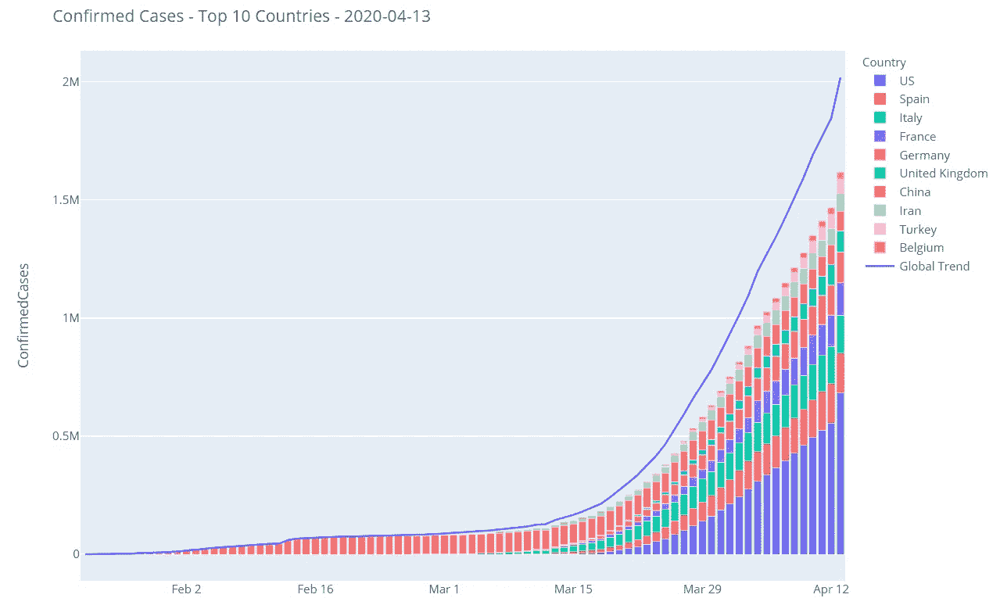
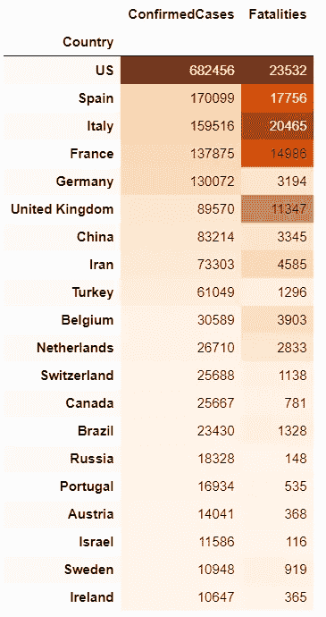

# 全球新冠肺炎预报

> 原文：<https://towardsdatascience.com/global-covid-19-forecasting-with-linear-regression-and-arima-c154c163acc1?source=collection_archive---------25----------------------->

## 正在 Kaggle 上进行的新冠肺炎预报竞赛简介

## 1.介绍

在这本笔记本中，我们将分析 2019 年 12 月在武汉首次发现的新冠肺炎在全球的传播和发展。截至 2020 年 4 月 13 日，210 个国家报告了 200 多万例病例。我们将尝试预测 2020 年 4 月 15 日至 2020 年 5 月 15 日的发展，这是正在进行的 [Kaggle 竞赛](https://www.kaggle.com/c/covid19-global-forecasting-week-4/overview)的一部分。我认为澄清这一挑战背后的想法非常重要，我认为 Kaggle 团队总结得很好:

> 我们理解这是一个严峻的形势，绝不想通过预测死亡人数来淡化这场危机对人类造成的影响。我们的目标是提供更好的评估方法，帮助医疗和政府机构在流行病爆发时做好准备和调整。

在笔记本的第一部分，我们将从信息和质量的角度探讨数据。之后，我们将清理数据，并继续进行特征工程。在第三部分，我们将看看不同的预测方法，即线性回归和 ARIMA。最后，在我们为竞赛创建提交文件之前，我们将有一个短暂的停留和回顾。尽管这是一个非常严肃的话题，但我希望我们能一起学到一些东西。保持健康！

## 2.探索性数据分析

## 2.1 确诊病例

在开始之前，让我们快速看一下数据结构。我们有两组数据。训练数据集包含六列:

*   **ID** :唯一标识符
*   **省 _ 州**:特定国家的省和州，如美国的华盛顿州
*   **国家地区**:德国、法国或西班牙
*   **日期**:各行的日期戳
*   **确诊病例**:新冠肺炎确诊病例数
*   **死亡人数**:新冠肺炎登记的死亡人数

除了“Province_state”列之外，数据集中没有遗漏。4 月初也有一个重叠的日期间隔。我们将修复这些问题，并先看看发行版。

迄今为止，大多数新冠肺炎病例发生在美国。紧随其后的是四个最大的欧盟成员国和中国，中国是第一个新冠肺炎病例出现的国家。

在上图中，我们绘制了前 10 个国家的确诊病例数量以及全球发展线。一个有趣的观察是，这 10 个国家占全球发展的很大一部分(见全球趋势线)。乍一看，曲线似乎变平了，这表明我们正在离开指数增长阶段。

我们创建了两个新变量:差异和增加配额。第一个变量包含 t0 和 t-1 绝对情况下的差异。第二个变量，增加配额，是 t0 和 t-1 之差的商。正如我们所看到的，随着时间的推移，这两种发展都趋于平缓。这可能有两个原因:

*   我们正在进入电晕流行的下一个阶段，并离开指数增长阶段
*   **的数据质量不够**，只有一小部分的实际感染被计算和统计记录。2020 年 4 月 13 日的奇怪异常值支持了这一论点。

为了更好地了解情况，我们现在检查死亡人数。

## 2.2 死亡事故

基本上情况与确诊病例相同。2020 年 4 月 13 日，据报道死亡人数超过 119，000 人。大多数死亡病例来自我们之前在确诊病例图表中看到的 10 个州。乍一看，曲线看起来比确诊病例更陡，因此我们将对它们进行比较。

我们的印象是正确的:确诊病例的曲线最近比死亡病例的曲线更平坦，但差异并不巨大。如果确诊病例的增长真的放缓，这种发展是合理的，因为人们不是直接死于电晕，而是后来。

## 2.3 新冠肺炎的地理分布

[动画](https://bd317.github.io/covid-005/)展示了 2020 年 1 月 1 日至 2020 年 4 月 12 日期间新冠肺炎的传播情况。直到 20.02。除了中国之外，只有一个小点，在那之后，首先在欧洲，然后在美国，最后在非洲有了快速的增长。目前，世界上几乎每个地区都受到 Covid 19 的影响。

## 2.4 结论

让我们简要总结一下主要发现:

*   全世界约有 200 万确诊病例和 119，000 例死亡病例。确诊病例和死亡人数排名前 10 位的国家占大多数。
*   根据目前的数据，利差似乎在**有所放缓**。
*   几乎世界上的每个地区都受到新冠肺炎的影响

然而，专家认为，未报告的病例数量要高得多，只有一小部分病例得到记录。因此，我们的观察也可能是因为许多国家的检测能力已经耗尽。我们无法用现有的数据材料回答这个问题。为了进一步的调查，我们必须假定现有的数字反映了实际的发展情况。

## 3.特征工程

在这一章中，我们将尝试时间序列分析的不同方法和技术。如果你对最终预测感兴趣，你可以直接进入第 4.3 章**ARIMA**。

## 3.1 国家、州和日期

在这一章中，我们将以这样一种方式准备数据，以便我们能够用各种统计方法进行预测。为此，我们将清理数据并创建要素。特征工程是时间序列分析中一个非常有趣的因素。如果我们假设想要预测确诊病例和死亡人数，我们将只有州、省和日期作为模型的输入。以有意义的方式推断这些数据似乎太少了，但是在本章的后面会有更多的介绍。让我们首先来看看训练和测试数据集。

正如我们在第一章中已经看到的，有一段重叠的时间。本次比赛的[规则](https://www.kaggle.com/c/covid19-global-forecasting-week-4/overview/evaluation)规定，只有 2020 年 4 月 1 日之前的数据可以用于公共排行榜。由于这个原因，我们从训练数据中删除数据。稍后，我们将使用所有可用的数据来做出最好的预测。

我们已经注意到我们没有很多可用的功能。先把日期搞得有意义一点。算法不能从日期中读取任何东西，所以我们从中提取各种特征，比如日和周。例如，你可以从组合中读出每周趋势。在德国，我注意到，平均而言，周四和周五报告的病例较多，周六和周日明显较少。这可能与报告过程有关:周六和周日，相关办公室的工作人员较少，而且并非所有病例都得到可靠报告。
此外，我们对州和省使用 SciKit 的 LabelEncoder()，因为大多数算法不能对字符串做任何事情。标签编码器为相应列中的每个不同案例分配一个编号。

## 3.2 确诊病例和死亡——滞后和趋势

如果我们想要预测未来的数据点，目前只有国家、州和日期是已知的。我们没有关于未来确诊病例或死亡人数的信息。不过，我们确有过去个案数目的资料，我们应该利用这些资料。在时间序列分析中，当目标的先前发展(例如确诊病例)被记录为数据集中的特征时，我们称之为滞后。

此外，可以记录趋势，即短期发展。这可以描述为两个连续数据点之间的趋势为(t0 -t1)/ t1。

## 4.系统模型化

现在我们有了所有必要的函数，数据也相应地准备好了。我们将尝试两种不同的方法:1)线性回归和 2) ARIMA。我们将从线性回归开始。你可以在 SkyCit [这里](https://scikit-learn.org/stable/modules/generated/sklearn.linear_model.LinearRegression.html)找到更多关于线性回归的实现和参数的信息。

## 4.1 线性回归(不用于提交)

与其他机器学习项目不同，我们不能仅仅通过 train-test-split 函数来抽取随机样本，因为数据点在时间上是相互依赖的。因此我们编写自己的函数。在训练数据集中，我们有截至 2020 年 3 月 31 日的可用数据。这是自 2020 年 1 月 22 日(我们数据集中的第一天)以来的第 69 天。我们将训练我们的数据，直到 2020 年 3 月 31 日，然后我们将看到我们的预测与实际发展有多接近。我们将在以下方面有所不同:

*   使用的滞后数
*   我们包括的培训时间

关于线性回归函数的几点说明:

*   我们为每个国家单独训练算法。如果一个国家有几个州，我们也会针对每个州分别进行培训。由于各州处于新冠肺炎疫情的不同阶段，我们将无法使用针对所有数据点训练的算法做出良好的预测。
*   第一步，我们计算各个国家或州的滞后。通过反复试验可以获得正确的滞后次数。太少的滞后会导致对短期趋势的过度解读，太多的滞后意味着我们没有充分考虑短期趋势。
*   然后我们对目标和滞后进行对数运算。线性回归不适合外推指数趋势。对数允许我们的算法更好地解释和处理数据。

**注意**:滞后的使用产生了一个新问题。这些只适用于我们的训练数据。所以我们只有第一次预测的可用日志。之后，我们必须将该预测写回到训练数据集中，重新计算滞后，并做出新的预测。必须对每个数据点重复这一过程。

**致谢:**实现的大部分代码来自[这个](https://www.kaggle.com/saga21/covid-global-forecast-sir-model-ml-regressions)伟大的笔记本。我通常也建议阅读它，以获得关于进一步过程的理论假设。

我现在不会显示所有不同参数的结果。您可以在链接的笔记本中亲自测试它们。在下文中，我们将了解以下参数的结果:

*   确诊病例有 40 个滞后
*   死亡 20 次
*   培训开始日期 2020 年 3 月 10 日

确诊病例位于左侧 Y 轴，死亡病例位于右侧 Y 轴。

**德国**

**西班牙**

**阿尔及利亚**

**安道尔**

## 4.2 线性回归-结论

对于德国和西班牙，预测最初看起来不错，但可以看出，实际数字和预测之间的差距正在扩大。我们也研究了阿尔及利亚，作为一个迄今病例很少的国家。在这一点上，预测和实际数字也出现了偏差。我选择安道尔是因为到目前为止这里还没有病例。这个预测完全是荒谬的，会毁了我们在卡格尔的整个成绩。我们可以通过硬编码来拦截这种现象，即没有确诊病例的国家将继续被预测为零。相反，我们将继续使用 ARIMA 方法。

## 4.3 ARIMA(用于提交)

ARIMA 代表自回归(AR)综合(I)移动平均线(MA)。作为输入提供的数据必须是单变量序列，因为 ARIMA 从过去计算未来的数据点。这正是我们试图用线性回归做的。ARIMA 基本上有三个重要参数:

p:模型的自回归部分。简化一点可以说，模型假设如果昨天和前天有很多确诊病例，那么今天和明天也会有很多确诊病例。

描述差异量的模型的集成部分。如果可用的数据不是稳定的并且包含趋势，ARIMA 可以提取这种季节性。

q ->模型的移动平均线部分。通过形成均线，可以平滑随机效应。

重要提示 : ARIMA 无法考虑任何外部因素。数据点仅基于历史数据进行推断。如果在一个州有夜间外出的禁令，我们的模型将**而不是**提供良好的预测。

**功劳**:实现的大部分代码来自[这个](https://www.kaggle.com/hossein2015/covid-19-week-3-sarima-x-approach)很棒的笔记本。

确诊病例位于左侧 Y 轴，死亡病例位于右侧 Y 轴。

**德国**

**西班牙**

**意大利**

**阿尔及利亚**

**安道尔**

**伊朗**

**俄罗斯**

**中国—上海**

**中国—北京**

**美国—纽约**

**美国—华盛顿**

**韩国**

**加纳**

**南非**

## 4.4 ARIMA——结论

随着时间的推移，对单个国家的预测看起来更加可信。德国等确诊病例较多、历史较长的国家的数据点可以很好地推断出来。如果报告的数据不稳定，比如在上海，我们的算法将无法做出准确的预测。
实施过程相比线性回归也容易得多。提交给 Kaggle 的第一份测试的均方根误差约为 0.4。第 4 周的比赛今天结束，评估阶段开始。我会补充最后的结果。

## 5.摘要

首先，我们观察了新冠肺炎周围的发展，清理了数据并做了相应的准备。然后我们尝试了两种不同的方法来预测时间序列:1)线性回归和 2) ARIMA。线性回归的结果非常不稳定，预测似乎也不是特别准确。在 ARIMA，我们取得了明显更好和更可信的结果。最终结果评估可能于 2020 年 5 月 15 日进行。然而，测试期间的提交取得了良好的成绩。
尽管这个话题很严肃，但我希望你能带走一些东西。**居家健康！**

[如果你对数据科学感兴趣并且还没有注册，请随时使用我的推荐链接加入这个社区。](https://medium.com/@droste.benedikt/membership)

***编者按:*** [*走向数据科学*](http://towardsdatascience.com/) *是一份以数据科学和机器学习研究为主的中型刊物。我们不是健康专家或流行病学家，本文的观点不应被解释为专业建议。想了解更多关于疫情冠状病毒的信息，可以点击* [*这里*](https://www.who.int/emergencies/diseases/novel-coronavirus-2019/situation-reports) *。*