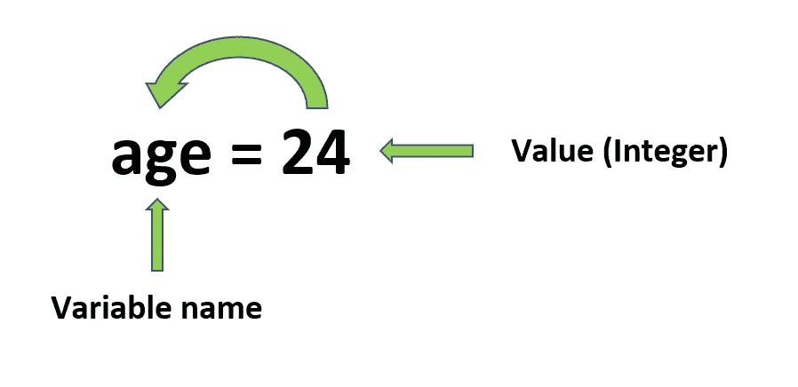
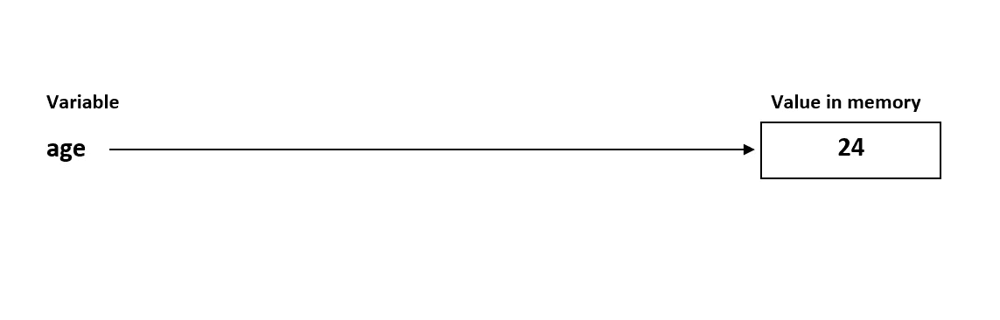

# Python 中的全局、局部和非局部变量

> 原文：<https://towardsdatascience.com/global-local-and-nonlocal-variables-in-python-6b11c20d73b0?source=collection_archive---------2----------------------->

## 在本教程中，让我们学习 Python 中全局、局部和非局部变量的用法


由 [Max Duzij](https://unsplash.com/@max_duz?utm_source=unsplash&utm_medium=referral&utm_content=creditCopyText) 在 [Unsplash](https://unsplash.com/s/photos/programming?utm_source=unsplash&utm_medium=referral&utm_content=creditCopyText) 上拍摄的照片

首先，我不是上图中的那个人。我只是一个仁厚的作家，在这里讲一个 Python 编程中最容易混淆的概念“ ***全局、局部和非局部变量*** ”。我知道看完标题你会想“ ***我为什么还要担心这个*** ”。嗯，答案是有时候不知道这些微小的事情会让你付出很大的代价。所以事不宜迟，我们开始吧。

在像 C/C++这样的编程语言中，每次同时声明一个变量时，都会分配一个内存，这种分配完全取决于变量的类型。因此，程序员在创建变量时必须指定变量类型。但幸运的是，在 Python 中，您不必这样做。Python 没有变量类型声明。像 C 中的指针一样，Python 中的变量不合法地存储值；它们使用引用来突出显示内存中的对象。

# 主题

本文将涉及的主题列表如下:

*   **变量** —快速介绍
*   **全局变量** —如何摆脱`**UnboundLocalError**`
*   **局部变量** —如何摆脱`**NameError**`
*   **非局部变量** —何时以及如何使用它们

另外，在开始之前，我必须告诉你一件事。这篇文章的全部代码可以在我的 [***GitHub 资源库***](https://github.com/Tanu-N-Prabhu/Python/blob/master/Global%2C_Local_and_Nonlocal_variables_in_Python.ipynb) 下面给出:

[](https://github.com/Tanu-N-Prabhu/Python/blob/master/Global%2C_Local_and_Nonlocal_variables_in_Python.ipynb) [## 塔努-北帕布/Python

### permalink dissolve GitHub 是超过 5000 万开发人员的家园，他们一起工作来托管和审查代码，管理…

github.com](https://github.com/Tanu-N-Prabhu/Python/blob/master/Global%2C_Local_and_Nonlocal_variables_in_Python.ipynb) 

# 变量

一个变量更可能是一个 ***容器*** 来存储值。现在要存储的值取决于程序员是使用整数、浮点、字符串还是 [**等**](https://www.w3schools.com/python/python_datatypes.asp) 。

> 变量就像计算机内存中的一个盒子，你可以在里面存储一个值。—阿尔·斯威加特

> 与其他编程语言不同，在 Python 中，你不需要声明或初始化任何变量。 *请阅读* [**本**](https://stackoverflow.com/a/11008311/11646278) **。**

## **语法**

在 Python 中创建变量的一般语法如下所示:

`**variable_name**` = `**value**`

Python 中的`**variable_name**` 可以简短如`**a, b, x, y, ...**`也可以信息量很大如`**age, height, name, student_name, covid, ...**`

> **虽然建议保留一个描述性很强的变量名以提高可读性。**

## 规则

**一切都设置好了，命名变量时需要遵循一些规则:**

*   变量名必须以字母*或下划线字符*开头**
*   **变量名不能以 ***号*** 开头**
*   **变量名只能包含 ***字母数字字符*** 和 ***下划线。*** 例如，任何类似这样的都是有效的: ***A-z，0–9，以及 _*****
*   **变量名 ***区分大小写*** ( ***高度*** 、 ***高度*** 、 ***高度*** 是三个不同的变量名)**

## **例子**

**下面给出了一个将值正确初始化为变量的示例:**

```
****# This is a valid and good way to assign a value to a variable
# Let's assign values to variables to calculate the area of a circle****pi** = 3.142            **# I could have also used "math" library** 
**radius** = 5            **# Interger value for radius
area_of_circle** = 0    **# Used to store the value of area of circle****area_of_circle** = pi * (radius) ** 2        **# Area = (PI * R^2)**print("The area of the circle is: ", **area_of_circle**)**
```

**上面代码的输出如下所示:**

```
**The area of the circle is:  78.55**
```

## **图片示例(*快速浏览*)**

**我相信只要看到一幅图片或一幅图像，就能更快地理解这些概念。下面是存储在内存中的变量的图示。**

****

****作者 Tanu Nanda Prabhu 的照片****

****

**作者 Tanu Nanda Prabhu 的照片**

# **全局变量**

## **相同的旧定义**

**在 Python 或者其他任何编程语言中，全局变量的定义保持不变，就是“ ***一个在函数外声明的变量叫做全局函数*** ”。我们可以在函数内部或外部访问一个全局变量。**

## **创建一个全局变量并访问它**

**让我们用上面的例子来理解在函数内部和外部访问变量的概念。**

```
**pi = 3.142       **# I could have also used "math" library (math.pi)**
radius = 5       **# Interger value for radius**def **circle**():
    area_of_circle = pi * (radius) ** 2
    print("The area of the circle is: ",   area_of_circle)
    circumference_of_circle = 2 * pi * radius**# Accessing the global variables outside the function** print("The circumference of the circle: ", circumference_of_circle)
**# Accessing the global variables inside the function
circle**()** 
```

**上述代码的输出如下所示:**

```
**The circumference of the circle:  **31.419999999999998** 
The area of the circle is: ** 78.55****
```

**这就是全局变量的特点。如上例所示，我使用了两个常用变量`**pi**`和`**radius**` 来计算在函数内部声明的圆的面积和在函数外部计算的圆周的面积。对于这两种计算，我们使用相同的公共变量。**

## **详细理解“UnboundLocalError”**

**现在让我们以同样的老例子为例，尝试将`**radius**` 更新 2(乘以 2)**

```
**pi = 3.142       **# I could have also used "math" library (math.pi)**
radius = 5       **# Interger value for radius**def **circle()**:
    radius = radius * 2         **# Update the radius by (x 2)**
    area_of_circle = pi * (radius) ** 2
    print("The area of the circle is: ", area_of_circle)**circle()**     **# Accessing the global variables inside the function****
```

**现在我知道你可能会喜欢“ ***没有必要*** ”这个额外的步骤`**radius = radius * 2**`我们可以在初始步骤中直接这样做，将半径值指定为 10，即`**radius = 10**`。我知道，但我正在尝试引入一个概念。请原谅我。**

**从上面的代码中可以看出，如果您尝试更新半径，然后执行这段代码，您会感到惊讶。不要激动的说“ ***我做了*** ”因为你没有，反而会被一个叫做`**UnboundLocalError**` **的错误提示。更有可能的错误是这样的。****

```
****UnboundLocalError**: local variable '**radius**' referenced before assignment**
```

**这个错误的原因是变量`**radius**` 是局部的，不能像上面那样更新。在这里，你可以把它变成一个全局变量。现在怎么做。请看下面的代码片段。**

```
**pi = 3.142       **# I could have also used "math" library (math.pi)**
radius = 5       **# Interger value for radius**def **circle()**:
    **global** radius               **# Making raduis a global variable**
    radius = radius * 2         **# Update the radius by (x 2)**
    area_of_circle = pi * (radius) ** 2
    print("The area of the circle is: ", area_of_circle)**circle()**** 
```

**现在，当您执行代码时，它会顺利执行。因为现在它被明确声明为全局变量。上面代码的输出如下所示:**

```
**The area of the circle is:  **314.2****
```

**考验你长远知识的时候到了。两年前在 [**栈溢出**](https://stackoverflow.com/q/10851906/11646278) 中有一个关于`**UnboundLocalError**`的问题。 [**表单**](https://stackoverflow.com/q/10851906/11646278) 现已停止接受答案，因为已经有大量答案。你可以跳进去，试着回答它，更清楚地理解它。**

# **局部变量**

## **相同的旧定义**

**在 Python 或者其他任何编程语言中，局部变量的定义保持不变，就是“ ***在函数内部声明的一个变量称为局部函数*** ”。我们可以在函数内部访问一个局部变量，但不能在函数外部访问*。***

## ***创建一个局部变量并访问它***

***我们在函数内部使用局部变量，并不试图在函数外部访问它们。因此得名本地。但好的一面是，我们可以在函数本身中访问这些变量。***

```
***def **circle**(): pi = 3.142    **# I could have also used "math" library (math.pi)**
    radius = 5    **# Interger value for radius**
    area_of_circle = pi * (radius) ** 2
    print("The area of the circle is: ",   area_of_circle)
    circumference_of_circle = 2 * pi * radius**# Accessing the global variables inside the function
circle**()***
```

***上述代码的输出是:***

```
***The area of the circle is: ** 78.55*****
```

***这就是局部变量的特点。如上例所示，我使用了两个普通变量`**pi**`和`**radius**` 来计算一个函数中声明的圆的面积。所以访问这些变量不会产生任何问题。但是如果我们试图在函数之外访问它们，会发生什么呢？请参见下面的下一节。***

## ***详细了解“名称错误”***

***让我们使用上面的同一个例子，并访问函数中声明的变量:***

```
***def **circle**(): pi = 3.142    **# I could have also used "math" library (math.pi)**
    radius = 5    **# Interger value for radius**    
    area_of_circle = pi * (radius) ** 2
    print("The area of the circle is: ",   area_of_circle)
    circumference_of_circle = 2 * pi * radius**# Accessing the global variables outside the function** print("The circumference of the circle: ", circumference_of_circle)
**# Accessing the global variables inside the function
circle**()***
```

***当你执行上面的代码时，会出现一个`**NameError**` **的提示。**更有可能的错误是这样的***

```
*****NameError**: name 'pi' is not defined***
```

***这个错误的原因是因为我们试图在全局范围内访问局部变量`**pi**` 和`**radius**` ，而局部变量只在`**circle**()`或局部范围内起作用。有一个办法可以解决，把`**pi**` 和`**radius**` 声明为全局或者在函数外声明。任何函数都可以访问它们。***

# ***非局部变量***

## ***相同的旧定义***

***在 Python 或任何其他编程语言中，我们经常在嵌套函数中使用非局部变量。现在，我所说的嵌套函数是什么意思？***

## ***嵌套函数***

***通常，嵌套函数是在另一个函数内部声明的一组函数。下面是一个嵌套函数的例子。***

```
***def **circle**():
    pi = 3.142   **# I could have also used "math" library (math.pi)**
    radius = 5   **# Interger value for radius**
    area_of_circle = pi * (radius) ** 2 def **circumference**():
 **# Formula for circumference**        circumference_of_circle = 2 * pi * radius    
        return circumference_of_circle print(**circumference**())    **# Calling the circumference function** return area_of_circleprint(**circle**())     **# Calling the circle function*****
```

***在执行这段代码时，您将得到以下输出***

```
*****31.419999999999998 
78.55***** 
```

## ***创建一个非局部变量并访问它***

***现在让我们尝试在`**circumference**()`中更新半径 2(乘以 2)。我之所以特别坚持这么做，是因为一旦你写了`**radius = radius * 2**`并运行代码，你就会得到`**UnboundLocalError**` 的提示。看到这里，你会说`**global radius**`把它变成一个全局变量，但这次你会得到一个新的错误`**NameError**`。而现在你会莫名其妙，不知道该怎么办。有一个简单的方法可以解决这个“ ***去读一个非局部变量的定义*** ”。每当有嵌套函数时，你需要使用一个`**nonlocal**` 变量。就这样，问题解决了。下面是创建一个非局部变量并访问它的方法。***

```
**def **circle**(): pi = 3.142  ** # I could have also used "math" library (math.pi)**
    radius = 5   **# Interger value for radius**
    area_of_circle = pi * (radius) ** 2 def **circumference**(): **nonlocal** radius         **# Nonlocal variable**
        radius = radius * 2 **# Formula for circumference**        circumference_of_circle = 2 * pi * radius    
        return circumference_of_circle print(**circumference**())    **# Calling the circumference function** return area_of_circleprint(**circle**())     **# Calling the circle function****
```

**执行这段代码时，您将得到如下输出**

```
****62.839999999999996 
78.55**** 
```

# **结论**

**这是文章的结尾，标题为“***Python 中的全局、局部和非局部变量*** ”。我希望你们通过阅读这篇文章学到了一些东西。通过这篇文章，您学习了如何消除两个重要的 Python 错误，如`**NameError**` 和`**UnboundLocalError**` ，这两个错误困扰了您很多年。现在，您可以面带微笑地轻松调试这两个错误，而不会流汗。如果您对本文有任何意见或建议，那么评论区就是您的了。敬请关注更多更新，直到那时再见。保持安全和快乐的编码，下次再见。**