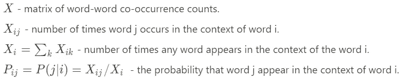
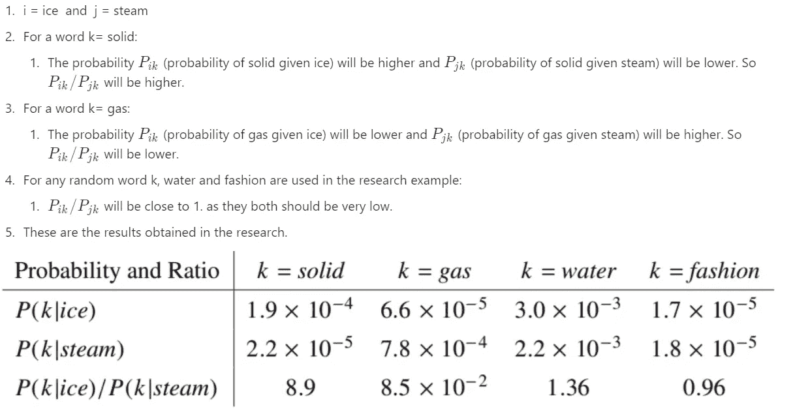
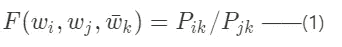
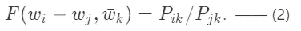
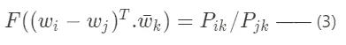
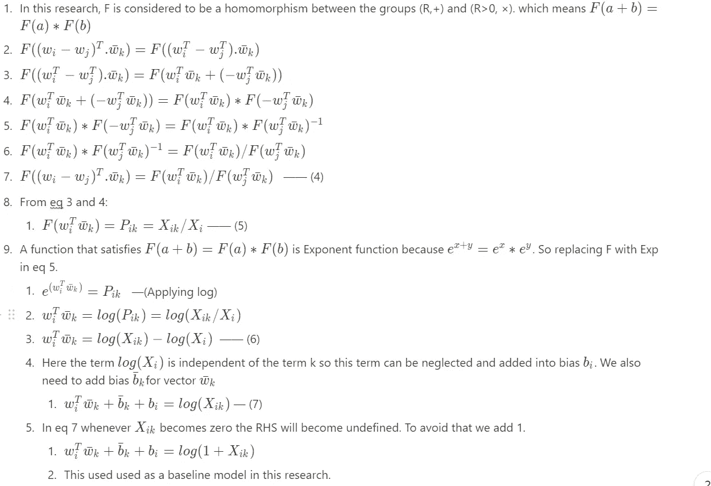
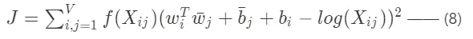
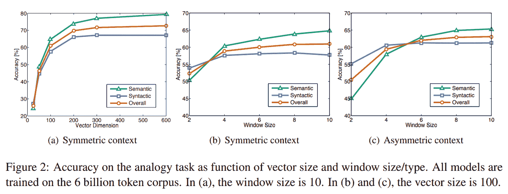
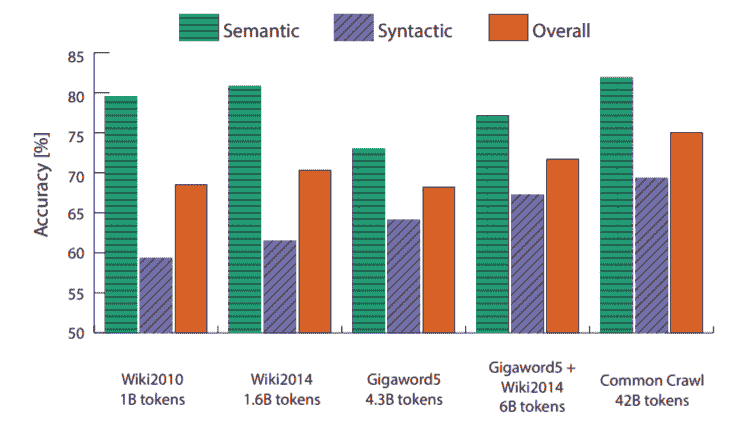

# 手套研究论文明确解释

> 原文：<https://towardsdatascience.com/glove-research-paper-clearly-explained-7d2c3641b8a6?source=collection_archive---------23----------------------->

[http://cf.ydcdn.net/latest/images/wordfinder-background.jpg](http://cf.ydcdn.net/latest/images/wordfinder-background.jpg)

## 直觉理解和数学推导在手套中的应用。

对于数据科学家来说，阅读和理解研究论文是非常重要的，这些研究论文构成了当前 art 模型的基础，无论是在自然语言处理还是在帮助我们解决许多任务的计算机视觉中。它帮助我们思考和理解研究中的内容，这些研究为我们提供了在数据科学之旅中使用的模型和算法。通常研究论文看起来像是数学密集型的脚本，所以我们倾向于完全忽略它们。在我的系列文章中，我将尽可能简要地解释和总结研究论文和其中的数学知识。

这篇文章是关于斯坦福大学的克里斯托弗·d·曼宁、杰弗里·潘宁顿和理查德·索彻撰写的手套研究论文。我鼓励你在这里观看斯坦福大学的 NLP 课程【https://www.youtube.com/playlist? list = ploromvodv 4 rohcuxmzknm 7j 3 fvwbby 42 z

# 摘要

1.  最近的方法已经成功地使用向量来表示单词的语义和句法含义。但是如何捕捉这些含义仍然是一个黑盒子。
2.  这项研究的主要目标是找出一个具有必要参数的模型来表示这些意义。
3.  这给出了使用全局对数双线性回归模型的范围，该模型结合了两种建模方法的优点，即 ***全局矩阵分解*** 和 ***局部上下文窗口*。**
4.  Glove 通过仅对单词-单词全局共现矩阵中的非零元素进行训练，而不是对整个稀疏矩阵或较大语料库中的上下文窗口进行训练，来输出具有有意义的子结构的向量空间。
5.  它在单词类比任务中给出了 75%的性能，并且在 NER 和相似性任务中也优于前者。

# 介绍

1.  经典语义模型将句子或语料库中的单词表示为实值向量。这些可以用作任务中的特征，如问题回答系统、信息检索、文档分类、命名实体识别和解析。
2.  在早期，这些向量表示的质量是通过为一些已知单词生成的向量之间的距离或角度来评估的。
3.  最近，这些矢量表示不仅通过标量之间的距离来评估，还通过每个维度的差异来评估。这为形成类似“国王之于女王，就像男人之于女人”的类比创造了空间。这迫使模型将意义纳入向量的维度。
4.  2 研究中使用的主要建模方法有:

*   全局矩阵分解，如潜在语义分析(LSA)。
*   局部上下文窗口模型，如跳格图。

这两种方法都有一些缺点。

1.  LSA 有效地捕捉统计信息，但它产生的矢量表示很差，在单词类比任务中表现不佳。
2.  Skip gram 生成更好的向量表示，并且在单词类比任务中表现更好，但是它不会完全利用语料库中存在的统计信息，因为它们在单独的局部窗口而不是全局共现计数上训练。
3.  Glove 使用全局对数双线性回归模型来生成有意义的向量表示，这些向量表示在单词类比任务中表现得更好。
4.  Glove 使用加权最小二乘法来训练全局共现计数，并利用语料库中存在的统计信息。

# 全局矩阵分解方法

1.  这些方法使用矩阵分解方法，通过分解大矩阵来获得低秩近似。这些近似捕捉了语料库中存在的统计信息。
2.  根据等级和用于形成更大矩阵的方法，捕获的这种类型的信息会有所不同。
3.  例如，LSA 使用 word-document 矩阵，其中行代表单词，列代表文档。根据该单词是否出现在文档中，添加 1 或 0。
4.  在另一个例子中，超空间语言模拟(HAL)使用单词-单词矩阵，其中的值表示该单词是否存在于另一个单词的上下文中(即存在)。这是失败的，因为它生成了一个不成比例的矩阵，对频繁出现的单词赋予了更大的权重。提出了各种变换来将不成比例的矩阵转换成平衡的矩阵。

# 基于局部上下文窗口的方法:

1.  这些方法通过聚焦于局部的特定上下文窗口来学习单词表示。
2.  Skip-gram 和 CBOW 基于局部窗口中存在的两个单词的向量之间的内积。
3.  在 Skip-gram 中，目标是在给定单词本身(中心单词)的情况下预测单词上下文(周围的单词)。
4.  在 CBOW 中，目标是在给定上下文单词(周围单词)的情况下预测单词(中心单词)。
5.  基于窗口的方法的主要缺点是它们是局部的，并且它们不查看全局共现，因此它们不能使用语料库中存在的统计信息。因此，他们没有利用语料库中单词的重复。

# 手套法

无监督算法利用语料库中单词出现的统计信息。这里的问题是“我们如何从这些统计数据中产生意义，以及产生的单词向量如何表示该意义”

让我们考虑一个在研究中使用的例子。

*   与原始概率相比，该比率能够更好地区分相关的词(固体和气体)和不相关的词(水和时尚),并且还能够更好地区分两个相关的词。
*   这个实验证明了同现概率的比率比个体概率做得更好，并且它们是学习更好的单词向量表示的良好起点。

**损失函数的推导:**

*   上面的例子可以概括为下面给出的函数。

*   这里的 ***w*** 代表语境上的词语 ***w*** *条*代表语境外的词语。
*   在上面的等式中，可以从语料库中计算 RHS。
*   f 可以是任何带有未知参数的函数。我们可以向该函数添加一些约束，以便可以学习参数来对单词向量空间中的概率比中存在的信息进行编码。因为目标是找出多维线性向量空间中表示单词的向量。
*   考虑到上面的说法， ***w*** *i，****w****j*可以用两个词的向量差来表示。所以通过替换我们得到:

*   在等式 2 中，RHS 是标量，LHS 是矢量的组合。为了匹配这两者，我们需要考虑作为向量的参数之间的点积。这里理想的 F 是一个由神经网络创建的复函数。

*   这里我们需要记住，X 是单词-单词共现矩阵，这意味着单词和上下文单词可以互换，短语“在上下文中”和“在上下文外”只是一种表示。即，基于所使用的上下文，单词可以在上下文中或者在上下文之外。
*   考虑到以上几点，我们必须有一个函数 F，它能使我们互换***w***<=>***w****bar 和****X<=>X****转置* 而不失去对称性。
*   为了即使在这种交换之后也能达到对称，我们的函数 F 应该遵循一个群同态。[https://en.wikipedia.org/wiki/Group_homomorphism](https://en.wikipedia.org/wiki/Group_homomorphism)。简单地说，同态函数是保持两个群之间代数结构的函数。

*   使用的缺点是，它对所有单词-单词共现给予相等的权重，这导致噪声，因为一些共现具有较少的信息，应该给予较少的权重。
*   提出了一种克服这一缺点的新方法。即使用加权最小二乘回归模型。

*   这里 f 是一个加权函数，用于减少频繁共现项的影响，这是上面讨论的缺点。函数 f 是用 3 个性质构造的。

1.  它应该是一个连续函数，当 ***x →*** 0 时消失。
2.  它应该是非递减的。
3.  对于 ***x*** 的大值应该输出相对较小的值。
4.  这些规则确保在训练单词嵌入时，罕见或频繁的同现值不会被过度加权。
5.  有许多函数满足这些约束，Glove 选择了一个限幅幂律来构成函数。
6.  ***X****max**经过不同值的实验，固定为 100，alpha 固定为 3/4。*

*   *给出了手套和 Skip Gram 模型之间的比较，这将在 Skip Gram 研究论文的下一篇文章中解释。*

# *模型复杂性*

1.  *从损失函数 ***J*** 中使用的加权函数可以观察到，计算复杂度取决于矩阵 ***X*** 中非零元素的个数。*
2.  *最坏情况的复杂度由 *O(|V| )* 给出，其中 V 是词汇量。*

# *模特培训*

*该模型用 5 个语料库进行训练。*

*   *2010 年拥有 10 亿代币的维基转储。*
*   *拥有 16 亿令牌的 2014 年维基转储。*
*   *拥有 43 亿代币的 Gigaword 5。*
*   *2014 年 Gigaword 5 和 Wiki dump 的组合拥有 60 亿个令牌。*
*   *共有 420 亿个令牌用于抓取 web 数据。*

*对每个语料库执行以下步骤。*

*   *使用斯坦福分词器对每个语料库进行分词和小写，构建 400，000 个最常用单词的词汇表。*
*   *构建一个同现计数 x 的矩阵。*
*   *选择一个上下文窗口，我们还可以在左右上下文之间进行选择。*
*   *使用递减加权函数来确保非常远的单词对预期包含关于单词彼此关系的不太相关的信息。*

*使用以下参数。*

*   ****X*** *最大值* = 100 且**α**= 0.75*
*   *使用 AdaGrad 对来自 x 的非零元素的随机样本训练模型。*
*   *最初，学习率为 0.05。*

*该模型根据单词是在上下文中使用还是在上下文外使用，为每个单词生成 2 组向量 ***w*** 和***w****bar**。一般使用***w****+****w****bar*给出一些性能提升。**

# **模型分析**

*   ****向量长度和上下文大小****

1.  **下图有助于我们理解向量维数和上下文大小对模型性能的影响。**
2.  **对称上下文:扩展到目标单词左右的上下文窗口。**
3.  **不对称上下文:只向左延伸的上下文窗口。**
4.  **向量大于 200 维时，性能会下降。**
5.  **小的和不对称的上下文窗口在句法任务上表现出更好的性能，因为句法信息主要是从邻近的局部上下文中提取的，并且它也依赖于顺序。**
6.  **较大的窗口尺寸在语义任务上表现出较好的性能，因为语义信息更加非局部化。**

****

*   ****语料库规模****

****

1.  **语料库规模越大的模型在句法子任务上表现越好。这是因为更大的语料库中统计信息的增加。**
2.  **对于语义子任务，该模型在较小的语料库中表现出更好的性能，该语料库可能包含更接近的有意义的词类比。**
3.  **模型在不同语料库的 300 维向量上进行训练。**

# **结论**

**我试图在这篇文章中涵盖所有的细节。我鼓励您阅读本文，以获得各种任务的所有详细模型性能结果以及其他模型之间的比较。**

*****注意:这篇文章的目的是解释研究论文中给出的术语和数学。所以流程和上下文与论文中使用的非常相似。*****

*****资源:*****

** [## 手套向量表示同态问题

### 在《手套:单词表示的全局向量》一书中，有一部分(第三页的底部)我不…

datascience.stackexchange.com](https://datascience.stackexchange.com/questions/27042/glove-vector-representation-homomorphism-question)  [## 群同态

### 其中等式左边的群运算是 G 的运算，右边的是 h 的运算。

en.wikipedia.org](https://en.wikipedia.org/wiki/Group_homomorphism) 

感谢你花时间阅读这篇文章。希望对你有帮助。如果你有任何疑问，请随时联系我。**