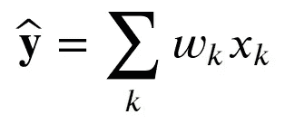
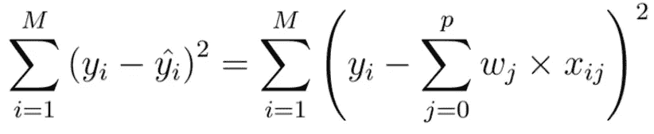
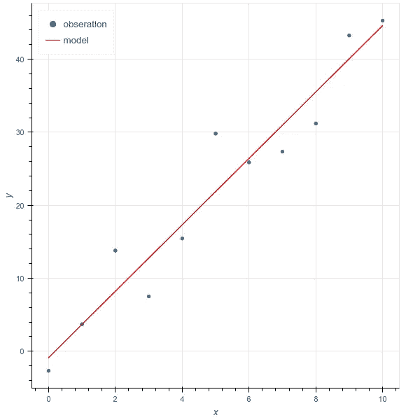
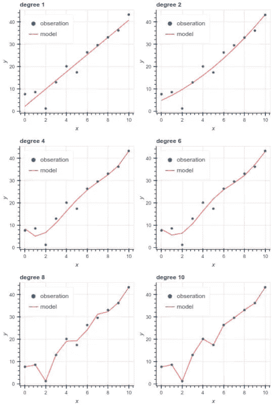
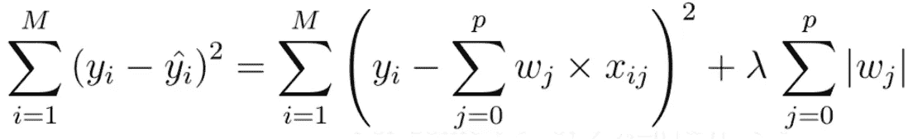
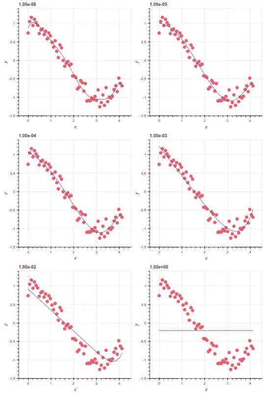
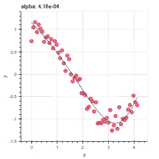
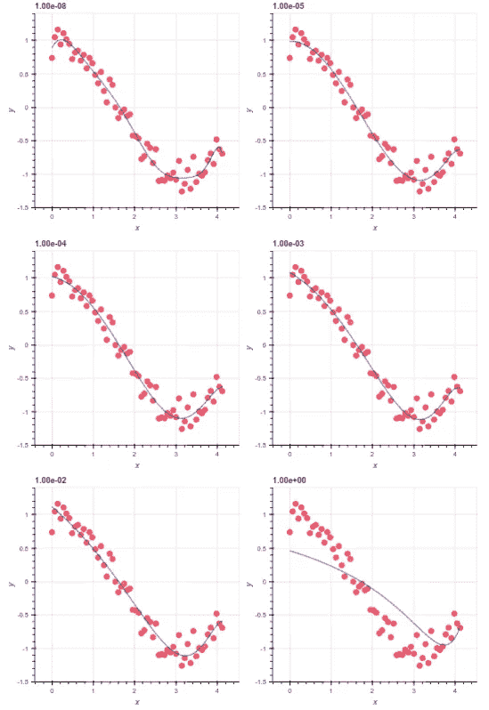
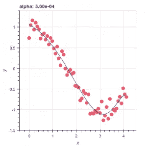
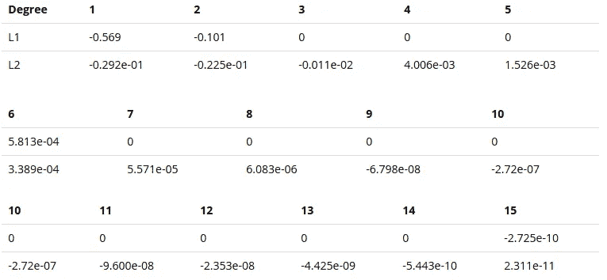

# 使用 Python 和 scikit 进行线性回归-学习库

> 原文：<https://towardsdatascience.com/glr-with-python-and-scikit-learn-library-67b5b0d418ea?source=collection_archive---------45----------------------->

## 机器学习

## 广义线性回归导论

从[@法比奥哈](https://unsplash.com/@fabioha)到[https://unsplash.com/](https://unsplash.com/)

一般来说，机器学习、统计学和应用数学中最常用的工具之一是回归工具。我说的是回归，但是有许多回归模型，这里我将尝试介绍的是众所周知的广义线性回归。这个复杂词背后的思想非常简单:我们试图拟合的观察值应该是输入解释变量的线性组合。在数学上，观测向量被公式化

其中 *x* ₖ代表解释向量 *k* ，而 *w* ₖ是每个解释变量的权重。此外，由于我们通常需要一个截距，按照惯例，我们设置 *x* ₀ *=1* ，因此权重 *w* ₀代表截距。

# 线性回归

作为第一个例子，让我们从一个简单的线性回归开始，它包括最小化误差平方和。误差被定义为预期真实值和通过我们的模型获得的预测值之间的差异

线性模型的成本函数

对于所有 m 点 *(xᵢ，yᵢ)*

为了说明这个简单的例子，让我们使用令人敬畏的库 scikit-learn，特别是包`sklearn.linear_model`

简单线性回归

我们在这里使用的模型非常简单，它只是一条线。该模型似乎很好，拟合系数为 *w₀ =-0.87998* 和 *w₁=4.54914* ，但误差不为零(示例中均方差= 15.57)。有时，减少残差的一种方法是用稍微复杂一点的模型来改变模型。在我们的例子中，我们简单地拟合了一个 1 次多项式。如果我们增加多项式次数呢？例如，假设我们将度数增加到 12:

多项式次数的影响

正如我们所见，模型的多项式次数越多，残差就越小。然而，在这个例子中尤其明显的是，误差的减小不一定是更好模型的标志。事实上，假设我们使用一个高次多项式作为我们的模型，误差往往是零(实际上这是因为我们有一个多项式次数等于观察次数)。但是，如果我们增加一个额外的观察，我们的模型肯定会经历一个高残差。

结果是

对于 X=15 **的残差**为**【57.50465854】
对于** X=15 **的残差**为**【540.59208041】
对于** X=15 **的残差**为**【23711.11027247】** 

正如我们在本例中看到的，在 x = 15 处添加一个观测值会导致多项式次数的误差增加。这种行为被称为过度拟合，即模型非常适合数据，但往往对新数据表现不佳。我们说它遭受巨大的变化。

为了克服这个问题，我们需要选择正确的多项式次数。例如，我们可以将数据集分成两部分，一个训练集和一个测试集。然后，最佳模型将是在测试集上具有最小残差的模型。然而，有一个聪明的方法来限制过度拟合现象:正则化。

# 正规化

正则化包括向模型添加惩罚，目标是防止过度拟合。它来源于这样的假设，当多项式的次数增加时(举我们的第一个例子)，每个多项式的权重也增加。因此，为了克服过度拟合，我们惩罚高权重的单体。最小化函数现在变成了

正则化成本函数

其中|。|通常是 L1 或 L2 范数，而λ是一个超参数，它可以被调整以调节惩罚敏感性(0 表示没有惩罚，即未规范化的模型)。两种广泛使用的正则化方法是 L1 和 L2 正则化，也称为[套索](http://en.wikipedia.org/wiki/Least_squares#Lasso_method)和[岭](http://en.wikipedia.org/wiki/Tikhonov_regularization)回归。

# 套索

引用 scikit-learn 库的内容

> LASSO 在某些情况下很有用，因为它倾向于使用较少参数值的解决方案，有效地减少了给定解决方案所依赖的变量的数量。因此，套索及其变体是压缩传感领域的基础。在某些条件下，它可以恢复非零权重的精确集合。

套索正则化的影响

我们清楚地看到正规化的效果。当我们增加惩罚时，我们强烈限制每个系数的权重，直到只保留截距。但是如何选择合适的参数呢？在这里，我们再次需要查看在不是训练集的集合上计算的残差。这种方法被称为验证。原则是将数据集分成三部分，比如 80%用于训练集，10%用于验证，10%用于测试。在训练集上训练模型，然后使用验证集来选择超参数。最后，使用测试集来估计模型的真实误差。然而，在小数据集上，这种方法不够有效，因为它限制了可用于训练的数据量。对于这样的小数据集，我们可以应用交叉验证的方法。为此，我们将数据集分成两部分，一部分用于训练，另一部分用于测试。然后，对除了一些 k 样本之外的所有训练集执行训练。所以我们假设训练集由 N 个样本组成。我们对 N-k 个样本执行 N/k 次回归，并计算 k 个剩余样本的验证误差。在所有这些回归之后，验证误差是所有验证误差的平均误差。

在 scikit-learn 库中，有一个类实现了这种方法并找到了最佳的超参数:LassoCV。然后，我们重用前面省略了`alpha`参数的代码示例，以强制使用`LassoCV`模型:

套索正则化的最优解

根据拉索夫模型，最佳超参数 alpha=4.16e⁻⁴.

# 里脊回归

岭回归与 LASSO 非常相似，不同之处仅在于正则项中使用的范数的阶数。在 LASSO 中，我们使用一阶范数(L1)，在岭回归中，我们使用二阶范数(L2)。这种正则化技术的行为是模型的所有结果权重仍然是非空的，但是最终具有非常小的值，使得它们对预测值的影响非常低。相反，LASSO 通过最终将权重设置为空来增加模型的稀疏性，这使得模型解释更容易。岭回归的主要优点是它与乘法因子无关，倾向于高度相关变量的权重相等，而 LASSO 会选择这个或那个。

我们示例的实现与前面的 LASSO 案例非常相似。我们要做的就是把`Lasso`和`LassoCV`换成`Ridge`和`RidgeCV`！

山脊正则化的影响

通过交叉验证:

岭正则化最优解

正如我们所见，最终的模型与套索正则化略有不同。如果我们现在看看权重系数:

两种正则化的回归系数比较

# 结论

在本文中，我们看到了两种正则化技术，以及在尝试拟合模型时使用正则化的重要性。我们还看到，尽管这两种技术非常相似，但却给出了非常不同的结果。事实上，脊技术包括了所有的解释变量，而套索技术产生了一个稀疏的模型，通常更容易理解。然而，LASSO 在高度相关变量的情况下表现不太好，因为它倾向于在结果中产生高度稀疏。这正是我们在示例中尝试用多项式拟合余弦时看到的情况。每个变量都是高度相关的，因此得到的模型有许多零值作为权重系数。除了脊和套索，弹性网格是另一种结合了 L1 和 L2 正则化的有用技术。它允许学习一个稀疏模型，同时它也保持山脊性质。

# 结束注释

我们简要地讨论了这个主题，但是和机器学习一样，我们需要几个数据集来训练模型、验证模型和测试模型。我们稍微讨论了一下，很快就看到了如何用交叉验证来处理小数据集。