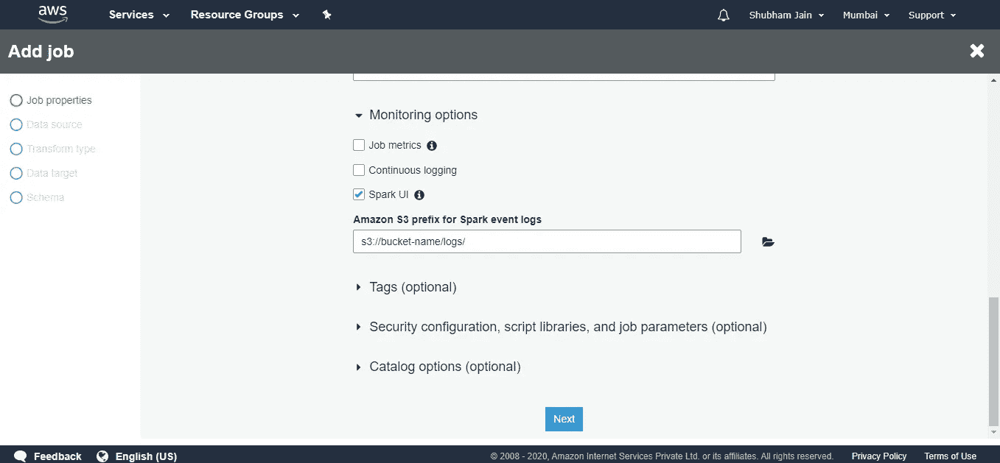
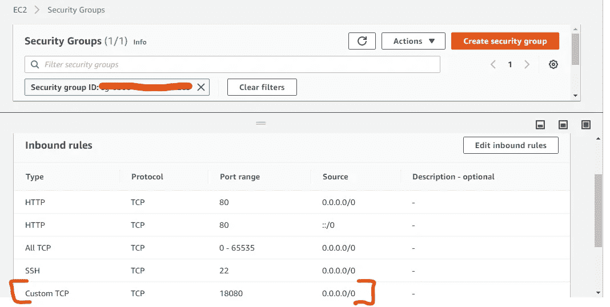
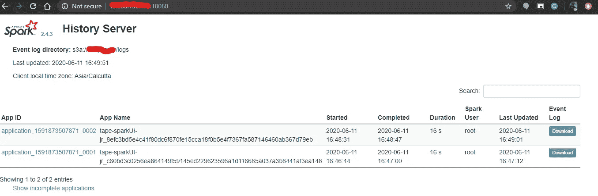
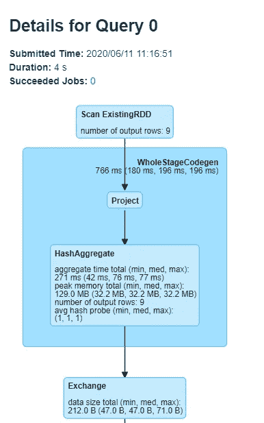

# 通过启用 spark UI 对 AWS 粘合作业进行高级监控

> 原文：<https://towardsdatascience.com/glue-spark-ui-6dab088929d9?source=collection_archive---------30----------------------->

## 启用 spark 历史服务器的 Docker 容器，可用于查看粘合作业的 sparkUI


在 [Unsplash](https://unsplash.com?utm_source=medium&utm_medium=referral) 上由 [Carlos Muza](https://unsplash.com/@kmuza?utm_source=medium&utm_medium=referral) 拍摄的照片

Apache spark 目前是处理大型数据集时不可或缺的框架。大多数处理大量数据的数据工程师和数据科学家在某些时候会利用 spark 功能。

> 说到对 spark 的理解，20%由**代码语法**组成，30%是**数据工程概念**，剩下的 50%是**优化**

**代码语法**包括使用*函数和语法*，**数据工程概念**反映了 *SQL、高效查询构建和创建优化查询*和**优化的知识**包括集群管理的好坏和以*最小无序度运行代码、处理不可避免的小文件、优化连接、处理长时间运行的作业、优化倾斜数据集*以及利用*完整集群。*

语法定义和数据工程概念可以随着时间的推移而学习，但是为了优化集群，您需要可视化您的集群如何响应在其上执行的查询。

SparkUI 用于识别*长时间运行作业背后的根本原因，可视化 Dag*、 *OOM 问题*、*磁盘溢出*、*过度洗牌*、*倾斜数据集、*以及集群的整体运行状况。

要使用 apache spark，我们需要大型集群，但有时，管理这些集群会带来额外的开销。因此，我们开始使用 AWS EMR 或 GCP Dataproc 在云上利用集群，但同样我们需要管理这些集群并充分利用它们。现在，我们需要能够运行 spark 工作负载的东西，并且只为我们使用的东西付费。这就是 **AWS 胶水**出现的原因。

Aws Glue 是无服务器的，因此我们不需要管理集群或担心与之相关的运行成本。我们只为使用资源的时间付费，一旦我们的工作完成，资源就会被释放。

每一件好事都是有代价的，所以这里的问题是我们不能在优化方面完全配置我们的胶合工作。此外，我们不能实时查看作业的 spark UI，相反，我们需要运行 spark 历史服务器来查看胶合作业的 Spark UI。

要启用 spark UI，我们需要遵循一些步骤:

1.  在粘合作业中启用 spark UI 选项。
2.  指定将生成日志的 s3 路径。
3.  使用 docker 和 EC2 启动 Spark 历史服务器。
4.  访问历史服务器上的 spark UI。

## 为日志生成启用 spark UI

创建一个新作业，并在 monitoring 部分启用 spark UI 选项，并为日志生成提供一个 s3 路径。



为粘合作业启用 spark UI

## EC2 上的 Spark 历史服务器设置

我们现在将创建一个 Spark 历史服务器，从中我们可以看到粘合作业的 DAG 和任务详细信息。

相同的文档是:

Dockerfile 文件

我把阿尔卑斯山作为基本图像，因为我希望这个 docker 容器在尺寸上非常精简。

安装 Java 8、Maven 和 bash shell

```
RUN apk add --no-cache openjdk8
RUN apk add --no-cache maven
RUN apk add --no-cache bash
```

获取 spark 2.4 并解压缩，因为它包含了启用历史服务器的类

```
RUN wget [https://archive.apache.org/dist/spark/spark-2.4.3/spark-2.4.3-bin-without-hadoop.tgz](https://archive.apache.org/dist/spark/spark-2.4.3/spark-2.4.3-bin-without-hadoop.tgz)
RUN mv spark-2.4.3-bin-without-hadoop.tgz spark
RUN tar -zxf spark
RUN rm -rf spark
RUN mv spark-2.4.3-bin-without-hadoop/ spark/
```

将 *pom.xml* 复制到用于安装依赖项的容器中，并使用 maven 构建它

```
COPY pom.xml .
RUN mvn dependency:copy-dependencies -DoutputDirectory = /sparkui/spark/jars/
```

移除 maven 作为构建现在是成功的，并且也移除了冲突的 jar

```
RUN apk del maven
RUN rm /sparkui/spark/jars/servlet-api-2.5.jar && \
    rm /sparkui/spark/jars/jsr305-1.3.9.jar && \
    rm /sparkui/spark/jars/jersey-*-1.9.jar
```

添加端口号来启用历史服务器，您可以根据您的要求更改它。我们需要将属性添加到 *spark-defaults.conf* 文件中。

> 您也可以在这里更改端口号。

```
RUN echo $’\n\
spark.eventLog.enabled true\n\
spark.history.ui.port 18080\n\
’ > /sparkui/spark/conf/spark-defaults.conf 
```

将入口点添加到 docker 容器，该入口点将启用 spark 历史服务器。

```
ENTRYPOINT [“/sparkui/spark/bin/spark-class”, “org.apache.spark.deploy.history.HistoryServer”]
```

现在从这个文件构建并运行 docker 容器。

## 从 Dockerfile 构建 docker 映像:

要从该 Dockerfile 文件构建映像，请运行以下命令:

```
docker build -t jnshubham/glue_sparkui .
```

## 从 DockerHub 中提取现有图像

您还可以从 docker hub 上获取预构建映像。

要提取图像，请运行以下命令:

```
docker pull jnshubham/glue_sparkui:latest
```

通过运行以下命令检查下载的图像

```
docker images
```

## 运行 Docker 容器

要运行容器并启动历史服务器，请运行以下命令:

使用访问密钥和秘密密钥运行容器

```
$ LOG_DIR="s3a://path_to_eventlog/"
$ AWS_ACCESS_KEY_ID="AKIAxxxxxxxxxxxx"
$ AWS_SECRET_ACCESS_KEY="yyyyyyyyyyyyyyy"

$ docker run -itd -e SPARK_HISTORY_OPTS="$SPARK_HISTORY_OPTS -Dspark.history.fs.logDirectory=$LOG_DIR -Dspark.hadoop.fs.s3a.access.key=$AWS_ACCESS_KEY_ID -Dspark.hadoop.fs.s3a.secret.key=$AWS_SECRET_ACCESS_KEY" -p 18080:18080 jnshubham/glue_sparkui
```

运行配置了 IAM 角色的容器来访问 s3 bucket

```
$ export LOG_DIR=s3a://bucket_name/logs_path/
$ docker run -itd -e SPARK_HISTORY_OPTS="$SPARK_HISTORY_OPTS -Dspark.history.fs.logDirectory=$LOG_DIR" -p 18080:18080 jnshubham/glue_sparkui
```

## 从 EC2 访问历史服务器

要访问历史服务器，请启用安全组入站规则中的端口 18080 以允许流量。



启用端口 18080 的流量

一旦你有一些成功的日志，打开 ip:18080 打开历史服务器，它将显示粘合工作的 spark 用户界面:



现在，您可以可视化生成的 Dag 和查询性能。您还可以跟踪每项任务所花费的时间，然后对其进行优化。

希望你们都喜欢这篇文章。

更多信息，请访问我的 [GitHub](https://github.com/jnshubham/glue_sparkui_docker) 或 [dockerhub](https://hub.docker.com/repository/docker/jnshubham/glue_sparkui) 。