# 以小见大

> 原文：<https://towardsdatascience.com/go-big-by-being-small-618d2da54b49?source=collection_archive---------51----------------------->

## 外推小时间序列数据集的方法。

作者图片

当我还是一名大学生的最后一年时，我正在为我的研究论文准备和收集足够的数据集，作为我的最后一年项目。我只是随便浏览了一下互联网，瞧！我很快就收集到了我需要的所有数据集。但当我以为我的船一切顺利时，一个北海巨妖出现了——当然不是海怪，但它需要大量的头脑风暴。我一直在收集的数据集太小，无法处理，我说的是 20 到 30 次定期观察，*哎呀*。你可能会问，你为什么没有意识到仅仅通过观察数量是不够的？好吧，坦率地说，当我看到“少数”数量的观察时，我确实感到有点担心。但是当我意识到这不足以在我研究的模型中实现时，我受到了打击。

经过几个小时，一本书，一杯咖啡，我终于找到了如何处理这些小数据集的灵感，**推断，恰当地**。起初，我真的认为我的想法会在模型中引起相当大的错误，但谢天谢地，进展顺利，我完成了我的论文。所以在这篇文章中，我想分享我在处理单变量数据集时使用的方法，以及我为多变量数据集开发的一种新方法。

# 让我们从简单的单变量数据集开始，该数据集具有误差容限(MOE)

提供了 MOE 的数据集在这种外推方法中非常有用，因为 MOE 是决定外推值精确度的关键因素之一。在这种情况下，我将使用从美国人口普查局的表 S1901 中收集的美国年平均收入。有了 MOE，我们可以很容易地得到每年平均收入的最小值和最大值。知道这些值后，我们根据其年度值，通过从均匀(0，1)分布中产生随机变量来外推，以代表平均收入的标准化值。然后，我们使用最小值和最大值将标准化值转换回实际值，如下所示

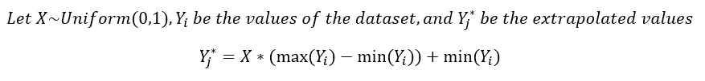

作者图片

假设我想外推数据集，因为我想重新创建月平均收入，我将需要每年转换 12 个随机均匀变量。这是真实数据集和外推数据集的并排图比较。

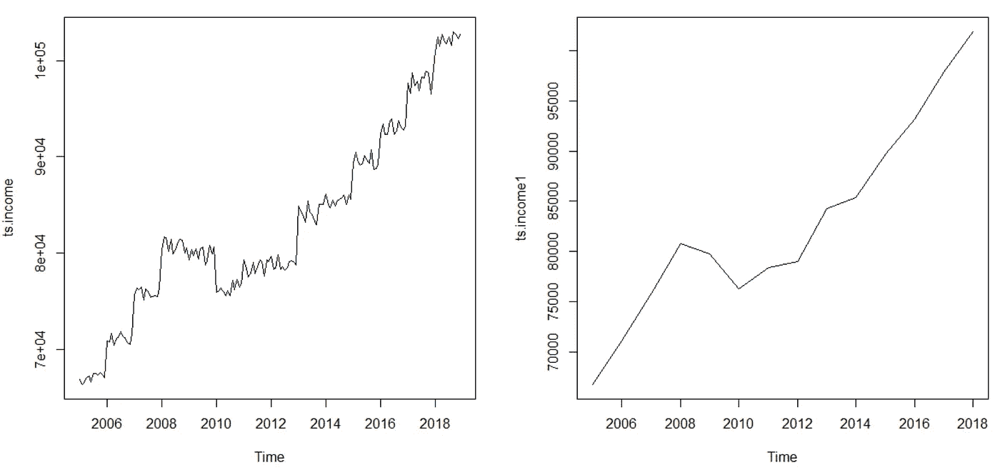

外推的(左)，真实的(右)，作者的图像

正如我们所看到的，增长的趋势仍然存在，只是更嘈杂，因为现在它有每月而不是每年的价值。如果我们检查统计特性之间的差异

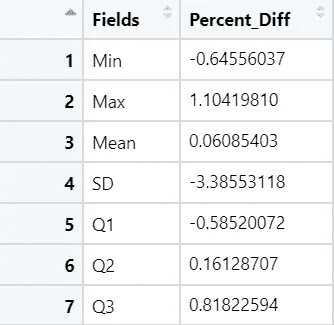

统计属性的百分比差异，按作者分类的图像

差别不大:)

# 无 MOE 的单变量数据集

这个条件就是我之前提到的问题。我对如何获得我正在处理的数据的周期性变化的信息感到困惑。幸运的是，该解决方案只需要两个主要特征:一个符合数据集分布的时间序列模型和一些随机化的标准化值。

在这个例子中，我将使用每月太阳黑子数据集，您可以在这里 获得 [**。是的，这已经是一个巨大的数据集，所以不需要外推，我说的对吗？但是，假设你只得到过去 3 年的观察数据，并被告知基于这些数据生成过去 3 年的每日值。**](https://machinelearningmastery.com/time-series-datasets-for-machine-learning/)

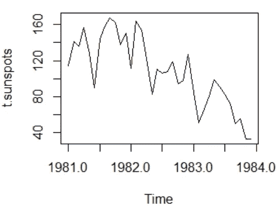

1981-1984 年的每月太阳黑子，图片由作者提供

现在**让我们挑选模型。**从一开始，我们就知道这是一个月度数据集。所以我们为什么不选些简单的呢？我们将使用线性季节性回归模型来拟合数据集。结果如下:

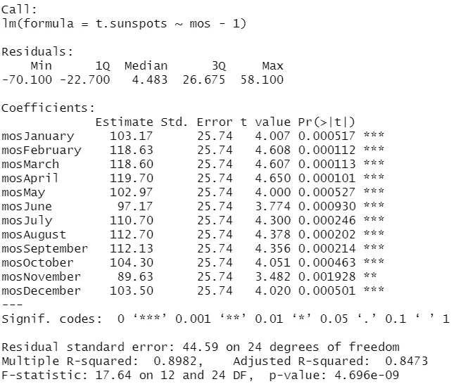

作者图片

那非常合适。现在我们将使用这个结果的估计值和标准误差来推断数据。换句话说，如果我们回头看前面的例子，我们可以使用估计值和标准误差分别作为“平均收入”和 MOE。因为我们要生成每日值，所以这些值将根据一个月中的天数以及估计值和标准误差生成—从现在开始，我使用 95%的置信度。以下是推断的每日价值:

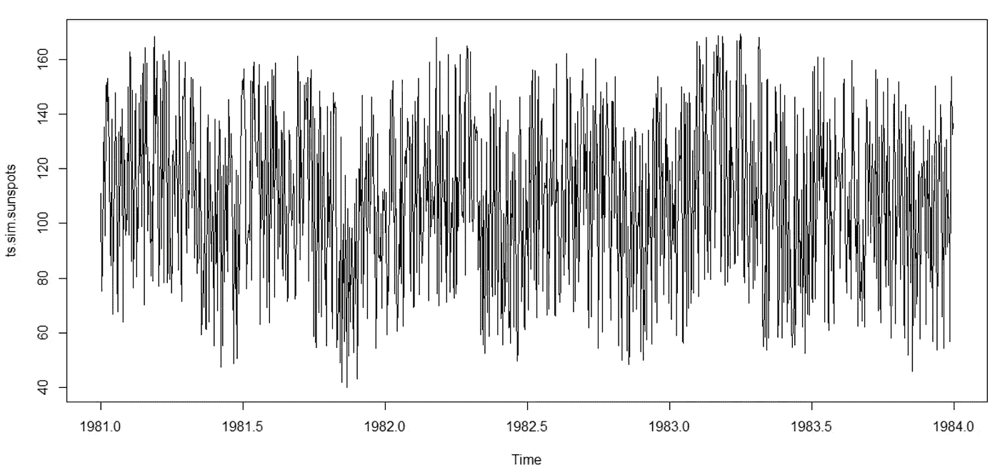

作者图片

有一点马上让人感觉不对劲，那就是原始数据集中缺少下降趋势。我这样做是为了展示根据我们正在处理的数据集选择一个合适的模型是多么重要。根据这一结果，我们可以得出结论，线性季节回归模型并不完全适合这一数据集。此外，通过使用回归，我们立即假设数据集中的状态是稳定的，这使得外推值看起来像是稳定的时间序列。

# 多元数据集

直到最后一个例子，我花了很长时间才想到一种方法来推断一个多元数据集。然而，这里有一种方法。在最后这个例子中，我使用的是来自 [Kaggle](https://www.kaggle.com/sumanthvrao/daily-climate-time-series-data) 的新德里气候训练数据集。

同样，让我们先研究一下数据集。因为我期待变量之间的相关性，所以我将从变量之间的散点图开始。

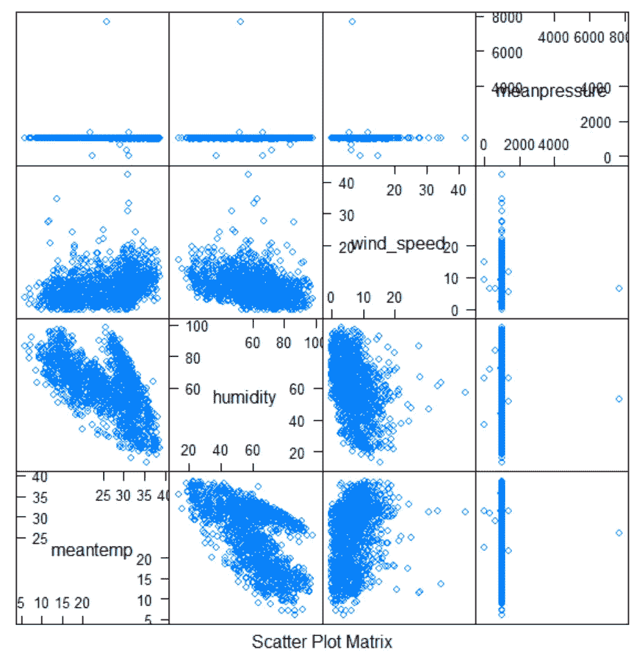

作者图片

现在，我的眼睛立即转向压力部分，尽管温度和湿度之间存在明显的负相关性。图中有些东西感觉不对劲，我马上意识到这一定是一些异常值，知道一些值与其他值相差很大。我知道我不是这方面气候知识的专家，所以我打电话给我们最好的朋友和万事通，**谷歌**，帮我找出气压的正常值，它把我[送到这里](https://iridl.ldeo.columbia.edu/dochelp/QA/Basic/atmos_press.html)。结果，数值应该在 1013.25 毫巴左右。因此，根据数据集和网站，介于 990 和 1024 之间的压力值将被视为正常。然后，将根据数据集的分布替换异常值。

你可能想知道，这个例子一定有一个转折，因为已经有很多观察了。你猜对了！(真的很抱歉我的老土笑话试图让你的注意力回来 lol)

这里的难点在于，你实际上已经得到了每个变量的月平均值，你需要将它转换回日值。现在，根据我之前给出的最后两个例子，请回答这个问题

> 有用吗？这样做可能吗？

把你的答案留到本文结尾，我们来看看。

首先，正如我们之前所做的，让我们看看变量之间的散点图。

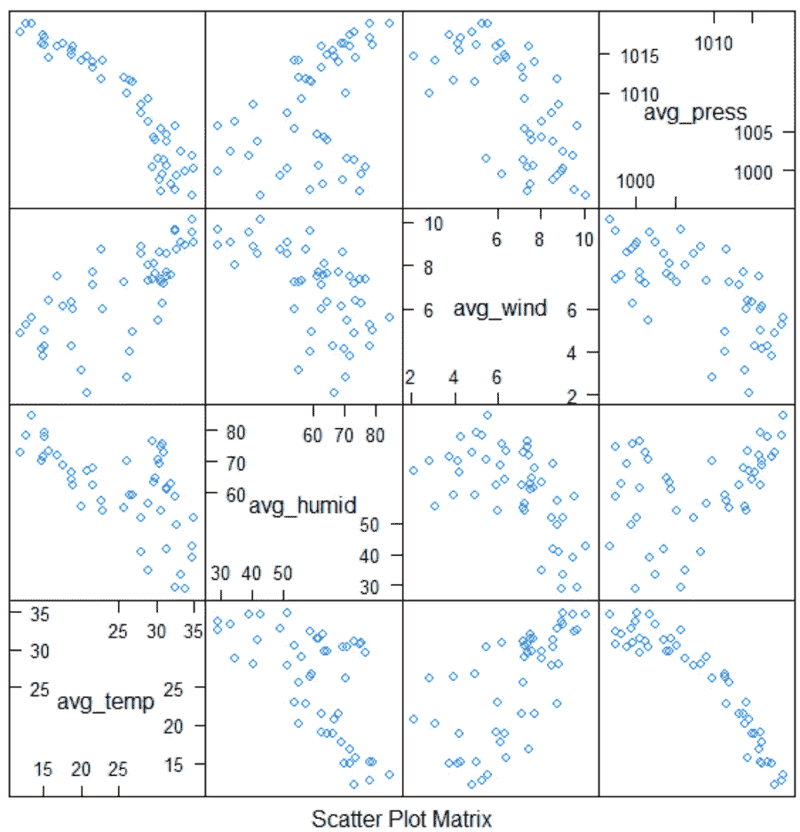

作者图片

看起来我们的数据集是相互关联的。以下是我从这个情节中看到的:

*   最明确的关系是温度和压强之间的关系，这是负相关。
*   其余的可能有相当适度的相关性，看起来可能符合二次模型。

考虑到这些，我决定为每一对可能的变量创建一个线性和二次回归模型，然后比较它们的 R 平方值和调整后的 R 平方值。此外，我将为每个变量创建一个线性季节回归模型，因为根据下面的图，它肯定有一个季节模式。

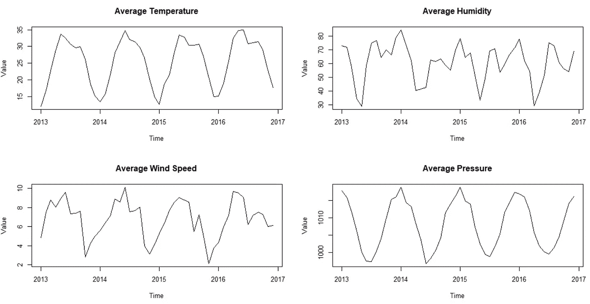

作者图片

在进行回归之前，最好对值进行标准化，因为值的变化是不相似的。这是模型拟合的结果:

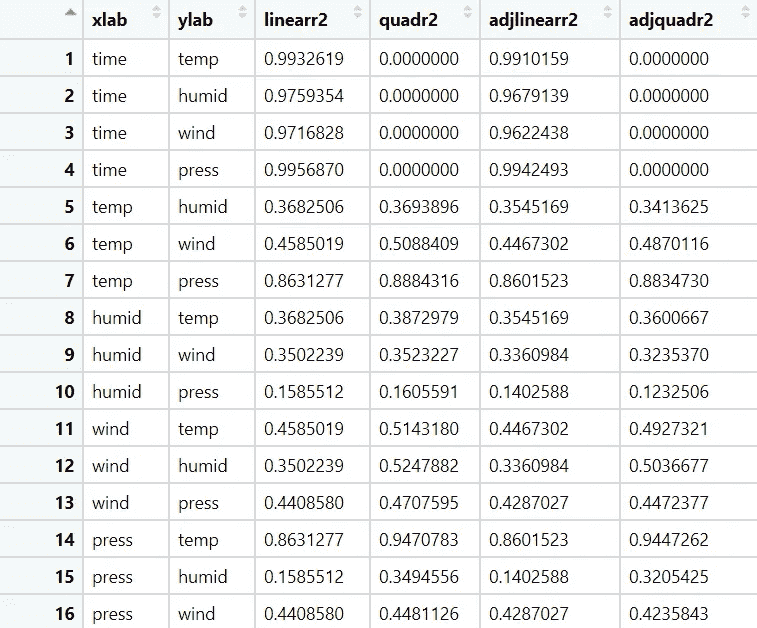

作者图片

让我们关注变量之间的关系。排除季节性回归结果(第 1-4 行)，最高的 R 平方值是二次模型，其中压力为自变量，温度为因变量。而另一个模型似乎不太适合，尽管散点图显示了相关性。幸运的是，季节模型非常适合所有变量。考虑到这些，我的计划是这样的:

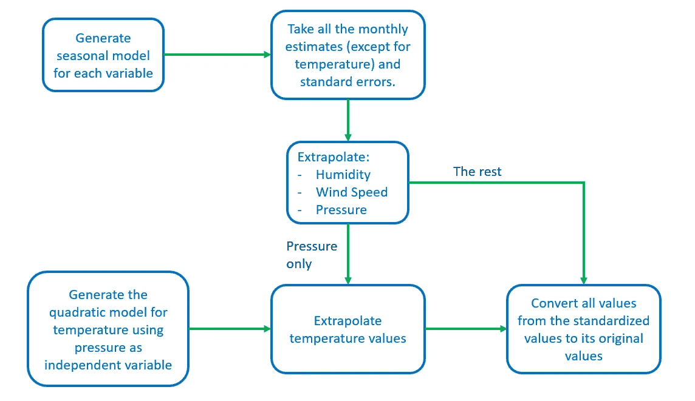

作者图片

现在，你一直在等待的时刻，真实值与外推值的比较(蓝线是外推值)。

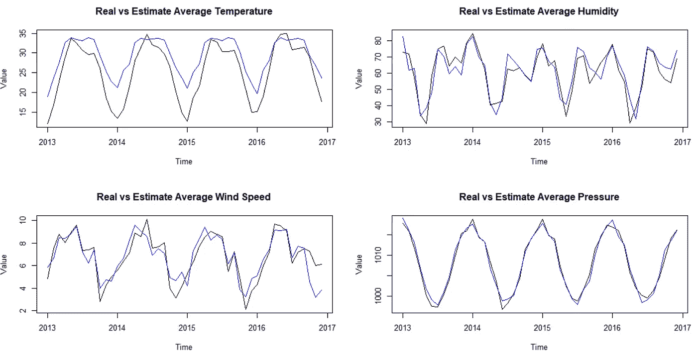

作者图片

每个外推值都与实际值吻合得很好，而且与温度的关系也不太坏。但是，我们的百万美元问题还没有答案。为了将数值转换回每日数值，我们需要一点数学知识。

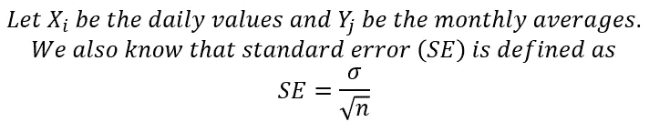

作者图片

其中 n 是样本数。然后，我们可以获得月平均值的方差，即

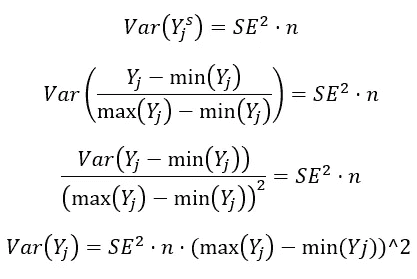

作者图片

其中 Yj^s 是月平均值的标准化版本。最后，我们用这组等式推导出每日值的标准误差:

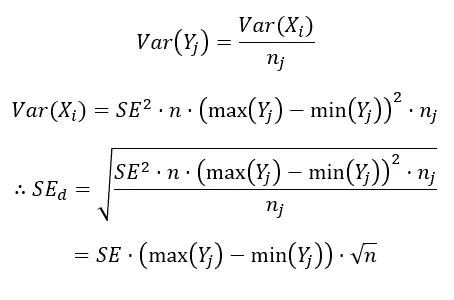

耶！:)，图片作者

废话不多说，让我们看看每天的外推值是如何得出的。

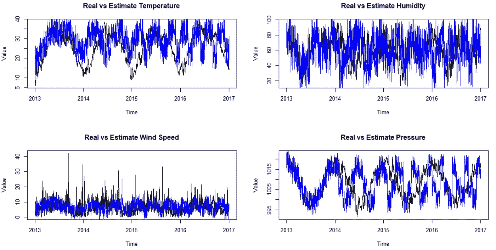

作者图片

我的第一反应是“这是什么嘈杂的时间序列？这简直是疯了！”。我不认为我们需要解释什么来回答这个问题，这是一个明确的否定，至少使用这种方法。由于我们使用外推数据进行外推，因此外推值噪音太大，并且仅对短期有效。此外，月平均值不像日平均值那样带有“跳跃”,导致外推的日值无法捕捉到它。

# 结论

*   这种外推方法只能根据计算中使用的数据集来创建值，并且生成的值将遵循数据集的特征。
*   平稳性假设可能会影响检测“跳跃”的能力。因此，更合适的模型可能是生成更合适的外推值的解决方案。
*   即使外推值是完美的，也不意味着它是总体的完美代表。尽管如此，最好还是得到一个对人口可能的估计描述。

# 下一步是什么？

我可能不是这方面的专家，但我确实学会了创造性地使用时间序列数据集。尽管如此，我还是想听听你的建议，也许能更好地改进这个方法。所以，下面是我对这种时间序列外推法的 GitHub 回购。近期一定会贴出更多的数据科学或精算项目，敬请期待！

 [## nicholasatyahadi/时间序列数据集外推法

### 有时我们会收到少量数据的数据样本。这个小数量可能会受到周期性的影响…

github.com](https://github.com/nicholasatyahadi/Time-Series-Dataset-Extrapolation)