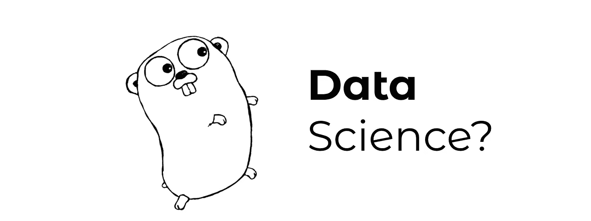
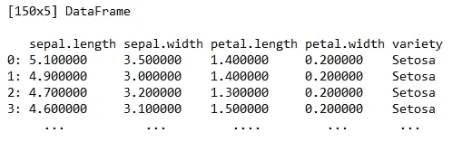
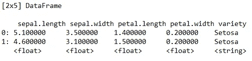
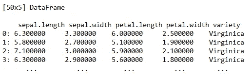
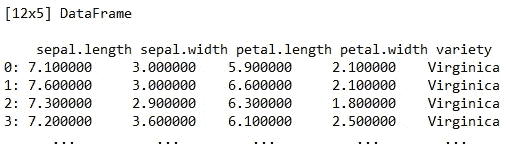
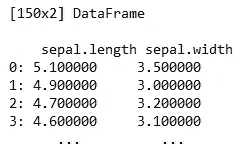

# 去学数据科学？让我们试试。

> 原文：<https://towardsdatascience.com/go-for-data-science-lets-try-46850b12a189?source=collection_archive---------14----------------------->

## 谷歌的 Golang 能搞定数据科学吗？让我们找出答案。

*数据科学能从静态类型、编译的编程语言中受益吗？*这就是我们将在本文中探讨的。

Go 或 Golang 是一种非常类似于 C 的编程语言，但是提供了内存安全、垃圾收集和结构化类型。它是由**谷歌**在 2007 年设计的，目的是在多核、联网机器和大型代码库的时代提高生产力。

图片来源:[维基共享资源](https://commons.wikimedia.org/wiki/File:Golang.png)

***作者注:*** *我不是围棋编程语言方面的专家。下面你将阅读一篇观点文章，展示该语言处理数据的选项。欢迎在评论区发表你的想法。*

***但是我们作为数据科学家为什么要关心围棋呢？***

我很高兴你问了。大多数开发人员对 Python 有一种爱恨交加的关系，其中“爱”的部分来自于它易于学习和编写，“恨”的部分来自于它非常慢并且是动态类型的。

因此，Go 可能是解决 Python 问题的语言之一。

本文的目的不是向您展示如何在您的机器上安装和配置 Go，而是向您展示 Go 如何处理**数据读取**和**数据操作**，因此您可以将它与您选择的语言进行比较，看看它是否值得进一步探索。

目标读者是任何对 Python/R 有足够经验的人。我所说的“足够经验”是指你知道如何编写代码，并且你能够看到这两种语言的缺点。

这篇文章的结构如下:

1.  设置和导入
2.  读入 CSV 数据
3.  数据帧
4.  数据过滤
5.  结论

是的，完整的代码可以在[这里](https://gist.github.com/daradecic/c295c04191f91585e198a21df21fd76d)找到。事不宜迟，我们开始吧！

# 设置和导入

首先，我们将做一些必要的事情:声明一个包，导入一些库，并声明 main 函数。

与 Python 相比，这有点像样板文件，而且所有要执行的代码都必须在`main`函数中。请随意考虑这是赞成还是反对。

在我们开始学习与数据科学相关的东西之前，我们的 **main.go** 文件应该是这样的:

这就是开始前需要的所有样板文件。在下一节中，我们将下载并读入 CSV 数据，在接下来的一节中，我们将把它转换成 DataFrame 对象，这样就可以很容易地操作它。

# 读入 CSV 数据

没有数据就没有数据科学。因此，任何打算用于数据科学的编程语言都必须具有数据读取和处理能力。

有了 Go，我们可以使用 **OS 模块**读入逗号分隔的数据。为了演示，我们将使用著名的[虹膜数据集](https://gist.github.com/netj/8836201)，代表来自各种花卉物种的数据。

要读取 CSV，我们可以使用以下代码片段:

例如，如果找不到文件，`os.Open`命令会导致错误。这就是为什么以某种方式处理这个错误是个好主意。但是如果您现在将这个`irisCsv`打印到控制台，您将不会得到您所期望的结果:

`&{0xc000088780}`

我们将在 net 部分解决这个问题，在那里文件将被转换成数据帧。

# 数据帧

如果您曾经使用 Python 或 R 进行过数据科学方面的工作，那么您肯定对数据帧的概念很熟悉。为了执行任何与数据相关的工作，我们需要将 CSV 转换成 DataFrame 格式。在这样做之前，我们需要安装`dataframe`库:

`go get github.com/kniren/gota/dataframe`

现在我们可以很容易地将它包含到我们的导入中——只需将所有内容放在 imports 部分的`go get`之后。从这一点来看，将`irisCsv`转换成数据帧的过程再简单不过了:

`df := dataframe.ReadCSV(irisCsv)`

如果您现在将它打印到控制台上，您会看到类似这样的内容:

***挺酷的吧？***

在下一节中，我们将探索如何实际处理这些数据——如何过滤数据、选择子集等等

# 数据过滤

现在，这是你一直在等待的部分。对你们大多数人来说，这一部分可能是成功或失败的时刻。如果 Go 能够很好地处理数据操作，考虑到它对 Python 的所有非数据科学相关的东西，它可能值得进一步探索。

事不宜迟，让我们看看如何打印出数据帧的前几行**——与 Python 和 Pandas 的`head()`相同。**

执行此代码将导致以下结果:

结果显然与使用 Python 获得的结果相同，但是 Python 在这里是明显的赢家，至少在开发的便利性和速度方面是如此。

接下来，我们将深入研究**过滤**。

假设您只对 virginica 物种感兴趣，并希望将它们存储到特定的变量中。你可以这样做:

现在，这比 Python 中的输入要多得多，但是你不能否认代码不干净和不言自明。要是没有这么多打字要做就好了。

同样，您可以过滤掉其他操作符。这里我们选择过滤掉所有`sepal.length`等于或小于 7:

太好了。对于最后一个示例，让我们看看如何选择感兴趣的列:

此外，如果你问我，我会说这不是最干净的解决方案，但是这更多的是与 Go 语法有关，而不是 Go 处理数据的能力。这实际上可能对你有好处，取决于你习惯哪种类型的语法。

这篇文章到此为止，让我们在下一部分给出**结论**和一些结束语。

# 结论

老实说，我还没有像探索 Python 那样深入地探索过 Go 编程语言。然而，我们仍然做了一些有益的工作。

以下是我最后的想法:

*   *在熟悉数据和/或设计解决方案原型时，我会使用 Go 吗？*绝对不是——它只是没有考虑探索性数据分析。
*   *我会翻译最终的 Python 解决方案来获得更好的性能吗？*也许。

我说的“可能”是指收益大于成本，收益是速度的提高，成本是进行转换所需的时间。是的，Python 比 Go 慢，但是在某些情况下，你可能不会从额外的速度中获益太多。

*你用过 Go 做数据科学吗？或者其他不是 Python，R，或者 Julia 的语言？请在下面的评论中告诉我。*

感谢阅读。

*喜欢这篇文章吗？成为* [*中等会员*](https://medium.com/@radecicdario/membership) *继续无限制学习。如果你使用下面的链接，我会收到你的一部分会员费，不需要你额外付费。*

 [## 通过我的推荐链接加入 Medium-Dario rade ci

### 作为一个媒体会员，你的会员费的一部分会给你阅读的作家，你可以完全接触到每一个故事…

medium.com](https://medium.com/@radecicdario/membership) 

# 参考

[1][https://en . Wikipedia . org/wiki/Go _(programming _ language)](https://en.wikipedia.org/wiki/Go_(programming_language))