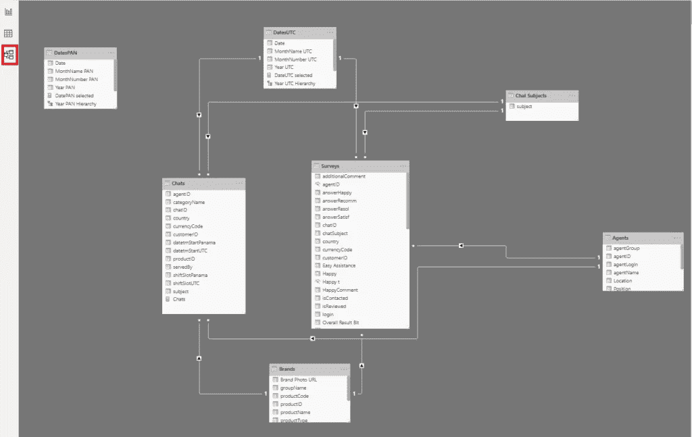
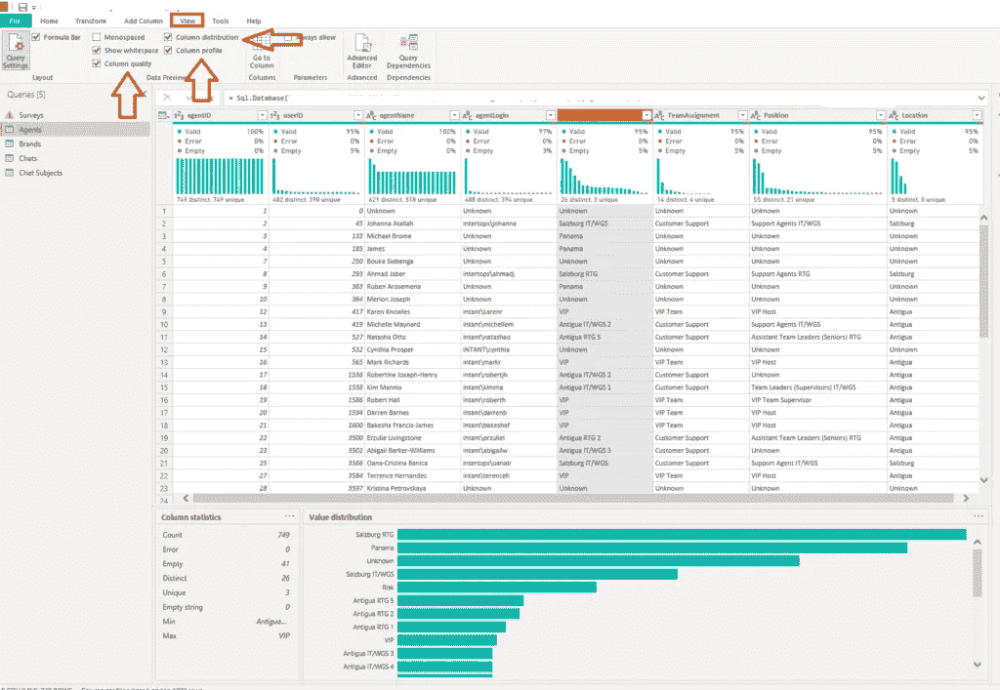
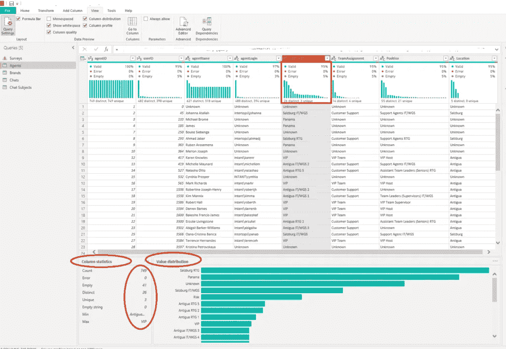

# 力量 BI 101 去，得到他们，夏洛克！像专家一样在 Power BI 中进行数据分析

> 原文：<https://towardsdatascience.com/go-getem-sherlock-doing-data-profiling-in-power-bi-like-a-pro-44f448730e6c?source=collection_archive---------44----------------------->

## 成为一名“数据侦探”听起来对你没有吸引力？检查为什么你应该重新考虑你的立场

克莱门特·尼维斯关于 Pexels.com 的照片

你喜欢阅读犯罪故事吗？就我个人而言，我崇拜他们。而且，当我年轻的时候，我非常崇拜夏洛克·福尔摩斯和赫丘里·波罗，以至于我长大后想成为像他们一样的人:)

这两个角色最适合演什么？他们可以准确无误地剖析人们，基于这种剖析收集事实，所以最后，一切看起来如此简单和明显——就像任何人都可以做到那样！

老实说，我的侦探技能甚至不足以在那份“工作”中取得成功。但是，我决定分析数据，而不是分析人…

## 什么是数据分析？

柯克·赖在 Unsplash.com 拍摄的照片

根据 Ralph Kimball 的说法，数据剖析是对数据源内容的系统的预先分析。这句话中有多个关键词，但我们只关注其中的几个:

*   在开始使用数据之前，你必须了解你的数据
*   您必须检查数据的所有方面，从检查内存占用和基数到复杂的业务规则(系统性的)
*   您应该对源数据执行数据剖析——在数据仓库领域有一句名言:*垃圾进，垃圾出*！简而言之，如果您的数据本身质量不好，您就不能指望您的报告能显示准确的数字

有多种类型的数据分析技术:

1.  ***完整性*** —我的列中有多少空白/空值？
2.  ***唯一性*** —我的列中有多少个唯一值([基数](/how-to-reduce-your-power-bi-model-size-by-90-b2f834c9f12e))？我有副本吗？允许有重复吗？
3.  ***值分布*** —记录在特定属性的不同值之间的分布
4.  ***范围*** —查找列内的最小值、最大值、平均值

## 为什么我需要数据分析？

Andrea Piacquadio 在 Pexels.com 的照片

执行数据分析的主要好处是*提高数据的质量*。这样，例如，您可以发现电话号码列中是否有字母，或者邮政编码是否与预期模式不匹配。

此外，您还可以捕捉数据中是否出现了异常值。简单地想象一下，您有一个包含不同水果的单独价格的列——假设它的范围在 1 到 1000 之间。但是，突然之间，您注意到 1.000.000 的值(有人犯了一个错误，或者其他什么原因)。现在，假设您的报告显示了水果的平均价格！我打赌你不会想到苹果、桔子或香蕉的平均价格只有几千美元:)

## 了解您的数据

最后，在将数据呈现在用户面前之前，你应该了解这些数据。因为，根据数据分布和列的其他特征，您可以更容易地决定使用哪些可视化，或者是否有必要应用一些额外的步骤来进行数据清理或数据转换。

研究数据的细微差别并发现底层结构中的异常，可以使您的报告更出色，同时也更准确。

照片由 Unsplash.com 的 Edo Nugroho 拍摄

## 利用 Power BI 进行数据分析

我最喜欢 Power BI 的一点是，它为您提供了一种可能性，不仅可以创建吸引人的可视化效果，还可以在此之前塑造您的数据。

也就是说，当涉及到数据分析时，Power BI 可以提供很多功能。更重要的是，它使您能够以非常用户友好的方式执行数据分析，因为它有一些内置的功能，可以使您的“数据夏洛克”工作更加容易。

我将与您分享一些我在日常工作中应用的关于数据分析的技巧。

我喜欢做的第一件事是在 Power BI Desktop 的 model 选项卡中打开数据模型:

这样，我就熟悉了这些表，我可以识别关键列、表之间的关系、关系类型(1:1，1:M；活动/不活动)等。这让我对数据模型有了一个很好的了解，所以我可以在以后专注于具体的事情。

下一步是打开 Power Query 编辑器，大部分数据分析都在这里进行。那么，让我们来看看它是如何做到的:

在“视图”选项卡下，打开“列分布”、“列配置”和“列质量”选项。一旦您选择了一个特定的列，您应该能够看到您的数据分析。更重要的是，它以一种很好的、人类可读的方式显示，因此您可以快速获得底层数据的详细概述！

这样，Power BI(或者更准确地说，Power Query)可以帮助您发现数据中的异常值、异常或任何其他意外的“行为”。

现在让我们来看看所有这些视觉效果显示了什么:

*   ***列质量*** 显示有效数据与错误数据及空数据的百分比。在一个完美的世界里，100%的数据都是有效的，但是现实中很难做到
*   ***列分布*** 显示列内的数据分布，同时也显示不同的和唯一的值的数量。这两者是不一样的:不同的值包括重复值和空值，而唯一值不包括。因此，非重复值是总数，而唯一值则表示这些值中有多少不是重复值或空值。
*   ***列概要*** 显示列的更深入的概述，包括行数，以及在特定列中导入数据时是否有错误。您还可以检查空行的数量，与列中的最小值和最大值相同。这在您分析一个数字列时特别有用，因为您可以快速发现任何可能的异常值(请回忆一下我们之前关于水果价格的例子)

此外，当应用于数字列时，列统计信息还将包括零和 NULLs 的数量，以及一些统计函数，如平均值、标准偏差和偶数与奇数之间的分布。

拥有所有这些统计信息可以帮助您理解数据分布，并在您决定额外转换或清理数据时为您提供支持。

## 结论

现代数据仓库面临的最大挑战之一是实现最高水平的数据质量。这条道路上的第一步(也是最重要的一步)是数据概要分析。

回到我们开始的地方——夏洛克·福尔摩斯和赫丘里·波罗——因为他们能够在调查过程中发现细微的差别并识别出一些不寻常的行为(异常值),这最终为他们带来了成功！

总结:花点时间成为“夏洛克”或“波洛”，然后再将注意力转移到在报告中构建漂亮的视觉效果上。

感谢阅读！

[成为会员，阅读 Medium 上的每一个故事！](https://datamozart.medium.com/membership)

订阅[此处](http://eepurl.com/gOH8iP)获取更多有见地的数据文章！