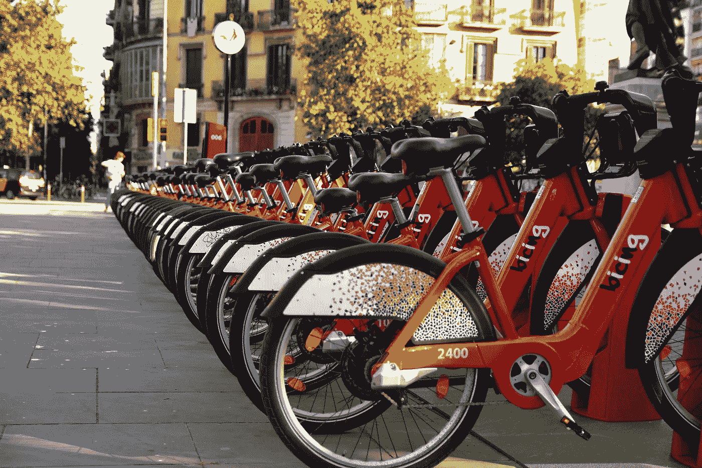
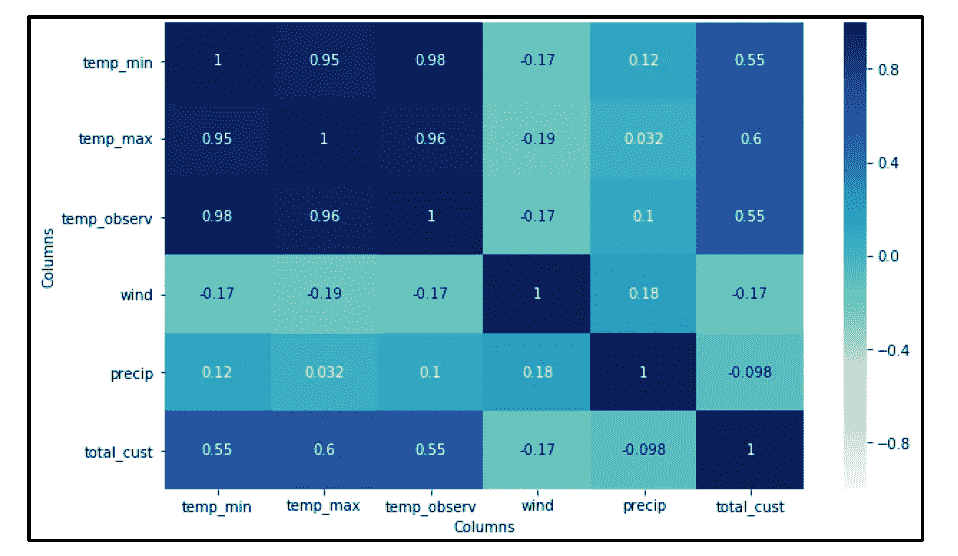
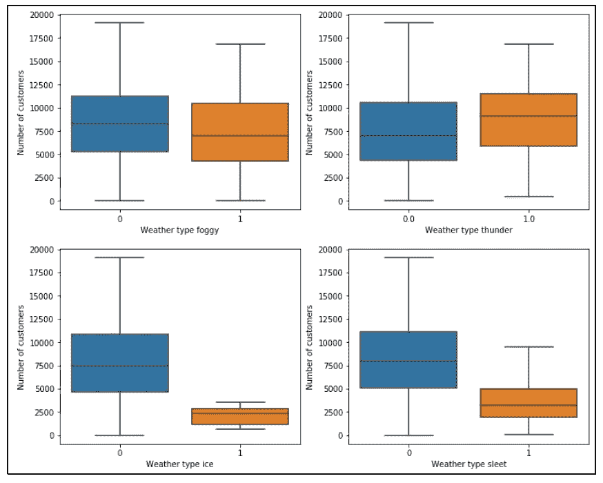
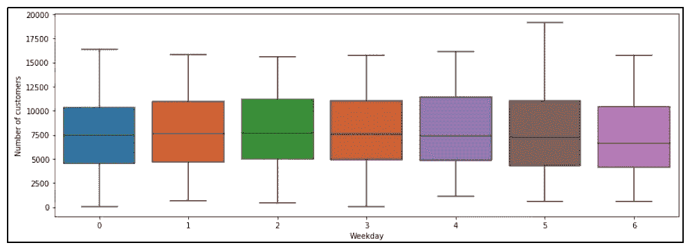
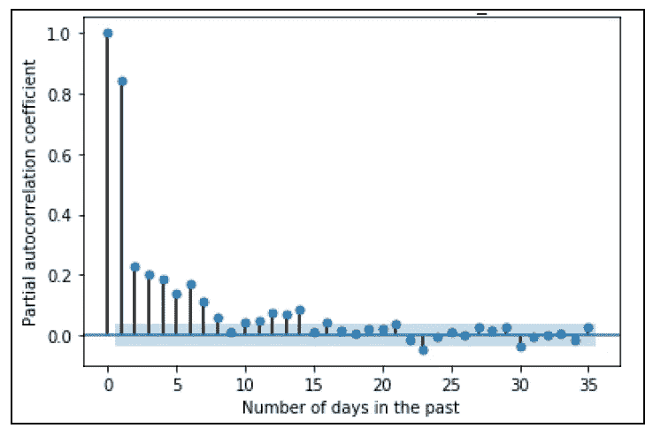
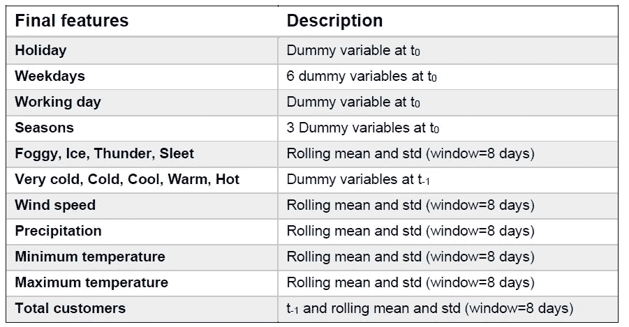

# 基于 AdaBoost、随机森林和 XGBoost 的时间序列预测

> 原文：<https://towardsdatascience.com/go-highly-accurate-or-go-home-61828afb0b13?source=collection_archive---------8----------------------->

照片由[杰米街](https://unsplash.com/@jamie452?utm_source=unsplash&utm_medium=referral&utm_content=creditCopyText)在 [Unsplash](https://unsplash.com/s/photos/mistake?utm_source=unsplash&utm_medium=referral&utm_content=creditCopyText)

## 我们能从不能给我们很好预测结果的数据科学项目中学到什么

*编辑:这篇文章之前的标题是“去高度精确还是回家？”*

在 [kaggle](https://www.kaggle.com/) 上浏览笔记本，或者阅读那些数据科学项目的故事，在这些故事中，人们获得了高度准确的结果，完美地解决了潜在的业务问题，这对于数据科学领域的初学者来说可能会非常沮丧，因为他们在自己的项目中可能达不到这样的结果。但是这些闪亮的笔记本和博客帖子实际上并没有讲述事情的全部。

获得好的结果实际上意味着大量的工作。除非您一开始就有一个非常全面的数据集，否则您将需要运行多个周期来研究、添加和探索数据、设计和选择要素、转换要素以及运行和调整模型。即使经过多次尝试，您的模型可能仍然表现平平。那么该不该放弃这个项目，以“浪费时间”来归档呢？

**绝对不行！**

在下面的段落中，我想分享我自己在一个具有挑战性的项目中的工作经历，这让我学到了关于数据科学的宝贵经验。

# TL；博士:

*   不要期望马上得到很好的预测结果
*   时间序列预测是非常困难的，通常情况下，简单的模型或传统的统计方法会比先进的机器学习模型产生更好的结果
*   超参数调整不会将坏的或不相关的数据变成很好的预测；回到你正在使用的功能，试着理解哪些应该删除、重新设计、改造或添加
*   理解你为什么使用某些算法；将它们与其他人进行对比，并能够解释它们的优缺点
*   使用一个简单的基线模型来比较你的结果
*   从黑客到理解

# 该项目

该项目的目的是使用来自 [Capital Bikeshare](https://www.capitalbikeshare.com/system-data) 的数据预测美国 DC 大都会地区的自行车共享需求。有一整套研究只是处理这样一个问题，即如何知道人们何时想在一个城市的某个位置租一辆自行车，以避免车站自行车供应过剩和短缺。**我希望通过专注于基于树的集成算法(AdaBoost、random forests 和 XGBoost)之间的比较来解决需求预测问题，并避免我在 kaggle 和其他地方发现的自行车共享预测的许多实现中普遍存在的前瞻偏差**。因此，我预测了整个城市第二天的自行车共享客户数量。

图片由 [Pablo Valerio](https://pixabay.com/users/dkatana-1469103/?utm_source=link-attribution&amp;utm_medium=referral&amp;utm_campaign=image&amp;utm_content=4196725) 拍摄，来自 [Pixabay](https://pixabay.com/?utm_source=link-attribution&amp;utm_medium=referral&amp;utm_campaign=image&amp;utm_content=4196725)

你可以在我的 [GitHub](https://github.com/julianikulski/bike-sharing) 上找到这个项目的实现。我使用了 Capital Bikeshare 的自行车共享数据、NOAA 国家气候数据中心的历史天气数据和 DC 人力资源部的信息。自行车共享数据的范围从 2011 年 1 月 1 日到 2018 年 12 月 31 日，是一个提供日常自行车需求的连续时间序列。合并数据集后，保留了一个日期特征、十九个分类特征(假日和天气类型特征)和六个数字特征(平均值、最小值、最大值、观测温度、风速和降雨量)以及目标变量(t0 时的客户数量)。

我将简要概述我的 EDA 的部分内容(通过对自行车共享研究的全面文献综述了解)，建模和评估方法，然后回顾这个项目教给我的经验教训，我希望将这些经验教训传递下去。

# 探索性数据分析

显示目标随季节分布的箱线图

根据季节绘制的目标分布图显示，租赁自行车的人数与一年中的时间有明显的联系。在春天，当与夏天和秋天相比相当寒冷时，自行车共享需求将会降低。

显示数值天气特征和目标之间的皮尔逊相关系数的热图

相关系数表明，最低温度与目标温度、最高温度与目标温度之间存在较强的相关性。我决定同时使用这两个特性。风速和降雨量与目标只有微弱的相关性，但是，我想保留这些特征，因为它们可能对模型仍然有用(特别是考虑到皮尔逊相关性仅显示线性关系)。为了避免前瞻偏差，即使用只有在未来才可用的数据来预测未来的数据，我使用了滞后的天气数据。我为过去 8 天的天气趋势的平均值和标准差设计了新的特征。用不同的时间滞后运行我的模型显示，8 天产生了最好的结果。我还将 t-1 时的最高温度编码为一个分类变量，表示一天是非常冷、冷、凉、暖还是热。

根据天气类型显示目标分布的箱线图

我没有使用原始数据集中包含的 18 种不同的天气类型，而是根据目标变量的相似分布将它们组合成 4 个分类变量。我还设计了这些变量的 8 天滞后的均值和标准差。

显示目标在不同工作日的分布的箱线图

工作日实际上似乎对顾客数量没有太大影响。然而，基于树的集成模型应该能够很好地处理有噪声的数据，所以我保留了这些特征，并在删除它们之后再次运行我的模型来比较结果。

目标的部分自相关图

因为我使用的是时间序列数据，所以目标值也可以设计成特性，实际上也应该如此！从偏相关图中我们可以看出，昨天的客户数量与今天的客户数量有很强的相关性。我添加了 t-1 的客户数量作为一个特征，还添加了过去 8 天的平均值和标准差。

总客户目标变量的时间序列

在进行时间序列预测时，统计学告诉我们，我们需要确保我们的数据是平稳的，才能得到准确的结果，这意味着需要去除任何季节性或非季节性的趋势。我使用了 [ADF](https://en.wikipedia.org/wiki/Augmented_Dickey%E2%80%93Fuller_test) 和 [KPSS](https://en.wikipedia.org/wiki/KPSS_test) 测试来发现目标不是静止的。我比较了预测非平稳和平稳目标变量的模型的性能，以了解非平稳性对预测结果的影响。

模型中使用的最终特征以及应用于它们的转换

我总共使用了 25 个特征来预测需求。

# 建模

与其他机器学习算法相比，基于树的集成模型具有多重优势:易于理解；他们的成绩比底层的弱学习者要好；它们没有正态分布假设，可以处理混合数据类型；它们对过拟合、离群值、噪声、多重共线性和输入缩放具有很强的鲁棒性(更多详情，请查看[本文](https://www.sciencedirect.com/science/article/pii/S1383762109000605)和[本文](https://link.springer.com/chapter/10.1007/3-540-45014-9_1))；与支持向量机或神经网络等最大似然算法相比，它们在计算上相对便宜。因此，我使用 AdaBoost、random forests 和 XGBoost 来预测自行车共享需求，并确定这三个模型中的哪一个最适合这种类型的数据集。作为性能基准，我使用了最后一个值方法，该方法预测明天的需求(t0)将与今天的需求(t-1)相同。

关于实现和调整的超参数的更多细节，你可以参考我的 [Jupyter 笔记本](https://github.com/julianikulski/bike-sharing)中的代码。

# 估价

在我的评估中，我根据曾等人(2016) 使用的方法使用了三种不同的指标:平均误差(MAE)、均方根误差(RMSE)和均方根对数误差(RMSLE)。MAE 显示的是预测值与真实值的平均偏差，而 RMSE 则对偏差进行平方，对较大偏差的惩罚比对较小偏差的惩罚更重。RMSLE 对低估的惩罚比对高估的更重。这使得自行车共享需求成为一个有趣的指标，因为你通常希望在共享站有更多而不是更少的自行车供人们租赁。

自行车共享需求预测汇总结果

查看这些结果并将高级 ML 算法与基准和目标值范围进行比较，所有三个模型都表现得相当好。原始基线模型甚至优于 MAE 上的所有调优模型。此外，这些模型在预测中平均每天偏离 1500 人。考虑到在分析的整个 8 年期间，平均每天只有 7，726 个客户，这些预测性能并不太好。

# 那么，我们如何解释这种表现，我们又能从中学到什么呢？

**时间序列预测与前瞻偏差:**预测时间序列很难，因为有很多因素可以影响明天的价值。此外，你需要更多的统计背景知识，以避免陷阱。最重要的是，要有一个有意义的模型，你需要避免前瞻偏见。在我的模型中，我使用了滞后的天气数据来解释前瞻偏差。然而，由于天气多变，趋势数据可能没那么有用。使用天气报告/预报数据来预测需求可能更好。但由于这些信息很难获得，尤其是过去较长时期的信息，所以我决定使用历史天气数据。

除了这方面的前瞻偏差，我们还需要确保我们**不会引入随机性。**时间序列需要连续有序。我们不能将数据随机分成训练集和测试集。相反，我们应该使用[时间序列片段](https://scikit-learn.org/stable/modules/generated/sklearn.model_selection.TimeSeriesSplit.html)来避免我们用在预测时无法知道的信息来预测目标。此外，当使用 bagging 或 bootstrapping 算法时，如随机森林和 XGBoost，确保您实际上**不引导**，因为这将再次在我们的预测中引入随机性和前瞻偏差(默认情况下， [XGBoost](https://xgboost.readthedocs.io/en/latest/parameter.html) 不引导，而 r [和随机森林](https://scikit-learn.org/stable/modules/generated/sklearn.ensemble.RandomForestRegressor.html)引导)。前瞻偏差是你在 kaggle 上看到的类似项目的其他实现实际上产生更好结果的原因:在训练和测试期间，它们表现得更好，而在现实生活中，它们实际上可能会失败。

**统计以及如何知道它们什么时候重要:**即使不使用传统的统计方法来做时间序列预测，仍然需要很好地理解一个时间序列所附带的底层统计假设。在不了解自相关的情况下，您会查看目标值的偏相关来确定这是一个很好的工程特性吗？如果没有意识到平稳性，您会转换您的数字特征和目标变量来解释季节性和非季节性趋势吗？因为我以前没有做过时间序列预测，不确定平稳性的影响，我简单地用**运行了所有预测平稳*和*非平稳目标**的模型，并对它们进行了比较。我发现只有 AdaBoost 在处理静态数据时表现稍好。因此，当趋势仍然包括在目标中时，ML 算法似乎不容易不准确。但在未来，如果我不确定结果会是什么，我会尝试两种选择。

**简单基线模型:**与 3 ML 算法相比，最后一个值方法的性能并没有差很多。这怎么可能呢？如上图所示，**今天和昨天的目标值高度相关**。因此，如果我使用一个模型，简单地从昨天的值来预测今天的目标，那么它会表现得相当好。这表明，即使你有一个考虑到各种特征的花哨的多元 ML 模型，你实际上也不一定能够[胜过非常简单的基线模型](https://www.researchgate.net/publication/323847484_Statistical_and_Machine_Learning_forecasting_methods_Concerns_and_ways_forward)或更传统的统计模型，如 [ARIMA](https://machinelearningmastery.com/arima-for-time-series-forecasting-with-python/) 。特别是在时间序列预测中，越复杂并不总是越好。

**反复试验:**不仅超参数调整对提高性能很重要。如果您有坏的或不相关的特征，调整不会保存您的模型。**特征选择和工程对改进欠拟合模型至关重要**。当比较工作日特征的包含和移除时，查看 AdaBoost 的性能，其显示了良好特征选择的重要性以及该算法对噪声数据的明显弱点。AdaBoost 是唯一一种在去除工作日特征后有所改进的算法。功能选择和工程是一个漫长的试错过程。但是，用不同的特征来测试你的模型，以确定哪些特征实际上有助于你的预测，哪些特征不利于你的预测，这一点很重要。识别其他有用数据集和要素的研究部分至少与调整超参数一样重要。

**理解 ML 算法:**不要因为你在 kaggle 上看到很多人在做 XGBoost 就去实现它。思考不同算法的优缺点，通读介绍这些算法及其伪代码的实际科学论文，并相互比较。通过这个项目和实际阅读分别介绍 AdaBoost、random forests 和 XGBoost 的论文，我实际上理解了如何对比这些基于树的集成算法。只有这样，你才能更好地理解为什么某些算法可能比其他算法执行得更好。在我的例子中，XGBoost 很可能表现得更好，因为它增加了正则化超参数，避免了过度拟合。虽然随机森林通过使用 bagging/bootstrapping 训练样本来减少过拟合，但这对于我们想要避免随机性的时间序列数据没有帮助。

**理解性能指标:**结合使用 MAE、RSME 和 RMSLE 可以让你知道你的模型可能有哪些弱点。因为最后一个值方法的 MAE 较低，但是 RMSE 和 RMSLE 高于任何调整的 ML 模型，这表明 ML 模型更经常适度地过度预测目标，而最后一个值方法更严重地低估。尤其是具有最低 RMSLE 的随机森林，过度预测的频率高于不足预测的频率。这对于需求预测模型来说可能是更好的，因为在车站有更多的自行车可供出租比更少的自行车更好。

# 结论

XGBoost 是三种基于树的集成算法中性能最好的模型，并且对过拟合和噪声更加鲁棒。它还允许我们忽略这个特定数据集中的平稳性。但是，成效还是不大。为了获得更好的自行车共享需求预测结果，需要在特征选择和工程上花费更多的时间。因为模型不适合，很可能需要包括不同的和/或更多的特征。但是，更传统的统计方法，如 ARIMA，也不应该放弃，因为他们可能会产生更好的结果。为了使它对现实世界的应用更有用，一个更长的预测范围和一个特定站点而不是整个城市的预测将是有价值的。

其中一些见解你可能已经很熟悉了，在我在 [Udacity](https://www.udacity.com/course/data-scientist-nanodegree--nd025) 攻读数据科学纳米学位期间，我了解到了理解性能指标、ML 算法和特征选择的重要性。但是这个特别的项目提醒了我，作为一名数据科学家，超越仅仅是黑掉 T5 的 T4，开始理解 T7 对你的成长是多么重要。此外，我以前没有做过时间序列预测，在处理这类数据时学到了很多潜在的陷阱。

并不是你接触的每个项目都会立即带来高预测性能。这往往需要大量的时间、研究和反复试验。但是，即使表现一般的模型也能告诉我们很多关于我们试图解决的潜在数据和业务问题，并指导我们如何改进我们的预测。

*注:这篇博文的内容基于我写的一篇未发表的研究论文。*

你想在媒体上阅读更多高质量的故事吗？考虑注册一个支持我和其他媒体作者的会员。

 [## 通过我的推荐链接加入 Medium-Julia Nikulski

### 作为一个媒体会员，你的会员费的一部分会给你阅读的作家，你可以完全接触到每一个故事…

medium.com](https://medium.com/@julia.nikulski/membership) 

如果你想更深入地了解本分析中使用的基于树的集成算法，请查看我关于 AdaBoost、random forests 和 XGBoost 的指南。

 [## AdaBoost、随机森林和 XGBoost 的终极指南

### 它们是如何工作的，有何不同，何时应该使用？

towardsdatascience.com](/the-ultimate-guide-to-adaboost-random-forests-and-xgboost-7f9327061c4f)