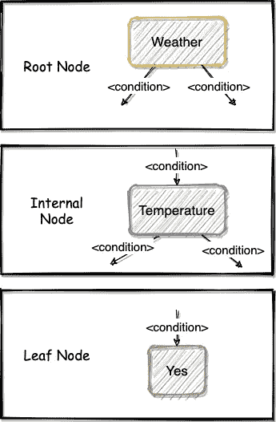
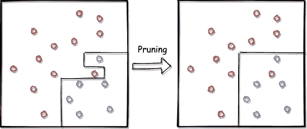
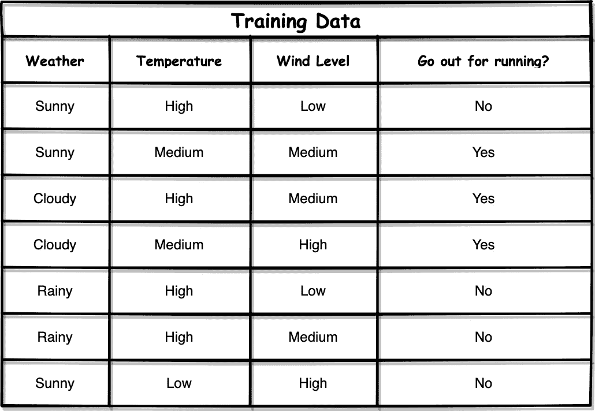
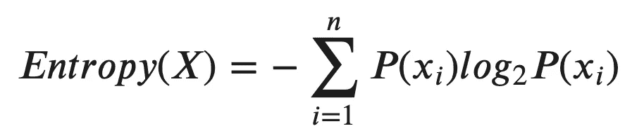
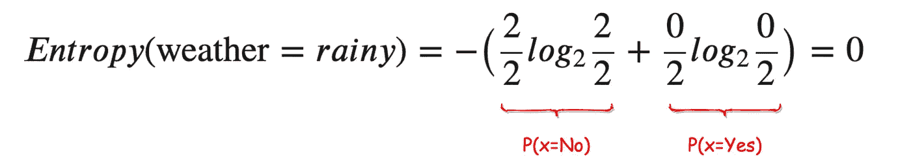
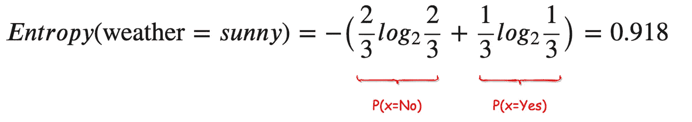
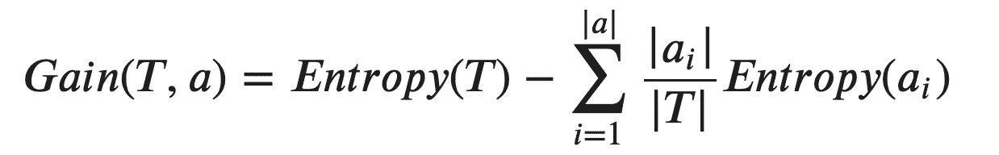
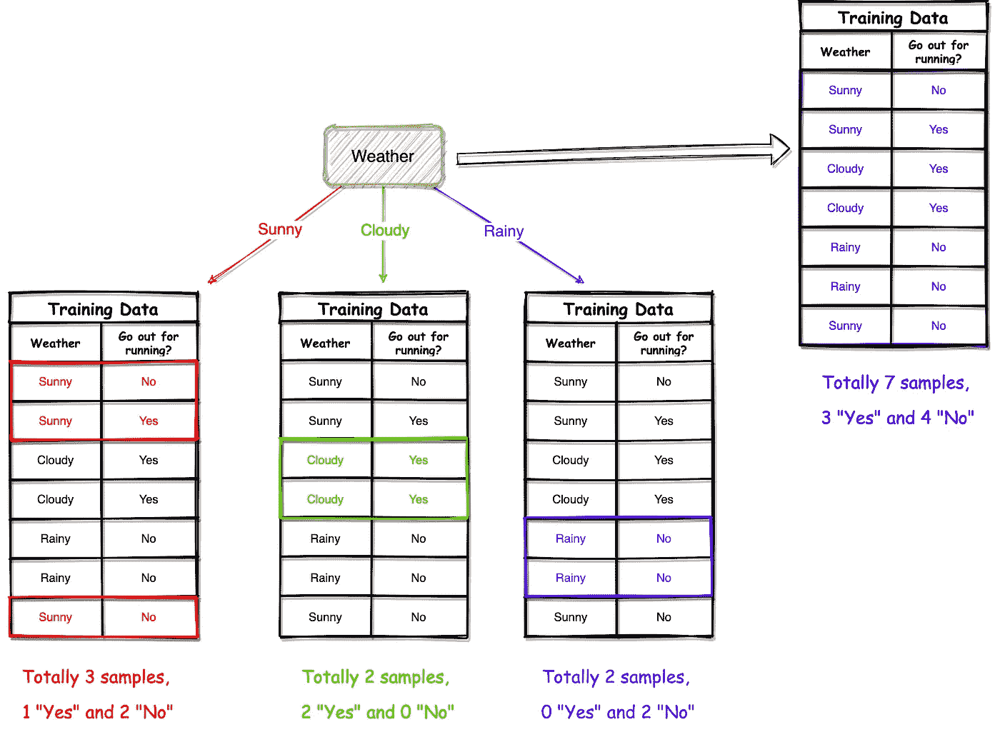
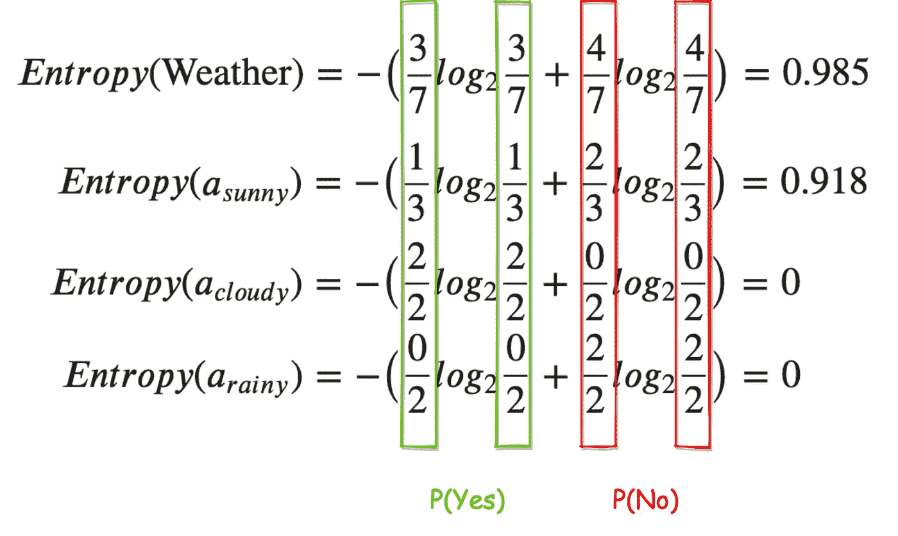
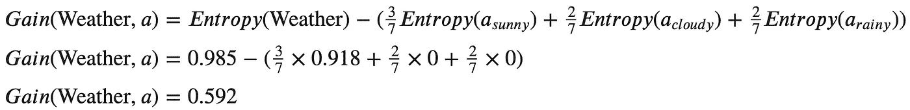

# 出去锻炼还是不锻炼？让数据科学来决定

> 原文：<https://towardsdatascience.com/go-out-for-exercise-or-not-let-data-science-decide-34f8f28ce7b4?source=collection_archive---------30----------------------->

由 [Sorbyphoto](https://pixabay.com/users/Sorbyphoto-725076/) 在 [Pixabay](https://pixabay.com/photos/tree-snow-winter-landscape-1056598/#) 上拍摄的照片

## 决策树机器学习算法简介

作为最流行的经典机器学习算法之一，决策树在可解释性方面比其他算法更直观。让我们考虑下面的对话。

杰德:“我们明天应该出去跑步吗？”
克里斯:“天气怎么样？”
杰德:“我用手机查一下。今天是晴天！”克里斯:“听起来不错！那温度呢？”
玉:“嗯……35 度”
克里斯:“哎呀，太热了。我更喜欢去室内游泳池游泳。”

我们一生中做了很多决定。如果我们想一想为什么会做出那些决定，大多数时候背后都有一个“决策树”，如上图所示。这就是为什么决策树可能是最直观的非常接近人脑的机器学习方法。

# 决策树的构建模块

由 [PublicDomainPictures](https://pixabay.com/users/PublicDomainPictures-14/) 在 [Pixabay](https://pixabay.com/photos/backdrop-block-brick-building-21534/) 上拍摄的照片

决策树作为机器学习模型是如何构建的？构建决策树有几种不同的流行算法，但它们必须包括两个步骤:**构建**树和**修剪**树。

## 构建决策树

为了构建决策树，算法需要生成三种类型的节点:

*   **根节点**:决策树只有一个根节点，位于树的顶端。
*   **内部节点**:这些节点位于其父节点和子节点之间。
*   **叶节点**:这些节点永远不会有子节点，它们是决策树做出的“决定”。

然后，很明显，问题变成了典型的决策树算法如何生成/决定这些类型的节点:

*   对于根节点，应该创建哪个功能？
*   “条件”是如何决定将父节点拆分成子节点的？
*   何时停止生成更多的分支并以叶节点结束？

这些在不同类型的决策树算法之间是不同的，这将在后面的部分中讨论。

## 修剪决策树

这听起来像是一旦树建好了，我们就完成了，但并不是真的。大多数时候，我们必须修剪树木，以避免“过度适应”。

如上图所示，我们假设每个分割红色样本和蓝色样本的边界都是一个分割决策树中节点的条件。事实证明，左边的树似乎过于适合训练示例。修剪后的树，我们期待它成为正确的东西。

过拟合的原因通常是训练数据集小，被认为分裂的“特征”太多。决策树模型最有趣的特征是它们可以与训练数据集完美拟合，即 100%正确地对训练数据集进行分类。然而，这不是我们想要的，因为这几乎意味着我们构建的树已经失去了泛化能力。换句话说，它不能用于实际问题，只能用于训练数据集。

通常，有两种类型的树修剪机制:

*   **预修剪**

建造时修剪树木。也就是说，在拆分节点并将更改应用到树之前，测试拆分是否会提高测试数据集中的分类准确性。如果有，继续做这个分支。否则，该当前节点将不会被分割，从而成为叶节点。

*   **后期修剪**

该算法首先建立决策树。然后，从叶节点向后到根节点，评估每个分支以测试分裂的影响。如果这个分支在测试数据集上没有提高太多的性能，或者有时甚至可以提高性能，那么就去掉它。

# 算法将如何构建决策树

照片由[菲洛娜](https://pixabay.com/users/FeeLoona-694250/)在 [Pixabay](https://pixabay.com/photos/child-tower-building-blocks-blocks-1864718/) 上拍摄

不管我们将使用哪种算法来构建决策树，将使用的两个常见且重要的标准是**纯度**和**熵**。

## 纯洁

理解什么是纯洁是相当容易的。也就是说，对于一个单一的特征，它所对应的决策有多纯粹。让我们使用上面的样本数据集来演示。

*   当天气多雨时，所有的决定都是“不”(100%纯度)
*   当天气晴朗时，2 个决定是“否”, 1 个是“是”

因此，我们可以说第一套的纯度高于第二套。

## 熵

熵几乎是熵的反向概念。它是由 Claude Shannon [1]首先提出的，是一个从热力学转移到信息论的概念。一般是指信息的“不确定性”。公式如下所示:

不要被公式吓到，它在我们的语境中非常简单。集合“ *X* 是节点集合中的一切，“ *xᵢ* 是指每个样本的具体决策。因此，“*【p(xᵢ】)*”是某个决策要做出的集合的概率。

让我们用我们在纯度概念解释中用过的同一个例子。

*   当天气多雨时，两个决定都是“否”(100%纯度)

*   当天气晴朗时，2 个决定是“否”, 1 个是“是”

结果符合直觉。基于训练数据集，当天气下雨时，我们肯定不会出去跑步。换句话说，给定天气是雨天，根本不存在“不确定性”，所以熵为 0。

## 信息增益

在理解了纯度和熵的概念之后，我们可以用它们来构建我们的决策树。最经典、最基本的决策树算法之一叫做“ID3”。它根据一个叫做“信息增益”的概念来分割节点，信息增益是通过减去父节点和所有子节点的熵来计算的。公式如下。

在哪里

*   “T”是父节点,“a”是“T”的属性集
*   符号“|T|”表示集合的大小

同样，不要被公式吓到。我们用一个例子来演示一下。假设我们想使用“天气”作为我们的根节点。我们需要计算它的信息增益。

从上图中，我们可以很容易地计算天气节点(在此上下文中是父节点)及其子节点“晴天”、“多云”和“雨天”的熵，如下所示:

因此，使用“天气”作为根节点的信息增益可以计算为:

同样，我们可以用同样的方法计算另外两个特征的信息增益:温度和风级。

使用温度作为根节点的信息增益是 0.522，对于风级，它是 0.306。因此，我们应该使用天气作为根节点，因为它具有最高的信息增益，为 0.592。

一旦根节点被决定，剩余的内部节点将继续使用信息增益，直到每个分支到达叶子节点，即决定。

# ID3 算法的缺点(信息增益)

照片由 [geralt](https://pixabay.com/users/geralt-9301/) 在 [Pixabay](https://pixabay.com/photos/terrorist-terror-happiness-positive-2481808/) 上拍摄

好的。如果你理解了上面提到的所有内容，你就已经理解了如何使用 ID3(信息增益)算法构建决策树。然而，ID3 算法有一些明显的缺点。

假设我们有另一个特性“日期”。显然，“约会”功能在决定我们是否应该出去跑步时可能不是很有用。然而，普通 ID3 算法倾向于选择具有更多不同值的特征作为靠近树根的节点。这意味着我们最终可能会得到一个以无用特征作为重要节点的树。

当然不会每次都这样，但有可能。因此，有更多的机器学习算法如 C4.5 和 CART 被提出来提高决策树的性能。

我会不断更新不同种类的机器学习和数据挖掘算法。所以，有兴趣的话以后继续关注。

C4.5 算法:

 [## 不要像这样使用决策树

### 展示 ID3 中信息获取的局限性以及使用 C4.5 的优势

towardsdatascience.com](/do-not-use-decision-tree-like-this-369769d6104d) 

# 摘要

Pixabay 上由 [viarami](https://pixabay.com/users/viarami-13458823/) 拍摄的照片

在本文中，我介绍了一个非常流行和经典的机器学习算法——决策树的基础知识。决策树模型的主要构件包括构造和修剪。之后，我介绍了最基本的决策树算法 ID3。我们已经学习了什么是纯度和熵，这些有用的概念在构建决策树中起着重要的作用。ID3 利用信息增益来构造决策树，这是非常直观和易于解释的。然而，它确实有缺点，这些缺点将在其他类型的算法中得到改进。

我的下一篇文章将是关于 ID3 之上的其他流行的决策树算法，以克服它的一些缺点。希望这些文章能帮助你更多地了解机器学习/数据科学学科！

 [## 通过我的推荐链接加入 Medium 克里斯托弗·陶

### 作为一个媒体会员，你的会员费的一部分会给你阅读的作家，你可以完全接触到每一个故事…

medium.com](https://medium.com/@qiuyujx/membership) 

**如果你觉得我的文章有帮助，请考虑加入灵媒会员来支持我和成千上万的其他作家！(点击上面的链接)**

# 参考

[1]香农，C. E. (1948 年)。交流的数学理论。*贝尔系统技术期刊*， *27* (3)，379–423。