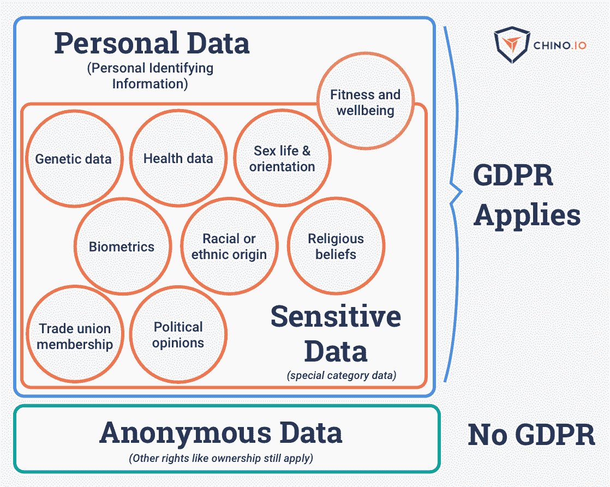
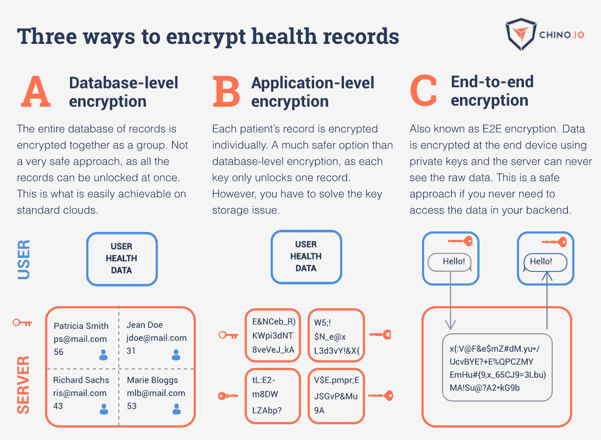

# 保护自己:数字健康的数据保护和数据安全

> 原文：<https://towardsdatascience.com/go-secure-yourself-data-protection-and-data-security-for-digital-health-192f886bb145?source=collection_archive---------21----------------------->

每个人都希望自己的健康数据保密。毕竟，它可以揭示你生活中一些最敏感的细节。

> 对黑客来说，健康数据也比信用卡数据更有价值。但是很多时候，它没有得到适当的保护。

这样做需要结合数据保护和数据安全。这些概念经常被混淆，但我觉得大家，尤其是实际用户，应该更好理解。

## 介绍

> 毫无疑问，隐私、数据保护和数据安全[与](https://www.chino.io/blog/data-protection-vs-data-security/)密切相关，如下图所示。

但它们绝对不是同义词。

> 隐私是一项基本人权，涵盖了个人生活的方方面面。《欧洲人权公约》第 8 条涵盖了这一点。

**数据保护**是关于谁可以访问个人数据的法律控制。例如，《一般数据保护条例》(GDPR)谈到“在处理个人数据方面保护自然人”。**数据安全**更通用。这是关于[技术控制](https://www.chino.io/blog/whoops-the-data-security-mistakes-we-make/)通过使用安全和访问控制来限制对任何数据的访问。数据安全是增强数据保护的重要工具。

> 然而，正如您将看到的，数据保护需要许多额外的措施。在这篇博客中，我将关注数据保护和数据安全。

隐私、数据保护和数据安全之间的关系

# 什么是数据保护？

> 近年来，数据保护越来越重要。世界各国都在收紧数据保护法。

**GDPR** [于 2018 年生效](https://www.chino.io/blog/health-data-and-data-privacy-storing-sensitive-data-under-gdpr/)，保护每个欧盟公民的个人数据，无论这些数据保存在哪里。自 2018 年 5 月 25 日开始执行以来，企业已经收到罚款或受到执行行动。[在本文](https://www.chino.io/blog/gdpr-fines-in-helthcare-7-lessons/)中，我们看了三个关键案例，并从这些案例中吸取了一些重要的经验教训。在美国， **HIPAA** (健康保险流通与责任法案)已经保护健康数据将近 25 年了。在这里，你可以了解 HIPAA 和 GDPR 的区别。最近，加州消费者保护法( **CCPA** )将 GDPR 式的保护延伸到了加州的许多消费者。其他地方也有类似的法律，比如巴西的《LGPD 法》和南非的《POPI 法》。有关所有法律、法规&标准的快速概述，请查看本[免费白皮书](https://www.chino.io/a/chino-io-whitepaper-compliance-overview)。

# 数据保护与个人数据有关

> 数据保护只涉及个人数据，也称为**个人识别信息**或 **PII** 。

根据数据保护法，公司和其他实体不受任何保护。 [GDPR 将个人数据](https://www.chino.io/blog/protect-personal-data-for-gdpr-2/)定义为:

> “……与已识别或可识别的自然人(“数据主体”)有关的任何信息；可识别的自然人是指可以直接或间接识别的人，特别是通过参照身份识别特征，如姓名、身份证号、位置数据、在线身份识别特征，或该自然人的身体、生理、遗传、精神、经济、文化或社会身份所特有的一个或多个因素。”

这意味着任何与个人无关的数据(如匿名数据)都不在 GDPR 的覆盖范围内。

大多数数据保护立法赋予人们收集、存储和分发个人信息的特定权利。通常，与健康、性、宗教信仰等相关的敏感数据。获得额外保护。例如，GDPR 在第 9 条中规定了敏感(特殊)数据类别的数量。

GDPR 下的数据分类

虽然大多数数据保护法涵盖所有形式的数据，但有些法律仅涵盖特定类型的数据。例如，HIPAA 仅与个人健康信息或 PHI 相关。

# 数据主体权利

> 数据保护法基于隐私是一项基本人权的理念。

GDPR 走得更远，给予数据主体与个人数据相关的 8 项基本权利:

1.  **知情权。**
2.  **进入权。**
3.  **权利整风。**
4.  **被删除/被遗忘的权利。**
5.  **权利限制处理。**
6.  **数据可移植权。**
7.  **反对的权利。**
8.  **与自动决策和分析相关的权利。**

CCPA 也给予类似的权利。在大多数情况下，这些权利要求应用程序开发人员实施技术措施，如审计日志记录、同意跟踪和数据导出。

> 然而，有些权利，如被遗忘的权利，也需要法律咨询和专业知识来纠正。

# 实施数据保护

> 数据保护通常需要组织和技术措施的结合。

GDPR 的核心特征之一是，公司在处理个人数据时需要法律依据。这意味着您通常需要在处理数据之前获得许可(同意)。

> 您还必须实施合适的技术措施。然而，GDPR 并没有具体说明这些是什么。

这是因为并非所有企业都拥有同等的资源，并非所有数据都面临同等的风险，而且数据安全性在不断发展。相反，GDPR 谈到了“考虑到最先进的技术”和“通过设计和默认来保护数据”。

在欧盟和美国，也有法律义务公布任何数据泄露的细节。

> 根据 GDPR，即使您不确定违规行为是否已经发生，您也必须在 72 小时内通知您当地的数据保护机构。

您还有义务通知其数据可能受到影响的任何人。在美国，针对经济和临床健康的健康信息技术( **HITECH** )法案要求对影响 500 人以上的任何违规行为进行通知。然而，CCPA 没有这样的要求，而是依靠用户提交投诉。

# 什么是数据安全？

> 数据安全是控制或限制数据访问的任何措施的总称。重要的是，它涵盖了所有形式的数据，而不仅仅是 PII 或 PHI。

数据安全有三个主要方面。首先，您需要实际保护数据，通常使用某种形式的加密。其次，您需要保护您的网络和服务器免受访问。第三，您需要对用户进行身份验证，并检查允许他们访问哪些数据。

> 数据安全有很多标准，包括 NIST[ISO 27001](https://en.wikipedia.org/wiki/ISO/IEC_27001)和 T2 网络安全框架。

# 数据加密

> 加密包括使用加密算法和密钥来保护您的数据。数据应该在静态(存储中)和动态(例如，当您将数据从用户设备传输到后端)时进行加密。

加密有很多种形式，这里就不赘述了。但是有两个关键概念你应该知道。

首先是[对称加密](https://en.wikipedia.org/wiki/Symmetric-key_algorithm)。这里，相同的密钥用于加密和解密数据。这在某些方面就像传统的机械锁。另一种是非对称或[公钥加密](https://en.wikipedia.org/wiki/Public-key_cryptography)。这里，您使用一个(公共)密钥来加密数据，使用另一个(私有)密钥来解密数据。数据一旦加密，就只能用私钥解密。当然，如果你不能保证(私有)密钥的秘密，所有的加密都是无用的。

# 物理和网络安全

> 许多数据安全威胁是基于物理或网络的。数据泄露的一种典型形式是，员工不小心将一个未加密的 USB 密钥留在了餐厅或火车上。另一个是从服务器上物理盗窃硬盘。

> 在任何数据安全风险评估中，都必须考虑这样的物理威胁。作为最低要求，所有磁盘都应该加密以防止被盗。

网络威胁包括未经授权访问您的系统、拒绝服务(DoS)、勒索软件和病毒。这里的主要保护来自专业硬件，如负载平衡器、防火墙和入侵防御系统。一些公司甚至完全禁止访问公共互联网，以确保系统安全。如果你与这里的专家交谈，你可能会听到像非军事区(DMZ)、入侵检测和红方网络这样的术语。

# 认证和访问控制

难题的最后一块是控制和监控谁可以访问哪些数据。这通常被称为 AAA(认证、授权和计费)。

**认证**包括检查用户的身份。传统上，这是通过用户名和密码完成的。

> 但是越来越多的公司使用多因素身份认证。这可能只是简单地向您的手机发送一个代码，但它可能涉及物理认证令牌。它甚至可能涉及生物识别，如指纹、虹膜扫描或面部识别。

**授权**是您检查(经过身份验证的)用户可以访问哪些数据的地方。理想情况下，这应该是非常细粒度的，默认应该是限制访问。

这有助于防止网络钓鱼和类似的攻击，黑客试图通过操纵用户并获取他们的访问详细信息来访问您的系统。

**会计**经常被忽视，但是，它非常重要。这是关于记录所有访问数据的尝试(成功的和不成功的)，对用户帐户的任何更改(密码更改、权限更改等)。)，以及任何未经授权或有潜在风险的网络活动。目的是[确保如果你真的有数据泄露，你确切地知道发生了什么，哪些数据受到了影响](https://www.chino.io/blog/why-accountability-matters-in-gdpr/)。

> 需要注意的是，仅仅因为某人对某个数据有访问权限，并不意味着他们被允许访问该数据。

在这种情况下，数据保护施加了比数据安全更严格的控制。例如，一名医生的接待员能够访问患者记录，但如果他们只是因为爱管闲事而决定随机检查他们朋友的记录，这将违反数据保护。

# 保护敏感数据

> 如页面上方的图片所示，一些数据被视为更加敏感。像这样的敏感数据必须特别安全地存储，防止任何未经授权的访问。

GDPR 规定，您的系统必须实现隐私设计，考虑到最先进的技术，以确保数据得到保护。HIPAA 在[安全规则](https://www.hhs.gov/hipaa/for-professionals/security/laws-regulations/index.html)中给出了精确的指导。

我总是建议人们采取两个关键步骤来保护健康数据。首先，他们应该**假名**它。这意味着将个人详细信息和健康数据存储在不同的位置，并使用一个[假名来连接它们](https://www.chino.io/blog/how-to-implement-pseudonymization-key-questions/)。第二件事是使用一种强大的加密形式。如果您需要访问数据，您应该使用[应用程序级加密](https://www.chino.io/blog/how-to-encrypt-health-data-for-gdpr-hipaa-compliance/)(有时称为记录级加密)，这意味着每个用户的数据都使用唯一的密钥来保护。

如果您实际上不需要访问数据，您应该使用端到端加密。在这里，数据实际上是在终端设备上加密和解密的。

# 如果一切都出错了呢？

> 每家数字医疗公司都应该将数据安全和数据保护放在首要位置。如果你做错了，你将面临一系列的风险。

首先，如果发生任何数据泄露事件，公司会受到负面宣传的影响。在某些情况下，他们甚至会看到自己的名誉受到不可挽回的损害。

其次，对于初创公司来说，这种糟糕的公关会吓跑投资者，并可能危及你的生存。第三，你可能会收到巨额罚款。

> 例如，在 GDPR，罚款可达全球年营业额的 4%,在€可达 2000 万英镑，以较高者为准——我们已经看到€开出了超过 1 亿英镑的罚单。

HIPAA 还征收高达数百万美元的罚款(每份健康记录的丢失或被盗都是有代价的)。如果这还不够可怕，一些数据泄露使公司老板面临刑事指控的风险，特别是当涉及敏感数据时。

# 结论

希望您现在对数据保护和数据安全之间的区别有所了解。正如我上面解释的那样，数据安全就是保护任何类型的数据免受未经授权的访问。数据保护是指保护个人数据不被访问和滥用。只有具备良好的数据安全性，才能实现数据保护。然而，它也需要组织措施，如隐私政策和同意管理。在我写的关于这个话题的免费电子书中阅读更多。

***来自《走向数据科学》编辑的提示:*** *虽然我们允许独立作者根据我们的* [*规则和指导方针*](/questions-96667b06af5) *发表文章，但我们并不认可每个作者的贡献。你不应该在没有寻求专业建议的情况下依赖一个作者的作品。详见我们的* [*读者术语*](/readers-terms-b5d780a700a4) *。*