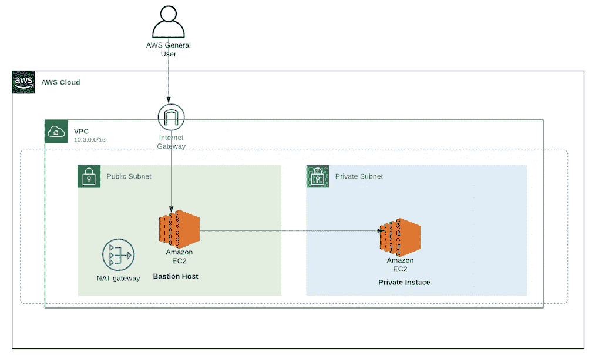
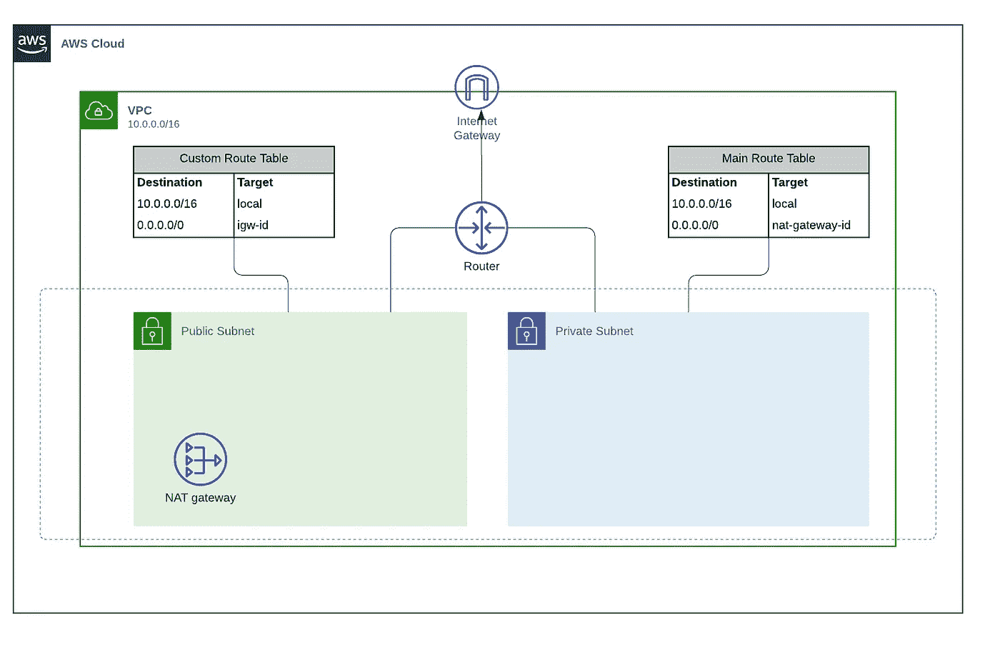
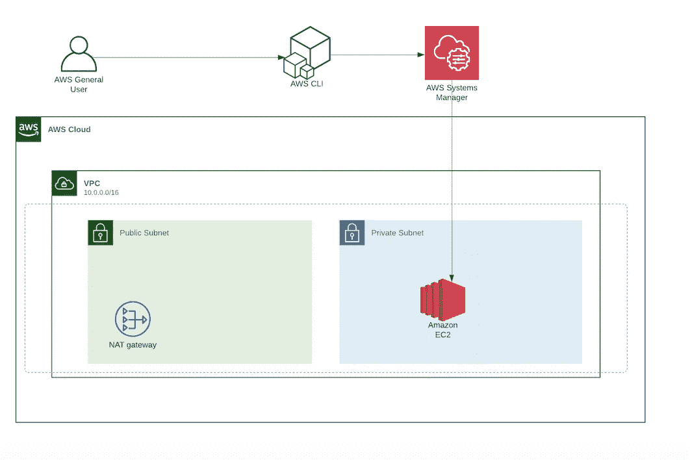

# 走向无堡垒:使用会话管理器访问私有 EC2 实例

> 原文：<https://towardsdatascience.com/going-bastion-less-accessing-private-ec2-instance-with-session-manager-c958cbf8489f?source=collection_archive---------8----------------------->


伊恩·巴塔格利亚在 [Unsplash](https://unsplash.com?utm_source=medium&utm_medium=referral) 上拍摄的照片

在本帖中，我们将设置一个私有 EC2 实例(在私有子网中)，并使用 SSM 会话管理器来访问托管 Jupyter 笔记本服务器的实例。然后，我们将通过 AWS 会话管理器使用 PostForwarding 从本地机器访问我们的服务器。

我们将在不打开入站端口或**的情况下设置这个基础设施**，设置堡垒主机**或**管理 SSH 密钥**！。**

# 为什么使用会话管理器？

众所周知，我们不能直接连接到一个私有 EC2 实例，除非有 VPN 连接或直接连接或其他与 VPC 的网络连接源。连接到 VPC 私有子网上的 EC2 实例的一种常见方法是使用一个 **Bastion 主机**。

**堡垒主机**是一种服务器，其目的是提供从外部网络(如互联网)到私有网络的访问。由于面临潜在的攻击，堡垒主机必须将渗透的机会降到最低。使用堡垒主机时，首先登录到堡垒主机，然后登录到目标私有实例。使用这种方法，只有堡垒主机会有一个外部 IP 地址。

然而，也有一些缺点:

*   您需要在您的堡垒中允许 SSH 入站规则
*   您需要在您的私有 EC2 实例上打开端口，以便将它连接到您的堡垒
*   您将需要管理您的用户的 ssh 密钥凭证:您将需要为每个用户生成一个 SSH 密钥对，或者为您的用户获得相同 SSH 密钥的副本
*   成本:bastion 主机也有相关的成本，因为它是一个正在运行的 EC2 实例。即使是一台 t2.micro 也要 10 美元/月左右。



堡垒主机架构，以便访问私有实例。使用 [Lucid.app](https://lucid.app) 设计

**会话管理器**可用于访问私有子网内不允许互联网进入的实例。AWS SSM 提供了通过其本地服务在您的系统上建立外壳的能力，或者通过将它用作其他协议的隧道，例如安全外壳(SSH)。优势:

*   它将记录会话期间发出的命令以及结果。如果您愿意，可以将日志保存在 s3 中。
*   Shell 访问完全包含在身份和访问管理(IAM)策略中，您不需要管理 SSH 密钥
*   用户不需要使用堡垒主机和公共 IPs。
*   不需要打开安全组中的端口

# 先决条件

## 会话管理器插件

您需要为 AWS CLI 安装会话管理器插件，以便使用 CLI 启动和结束将您连接到受管实例的会话。

你可以点击这里查看如何为不同的操作系统[安装插件！](https://docs.aws.amazon.com/systems-manager/latest/userguide/session-manager-working-with-install-plugin.html)

## 网络结构

在创建 EC2 实例之前，您需要一个带有公共和私有子网的 VPC。由于将在我们位于私有子网的实例上托管一个 Jupyter 笔记本，它将需要互联网访问(*，以便我们可以安装和更新 Python 包*)。

为了让我们的私有子网访问互联网，我们将使用 NAT 网关。此外，为了启用 internet 连接，此网关确保 internet 不会启动与实例的连接。

将使用的网络配置如下所示:



网络配置。使用 [Lucid.app](https://lucid.app) 设计

您可以直接在 AWS 控制台上创建网络，也可以使用 Terraform 构建网络，您可以在此处查看 Terraform 代码。

# 配置您的 EC2 实例

我们的实例将部署在没有公共 IP 地址配置的私有子网上，因为我们不需要它。

为了允许会话管理器访问我们的实例，需要附加以下 IAM 角色:*amazonsmsmanagedinstancecore。*该策略授予实例核心 Systems Manager 功能所需的权限。

对于 VPC 安全组，我们**不需要包含任何入站规则，**只允许出站流量。

VPC 安全集团

EC2 实例

# 会话管理器—启动会话

完成所有设置后，您可以从命令行访问您的实例:

```
$ aws ssm start-session --target {YOUR_TARGET_INSTANCE_ID}
```

需要注意的是，连接是在没有打开 EC2 安全组的任何端口和没有 Bastion 主机的情况下成功建立的！

下图显示了我们正在使用的实际配置:



会话管理器架构。使用 [Lucid.app](https://lucid.app) 设计

会话管理器**有内置的审计日志** : AWS 会话管理器默认提供审计日志；因此，根据必要的安全性和合规性规定，每个命令都被记录并存储在 CloudWatch 日志或 S3 存储桶中。

您还可以在控制台上拥有会话历史记录:


AWS 系统管理器控制台的屏幕截图。[https://aws.amazon.com/console/?nc1=h_ls](https://aws.amazon.com/console/?nc1=h_ls)

# 会话管理器—端口转发

许多客户使用 **SSH 隧道**来远程访问不公开在公共互联网上的服务。基本上， **SSH 客户端**在一个已配置的端口上监听连接，当它接收到一个连接时，它通过隧道将该连接连接到一个 **SSH 服务器**。服务器连接到一个配置好的目的端口，可能与 SSH 服务器在不同的机器上。

在 [**OpenSSH**](https://www.ssh.com/ssh/openssh/) 中，使用`-L`选项配置本地端口转发:

```
ssh -L 9999:localhost:8888 user@instance
```

这个例子以用户`user`的身份打开一个到`instance`的连接，打开本地计算机上的端口 9999，从那里转发所有东西到`localhost:8888`。

AWS 系统管理器会话管理器的端口转发允许您在私有子网中部署的实例之间安全地创建隧道，**而不需要在服务器上启动 SSH 服务，打开安全组中的 SSH 端口，也不需要使用 bastion 主机。**

## 端口转发以访问运行在私有实例上的 Jupyter 笔记本服务器

在这篇文章中，我们不会讨论如何在 EC2 实例上设置 Jupyter 笔记本服务器，但是你可以在这个[链接](https://www.dataplyr.com/blog/2017/04/22/aws-post/)上找到所有需要的信息。

满足先决条件后，您可以使用 AWS CLI 创建隧道:

```
$ aws ssm start-session --target {YOUR_TARGET_INSTANCE_ID} --document-name AWS-StartPortForwardingSession --parameters "portNumber"=["8888"],"localPortNumber"=["8888"]
```


截图来自 Jupyter 笔记本控制台，一个开源软件[https://jupyter.org](https://jupyter.org)

**OBS:** 我在使用 Jupyter 笔记本服务器的时候，遇到了一个非常高的延迟问题；我想可能是因为会话管理器的端口转发。如果你正面临同样的问题，请留下你的评论。

# 结论

在这篇文章中，我们看到了如何使用会话管理器访问私有 EC2 实例，而不需要向实例安全组添加入站规则、管理 SSH 密钥以及使用另一个实例作为堡垒主机。我们还学习了如何使用会话管理器来使用 Post Forwarding。

这篇文章中使用的所有地形代码都可以在这里找到！

# 参考

[](https://aws.amazon.com/blogs/security/how-to-record-ssh-sessions-established-through-a-bastion-host/) [## 如何记录通过堡垒主机建立的 SSH 会话

### 堡垒主机是一种服务器，其目的是提供从外部网络到专用网络的访问，例如…

aws.amazon.com](https://aws.amazon.com/blogs/security/how-to-record-ssh-sessions-established-through-a-bastion-host/) [](https://www.1cloudhub.com/connect-ec2-private-instance-using-session-manager-go-bastion-less/) [## 使用会话管理器连接 EC2 私有实例-无堡垒

### Savings Plan 是一种新的灵活的 AWS 模型，用于节省使用计算服务的费用。它适用于 EC2 服务…

www.1cloudhub.com](https://www.1cloudhub.com/connect-ec2-private-instance-using-session-manager-go-bastion-less/) [](https://www.netskope.com/blog/leaving-bastion-hosts-behind-part-2-aws) [## 离开堡垒主机第 2 部分:AWS - Netskope

### 引言这篇文章是一个系列的第二篇，关于在每个主要的云…

www.netskope.com](https://www.netskope.com/blog/leaving-bastion-hosts-behind-part-2-aws) [](https://www.knowledgehut.com/tutorials/aws/aws-nat-gateway) [## 什么是 AWS NAT 网关？

### NAT 网关，也称为网络地址转换网关，用于启用私有子网中的实例…

www.knowledgehut.com](https://www.knowledgehut.com/tutorials/aws/aws-nat-gateway) [](https://www.ssh.com/ssh/tunneling/example) [## SSH 端口转发-示例，命令，服务器配置

### SSH 端口转发是中的一种机制，用于将应用程序端口从客户端机器隧道传输到服务器机器，或…

www.ssh.com](https://www.ssh.com/ssh/tunneling/example) [](https://aws.amazon.com/es/blogs/aws/new-port-forwarding-using-aws-system-manager-sessions-manager/) [## 使用 AWS 系统管理器会话管理器| Amazon Web Services 的新端口转发

### 我越来越多地看到客户采用不可变的基础架构模式:他们重建和重新部署一个…

aws.amazon.com](https://aws.amazon.com/es/blogs/aws/new-port-forwarding-using-aws-system-manager-sessions-manager/) [](https://www.ibexlabs.com/improving-systems-management-with-aws-systems-manager-session-manager/) [## 使用 AWS Systems Manager 会话管理器| Ibexlabs 改进系统管理

### 会话管理器是 AWS 的完全托管系统管理器服务中的一项功能，它允许您连接您的 EC2…

www.ibexlabs.com](https://www.ibexlabs.com/improving-systems-management-with-aws-systems-manager-session-manager/)