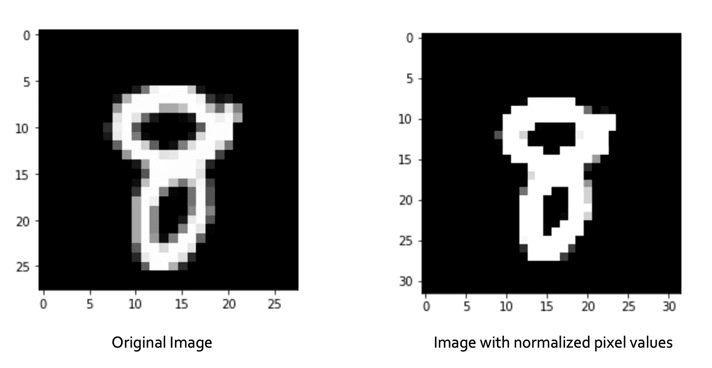
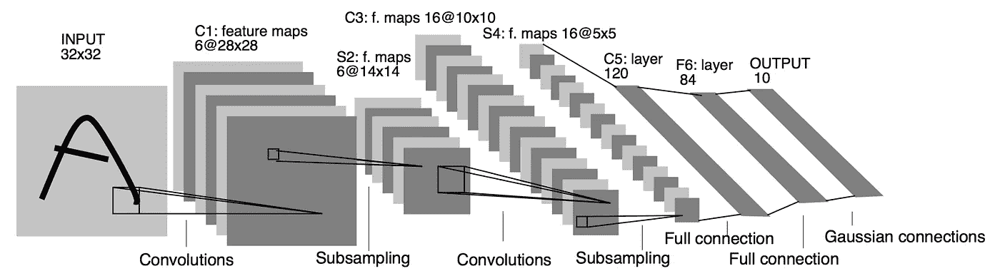
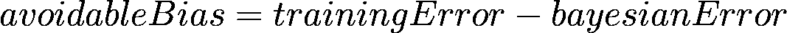
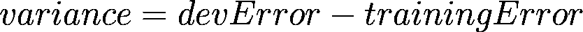
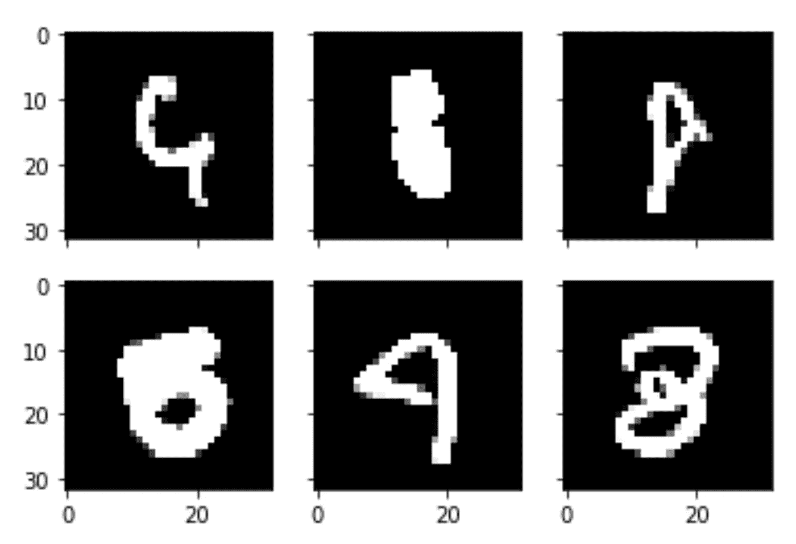
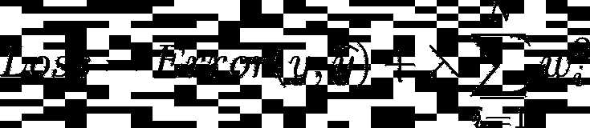
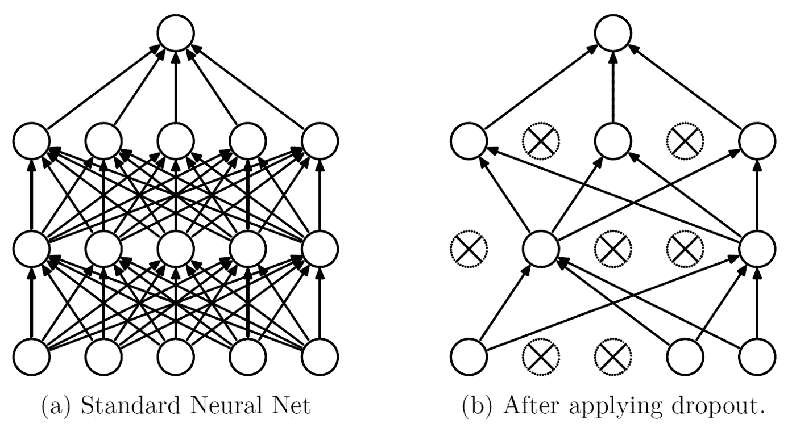
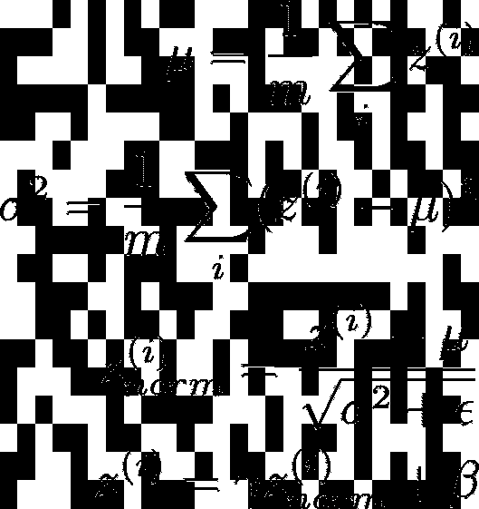
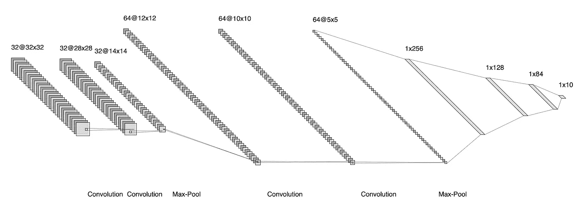

# 超越 99% — MNIST 手写数字识别

> 原文：<https://towardsdatascience.com/going-beyond-99-mnist-handwritten-digits-recognition-cfff96337392?source=collection_archive---------3----------------------->

## 了解如何通过各种技术优化神经网络，以达到人类水平的性能。

MNIST 手写数字数据集被认为是计算机视觉的“Hello World”。大多数神经网络的标准实现在正确分类手写数字方面达到了 98-99%的准确率。

除了这个数字，每增加一个小数都很难提高准确率。让我们看看如何通过高级优化推动模型预测准确率超过 99%。


MNIST 手写数字数据集(来源:[维基百科](https://commons.wikimedia.org/wiki/File:MnistExamples.png))

# 注意到

MNIST 数据集由 60，000 个训练样本和测试集中的 10，000 个样本组成。对于那些想在真实世界数据上学习技术和模式识别方法而不需要在数据预处理方面花费太多精力的人来说，这是一个很好的数据集。

由于本文的目的是学习优化方法来提高我们的分类器的准确性，我们将数据集重新分组为 48，000 个训练示例和 28，000 个测试示例，以减少可用于训练的数据，如 [Kaggle](https://www.kaggle.com/c/digit-recognizer/data) 所做的那样，并使问题变得更难。

# 图像预处理

通过从每个像素中减去训练集的平均活性并除以它们的标准偏差，对所有图像进行标准化。众所周知，每幅图像都由 0 到 255 之间的像素值组成。如果没有标准化，原始像素值在输入到网络中时会由于不稳定的输入特性而减慢学习速度。

```
# Standardization
# Vector 'X' contains all the training examples. mean_px = X.mean().astype(np.float32)
std_px = X.std().astype(np.float32)
X = (X - mean_px)/(std_px)
```



归一化图像有助于学习算法更快地收敛

# 模型

LeNet-5 (LeCun et al .，1998)没有从零开始建立模型。[基于梯度的学习应用于文档识别](http://vision.stanford.edu/cs598_spring07/papers/Lecun98.pdf))卷积神经网络被用作基线标准模型。



LeNet-5 架构，LeCun 等人，1998 年。"[基于梯度的学习应用于文档识别](http://vision.stanford.edu/cs598_spring07/papers/Lecun98.pdf)"

这是一个简单的模型，由一个卷积层和两个 max-pooling 层组成，后面是两个完全连接的层，最后是十个类的 softmax。

经过 30 个周期的训练，训练正确率为 99.98%，设定正确率为 99.05%。对于一个 1998 年发布的模型来说，准确性似乎相当不错。然而，该模型同时存在高方差和高偏差问题，测试集准确率低于 98.74%。让我们逐一解决这两个问题。

> **贝叶斯错误**率是任何分类器的最低可能**错误**率。



拟合不足的代表



过度拟合的代表

作为参考，可避免的偏差代表模型对数据的欠拟合，而方差代表过拟合。当我们微调模型时，我们的目标是最小化这两者。

数据集中的一些图像非常模糊，因此，假设贝叶斯误差不是 0%，而是在(0.2–0.3)%左右。



模糊图像的例子

# 减少方差

*   **数据扩充** —训练集中的一些图像在两个方向上随机旋转 10 度，缩放 10%，并在两个方向上移动 10%。
    ***直觉*** —它有助于显著降低模型的方差，因为模型也看到了一些不规则的手写数字。
*   **L2 正则化** —在某些卷积层中使用了超参数为 0.005(λ)的正则化。
    ***直觉*** —在下面我们神经网络的损失函数的方程中，通过增加第二项，我们对损失函数的惩罚更多。较高的损失导致权重相对较小，这“简化”了模型以减少过度拟合。



通过调整超参数“lambda”(在我们的例子中为 0.005)，惩罚损失函数

*   **漏失规则化** —在汇集层和一些全连通层之后增加了三个超参数为 25%的漏失层。
    ***直觉***——通过在训练时随机丢弃 25%的神经元，我们试图通过简单地不过度依赖任何特定神经元来产生输出，让网络更好地泛化。



Srivastava，Nitish 等人，“[辍学:防止神经网络过度拟合的简单方法](http://jmlr.org/papers/v15/srivastava14a.html)”，JMLR，2014 年

*   **批量归一化** —在我们的情况下，它在每组层(ConvNet + MaxPool &完全连接)之后执行，以稳定网络并使学习算法更快收敛。
    ***直觉*** —类似于标准化数据集中的图像，标准化各层的激活“减少”隐藏单元之间的移动，并允许各层独立地学习更多内容。



通过减去平均活动并除以方差来归一化图层的输出

*   **可变学习率** —当学习率可变时，性能显著提高。一旦模型检测到它的学习“停滞”,在我们的例子中，在等待两个时期后，学习率下降了 0.2 倍。
    ***直觉***——通过动态降低学习率，帮助算法更快收敛，更接近全局最小值。

```
variable_learning_rate = ReduceLROnPlateau(monitor=’val_loss’, factor = 0.2, patience = 2)
```

# 处理偏差

处理偏差相对简单，因为网络在训练集上表现很好。为了将训练集的准确度提高到 99.6%以上，使用了以下技术。

*   **更多层** —最初的 LeNet-5 网络由两个卷积层组成。在新网络中，增加了两个具有相同超参数的卷积层。
*   **深层网络** —卷积层中的滤波器数量显著增加，从前两层的 6 个增加到 32 个，后两层的 16 个增加到 64 个。由于卷积层体积的增加，隐藏在密集层中的数量也增加，以容纳更大的输入。

***直觉***——更深更密的网络让模型可以学习手写数字更复杂的特征。

# **将所有这些放在一起**

让我们把所有东西组装成一个模型。为此，我使用了 Keras 来构建模型，但是也可以使用其他框架。

总而言之，我们使用两个卷积层，然后是两次池化层(一次分别有 32 个过滤器和 64 个过滤器)和三个全连接层，最后有 10 个类的 *softmax* 单元。批处理规范化，L2 正则化和辍学是在层间完成的，如下面的代码所示。



我们改良的 LeNet-5

```
model = Sequential([# Layer 1
Conv2D(filters = 32, kernel_size = 5, strides = 1, activation = ‘relu’, input_shape = (32,32,1), kernel_regularizer=l2(0.0005)),# Layer 2
Conv2D(filters = 32, kernel_size = 5, strides = 1, use_bias=False),# Layer 3
BatchNormalization(),# — — — — — — — — — — — — — — — — #
Activation(“relu”),
MaxPooling2D(pool_size = 2, strides = 2),
Dropout(0.25),
# — — — — — — — — — — — — — — — — ## Layer 3
Conv2D(filters = 64, kernel_size = 3, strides = 1, activation = ‘relu’, kernel_regularizer=l2(0.0005)),# Layer 4
Conv2D(filters = 64, kernel_size = 3, strides = 1, use_bias=False),# Layer 5
BatchNormalization(),# — — — — — — — — — — — — — — — — #
Activation(“relu”),
MaxPooling2D(pool_size = 2, strides = 2),
Dropout(0.25),
Flatten(),
# — — — — — — — — — — — — — — — — ## Layer 6
Dense(units = 256, use_bias=False),# Layer 7
BatchNormalization(),# — — — — — — — — — — — — — — — — #
Activation(“relu”),
# — — — — — — — — — — — — — — — — ## Layer 8
Dense(units = 128, use_bias=False),# Layer 9
BatchNormalization(),# — — — — — — — — — — — — — — — — #
Activation(“relu”),
# — — — — — — — — — — — — — — — — ## Layer 10
Dense(units = 84, use_bias=False),# Layer 11
BatchNormalization(),# — — — — — — — — — — — — — — — — #
Activation(“relu”),
Dropout(0.25),
# — — — — — — — — — — — — — — — — ## Output
Dense(units = 10, activation = ‘softmax’)])
```

# 结果

该模型被训练 30 个时期，并给出以下结果。

*   训练准确率达 99.82%
*   开发设置准确率为 99.62%
*   测试集准确率为 99.41%

# 包裹

提到的优化极大地有助于推动模型的准确性突破 99%的大关。

我们可以注意到，随着测试集中精度的下降，仍然有一些过度拟合的迹象。请随意尝试，并尝试进一步减少差异。如果你认为还有其他方法可以改进模型，请留下评论。

所有的代码和结果都可以在 GitHub [这里](https://github.com/guptajay/Kaggle-Digit-Recognizer)找到。

## 参考

[1] LeCun 等，[基于梯度的学习应用于文档识别](http://vision.stanford.edu/cs598_spring07/papers/Lecun98.pdf) (1998)，IEEE 学报，1998 年 11 月

[2]吴恩达等人，[改进深度神经网络:超参数调整、正则化和优化](https://www.coursera.org/learn/deep-neural-network)，Coursera 课程

[3] Y. Ghouza，[CNN Keras 简介— 0.997(前 6%)](https://www.kaggle.com/yassineghouzam/introduction-to-cnn-keras-0-997-top-6) (2017)，Kaggle 数字识别器竞赛

[4] Srivastava，Nitish 等人，[辍学:防止神经网络过度拟合的简单方法](http://jmlr.org/papers/v15/srivastava14a.html)，(2014) JMLR