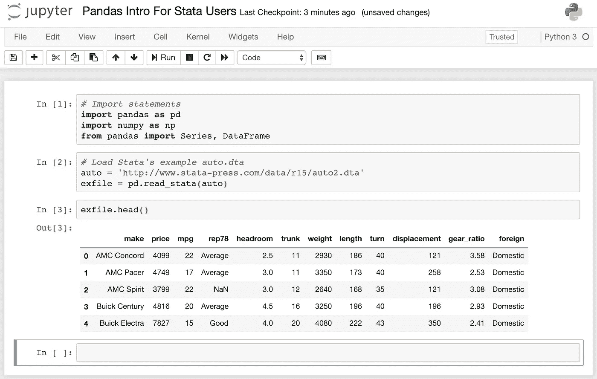
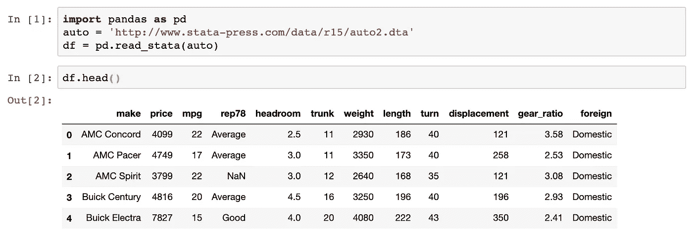
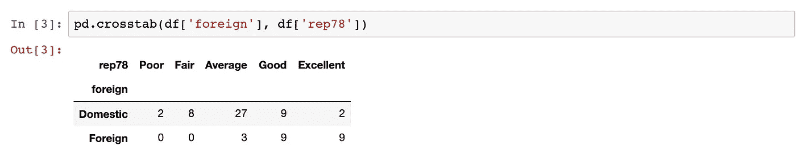
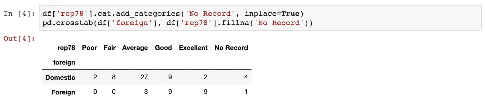
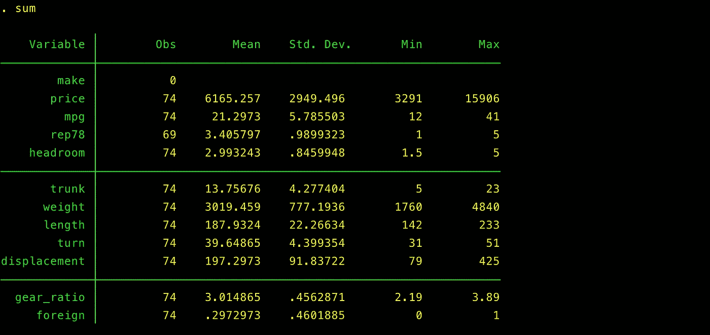
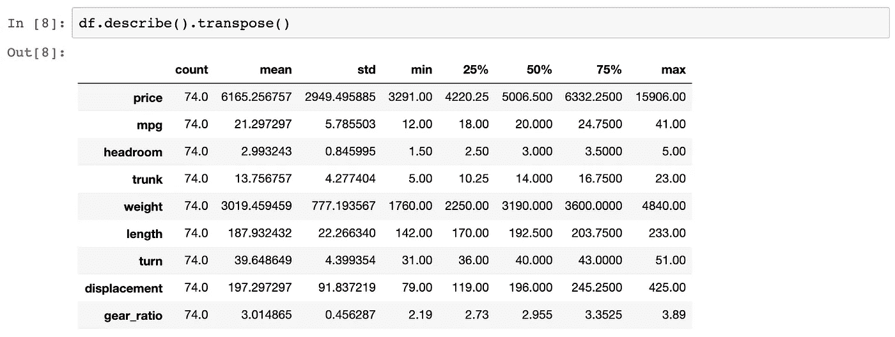
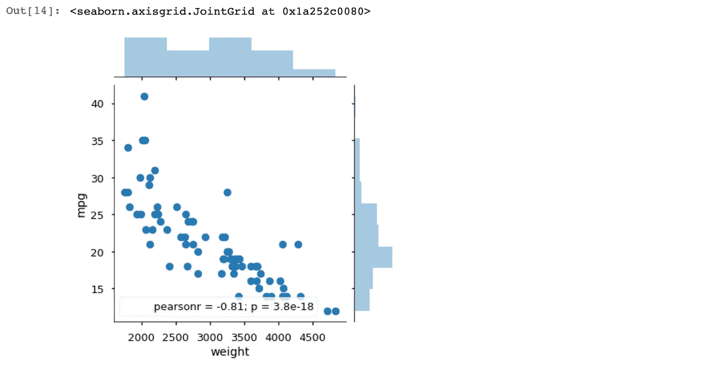
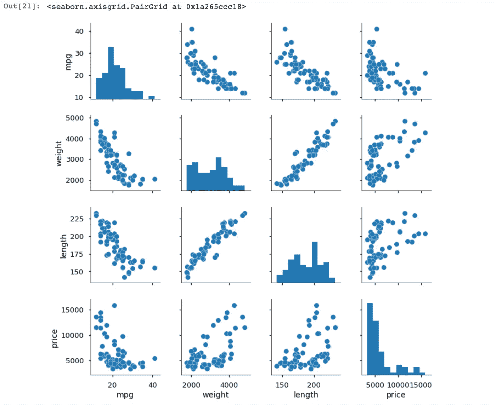
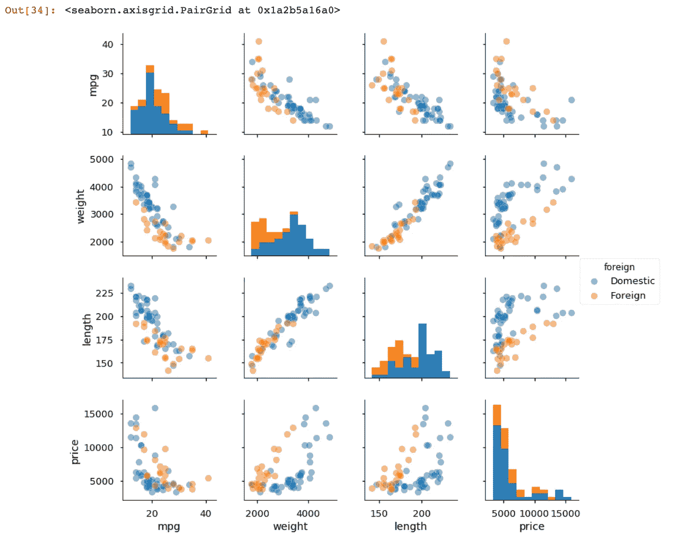

# 从 Stata 到熊猫

> 原文：<https://towardsdatascience.com/going-from-stata-to-pandas-706888525acf?source=collection_archive---------23----------------------->

## 开始、探索和可视化。专为熟悉或曾经熟悉 Stata 的人设计的指南。

## 由三部分组成的单一指南，概述

本指南是为想开始学习熊猫的 Stata 用户准备的。它是使用 Stata 用户熟知的示例和工作流编写的。此外，本文引用了许多 Stata 用户都知道的数据。

在本指南的第 1.1 部分中，我回顾了 Stata 用户可能希望开始探索使用 Python 和 Pandas 的各种原因。

在下一节，即第 1.2 部分，我将演示交叉列表和汇总统计，它们将帮助您开始数据探索过程。

最后，在第 1.3 部分中，我举例说明了各种简单的可视化方法，它们将帮助您继续数据探索过程。

# 第 1.1 部分:所以，您安装了 Python 和 Pandas，但是您不确定接下来的步骤。

Stata 和 Pandas 都为数据操作、可视化、统计等提供了完整(或接近完整)的平台。Stata 声称是…

> 一个完整的集成软件包，可满足您的所有数据科学需求，包括数据操作、可视化、统计和可再现的报告。([stata.com](https://www.stata.com/why-use-stata/)

熊猫声称是…

> 一个开源、BSD 许可的库，为 [Python](https://www.python.org/) 编程语言提供高性能、易于使用的数据结构和数据分析工具。(【pandas.pydata.org】T4)

## Stata 用户可能想学习熊猫的原因


Stata &熊猫营销图片。

一个合作者正在使用熊猫。你是 Stata 用户，但你合作的研究小组不是。他们用熊猫。在同一个沙盒里，你决定学习熊猫。

**你已经决定要扩展你的技能。准备好迎接新的挑战了吗？也许你读过 Stata 书店的几本书。您已经创建并发布了用户编写的程序(Stata 用户称之为*包*)。也许你甚至已经在[波士顿学院统计软件组件(SSC)档案库](http://repec.org/)发布了一个或多个程序到用户社区的首选存储库中。很明显，你已经准备好扩展你的技能了。**

**您无法访问 Stata。或者你预期失去 Stata 的访问权。Stata 是专有的，它的许可费用很高。如果你已经失去或预计失去访问 Stata 的权限，并且你对为自己购买许可证不感兴趣(尽管它很有价值)，Pandas 是一个不错的选择。**

**其他原因。**为什么一个 Stata 用户可能想学习熊猫并不重要。本指南是一个不可知论的指南，承认两种语言各有优缺点。在我的工作中，我经常发现一个人继承另一个人留下的东西。

## 本指南假设您已经安装了 Python 和 Pandas

为了避免重新发明轮子，本指南除了建议 Stata 用户考虑安装用于科学研究的 [Anaconda 发行版](https://www.anaconda.com/distribution/)之外，不讨论 Python 或 Pandas 的安装。

本指南中给出的示例和解释已经使用 Anaconda 发行版进行了测试。具体来说，这里给出的例子是在 Jupyter 笔记本中创建的，这是 Python 的 Anaconda 发行版中包含的软件。

使用 Stata 著名的汽车数据集示例。[我之前已经讨论过这个数据集，它对于测试或训练是有用的](/three-datasets-i-often-use-as-examples-c70ec5b2f793)。在 Jupyter 笔记本中加载该数据集通常会是这样的:



运行 Python 3 内核的 Jupyter 笔记本。使用 Stata 示例汽车数据集的熊猫插图。

接下来在第 1.2 部分，我将演示交叉列表和汇总统计，这将帮助您开始数据探索过程。在最后一节，第 1.3 部分，我将演示简单的可视化，让您继续数据探索过程。

# 第 1.2 部分:安装 Python 和 Pandas 之后，接下来是您的步骤。

## 加载自动数据集

在 Stata 中加载汽车数据集很容易:`sysuse auto`。在 Python 中，这个过程可以分两行完成。但是为了使代码更易读，我把它分成三行:

```
import pandas as pdauto = 'http://www.stata-press.com/data/r15/auto2.dta'
df = pd.read_stata(auto)
```

就是这样！简单。如果你是一个新的熊猫用户，如果你正在跟随祝贺！您已经将第一个数据集加载到内存中。

你会注意到的第一件事是，在 Python 中工作，很少有“输出”输出是语言提供的信息，用来帮助验证命令是否完成了您想要它做的事情。关于这方面的更多信息，请参见我的相关文章[合并数据:熊猫丢失输出](/merging-data-the-pandas-missing-output-dafca42c9fe)。

在 Python 中，这种反馈要少得多。验证您是否正确加载了汽车数据集。试试代码`df.head()`大致相当于 Stata 的`list in 1/5`。以下是您应该看到的内容:



运行 Python 内核的 Jupyter 笔记本。使用 Stata 汽车数据集的熊猫插图。

## 交叉制表

交叉列表法是最简单的分析技术之一。这种技术包括将两个或多个分类变量之间的出现次数制成表格。

Stata 的局限性在于，涉及两个或三个以上分类变量的交叉列表是有限的。对熊猫来说，三个或更多种类是没有问题的。

与汽车数据集的双向列表:

```
pd.crosstab(df['rep78'], df['foreign'])
```



运行 Python 内核的 Jupyter 笔记本。两个变量(维修记录和制造来源)的交叉列表。使用 Stata 汽车数据集的熊猫插图。

仔细看，这个表格遗漏了一些数据。为了让 Stata 在其交叉表中包含缺失的数据，跟在`tab`命令后面的`mi`选项将提供更完整的数据视图。把它放在一起，在 Stata 它会是`tab foreign rep78, mi`。

在 Pandas 中，需要两行来显示更完整的数据视图:

```
# Specify a new category among the repair records.
df['rep78'].cat.add_categories('No Record', inplace=True)# Generate a tabulation using the fillna() method.
pd.crosstab(df['foreign'], df['rep78'].fillna('No Record'))
```



运行 Python 内核的 Jupyter 笔记本。两个变量的交叉列表(维修记录和制造来源，包括缺失数据)。使用 Stata 汽车数据集的熊猫插图。

## 汇总统计数据

Stata 中的汇总统计并不复杂。查看连续变量的最快方法之一是键入`sum`。通过汽车数据集，您可以:



Stata 汽车数据集的汇总统计数据。

在 Pandas 中，最接近这种输出的命令是`df.describe().transpose()`，它将给出:



运行 Python 内核的 Jupyter 笔记本。跨行显示变量名的汇总统计信息，沿列显示统计信息。使用 Stata 汽车数据集的熊猫插图。

大多数 Pandas 用户会使用`df.describe()`，它在输出的顶部显示变量名，在每行显示统计数据。作为一名 Stata 用户，我添加了`transpose()`方法，该方法旋转输出以更好地匹配我习惯的 Stata 惯例。

另外，熊猫的默认输出也给出了第 25、50 和 75 个百分点。当然，第 50 百分位是最有用的中间值。Stata 的默认输出中没有提供这些额外的统计数据。

如果你正在跟随并且感觉冒险，通过执行以下来测试你的直觉:

```
df[['price','mpg','foreign']].groupby('foreign').describe()
```

看看你是否能正确预测输出会是什么。此外，努力调整代码以进行定制，以便您可以探索价格(price)或里程数(mpg)之外的其他变量。

接下来的第 1.3 部分演示了各种简单的可视化，让您可以继续数据探索过程。

# 第 1.3 部分:交叉列表和总结数据后，进行简单的可视化。

## 直方图和散点图得到升级

我最喜欢在熊猫而不是 Stata 中进行数据探索的一个部分是散点图和直方图的组合——在同一个图中。

直方图一次显示一个变量的分布。散点图说明了两个或多个变量之间的关系。

Pandas 提供了对 jointplot 的访问，它将散点图和直方图的优点结合成一个。再次使用 Stata 的汽车数据集:

```
import pandas as pd
import seaborn as sns
%matplotlib inlineauto = 'http://www.stata-press.com/data/r15/auto2.dta'
df = pd.read_stata(auto)sns.jointplot(x='weight',y='mpg',data=df, kind='scatter')
```



运行 Python 内核的 Jupyter 笔记本。说明英里数(mpg)和汽车重量(以磅为单位)之间关系的联合图。使用 Stata 汽车数据集的熊猫插图。

这个可视化探索了里程(在纵轴 *y* 上以每加仑英里数表示)和车辆重量(在 *x* 轴上以磅数表示)之间的关系。与直觉和一般理解一致，可视化表明，随着车辆重量增加，车辆里程减少。

这个连接图显示了这两个变量(体重和 mpg)之间的关系，以及这些变量的分布情况。作为一个额外的奖励，这个可视化显示了这两个变量的皮尔逊相关系数及其 *p* 值。

## 配对图

此外，pairplot 可以方便地比较数据集内的许多变量。配对图提供了散点图矩阵，类似于典型的相关矩阵。下面将比较里程(mpg)、重量(weight)、长度(length)、价格(price):

```
sns.pairplot(df[['mpg','weight','length','price']])
```



运行 Python 内核的 Jupyter 笔记本。说明里程(mpg)、重量(weight)、长度(length)和价格(price)之间关系的 Pairplot。使用 Stata 汽车数据集的熊猫插图。

为了增加分类比较，这里我们将比较国外制造和国内制造，我们可以调整代码以包括几个附加参数:

```
sns.pairplot(df[['mpg','weight','length','price','foreign']],
             kind='scatter', plot_kws={'alpha': 0.5}, 
             hue='foreign')
```



运行 Python 内核的 Jupyter 笔记本。说明里程(mpg)、重量(weight)、长度(length)和价格(price)之间关系的 Pairplot。在这个可视化中，我们还比较了国外和国内的制造来源。使用 Stata 汽车数据集的熊猫插图。

在添加了额外的论点之后，这些论点产生了一种视觉效果，可以让你比较国内制造的车辆和国外制造的车辆，新的模式开始出现，这可能会为进一步的分析提供信息。

[](https://adamrossnelson.medium.com/membership) [## 加入我的介绍链接媒体-亚当罗斯纳尔逊

### 作为一个媒体会员，你的会员费的一部分会给你阅读的作家，你可以完全接触到每一个故事…

adamrossnelson.medium.com](https://adamrossnelson.medium.com/membership) 

# 结论

本文分为三个部分，旨在帮助 Stata 用户考虑如何过渡到 Python 和 Pandas。如果目标不是过渡，本指南将帮助 Stata 用户开始学习一种新工具，可以补充您在 Stata 中正在进行的工作。Stata 和熊猫各有优缺点。

在最基本的层面上，一旦你对 Stata 的熟练程度达到了中级或更高级，那么通过学习 Python 和 Pandas 来增加你的技能是值得的。本文展示了将帮助您开始数据探索过程的技术。

第 1.1 部分回顾了 Stata 用户可能希望开始探索使用 Python 和 Pandas 的各种原因。第 1.2 和 1.3 部分演练了使用 Stata 流行的汽车数据集进行数据探索、分析和可视化的基本示例。

# 感谢阅读

感谢阅读。把你的想法和主意发给我。你可以写信只是为了说声嗨。如果你真的需要告诉我是怎么错的，我期待着尽快和你聊天。推特:[@ adamrossnelson](https://twitter.com/adamrossnelson)LinkedIn:[亚当罗斯尼尔森](https://www.linkedin.com/in/arnelson/)。