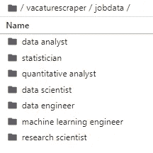
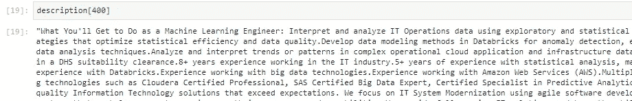
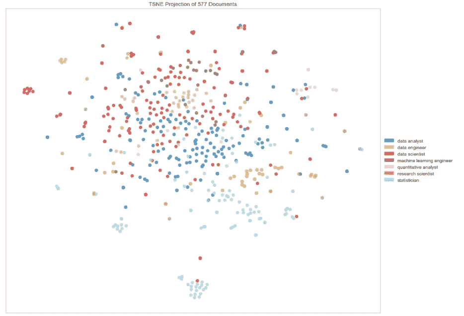
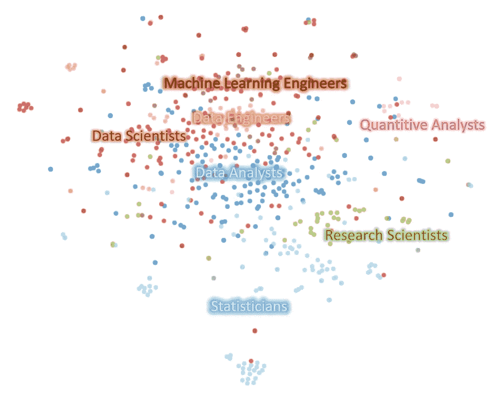
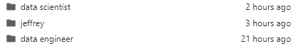
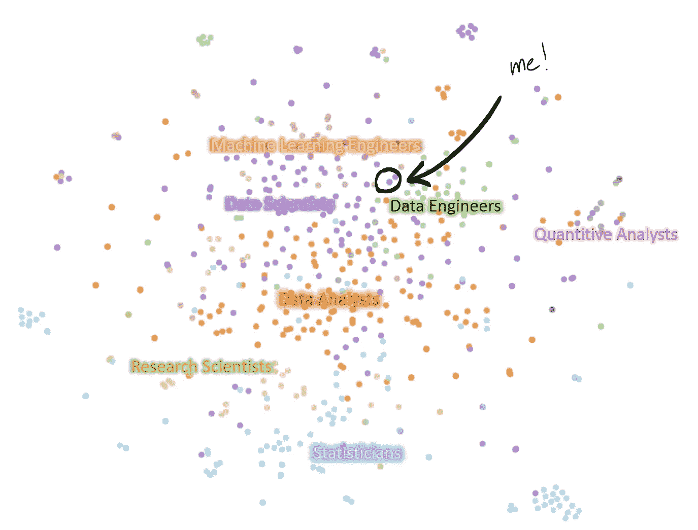

# 通过网络搜集职位空缺，找到我在数据科学世界中的位置。

> 原文：<https://towardsdatascience.com/gone-to-find-myself-finding-where-i-am-in-the-data-science-world-by-web-scraping-job-postings-bf416dbfb6fa?source=collection_archive---------41----------------------->

## 发现自己在数据科学中，在数据科学中。

## 这是一个有趣的练习，包括对招聘信息和由 tf-idf 和 t-SNE 主演的简历进行文本分析，以找到最适合我的工作角色。

在 [Unsplash](https://unsplash.com?utm_source=medium&utm_medium=referral) 上由 [Aron 视觉](https://unsplash.com/@aronvisuals?utm_source=medium&utm_medium=referral)拍摄的照片

关于许多“数据科学”职位的实际工作由什么组成，存在相当大的争议。作为一名数据科学家，看到从分析师到科学家再到工程职位的招聘信息会感到非常困惑，因为实际的职位描述可能与你对该职位的理解大相径庭。这场不匹配给我带来了毕业时的生存危机和此后许多不眠之夜。我是数据科学家吗？…一个机器学习工程师？

*我属于数据科学吗？*

结合这一事实，许多公司不知道他们真正想雇用什么样的数据专业人员，你就会明白为什么数据科学的工作描述可以无处不在。

我的目标很简单。我能在网上搜集招聘信息，按标题分类，然后看看我是否能得到一些有意义的可视化信息，告诉我自己在这个领域的最终位置吗？我能找到属于我的地方吗？

# 第一幕——一个网络掠夺者的故事

首先，我收集了数据科学的职位名称。为了增加趣味，我还加入了统计学家和定量分析师。下面的列表并不完整，它包含了我搜集到的条款:

*   数据科学家
*   数据工程师
*   数据分析师
*   机器学习工程师
*   统计员
*   定量分析师
*   研究科学家

显然这是一个有点缺陷的列表。还有很多标题，我的选择有点武断。前五个是相对常见的术语，而后两个稍微不常见。我决定坚持使用这些作为概念验证，我很乐意在评论中听到你的建议。

我决定用 python 库[请求](https://requests.readthedocs.io/en/master/)和 [beautifulsoup](https://www.crummy.com/software/BeautifulSoup/) 抓取 indeed.com 是我最好的选择。在浏览了网站并摆弄了用户界面后，我想我应该先收集个人职位描述的链接，然后一个一个地查找。

上面的代码片段首先收集可用描述的数量，并一次收集 50 个链接。因为 Indeed.com 会自动将你与不相关或半相关的职位进行匹配，所以我做了一个检查，只在职位名称实际上是职位发布的一部分时才继续。对 storedescription()的调用只抓取实际的工作描述，并将其存储到一个文本文件中。

我将跳过一些细节，但最重要的是，它给了我一个职位列表和几个包含纯文本职位描述的文件夹。在这七个文件夹之间，我有 **577** 个文本文档。

每个职位一个文件夹。

# 第二幕——理解招聘启事

兴奋地，我打开了其中一个招聘启事。承蒙[美声组](https://www.crummy.com/software/BeautifulSoup/)的帮忙，文本基本没问题，但仍有一些有限的预处理要做。一些句子的结尾变坏了，这是一个应该在标记化之前解决的问题。

从 Indeed.com 收集的示例描述(原始)

为了清理这一点，我添加了一个快速和肮脏的预处理脚本。

我有点担心如何进行。我想用 t-SNE 将描述绘制成类。我经常处理高维数据，但通常是以单词嵌入和张量的形式。又长又稀疏的向量让我害怕。如果我只为每个文档取一个简单的单词包向量，我将有一个巨大的向量，这可能会很麻烦。使用 [tf/idf](https://en.wikipedia.org/wiki/Tf%E2%80%93idf) 可能会缓解一些常见术语的问题，但不会降低我的数据的维度。我想我会继续使用 [SVD](https://en.wikipedia.org/wiki/Singular_value_decomposition) ，但是感觉应该有一个更简单的途径来实现我想要的可视化。

然后我找到了 [Yellowbrick](https://www.scikit-yb.org/en/latest/#) ，这是一个用于机器学习可视化的库，旨在补充 Scikit-Learn。使用 Yellowbrick，我可以在一行中完成奇异值分解和 t-SNE，如下所示:

这导致基于 577 个文档(= 577 个职位发布)的以下可视化

看哪！一个直接来自笔记本的 SNE 霸王龙图。

为了清楚起见，我把这些类的名字编辑成了下图。

同样的图，聚类标记为。名字大致放在各组集中的位置上。

这说明了什么是相当惊人的。统计学家几乎都聚集在一起，偶尔有数据科学家或分析师也在附近。有趣的是，研究科学家作为一个相邻的集群是明显可识别的。这表明这些工作可能是相当相关的，但仍然有足够的不同，可以被视为独立的集群。去研究科学家吧！

这几乎就像一个光谱。中间地带由数据分析师占据，他们在统计学家和数据科学家之间架起了一座桥梁。数据科学家和数据工程师相当混杂，其中工程师有一些巩固的基础。机器学习工程师似乎比数据科学家更关注数据工程师。数据科学家的小集群出现在边缘，这可能表明数据科学的不同风格。说真的，数据科学家这个角色似乎无处不在。

定量分析师在地图边缘形成他们自己的集群。这是意料之中的，因为它是一个相当独特的利基市场。有趣的是，一些分析师和科学家加入了他们的行列。这可能表明，那些寻找定量分析师职位的人也应该考虑看看数据科学和数据分析师的职位。

# 第三幕——我属于哪里？

风景很清晰，但我属于哪里？因为我已经有了招聘信息的文本描述作为我的数据，所以我真正需要的是把我的简历放在一个类似的纯文本格式中，并把它添加到一个文件夹中。然后，我可以简单地再次运行脚本来找出我在哪里。

我为“杰弗里”班做了一个文件夹存放我的简历。

不幸的是，有一个与 t-SNE 相关的随机元素，当我再次运行脚本时，我无法重现相同的情节。然而，数据*的大致方向应该*相同。也就是说，集群应该出现在相对于彼此或多或少相同的位置，但是在不同的方向和位置。

快速重新运行脚本显示，我的简历夹在数据工程、机器学习工程和数据科学家之间。也许在工程方面会多一点。我的简历上有几个软件工程实习和项目，所以这有一定的意义。不幸的是，我正好处在所有不同学科之间的争议区域的中间。最近的邻居是几个数据科学空缺，两个 ML 工程空缺，并在一群数据工程师附近。

暂时就这样了。如果你想看看我用的笔记本，你可以在这里找到。我还没有上传我搜集的文本数据，所以你得自己收集。我很喜欢写这个有趣的练习，也很感谢你在下面的反馈。当然，这与“适当的”方法相去甚远，我建议如果你重现它，不要太在意结果。