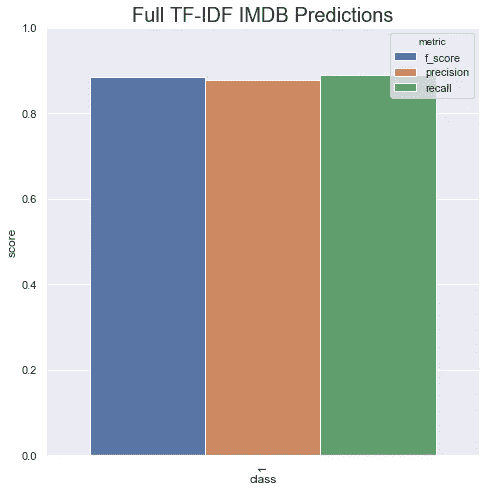
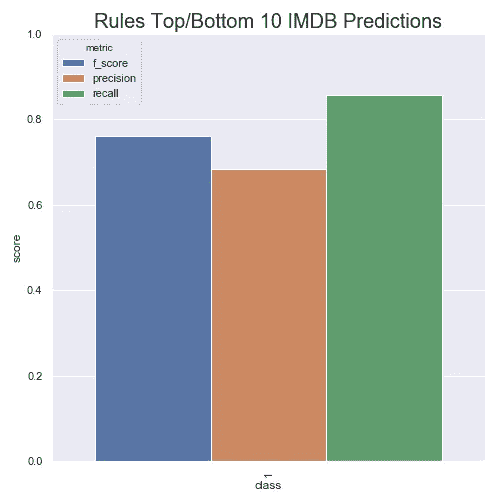
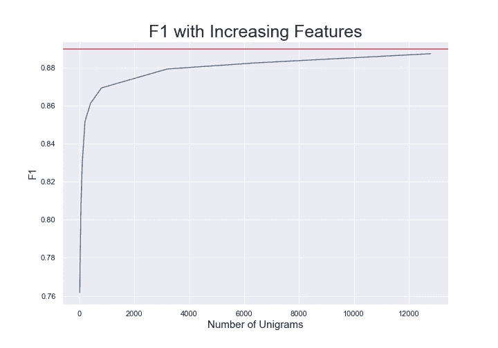

# Good Grams:如何为您的问题找到预测性的 N-Grams

> 原文：<https://towardsdatascience.com/good-grams-how-to-find-predictive-n-grams-for-your-problem-c04a5f320b39?source=collection_archive---------31----------------------->

## 找出哪些单词对你的问题有预测性是很容易的！


图片来源:[肯德里克·米尔斯](https://unsplash.com/photos/CgPPfCOPIWM)

# 介绍

如今，NLP 感觉就像是应用 BERT 并获得关于你的问题的最先进的结果。很多时候，我发现抓住一些有用的信息词汇也会有所帮助。通常，我会让一个专家来找我，说这五个词对这门课很有预测性。然后我会用这些词作为特征，瞧！你得到了一些性能上的改进或者更多的可解释性。但是如果你没有领域专家，你会怎么做呢？我喜欢尝试的一件简单的事情是在 TF-IDF 特性上训练一个简单的线性模型，并取前 n 个单词或 n-grams:)。

在这篇博文中，我们将:

1.  使用 SciKit-Learn 训练一个简单的模型，获得最丰富的 n-gram 特征
2.  然后在具有不同数量特性的模型上运行一些性能比较。

希望在本教程结束时，您将拥有一个有趣的新工具来揭示文本分类的良好特性。让我们开始吧。

# **TLDR**

使用 SciKit-Learn 的 TfidfVectorizer 上的线性分类器，然后按权重对特征进行排序，取最上面的`n`。您还可以使用 TfidfVectorizer，通过使用词汇参数来为您的模型提取 n 元语法的子集。

# 动机

对文本进行分类的一个非常成功的方法是寻找与问题相关的预测词或短语。在说电影评论情绪的上下文中，我们可以查找单词“好”、“优秀”、“伟大”或“完美”来找到好的评论，而“坏”、“无聊”或“糟糕”来找到坏的评论。作为好的和坏的电影评论的主题专家，我们很容易想出这些特征。

通常情况下，我不是一个主题专家，对我来说很难确定什么是好的预测词或短语。当这种情况发生时，我已经标记了数据，有一个快速的方法来找到描述性的单词和短语。只需训练一个线性模型，进行权重排序！

# 训练一个简单模型

SciKit-Learn 使得训练线性模型和提取相关权重变得非常容易。让我们来看看在 [IMDB 情感](https://www.kaggle.com/lakshmi25npathi/imdb-dataset-of-50k-movie-reviews/version/1)数据集上训练一个模型。

```
df = pd.read_csv("IMDB_Dataset.csv")
df["split"] = np.random.choice(["train", "val", "test"], df.shape[0], [.7, .15, .15])
x_train = df[df["split"] == "train"]
y_train = x_train["sentiment"]
x_val = df[df["split"] == "val"]
y_val = x_val["sentiment"]classifier = svm.LinearSVC(C=1.0, class_weight="balanced")
tf_idf = Pipeline([
     ('tfidf', TfidfVectorizer()),
     ("classifier", classifier)
 ])tf_idf.fit(x_train["review"], y_train)
```

这个模型只需要几秒钟的训练时间，但是只用单字就可以得到相当不错的 F 值 0.88。



有了这个新模型，我们只需从 TF-IDF 转换器中获取系数名称，从 SVM 中获取系数值，就可以找到最具预测性的特征。

```
coefs = tf_idf.named_steps["classifier"].coef_
if type(coefs) == csr_matrix:
    coefs.toarray().tolist()[0]
else:
    coefs.tolist()feature_names = tf_idf.named_steps["tfidf"].get_feature_names()
coefs_and_features = list(zip(coefs[0], feature_names))# Most positive features
sorted(coefs_and_features, key=lambda x: x[0], reverse=True)# Most negative features
sorted(coefs_and_features, key=lambda x: x[0])# Most predictive overall
sorted(coefs_and_features, key=lambda x: abs(x[0]), reverse=True)
```

通过访问管道中名为 step 的“分类器”,我们可以获得模型赋予每个特征的权重。创建管道时，我们命名流程中的每一步，这样我们就可以用这个`named_steps`函数来访问它们。大多数 SciKit-Learn 模型都有一个`.coef_`参数，该参数将返回模型的系数，我们可以用它来找到最具预测性的模型。为了方便起见，我对稀疏矩阵做了一些类型检查，因为这些类型的词法特征可能非常非常稀疏。特征名存储在我们管道的`tfidf`步骤中，我们以与分类器相同的方式访问它，但是调用`get_feature_names`函数。

我们的十大积极词汇是:

```
[(3.482397353551051, 'excellent'),
 (3.069350528649819, 'great'),
 (2.515865496104781, 'loved'),
 (2.470404287610431, 'best'),
 (2.4634974085860115, 'amazing'),
 (2.421134741115058, 'enjoyable'),
 (2.2237089115789166, 'perfect'),
 (2.196802503474607, 'fun'),
 (2.1811330282241426, 'today'),
 (2.1407707555282363, 'highly')]
```

我们的十大负面词汇是:

```
[(-5.115103657971178, 'worst'),
 (-4.486712890495122, 'awful'),
 (-3.676776745907702, 'terrible'),
 (-3.5051277582046536, 'bad'),
 (-3.4949920792779157, 'waste'),
 (-3.309000819824398, 'boring'),
 (-3.2772982524056973, 'poor'),
 (-2.9054813685114307, 'dull'),
 (-2.7129398526527253, 'nothing'),
 (-2.710497534821449, 'fails')]
```

# 使用我们的“好”功能

既然我们已经发现了一些“好”的特征，我们可以构建更简单的模型，或者在类似领域的其他问题中使用这些特征。让我们建立一些简单的规则，如果这些预测词中的任何一个出现在评论中，将返回 1，否则返回 0。然后仅用这 20 个特征重新训练模型，看看我们做得如何。

为了做到这一点，我创建了一个简单的 SciKit-Learn 转换器，它将 n-grams 列表转换为 regex 规则，NLTK 的 tokenizer 可以搜索这些规则。不是超级快(那是轻描淡写，真的很慢。您应该使用 TfidfVectorizer 中的词汇参数，后面会有更多介绍。)但是它很容易阅读并完成工作。

这段代码有三个主要部分。

**第 11 行**将一个表示 n-gram 的元组(比如(" good "、" movie ")转换成一个 regex r "<good><movie>"，NLTK 可以用它在文本中搜索特定的 n-gram。它基本上只是一个列表理解，用一个 [foldl](https://www.burgaud.com/foldl-foldr-python) 将单词连接成一个正则表达式，遍历所有的 n 元语法。

**第 13–26 行**通过遍历输入中的每一个句子，或者在本例中进行回顾，并将每个正则表达式应用于该句子，来执行转换。如果正则表达式找到了什么，它会在列表中与触发的 n-gram 对应的位置放置一个 1。这将产生一个带有 1 和 0 的向量，表示哪个 n 元语法出现在哪个句子中。

**第 28–29 行**允许我们像以前一样获取相关的特性名称。只是方便而已。

有了这个新的便捷的转换器，我们可以使用前十个最好的和后十个最差的单词来重新训练我们的模型。

```
n_grams = [('excellent',), ('great',), ('perfect',),
           ('best',), ('brilliant',), ('surprised',),
           ('hilarious',), ('loved',), ('today',),
           ('superb',), ('worst',), ('awful',),
           ('waste',), ('poor',), ('boring',),
           ('bad',), ('disappointment',), ('poorly',),
           ('horrible',), ('bored',)]
classifier = svm.LinearSVC(C=1.0, class_weight="balanced")
rules = Pipeline([
     ('rules', RuleTransformer(n_grams)),
     ("classifier", classifier)
 ])rules.fit(x_train["review"], y_train)
```

这 20 个特征使我们的 F1 减少了大约 0.13，这看起来很多，但是我们只使用了最初的 65，247 个单词的 0.03%。这真是太棒了！这 20 个特征编码了我们数据中的大部分信息，我们可以将它们用作其他管道中的特征！



## 用于规则提取的 TfidfVectorizer

我在上面构建了规则矢量器，但是我们可以通过使用 tfidf 矢量器并传入一个词汇表参数来获得相同的结果。最初的 SciKit-Learn 矢量器接受一个名为“词汇”的参数，该参数接受一个将单个单词或由空格分隔的 n 元语法映射为整数的字典。为了获得相同的效果，我们可以运行:

```
top_feats = sorted(coefs_and_features,
                   key=lambda x: abs(x[0]),
                   reverse=True)[:20]
vocab = {x[1]: i for i, x in enumerate(top_feats)}
TfidfVectorizer(vocabulary=vocab)
```

这里我们得到了特性的排序列表，然后我们创建了一个从特性名称到整数索引的映射，并将其传递给矢量器。如果你对地图的样子很好奇，大概是这样的:

```
{"great": 0,
 "poor": 1,
 "very poor": 2,
 "very poor performance": 3}
```

n-gram 是通过在单词之间添加一个空格来表示的。如果我们使用上面的代码代替我们的 RuleTransformer，我们将在很短的时间内得到相同的结果。

## 要取多少特征？

这 20 个字似乎很有力量。他们可以从一开始就为我们提供 79 F1，但也许 20 不是正确的功能数量。我们可以通过对越来越多的顶级功能运行我们的分类器并绘制 F1 来找出答案。



这向我们表明，在大约 13k 的最具预测性的词之后，该模型开始收敛到最佳 TF-IDF 单字性能。因此，我们只需 20%的原始功能集就能获得相同的性能！继续使用这些 13k 功能是一个更有原则的数字，我们仍然可以大幅减少原始功能的数量。

# 结论

如果我们纯粹着眼于词汇特征、特定单词及其数量，那么这可能是发现有用单词和短语的好方法。语言远比你使用的词语要复杂得多。在设计实际系统时，查看各种信息很重要。使用 BERT，使用句法特征，比如句子是如何分析的。语言不仅仅是生字，还有很多东西，但是希望这个小技巧可以帮助你在遇到困难的时候找到一些好的单词。