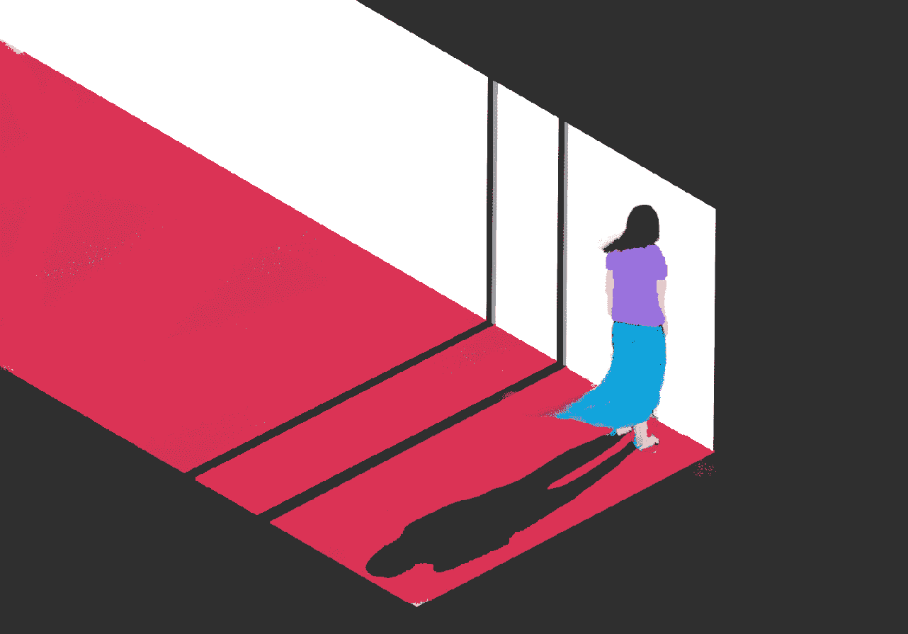
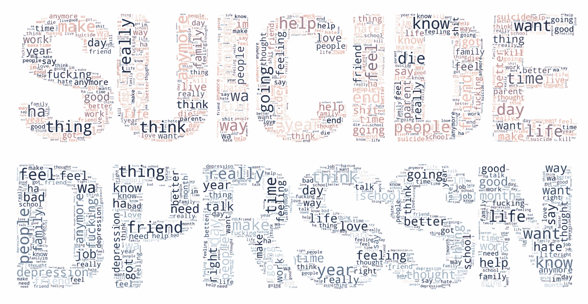
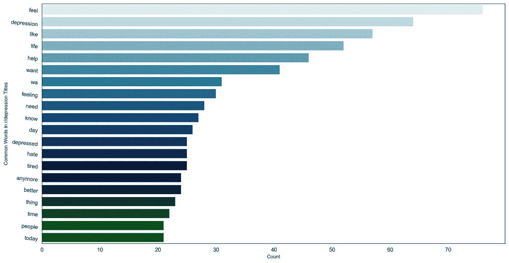
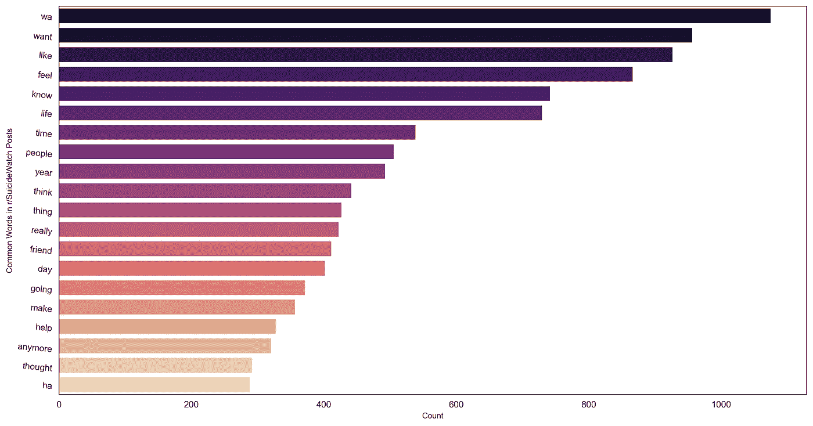
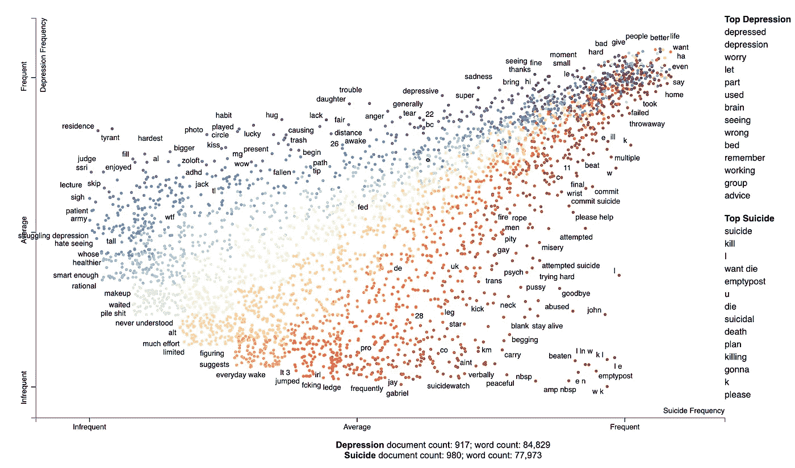
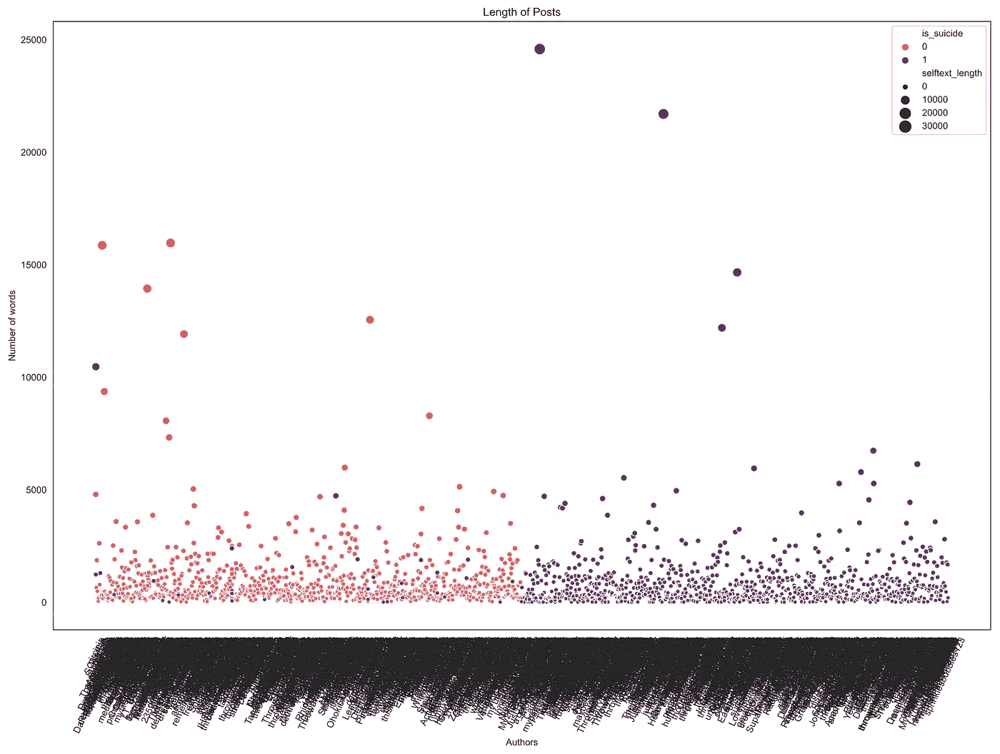
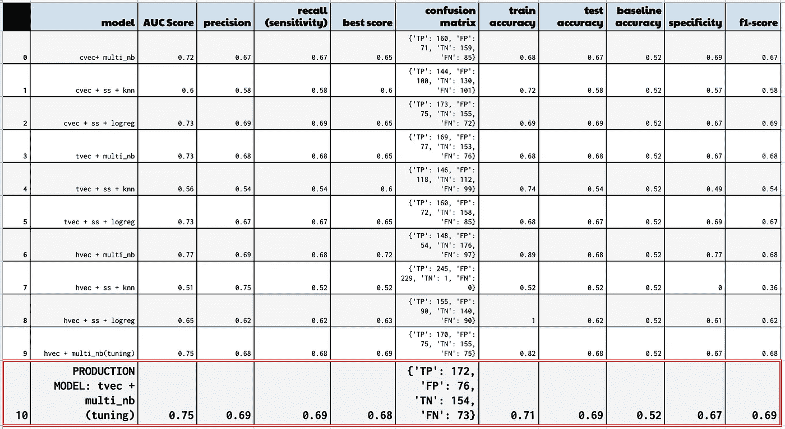
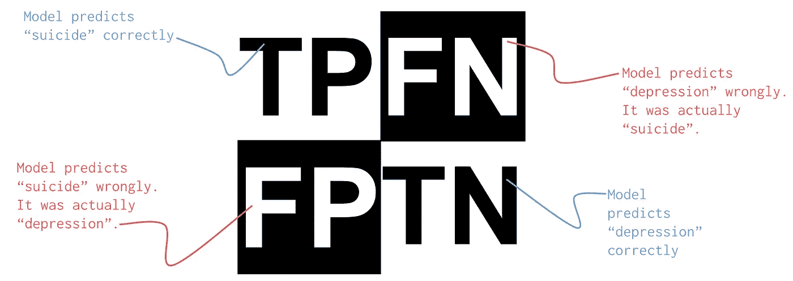
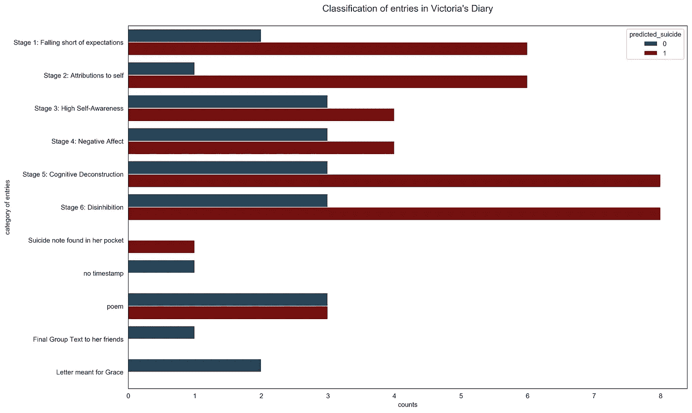

# 用自然语言处理检测自杀帖子

> 原文：<https://towardsdatascience.com/goodbye-world-4cc844197d51?source=collection_archive---------34----------------------->

插图:何

## 机器学习和 NLP 如何帮助国家自杀预防策略

> *坐在床上。唱了整首歌，还哭了一会儿。。。请停止这悲伤的举动。他妈的让它停下。*

**17 岁的维多利亚将此记录在笔记本电脑上的秘密日记中。几周后，她从新加坡一栋公寓楼的 10 层楼高的楼顶坠落，结束了自己的生命。**

**她的死亡是全球每年 80 万自杀死亡的惊人数据的一部分。世界卫生组织建议各国制定国家自杀预防战略，包括发起旨在“早期识别易受自杀风险影响的群体”的倡议。**

**基于文本的数据，如维多利亚日记中的文字和在线自杀援助社区线索，可能只是早期识别有自杀风险的个人的线索。**

# **寻找虚拟的自杀笔记**

**遗书曾经是一个人结束自己生命的最后交流方式。但社交媒体和 Reddit 等在线社区的兴起为个人创造了安全和匿名的空间，让他们变得脆弱，分享他们对自己精神健康的想法和自杀的计划。**

**我们的项目旨在使用自然语言处理(NLP)工具来分析来自两个支持社区的文本数据，并了解虚拟遗书中使用了哪些单词。在机器学习分类器的帮助下，我们旨在准确识别有自杀风险的个体。**

# **有细微差别的两个子街道**

****

**显示每个子编辑中单词使用频率的单词云。出现的次数越多，单词就显得越大。**

**为了解决我们的问题陈述，我们需要选择两个子主题，这两个子主题将为我们提供合适的数据来识别处于风险中的个体。虽然大多数抑郁症患者不会死于自杀，但美国卫生与公众服务部表示，与没有抑郁症的人相比，患有严重抑郁症的*确实会增加自杀风险*。**

**在 Reddit 上，我们发现了两个抑郁症和自杀的支持社区。快速浏览这些帖子可以发现，这些帖子确实是寻求帮助的在线空间。因此，很好的论坛让我们产生关于人们精神状态的真实文本数据。**

**这是我们的两个子主题和它们的标语(暗示了它们的使命陈述):**

**[***r/depression***](https://www.reddit.com/r/depression/)***——****“因为没有人应该独自在一个黑暗的地方”
(63.3 万成员)***

**[***r/suicide watch***](https://www.reddit.com/r/SuicideWatch/)*——“对任何有自杀想法的人的同伴支持”(20 万成员)***

# **子网格的特征**

*   **活跃帖子**—两个子网站每天都有超过 100 个帖子，回应者提供他们的帮助和对他们想法的评论。****
*   ******低钓鱼率** —很少有钓鱼帖子寻找产品广告或制造“垃圾邮件”。****
*   ******主要基于文本的数据**——不像其他 Reddit 主题，如 r/青少年，迷因主导了对话(对 NLP 项目不会是有用的数据)，这两个子主题几乎没有发布图像。****
*   ******相同但不同**——虽然两个子主题都是同行支持论坛，但 r/SuicideWatch 中使用的语言似乎对它们更具紧迫性和直接性。这里使用的短语包括:*“现在差点开枪自杀”*和*“我想得冠状病毒而死”*。识别一个有抑郁想法的人和一个有自杀风险的人所使用的语言之间的差异，对于一线的专业人士，如咨询师、教育家和精神病学家来说是有用的。****

# ****方法****

*   ******数据收集**——我们的旅程从通过 Reddit 的 API 收集数据开始(这个 API 只允许我们在每个 subreddit 上获得大约 1000 个独立的帖子)。****
*   ******清理** —我们的下一步是清理并考虑数据集中缺失的值。在自杀观察中，一个常见的情况是用户只在标题栏中输入内容，而将帖子栏留空。****
*   ******预处理** —我们将构建一个预处理功能，帮助将文本转换为小写，删除标点符号，将相关单词简化为一个常见的基本单词。****
*   ******探索性数据分析(EDA)** —使用计数矢量器，我们分析了每个子主题中最常用的词，以便更好地理解我们的数据(使用的词相似，但有一些细微的差异)。****
*   ******试听模型** —使用交叉验证的网格搜索，我们对不同的分类器模型进行评分，如 K-最近邻和多项式朴素贝叶斯，最终确定了最终的生产模型(TF-IDF 矢量器+多项式朴素贝叶斯)。****

# ****文本分析****

****作为 EDA 流程的一部分，我们分析了帖子、标题和用户名中的词频。以下是一些发现:****

********

****来自 r/depression 子编辑帖子的前 20 个单词****

********

****自杀观察子编辑帖子中的前 20 个单词****

*   ****许多相似的词——我们在我们的“前 20 个词”中看到大量相似的词，来自两个子主题，如 *wa，want，like，feel，life* 和 *people* 。这可能会使我们的模型难以区分这两个子网格。但这也是令人鼓舞的，因为这种相似性表明，我们为自己提出的问题实际上可能是一个挑战，而数据科学可能对这个挑战有用。****
*   ******想要和感觉的区别**——有趣的是，在 r/SuicideWatch 的帖子中，最热门的词是“想要”，与“感觉”相比，它的使用次数超过了两倍。在 r/depression 中，最常用的词是“感觉”,同样，它的使用次数是“想要”的两倍。****
*   ******一次性账户占主导地位**——有 67 个账户名称(1897 个)包含“一次性”一词。一次性帐户是那些想保持匿名的用户使用的临时帐户。考虑到心理健康这一敏感话题，这是可以理解的。****
*   ******大麻链接**——420，或“420”，大麻代码进入了我们的抑郁症前 20 名。在未来的项目中，在我们的帖子中寻找与药物使用的联系可能是值得的。****
*   ******男性符号**——我们的抑郁症前 20 名名单被用户名中的“先生”、“男人”、“男孩”、“男人”所占据。在我们所有的作者名单中，男性相关的名字(68 个)比女性相关的名字(15 个)要多。这与我们的目标没有很强的联系，但值得注意的是，自杀研究中有一个[性别悖论](https://www.researchgate.net/publication/13720598_The_Gender_Paradox_in_Suicide)，它观察到女性有更多自杀想法而男性自杀更频繁的现象。****

********

****“散点图”显示了每个子编辑帖子中的文本频率。每个点代表一个单词。图右上方的点表示在两个子数据中频繁出现的单词。****

# ****员额长度****

*****r/depression* 帖子的平均长度比 *r/SuicideWatch* 短了将近 130 个字。虽然，正如我们从下面的散点图中看到的，这些数字可能会被 *r/SuicideWatch:* 一些极长的帖子和完全空白的帖子中的异常值扭曲。****

********

# ****创建可靠的分类器****

****我们决定将我们的标题、用户名和帖子合并到一个单一的特征中，以馈入生产模型，这是一个词频率-逆文档频率矢量器和多项式朴素贝叶斯分类器的组合。****

********

****不同模特试镜的结果。****

****TF-IDF 矢量器为我们选择的特征中的单词(或者在我们的例子中，前 70 个单词)分配分数。TF-IDF 将对文档中出现频率过高的单词进行处罚。****

****“单词得分”矩阵然后被转移到多项式朴素贝叶斯分类器中，该分类器基于给定单词落入某一类别的概率的计算来进行预测。****

********

****我们的生产模型之所以被选为最接近的竞争对手(哈希矢量器),是因为它具有稍高的召回分数。****

****召回/灵敏度测量正确阳性标记(在自杀监视中)与所有真正处于自杀监视中的人的比率。因为这是我们项目的目标，模型在这个指标上表现良好对我们来说很重要(也许是最重要的)。****

****该模型也被证明泛化能力很好，从其训练到测试集分数只有 0.02 的变化。****

# ****维多利亚的日记****

****在评估我们的结果后，我们将我们的模型应用于维多利亚日记的摘录，她的父母提供了这些日记，作为心理学家杰西·白令为他的书*自杀:我们为什么自杀*所做的研究的一部分。****

****将我们的模型应用于维多利亚的作品，可以让我们看到我们的模型——根据在线社区的数据训练——是否可以很好地推广到一个看不见的测试集。在这种情况下，个人的话。****

********

****这个柱状图展示了我们的模型对《维多利亚的日记》中的条目所做的预测。如果我们只看“纯”日记条目(即不包括信件、遗书和诗歌)，该模型将 70.6%归类为“自杀”类别。****

****我们的数据集还包含了维多利亚的遗书，在她身上发现的。这是一个清晰而简短的信息:“如果我大脑受损，我不想活下去。我不想成为植物人”。我们的模型将此归类为“自杀”类别。****

****利用社会心理学家罗伊·鲍梅斯特的理论，白令将维克日记的不同部分绘制成六个不同的渐进阶段，从“达不到期望”(第一阶段)，到“高度自我意识”(第三阶段)，再到最后的“去抑制”。****

****该模型没有显示出任何与鲍梅斯特的六阶段范式相匹配的清晰模式(即，更多的自杀分类在后期阶段)。但这可能是因为我们每个阶段只能访问大约 10 个条目。获得更大的数据集将是有趣的，像 Bering 这样的研究人员已经将这些数据集分为不同的阶段。****

****在分析模型应用的结果时，我们必须首先解决数据中存在的一些“噪声”。尽管我们的模型是在在线支持社区的帖子上训练出来的。我们觉得用在维多利亚的日记条目上很合适，因为维多利亚也写得像是在给第三个人写信(事实上，她把日记命名为洛林)。****

****然而，有些参赛作品是维多利亚的诗。她诗歌中的许多句子(如*涂着尘垢的木炭街道。生锈的灯柱下闪闪发光的水珠。*)用比喻代替“直接引语”。因此，我们的模型对她日记中的诗做出决定可能是不准确的。(注意:在我们数据中的六首诗中，模型预测其中一半属于“自杀”类别)****

****然而，像维多利亚的诗可能是这个项目未来迭代的潜在研究领域。创造性写作样本可能是个人(例如，教室里的学生)透露他们私人想法的一种方式。****

# ****评估和未来发展****

*   ******TF-IDF 矢量器挑选的热门词汇** —需要注意的是，矢量器对“感觉”的加权高于“想要”，尽管(如我们之前的 EDA 中所见)，“想要”在自杀帖子中出现的次数多于“感觉”。这可能是因为 TF-IDF 对出现过多的单词进行了处罚。尽管如此，这组单词可能是建立其他模型的良好起点，这些模型可能能够预测自杀个体的存在，例如教师的子编辑。****
*   ******双重发帖现象**——在我们的探索性数据分析中，我们注意到大约有 26 例个人在两个子帖子上发帖。我们看的例子是一个用户，@*thambletrascan*3 月 4 日在 r/depression 上发帖说“*我不想死，但我也不想再活下去了*”。一天后，@thathumbletrashcan 访问了 r/SuicideWatch 论坛并发布了“*我终于有勇气实现我的计划了……你们所有人都不用再和我打交道了*”鲍梅斯特假设一个人分六个阶段“跌入自我消亡的深渊”。透过鲍梅斯特的理论来研究双重发帖可能会发现 Redditors 之间基于阶段的进展的联系。****
*   ******调查男性自杀事件** —根据新加坡撒马利亚人组织的数据，2018 年男性占所有自杀事件的 71%以上。这与我们在用户名中男性符号的 EDA 发现是一致的。未来的项目可以更深入地研究男性自杀问题。这可能与石油/天然气、银行和科技等男性主导的高压力行业的公司有关。****
*   ******抑郁症的复杂性** —抑郁症是复杂的，有层次的。与具有领域知识的专家合作可能有助于我们模型的未来发展，这些专家可以帮助我们筛选出可能与自残/强迫症/焦虑等其他疾病相关的因素？****

# ****参考****

****自杀的性别差异。维基百科，维基媒体基金会，2020 年 2 月 9 日，[https://en . Wikipedia . org/wiki/Gender _ differences _ in _ sudditive。](https://en.wikipedia.org/wiki/Gender_differences_in_suicide.)****

****了解自杀-快速的事实。新加坡撒玛利亚会，3 月 10 日。2020 年，[https://www.sos.org.sg/learn-about-suicide/quick-facts](https://www.sos.org.sg/learn-about-suicide/quick-facts)****

****斯旺森巴雷特。“自杀的两面”《纽约客》，《纽约客》，2019 年 1 月 17 日，[www . New Yorker . com/books/under-review/The-two-faces-of-suite。](http://www.newyorker.com/books/under-review/the-two-faces-of-suicide.)****

****预防自杀:全球当务之急。世界卫生组织，2014。****

****美国卫生与公众服务部。"抑郁会增加自杀的风险吗？"hhs.gov，2015 年 8 月 21 日，[www . hhs . gov/answers/mental-health-and-substance-abuse/does-depression-increase-risk-of-自杀/index . html](http://www.hhs.gov/answers/mental-health-and-substance-abuse/does-depression-increase-risk-of-suicide/index.html.)****

****百玲杰西。自杀:我们为什么自杀。芝加哥大学出版社，2018 年。****

# ******代码&触点******

****github
https://github.com/hesamuel/goodbye_world****

****数据集
[https://github.com/hesamuel/goodbye_world/tree/master/data](https://github.com/hesamuel/goodbye_world/tree/master/data)****

****领英
[https://www.linkedin.com/in/samuel-he/](https://www.linkedin.com/in/samuel-he/)****

****电子邮件
samuelhezhengbang@gmail.com****