# 谷歌分析数据导入——4 种方式

> 原文：<https://towardsdatascience.com/google-analytics-data-import-4-ways-8aeb8eb20738?source=collection_archive---------25----------------------->

来源: [Unsplash](https://unsplash.com/photos/npxXWgQ33ZQ)

## 了解如何使用 Google Sheets 插件、API 和 Apps 脚本以及开箱即用的解决方案将成本数据手动导入 Google Analytics

如果您使用多个广告服务和平台来宣传您的产品，将所有广告数据组合在一个界面中是一个好主意。这带来了一些巨大的优势:

1.  **节省时间。**你不需要永远在谷歌广告、脸书、Instagram 和其他服务之间切换来评估广告工作的效率。
2.  **2。允许您比较一个系统中所有服务的性能。**除了成本数据，您还可以将广告服务的其他信息发送到 Google Analytics，以深入分析您的活动、广告和关键词。通过比较所有流量来源的浏览量、广告成本、CTR 和 roa，您可以使用这些数据来决定您的渠道是否有回报并重新分配您的预算。

您可以转到**收购—活动—成本分析**，在 GA 报告中查看这些数据。

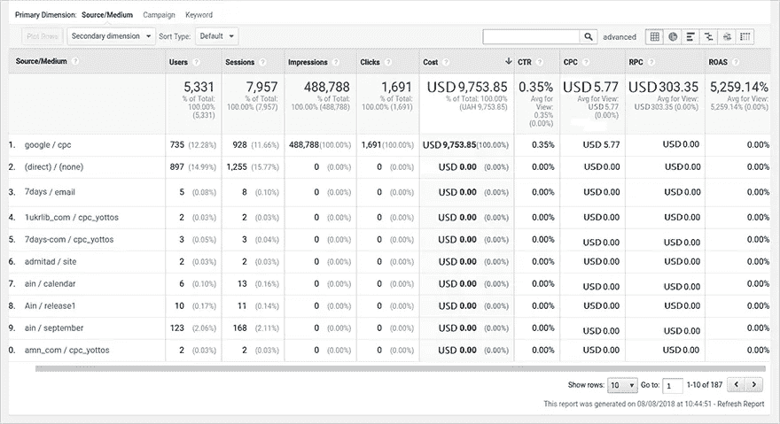

图片由作者提供

**3。让您使用谷歌分析的附加功能。**如果您将成本数据导入 Google Analytics，您可以在不同的归因模型中使用这些数据，并将计算结果与 ROI 进行比较，以正确地对您的营销渠道进行评分。

这些结果也可以在 GA: **转换—归因—模型比较工具**中跟踪。

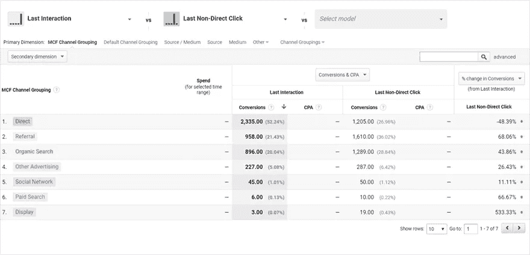

图片由作者提供

# 如何将成本数据导入 Google Analytics

将成本数据从 Google Ads(以前的 AdWords)导入 GA 非常容易，因为这两个服务之间有一个本地集成。要从其他广告服务导出成本数据，您可以执行以下操作之一:

*   通过 GA 界面手动导入。
*   使用 Google Sheets 的特殊插件导入。
*   通过 API 和 Google Apps 脚本使用半自动导入。
*   使用现成的解决方案。

我们将仔细查看不需要 IT 专家任何帮助的选项(如 [API 替代方案](https://developers.google.com/analytics/devguides/config/mgmt/v3/data-import?hl=ru)),以便您可以了解更多有关如何在 GA 中导入成本数据以及使用现成解决方案的信息。

请注意，我们提到的所有四个选项都需要在您的活动中使用正确的[正确的 UTM 标签](https://www.owox.com/blog/articles/how-to-use-utm-tags/):

*   必需的:utm_source，utm_medium，utm_campaign。
*   可选:utm_term，utm_content。

一旦用户点击你网站的链接，UTM 标签的值就会被发送到谷歌分析。

## 1.通过谷歌分析导入成本数据

使用这种方法，你必须用广告服务中的数据填写一个 CSV 文件，并在每次需要报告时手动上传到 Google Analytics。如果您有两个或三个频道，并且您希望每个月都有这些频道的数据，这种手动方法很好。但是当涉及到几十个渠道时，就变得非常复杂和耗时。

将成本数据导入 Google Analytics 有三个步骤。

## 第一步。在谷歌分析中创建一个数据集。

进入**管理面板—数据导入—创建**:

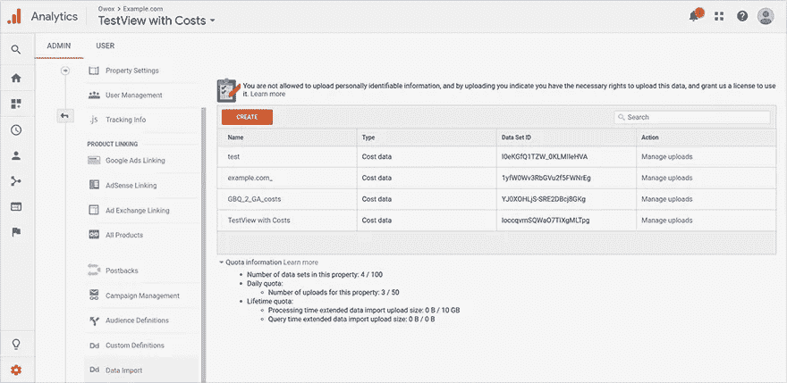

图片由作者提供

然后选择**成本数据**，点击**继续**:

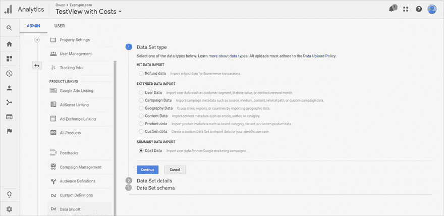

图片由作者提供

命名您的数据集，并选择要将成本数据上传到的 GA 视图。点击**继续**:

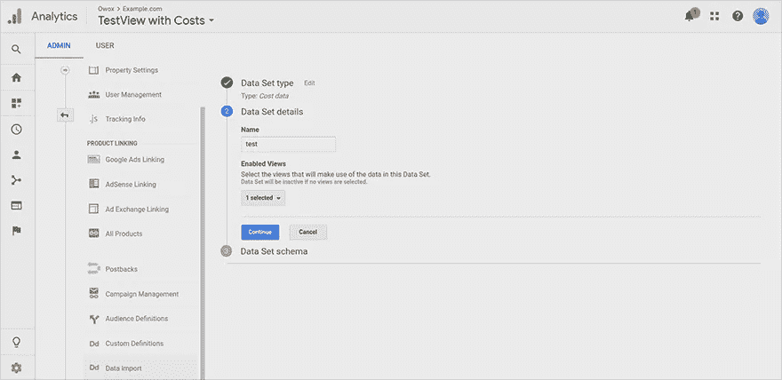

图片由作者提供

现在，通过选择从广告服务导出到 Google Analytics 的参数来确定数据集结构。有三个自动填写的必填字段:日期、来源和介质。还有一组字段至少需要一个参数:点击数、成本和印象数。

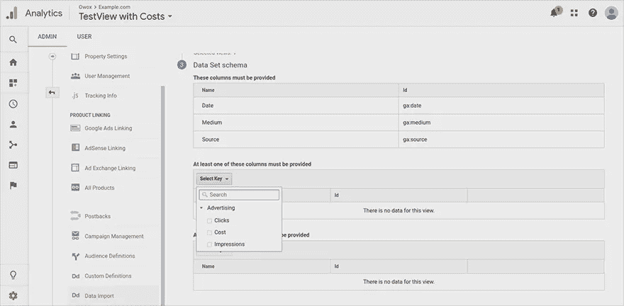

图片由作者提供

第三组字段是可选的。在这里，您可以添加使用 UTMs 收集的任何额外信息，例如，关键字或广告内容。

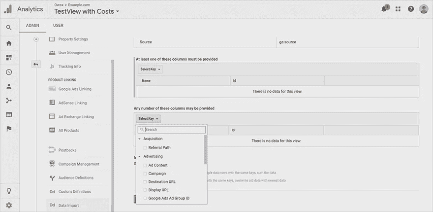

图片由作者提供

在**导入行为**下，选择当导入的数据重复时，例如当关键字已经上传到 GA 时，您想要做什么。如果要将新数据添加到现有数据中，选择**求和**。如果想用新数据替换现有数据，选择**覆盖**。接下来，保存更改，您将在**数据导入**菜单中看到一个新的数据集:

图片由作者提供

## 第二步。创建要上传的 CSV 文件。

一旦你创建了数据集，你需要准备一个 CSV 文件，用广告服务的成本、点击和其他指标的数据填充它，并上传到 Google Analytics。不要忘记在 CSV 文件中使用与步骤 1 中的数据集中相同的数据结构。你可以在[谷歌分析帮助](https://support.google.com/analytics/answer/6014981)中阅读更多关于如何正确建立上传成本数据的文件。

## 第三步。将 CSV 文件上传到 Google Analytics。

此时，您的数据已经收集完毕，CSV 文件也准备好了。现在该送 GA 了。为此，导航回**数据导入**并点击**上传文件**:

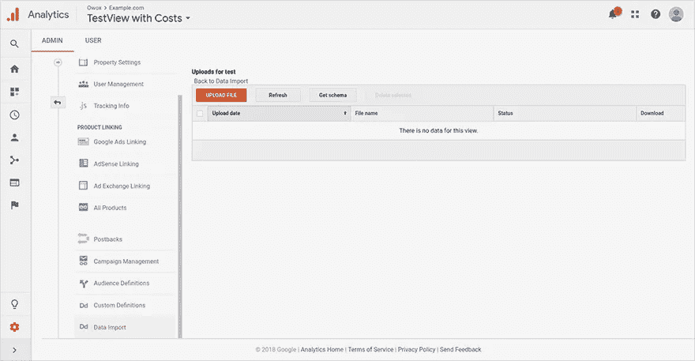

图片由作者提供

在您的计算机上选择包含成本数据的 CSV 文件，并确认**上传**:

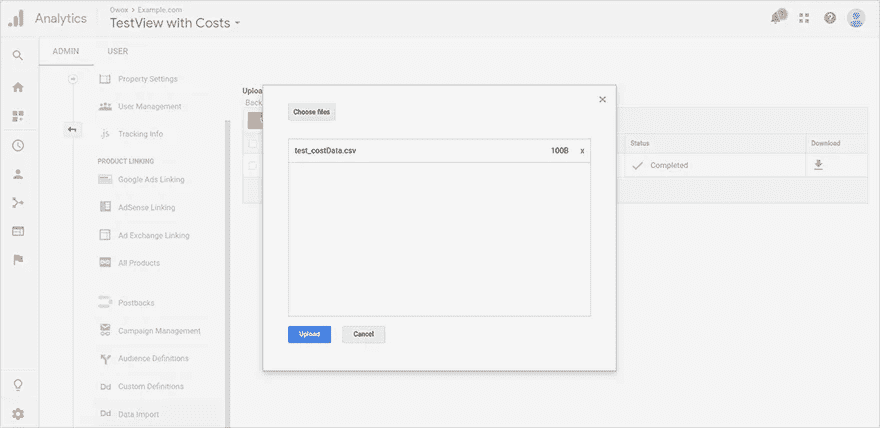

图片由作者提供

如果 CSV 文件填写正确，您将看到状态为“已完成”。处理数据并将其添加到您的报告中大约需要 24 小时。

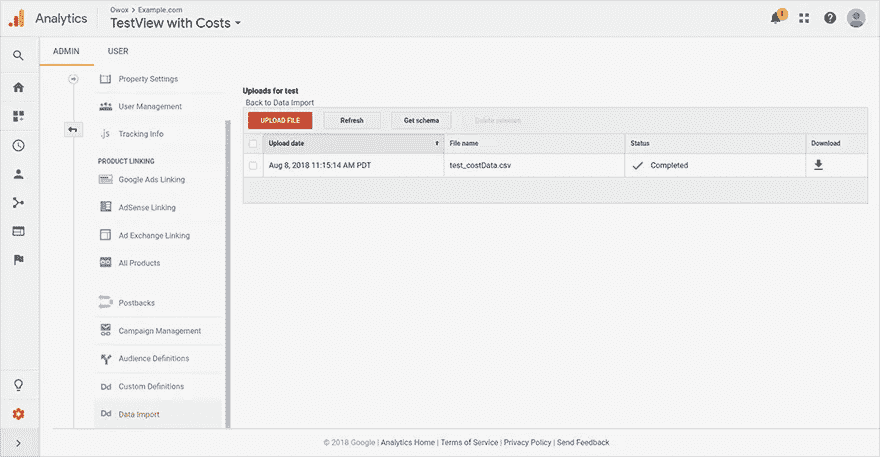

图片由作者提供

如果您在导入数据时看到错误，请在 Google Analytics 帮助中查看可能的[问题和解决方案](https://support.google.com/analytics/answer/3271778?ref_topic=6065475)。

## 2.使用 Google Sheets 插件导入成本数据

如果您已经在 Google Sheets 中收集了成本数据，您可以避免 CSV 文件带来的麻烦。只需使用免费的 [OWOX BI 数据上传插件](https://chrome.google.com/webstore/detail/owox-bi-data-upload/fadfhkmoaodkbbejgapjpbimhfflecin)，将您的成本数据从 Google Sheets 直接发送到 Google Analytics。如果上传的数据中有任何错误，插件会建议如何更正。

要使用 OWOX BI 数据上传插件导入数据，您需要在 GA 中创建一个数据集，并下载和安装该插件。接下来，打开一个结构合理的成本数据表(类似 GA 中的数据集，点击**附加组件** — **OWOX BI 数据上传** — **上传数据**:

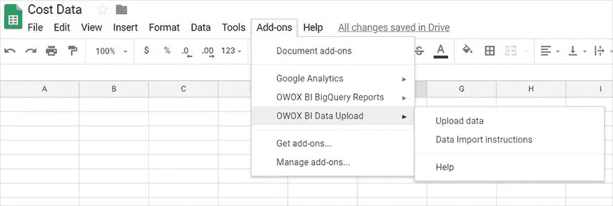

图片由作者提供

然后在 GA 中选择您想要上传费用的帐户、web 属性和数据集，并单击**验证&上传**。

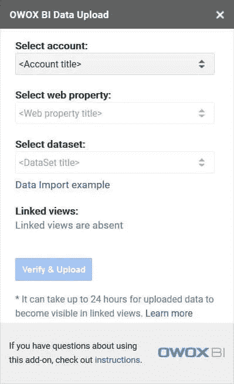

图片由作者提供

太好了，24 小时后，您将在 GA 报告中看到添加的数据。

## 3.使用 API 和 Apps 脚本导入成本数据

这个数据导入选项是半自动的。下面是如何设置的:在 GA 中创建一个数据集，同时在 Google Sheets 中创建一个成本数据表，剩下的工作将由 Google Apps 脚本完成。查看本指南以了解更多关于通过 API 导入的信息。

但是，请记住此选项的缺点:

*   有大量现成的脚本，但你必须配置它们，并知道正确的应用程序脚本语法来使用它们。
*   你必须手动或通过另一个 API 和应用程序脚本在 Google Sheets 中收集数据，甚至使用特殊服务。
*   你必须坚持某种格式，否则你会在数据中看到错误或不确定性。

## 4.通过特殊服务自动导入成本数据

大多数电子商务项目使用其他广告平台和谷歌广告。因此，这些项目必须仔细跟踪他们的成本，以快速反应和重新分配他们的营销预算。这就是为什么手动上传数据肯定太耗时。但是有工具可以解决这个问题，帮助营销人员和分析师摆脱常规工作。下面是我们对这个问题的解决方案，我们称之为 [OWOX BI Pipeline](https://www.owox.com/products/bi/pipeline/google-analytics-cost-data-import/) 。

目前，您可以使用 BI Pipeline 从脸书、Instagram、LinkedIn、Criteo 和 Yandex 自动将数据导入 GA。直接，Yandex。Market、MyTarget、AdRoll、Trafmag、Bing Ads、Twitter Ads、Sklik、Outbrain、Yahoo Gemini 和 Hotline。

OWOX BI 还可以扩展缩短的链接，识别广告活动中的动态参数，检查 UTM 标签，并通知您标签中的任何错误。最重要的是，Pipeline 将您使用的广告服务货币转换为 GA 中的货币。

如果您需要分析之前一段时间的数据，可以在 OWOX BI 设置中设置一个特殊选项，从 GA 获取过去六个月的历史数据。

此外，如果广告服务的数据有任何变化，Pipeline 会追溯更新上传到 GA 的数据(最多 21 天)。感兴趣了吗？在 7 天的试用期内，您可以免费试用所有这些功能。

但是关于 BI 管道的优点已经足够了。下面说说怎么用吧。您首先需要 GA 中的数据集，然后设置 OWOX BI 管道。

如果你还没有 OWOX 商业智能项目，用你的谷歌账户设置它。然后导航到**管道**，创建一条管道，选择[数据源](https://bi.owox.com/ui/data-pipeline/setup/#select-data-source):

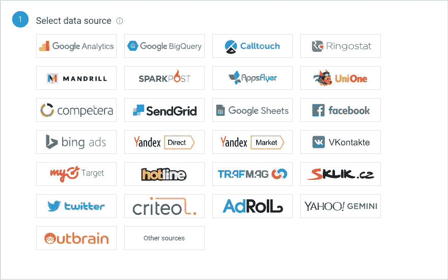

图片由作者提供

接下来，提供对广告服务的访问:

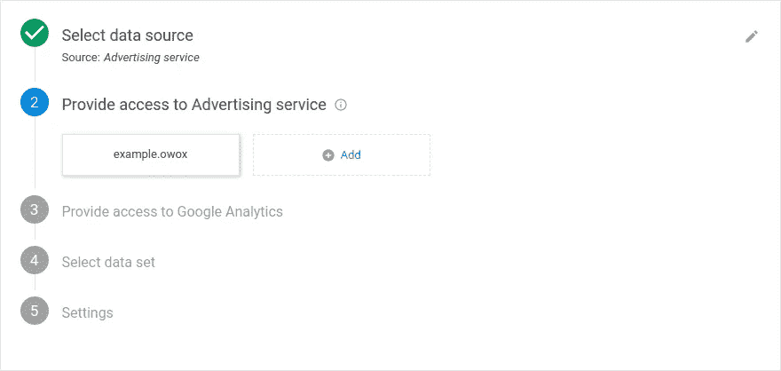

图片由作者提供

并提供访问您的 Google Analytics 帐户的权限:

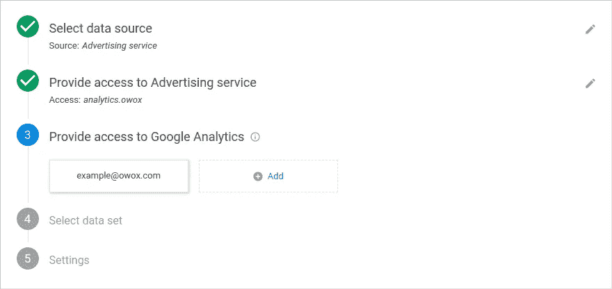

图片由作者提供

在 Google Analytics 中选择数据集以上传成本数据:

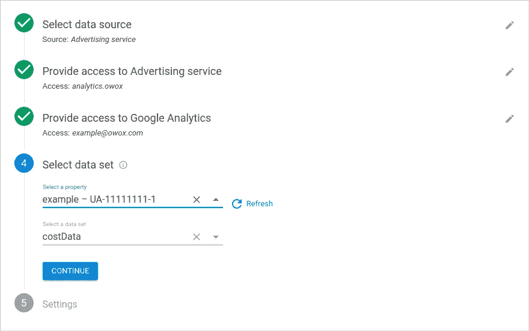

图片由作者提供

现在设置导入数据的开始日期(默认情况下，是当前日期)。您可以将其更改为过去或未来的日期。现在选择一个视图并点击**创建**:

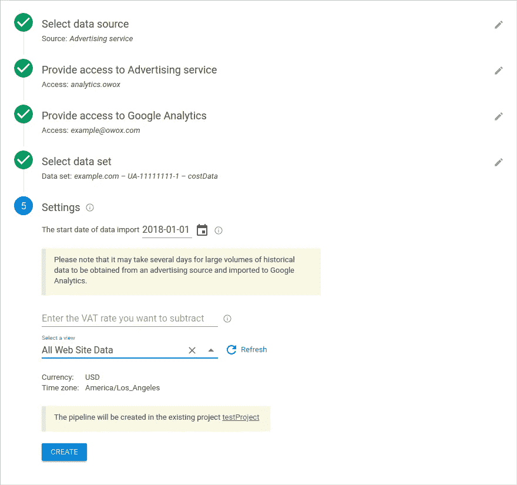

图片由作者提供

哒哒！管道已设置就绪。数据将在大约 36 小时后在 GA 报告中提供。OWOX BI 需要 12 个小时来处理数据，GA 需要 24 个小时来处理数据。

# 自由职业者协会

## 如果我只需要单个活动的数据，该怎么办？

您可以使用此活动的数据创建一个 CSV 文件，并将其手动上传到 GA。自动导入只能让您上传多个活动的数据。不过，您可以设置过滤器来查看您需要的活动信息。为此，在 g a 中创建数据集时选择**活动**参数:

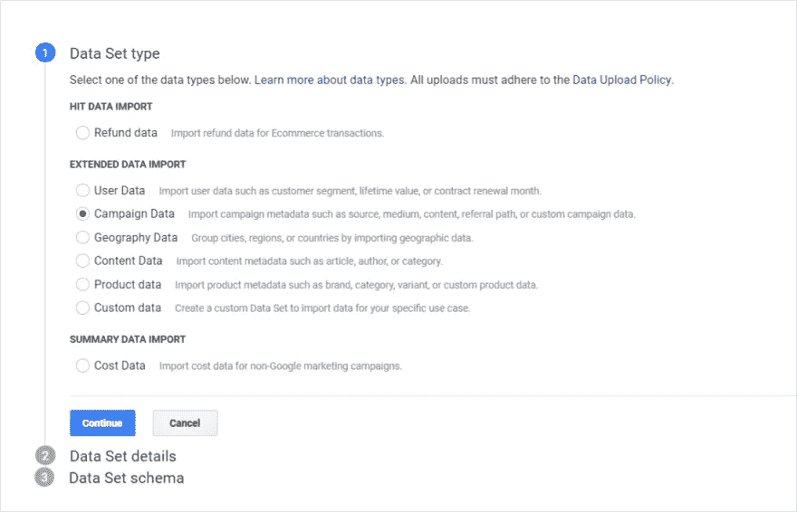

图片由作者提供

之后，进入**采购—活动—成本分析**，将**活动**设置为主要维度，查看跨活动的报告。

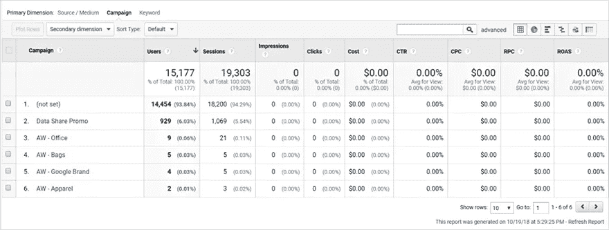

图片由作者提供

## 如果我需要的参数比 GA 中的数据导入允许的多怎么办？

如果你需要[成本数据模式](https://support.google.com/analytics/answer/6066858)中没有的信息，你可以从 Google BIgQuery 的广告服务中收集和组合数据。OWOX BI Pipeline 允许您从脸书 Ads 向 BigQuery 发送完整的数据(参见[数据模式](https://support.owox.com/hc/en-us/articles/115000316593))。

## 如何将成本数据从没有与 OWOX BI Pipeline 集成的来源导入 GA？

BI Pipeline 使用广告服务的官方 API。对于不提供 API 或者没有与 OWOX BI 集成的服务，有一个[手动上传](https://support.owox.com/hc/en-us/articles/217329137?_ga=2.71471568.299540108.1547120866-1908059887.1540556628)选项。它不同于 GA 手动上传方法，因为您不必形成和上传 CSV 文件，您可以在 OWOX BI 界面中完成。

## 我如何计算 roa 并考虑不在 GA 中的退款和已完成订单？

您必须使用 BigQuery 将来自 CRM 的已完成订单数据与来自 ad services 和 GA 的数据进行合并。这也将允许您建立一个基于漏斗的归因模型，并在考虑离线订单时评估您的活动。

# 结论

为了比较你的广告渠道的表现，你需要在一个单一的系统中收集数据，如谷歌分析。导入成本数据的最佳方式取决于您使用的广告服务数量以及您需要广告服务报告的频率。

如果您使用两三个广告服务，并且不经常需要报告，您可以手动将成本数据上传到 GA。否则，考虑使用 OWOX BI 之类的特殊服务来自动上传成本数据。