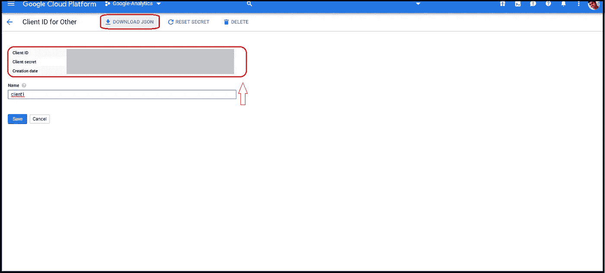

# 谷歌分析数据与 R

> 原文：<https://towardsdatascience.com/google-analytics-data-with-r-32caf8956c94?source=collection_archive---------14----------------------->


米利安·耶西耶在 [Unsplash](https://unsplash.com?utm_source=medium&utm_medium=referral) 上拍摄的照片

**目标:**以编程方式检索营销分析自动化的谷歌分析数据。

访问 Google Analytics API 来检索 GA 记录是构建端到端营销分析套件的基本要求之一。我们可以通过下面列出的四个主要步骤来实现这一目标:

1.  在 Google Cloud 中生成客户端 ID 和密钥。
2.  更新。伦美龙变量。
3.  导入相关库并在本地刷新 GA 令牌。
4.  最后，在 r 中构建 GA 数据集。

**第一步。在 Google Cloud 中生成客户端 ID 和密钥**

步骤 1.1。创建谷歌云项目:登录 [**谷歌云控制台**](https://console.cloud.google.com/) 创建项目。


创建谷歌云项目(图片由作者提供)

第 1.2 步。谷歌分析报告 API:一旦你创建了项目，导航到项目的 API 和服务部分，并启用“谷歌分析报告 API”。


谷歌分析报告 API 1(图片由作者提供)


谷歌分析报告 API 2(图片由作者提供)


谷歌分析报告 API 3(图片由作者提供)

第 1.3 步。配置 OAuth 同意屏幕:如果您是第一次设置 Google Cloud 项目，您必须在生成凭证之前配置 OAuth 同意屏幕。确保在项目范围中选择分析报告 API，在同意屏幕中输入应用程序名称和支持电子邮件。


配置 OAuth 同意屏幕 1(图片由作者提供)


配置 OAuth 同意屏幕 2(图片由作者提供)


配置 OAuth 同意屏幕 3(图片由作者提供)

第 1.4 步。创建 OAuth 客户端 ID:配置 OAuth 同意屏幕后，创建 OAuth 客户端 ID 凭据。以 JSON 文件的形式下载客户机 ID 和密钥，并将其存储在当前的工作目录中。


创建 OAuth 客户端 ID 1(图片由作者提供)


创建 OAuth 客户端 ID 2(图片由作者提供)



创建 OAuth 客户端 ID 3(图片由作者提供)

**第二步。更新。Renviron:编辑。Renviron 通过整合最新的谷歌云项目证书**

第 2.1 步。打开。Renviron 在 R 中使用以下命令并更新参数:

```
usethis:: edit_r_environ()
```


更新。伦美龙(图片由作者提供)

**第三步。GA 认证:启动一个 R 会话并提前导入所有相关的库**

googleAnalyticsR 和 googleAuthR 是列表中的必备。确保在加载 googleAnalyticsR 和 googleAuthR 包之前使用' gar_set_client()'函数。此外，指出 gar_auth()函数中“刷新令牌”的位置。

```
googleAuthR:: gar_set_client( "C:\\Users\\Sree\\gcp_client.json")library(googleAnalyticsR)
library(googleAuthR)
library(tidyverse)
library(lubridate)
library(dplyr)googleAuthR::gar_auth(token = "sc_ga.httr-oauth")
```

在执行上述命令时，您将能够通过自动刷新令牌经由 R 成功登录到 Google Analytics 报告数据库。

**第四步。Google 分析报告 API:在 R 中构建 GA 报告**

第 4.1 步。从 GA 获取视图列表:

确定您需要从谷歌分析的视图的完整列表。通过使用 googleAuthR 包中的“ga_account_list()”函数或通过从 Google Analytics 本身识别他们来获取他们的 ViewId。


谷歌分析报告 API(图片由作者提供)

```
my_accounts <- ga_account_list()
viewId <- (my_accounts$viewId)
```

第 4.2 步。通过查询 Google Analytics 报告服务器构建数据集:

为了便于说明，我在这里构建了一个循环，为 Google Analytics 中设置的所有视图顺序下载数据。

```
ga_data_final <- data.frame()for (i in viewId) {
  ga_data_temp <- 
    google_analytics(i, 
                     date_range = c(GoogleA_Start, GoogleA_End),
                     metrics = c("sessions"),
                     dimensions = c("date"
                                 ,"channelGrouping"
                                 ,"deviceCategory"
                                 ,"source"),
                     anti_sample = TRUE,
                     #slow_fetch = TRUE,
                     max = c("-1"))
  ga_data_temp$viewId <- i
  ga_data_final <- rbind(ga_data_final, ga_data_temp)
}
```

第 4.3 步。清理数据集:

```
GA_export <- 
  left_join(ga_data_final,my_accounts, by = "viewId") %>%
  select(date,channelGrouping,deviceCategory,source,sessions,Country) %>%
  mutate(channelGrouping_refined = if_else(
  channelGrouping == 'Organic Search','SEO',
  if_else(channelGrouping == 'Paid Search','PPC Search',
  if_else(channelGrouping == 'Display', 'PPC Display',
  if_else(channelGrouping == 'email,email','EDM',
  if_else(channelGrouping == '(Other)', 'Unspecified', channelGrouping  
  )))))) %>% select(date,channelGrouping,deviceCategory,source
  ,sessions,channelGrouping_refined,Country)rm(my_accounts,ga_data_final,ga_data_temp,i, viewId)
```

第 4.4 步。发布数据集:

这是谷歌分析报告服务器最终输出的快照。


发布数据集(按作者分类的图像)

最后，将带有时间戳的数据集发布到平面文件或云数据库中。

```
GA_data <- 
  GA_export %>%
  write_csv("GA_data.csv")
```

**第五步:接下来是什么？**

这只是营销分析自动化的开始。因为我们可以在此基础上做更多的事情，比如:

1)在虚拟机上自动化 R 脚本，并将增量数据存储在云数据库中。

2)重复相同的过程，建立一个自动化的跨渠道数据湖，带来增量脸书广告/谷歌广告/推特广告数据集。

3)使用时间序列预测来预测来自每个平台的用户会话/指标。

4)最后，构建一个 BI 仪表板，从平面文件/云存储中检索数据，以可视化端到端营销分析套件。

**关于作者**

[](https://srees.org/about) [## Sreejith Sreedharan - Sree

### 数据爱好者。不多不少！你好！我是 Sreejith Sreedharan，又名 Sree 一个永远好奇的数据驱动的…

srees.org](https://srees.org/about) 

如果您在理解 r 中 GA 自动化的基础知识方面需要任何帮助，请随时联系我。希望这有所帮助:)