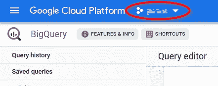
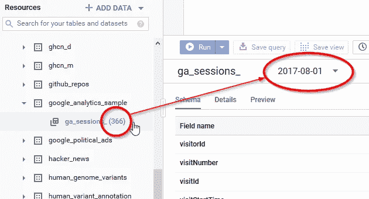
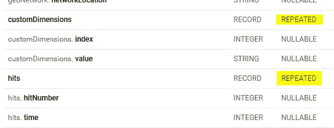

# BigQuery 中的谷歌分析 3:入门

> 原文：<https://towardsdatascience.com/google-analytics-in-bigquery-1-getting-started-ef0991484787?source=collection_archive---------23----------------------->

如果你在知道谷歌分析有其局限性之前使用过它。对于报告、过滤器、细分市场和预定义的维度/指标，您只能做这么多。通过将原始数据导出到 BigQuery，我们可以轻松地避开这些问题，并运行各种对于用户界面的报告来说过于复杂或过于具体的分析。但是原始数据也有一些缺点:模式有点不寻常，分析师可能会发现嵌套方法一开始有点挑战性。

我想开始一系列文章，在这些文章中，我将在*开放数据*上展示如何开始使用 BigQuery 中的谷歌分析表。我将讲述这个结构是什么样子，如何理解它，以及如何处理它的嵌套数据——首先是初级水平，稍后我想更详细一些。在第一篇文章中，我将首先向您介绍最常见的领域。

我假设你知道基本的分析 SQL。比如用`SUM()`和`[GROUP BY](https://cloud.google.com/bigquery/docs/reference/standard-sql/query-syntax#group-by-clause)`聚合值。你也应该知道`[LEFT JOIN](https://cloud.google.com/bigquery/docs/reference/standard-sql/query-syntax#left-outer-join)`和`[CROSS JOIN](https://cloud.google.com/bigquery/docs/reference/standard-sql/query-syntax#cross-join)`的区别。如果你以前从未使用过 BigQuery，下面是如何在沙盒模式下开始的指南和一个关于 web 界面的指南。如果你需要一点关于 SQL 的复习，你可以尝试一下 [SQLbolt](https://sqlbolt.com/) 来获得一个简单的交互式教程，而不需要注册或支付任何费用。

当然，如果你跟着做，这些文章的效果会更好，我写这些文章是因为我知道你会跟着做。

# 建立

首先，从谷歌商品商店查找[谷歌分析数据。每个人都有查看权限，但是为了查询数据，您的计费项目必须允许在美国查询数据。您可以在左上角选择您的计费项目:](https://console.cloud.google.com/bigquery?p=bigquery-public-data&d=google_analytics_sample&t=ga_sessions_20170801&page=table)

确保此项目可以查询美国的数据

要将 BigQuery 公共数据项目固定到您的项目列表[中，打开项目页面](https://console.cloud.google.com/bigquery?folder&organizationId&p=bigquery-public-data&page=project)，点击中间右侧的“固定项目”。我们将在这个项目中使用的数据集叫做`[google_analytics_sample](https://console.cloud.google.com/bigquery?folder&p=bigquery-public-data&d=google_analytics_sample&page=dataset)`。

要开始，只需单击数据集中的表组，如下图所示:

包含 366 个表的表组—这里选择了表 ga_sessions_20170801。

现在，单击右侧的“查询表”,一个查询框架出现在您的查询编辑器中，您可以轻松地修改它:

该查询应该为计数返回一个值。

# 谷歌分析数据结构 1 —简单数据类型

谷歌分析数据每天导出*一张表*、*、*，无论[是流](https://support.google.com/analytics/answer/7430726?hl=en)还是当天导出。该名称遵循`ga_sessions_YYYYMMDD`的模式，其中最后一部分被替换为 Google Analytics 中导出视图的[时区设置的日期。这意味着一个表中的所有数据都来自这个时区的某一天！组合不同时区的数据时要小心。现在，我们来看看实际数据。](https://support.google.com/analytics/answer/1010249?hl=en)

将 BigQuery 表视为平面表是一个好主意。是的，没错——尽管到处都在谈论臭名昭著的“嵌套数据”,但在开始理解它们时，将它们视为普通的关系表是有意义的。例如，表 *ga_sessions_20170801* :如果您只查看包含简单数据类型(且未被否决)的字段(列)，您会得到以下列表:

*   访问号码 *(int64)*
*   visitId *(int64)*
*   visitStartTime *(int64)*
*   日期*(字符串)*
*   fullvisitorid *(字符串)*
*   clientId *(字符串)*
*   频道分组*(字符串)*
*   社会管理类型*(字符串)*
*   用户标识*(字符串)*

仅此而已。一些字符串和一些整数。让我们揭开它们的神秘面纱。并且在我们开始之前，设置一个书签到 [**导出模式**](https://support.google.com/analytics/answer/3437719) 以备将来参考。在开发查询时，您将需要它来查找概念。这个参考资料加上跟踪开发人员编写的参考资料将有助于您理解数据。

*表格中的每一行等于一个会话*(或一次访问)。因此，我们的第一个字段 **visitNumber** 试图告诉我们这是哪个会话。不过，如果你在追踪网站，要小心:visitNumber 通常来自 cookie，而 cookie 可能是错误的。最好把这个领域当作一个粗略的估计。

[在这里运行这个查询](https://console.cloud.google.com/bigquery?folder&p=bigquery-public-data&d=google_analytics_sample&t=ga_sessions_20170801&page=table)查看结果！

但是什么是会话呢？我们可以将“**会话**”定义为 Google Analytics 称之为“*命中*”的一组服务器请求。会话从一次点击开始，并在以下情况下结束

*   超过*超时阈值*(在视图设置中设置[)](https://support.google.com/analytics/answer/2795871?hl=en)
*   点击包含*新的营销活动信息*——会话可以来自搜索引擎、广告、合作伙伴、其他渠道或直接
*   在*午夜*(因为创建了一个新表)

我们将在以后的文章中了解更多关于*点击*的信息！

字段名 **visitId** 可能会让您认为它允许您将它用作会话 Id。但事实并非如此。visit id 和 **visitStartTime** ，实际上都是以秒为单位的 UTC 时间戳，表示会话开始的时间*(第一次点击的时间)！区别就在这里:还记得一个会议是如何在午夜分成两个会议的吗？ *visitStartTime* 给出这一行的时间，而 *visitId* 给出前一天表中这一行的时间！如果没有午夜分割，则两个字段都包含相同的值*:**

[运行这个查询](https://console.cloud.google.com/bigquery?folder&p=bigquery-public-data&d=google_analytics_sample&t=ga_sessions_20170801&page=table)来查看结果！

当你计算超过*多天*的会话时，这种差异当然是非常重要的。

使用 [**通配符表**](https://cloud.google.com/bigquery/docs/reference/standard-sql/wildcard-table-reference) 有一种轻松的方法。您基本上是在表名中使用一个`*`作为通配符。这将添加伪列`_table_suffix`,它包含您用通配符替换的表名的所有部分。如果你替换日部分`ga_sessions_201708*`，它包含字符串形式的所有日，例如`01`或`02`。如果替换更多的`ga_sessions_2017*`，则包含更多的`0801`、`0731`，以此类推:

[运行此查询](https://console.cloud.google.com/bigquery?folder&p=bigquery-public-data&d=google_analytics_sample&t=ga_sessions_20170801&page=table)并修改它以了解更多信息！

因为字段**日期**包含本地日期，所以在整个表中它是相同的值。所以当我们数的时候，我们得到了桌子的数量。

再来说说 **fullVisitorId** 和 **clientId** :客户端 Id 是 fullVisitorId 的未哈希版本，但并不总是完全匹配。仅在加入其他营销数据时使用客户 id。使用 fullvisitorid 用于*识别客户端*(浏览器 cookies 或应用安装)，因为该 id 与谷歌用户分析数据一致。如果你在一个标准的非[用户 id 视图](https://support.google.com/analytics/answer/3123669?hl=en)中，那就是。

既然我们可以识别客户，我们也可以识别他们的会话，因为每个客户一次只能有一个会话——我们结合 *fullVisitorId* 和 *visitStartTime* 来获得与 Google Analytics 中相同的数量:

运行这个查询来查看不同之处！

如果你将 *fullVisitorId* 和 *visitId* 结合起来，然后分别计算几天的访问量，你会得到一个更准确的访问量，因为午夜时段被忽略了——但这个数字不会出现在谷歌分析中，所以要准备好回答同事的问题，将你的数字与谷歌分析用户界面中的数字进行比较。

字段 **channelGrouping** 包含该会话的营销渠道。请注意，通道可以从以前的会话中继承！这取决于你在[活动超时](https://support.google.com/analytics/answer/2795871?hl=en)上的谷歌分析设置——标准设置是**六个月**！要检查该值是否被继承，请查看字段*traffic source . istruedirect*，并咨询您的营销团队如何解释他们的活动超时选择。

字段 **userId** 只有在您将 Google Analytics 中的视图设置为用户 Id 视图时才相关，因为这样做的缺点是只跟踪那些实际上有用户 id(通常是登录 id)的会话。公司通常在自定义维度中跟踪登录 ID。我们稍后将了解自定义尺寸！

# 谷歌分析数据结构 2 —结构

结构是我们的第一个复杂数据类型:键值对列表*。如果你熟悉 JSON:它们基本上是对象，在`{ "key 1" : "value X", "key 2" : "value Y"}`或 Python 中它们被称为*字典*。*

在 BigQuery 中，它们被称为结构，或者有时——如果你在 web 界面中查看表模式——它们被称为`RECORD`。这完全是一回事。请不要把它们和数组混淆——有包含`RECORD`的数组——但是`RECORD`也可以独立存在！

区别在于模式:如果它说`REPEATED`，那么它是一个数组，如果不是，那么它只是一个单个的数组。

通过寻找“重复的”来识别数组—“*重复的记录*”意味着“数组中的结构”

对我们来说，这意味着我们有几个包含子字段的字段，但都是单个的`RECORD`。它们通常可以被视为普通的列。这里没什么可怕的。

虽然不能`GROUP BY`或聚合一个结构，但是可以`GROUP BY`一个结构的子字段(除非它本身是一个结构或数组)。让我向您展示我的意思—我们的表中有以下结构:

*   **总计**包含本次会话的合计值
*   流量来源告诉我们流量的来源
*   **设备**包含客户端信息
*   **地理网络**包含关于客户端地理位置的最佳猜测

它们非常自我描述，并且[有很好的文档记录](https://support.google.com/analytics/answer/3437719?hl=en)。确保您了解它们的子字段的值是如何被跟踪的——与您的开发人员交谈并阅读他们关于这些字段的限制的实现文档。例如，由于 [IP 匿名化](https://support.google.com/analytics/answer/2763052?hl=en)，地理位置[可能会非常不准确。](https://support.google.com/analytics/answer/6160484?hl=en)

**总计**可以节省计算时间。您可以使用点运算符`.`来访问子字段，如下所示:

[运行并修改此查询](https://console.cloud.google.com/bigquery?folder&p=bigquery-public-data&d=google_analytics_sample&t=ga_sessions_20170801&page=table)以了解如何查询结构！

*总计*的子字段包含两种类型的字段:

1.  **统计总量**，比如点击数、交易数和浏览量。
2.  **条件集合**，如 *totals.visits* 为`1`或`NULL`，表示某一组条件是否成立。

**totals.visits** 表示该会话是否包含*交互*。是的，存在没有交互的会话的用例:有时你想跟踪应用程序的安装，这将向 Google Analytics 发送一个没有交互的点击，Google Analytics 将围绕它建立一个完整的会话。这些以及类似的情况会导致*非交互式会话*，您可以使用`WHERE totals.visits = 1`忽略这些会话。记住 [GIGO](https://en.wikipedia.org/wiki/Garbage_in,_garbage_out) 原则，确保你的追踪开发者将这些点击设置为[非交互](https://developers.google.com/analytics/devguides/collection/protocol/v1/parameters#ni)，否则，你最终会有很多不应该被认为是非交互的会话。

**totals . bounds**表示该会话是否只有一次浏览量。小心这个数字，因为它不适用于应用程序流量。为此，你需要建立自己的反弹标准，例如检查`totals.screenviews = 1`。

还有 **totals.newVisits** ，其工作原理与 totals.visits 类似，也可用于简单计数`SUM(totals.newVisits)`或作为条件语句，例如`WHERE totals.newVisits = 1`。

**device.deviceCategory** 也是一个有趣的分类:谷歌分析自动将客户分为*移动*、*桌面*(包括笔记本电脑)和*平板*。他们并没有真正公开他们是如何做的，所以对照用户代理检查一下，看看它是否对你的情况有意义。这个字段很有用，因为这三个类别的用户体验不仅在接收方面不同，在提供输入方面也不同。如果你的团队也在跟踪 CSS 断点，当你的分析问题在 UX 领域时，它可能会给你更好的分段。

现在您已经知道了这些标准字段是如何工作的以及在哪里可以找到它们，接下来您可以进入有趣的部分:数组。它们将在下一篇文章中介绍——希望在那里见到您！