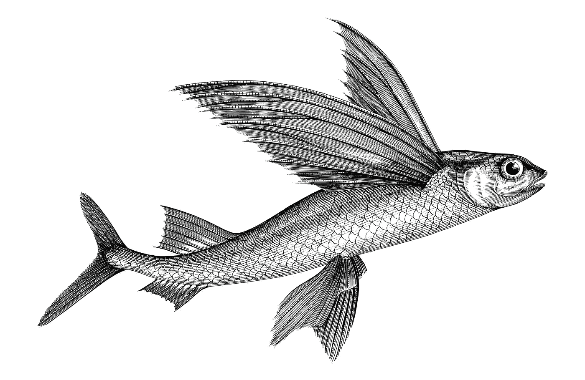
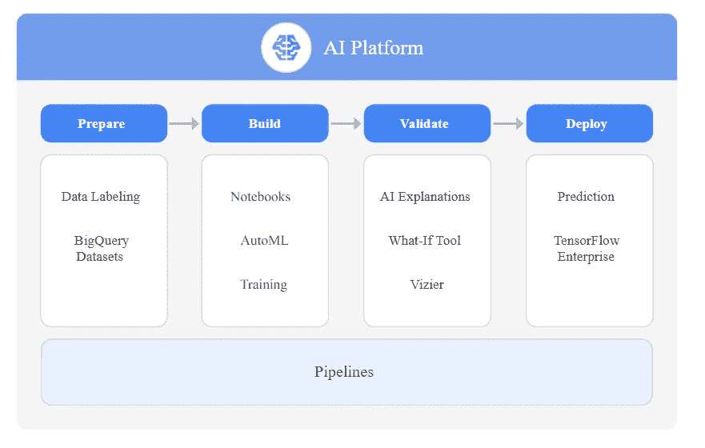
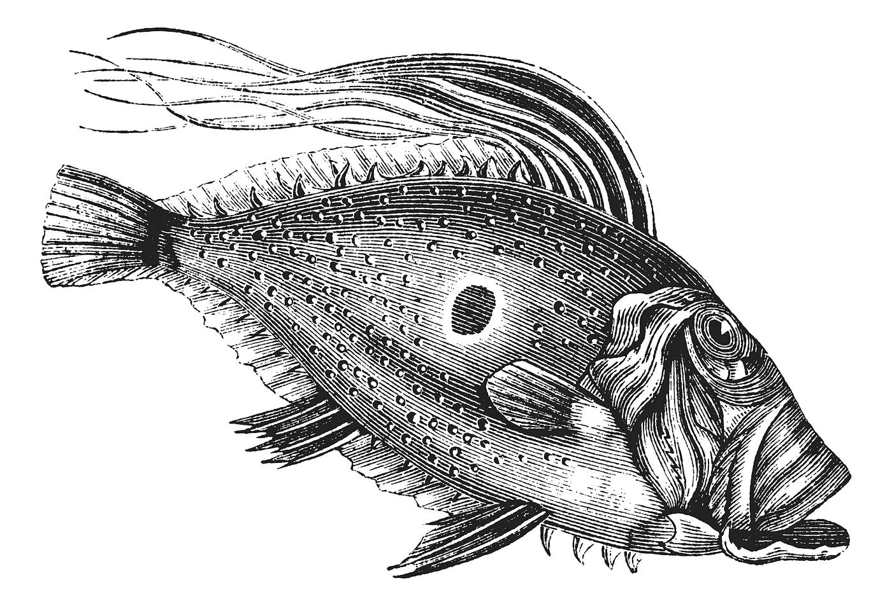

# 谷歌云人工智能平台:超可访问人工智能和机器学习

> 原文：<https://towardsdatascience.com/google-cloud-ai-platform-hyper-accessible-ai-machine-learning-cddd8c3348b3?source=collection_archive---------17----------------------->

## 在本系列的第一篇文章中，我们将介绍 Google AI 平台，探索现代数据科学可用的服务

授权给作者的图像

# 谷歌云

对于那些不熟悉谷歌云的人来说，谷歌云平台(GCP)是一套基于云的计算服务，旨在支持一系列常见的用例；从托管容器化应用程序，如社交媒体应用程序，到大规模数据分析平台，以及高级机器学习和人工智能的应用。

> 谷歌云由一组物理资产(如计算机和硬盘驱动器)和虚拟资源(如虚拟机)组成，这些资源包含在谷歌位于全球的数据中心中。
> ***谷歌云*** (来自[谷歌云](https://cloud.google.com/docs)入门)

谷歌云于 2008 年 4 月首次推出，运行在谷歌内部用于其最终用户产品的相同基础设施上，包括谷歌搜索、Gmail、文件存储和 YouTube。这个全球网络本身就是一个工程壮举，谷歌有一个迷人的互动展示平台，你可以去探索。

谷歌云是目前市场上三大云提供商之一，另外两家是微软 Azure 和亚马逊网络服务(AWS)。

# 谷歌和人工智能

谷歌经常被称为人工智能领域的世界领导者。要了解原因，我们可以从谷歌的使命宣言开始:

> 谷歌的使命是组织世界上的信息，并使其普遍可用和有用。人工智能正在以令人兴奋的新方式帮助我们做到这一点，为我们的用户、客户和世界解决问题。
> ***谷歌***

在这篇[文章](https://ai.google/about/)中，谷歌进一步阐述了其对 AI 的具体使用:

> 人工智能让人们每天做事情变得更容易，无论是搜索亲人的照片，在谷歌翻译中打破语言障碍，在旅途中键入电子邮件，还是用谷歌助手完成事情。人工智能还提供了看待现有问题的新方法，从反思医疗保健到推进科学发现。
> ***谷歌***

## 谷歌人工智能收购

过去十年左右，谷歌在人工智能领域进行了一系列收购:

2010: Metaweb(语义搜索)、Phonetic Arts(语音合成)
2011: SayNow(语音识别)、PittPatt(面部识别)
2012: Viewdle(面部识别)
2013: **DNNresearch** (深度学习)、Behavio(语义分析)、Wavii (NLP)、Schaft 等 6 家机器人公司、Industrial Perception
2013:Bot&Dolly(机器人视觉)
2014: **Eyefluence(视觉)
2017: **Kaggle** (数据科学)、Halli Labs(深度学习)、AlMatter(视觉)
2020: Onward (NLP)、智能眼镜(视觉)**

谷歌承诺让其他人也能获得这一人工智能领域的知识，并形成他们人工智能平台的基础。

> 在谷歌人工智能，我们正在进行推动该领域最先进技术的研究，将人工智能应用于产品和新领域，并开发工具以确保每个人都可以访问人工智能。
> ***谷歌***

# 谷歌云人工智能平台

授权给作者的图像

AI Platform 是 Google Cloud 上的一套服务，专门用于在云中构建、部署和管理机器学习模型。

## 超可访问的机器学习

人工智能平台旨在让数据科学家和数据工程师轻松简化 ML 工作流程，并访问谷歌开发的开创性人工智能。我们经常在 AutoML (Google 的点击式 ML 引擎)中使用它，但除此之外，它还支持使用 Tensorflow 和 SKLearn 构建的高级模型的训练、预测和版本管理。

# 云人工智能平台服务

AI 平台提供了一套服务，旨在支持典型 ML 工作流中的活动。

谷歌云 AI 平台服务(图片来源谷歌云)

**1。准备**

通常，数据首先在[**BigQuery Datasets**](https://cloud.google.com/bigquery/docs/datasets-intro)中准备(摄取、清理、特征工程)，big query Datasets 是 Google Clouds 超大规模数据仓库中的表集合。

虽然谷歌将 BigQuery 作为人工智能平台的一部分，但我们倾向于将 BigQuery 视为一个数据仓库，因此在技术上不是一项人工智能服务。话虽如此，我们构建的 99%的 ML 工作流都使用它。

Google 提供了 [**数据标注服务**](https://cloud.google.com/ai-platform/data-labeling/docs) 用于标注训练数据。该服务允许您与人工贴标机合作，为您可以在机器学习模型中使用的数据集合生成高度准确的标签。通常我们用它来对图像、视频、音频和文本进行分类。

一些示例图像标签选项包括(但不限于):

1.  **图片的分类**(猫，不是猫)
2.  图像**边界框**(在每张图像中的所有汽车周围画一个框)
3.  图像**分割**(勾勒出每幅图像中的所有人)

您可能想了解更多关于[数据标签定价](https://cloud.google.com/ai-platform/data-labeling/pricing)的信息。

(2020 年 11 月-由于 Covid19，数据标签服务目前不可用)。

**2。构建**

我们简单的谈了一下 [**AutoML**](https://cloud.google.com/automl) ，训练模型的零代码平台。

**机器训练机器**。Cloud AutoML 使机器学习专业知识有限的团队能够利用易于使用的图形界面训练高质量的模型。它依赖于谷歌最先进的迁移学习和神经架构搜索技术；利用超过 10 年的专有谷歌研究技术，帮助您的机器学习模型实现更快的性能和更准确的预测。

> 今天，设计神经网络是非常耗时的，并且需要专业知识，这限制了它在较小的科学家和工程师群体中的使用。这就是为什么我们创造了一种叫做 AutoML 的方法，表明神经网络设计神经网络是可能的。
> **T22【桑德尔·皮帅】谷歌 CEO**

我们使用 [**AI 平台笔记本**](https://cloud.google.com/bigquery/docs/datasets-intro) (托管 Jupyter 笔记本)来构建定制的 ML 模型，通常使用 Tensorflow 或 SkLearn。

2020 年 9 月发布，AI 平台笔记本取代云数据实验室。我们希望您现在可以直接在浏览器中使用笔记本，而不必先设置 ssh 隧道(datalab 强迫您这样做)。

最后， [**AI 平台培训**](https://cloud.google.com/ai-platform/training/docs) 提供服务，在云中的计算资源上运行你的培训工作。

**3。验证**

[**可解释的 AI**](https://cloud.google.com/explainable-ai) 是一套很棒的工具，可以帮助您理解模型的输出，验证模型行为，识别模型中的偏差，并获得改进模型和训练数据的方法。这确实有助于消除活动中的猜测，例如模型调优。

**当 AI 出错时**

照片由 [Marek Szturc](https://unsplash.com/@marxgall?utm_source=medium&utm_medium=referral) 在 [Unsplash](https://unsplash.com?utm_source=medium&utm_medium=referral) 拍摄

可解释的人工智能应该被忽视，否则后果自负。例如，一个图像分类模型被训练来检测狼。当算法错误地将一个外星人归类为狼时，创造者们感到困惑。结果是，经过训练的模型实际上只是在图像中寻找雪和树(这在训练集中占了很大比重)。

这是一个很棒的 TED 演讲，引用了这个和其他的例子。

可解释的人工智能应该被忽略，否则后果自负

[**AI 平台 Vizier**](https://cloud.google.com/ai-platform/optimizer/docs/overview) 更进一步，提供黑盒优化服务，调整超参数，优化模型输出。

**4。展开**

无论您是使用无代码 AutoML 训练的模型，还是使用 AI 平台笔记本构建的高级 Tensorflow 模型，AI 平台都提供了许多服务来帮助部署模型和生成预测。

[**AI 平台预测**](http://ai%20platform%20prediction%20that%20manages%20the%20infrastructure%20needed%20to%20run%20your%20model%20and%20makes%20it%20available%20for%20online%20and%20batch%20prediction%20requests.%20you%20can%20also%20use%20automl%20vision%20edge%20to%20deploy%20your%20models%20at%20the%20edge%20and%20trigger%20real-time%20actions%20based%20on%20local%20data.%20tensorflow%20enterprise%20offers%20enterprise-grade%20support%20for%20your%20tensorflow%20instance./) 管理运行模型所需的基础设施，并使其可用于在线和批量预测请求。

[**AutoML Vision Edge**](https://cloud.google.com/vision/automl/docs/edge-quickstart)**帮助部署 Edge 模型(在本地设备上运行，例如智能手机、物联网设备)并可以基于本地数据触发实时操作。**

****

**我们最近写了一篇探索 Edge AI 的文章(图片授权给作者)**

**我们在最近的文章中讨论了边缘人工智能的重要性。**

**[**TensorFlow Enterprise**](https://cloud.google.com/tensorflow-enterprise)为您的 tensor flow 实例提供企业级支持。**

****5。ML 管道(ML 操作)****

****

**授权给作者的图像**

**ML Ops 是部署健壮的、可重复的和可伸缩的 ML 管道来管理您的模型的实践。人工智能平台提供了许多服务来协助这些管道。**

**[**AI 平台管道**](http://continuous%20evaluation%20helps%20you%20monitor%20the%20performance%20of%20your%20models%20and%20provides%20continual%20feedback%20on%20how%20your%20models%20are%20performing%20over%20time./) 使用 Kubeflow 管道或 TensorFlow Extended (TFX)提供创建 ML 管道的支持。**

**[**持续评估**](http://continuous%20evaluation%20helps%20you%20monitor%20the%20performance%20of%20your%20models%20and%20provides%20continual%20feedback%20on%20how%20your%20models%20are%20performing%20over%20time./) 帮助您监控您的模型的性能，并对您的模型在一段时间内的表现提供持续反馈。**

**[**深度学习虚拟机映像**](https://cloud.google.com/deep-learning-vm) 支持轻松调配深度学习 ML 应用的云虚拟机。**

**最后， [**深度学习容器**](https://cloud.google.com/ai-platform/deep-learning-containers) 为深度学习环境提供预配置和优化的容器。**

****

**授权给作者的图像**

**我们在最近的文章中深入覆盖了深度学习容器: [A Cloud ML first: Google 的 AI 平台深度学习容器，采用 NVIDIA Tensor Core A100 GPU](/a-cloud-ml-first-googles-ai-platform-deep-learning-container-with-nvidia-tensor-core-a100-gpu-53ab9d313d17?source=your_stories_page-------------------------------------) 。**

# **后续步骤**

**1.请关注本系列的下一篇文章，在这些文章中，我们将更详细地探讨每种服务，并提供实际操作的示例**

**2.阅读[谷歌云 AI 平台文档](https://cloud.google.com/ai-platform)**

**3.了解更多关于[安科瑞斯数据，分析&人工智能](https://www.ancoris.com/solutions/data_analytics_ai)**

**4.与[作者](https://www.linkedin.com/in/google-cloud-platform/)连线**