# 谷歌云推出免费访问新冠肺炎公共数据集计划

> 原文：<https://towardsdatascience.com/google-cloud-launches-freely-accessible-covid-19-public-datasets-program-9fa72c3f7bf?source=collection_archive---------40----------------------->

## 旨在帮助研究人员、数据科学家和分析师抗击新冠肺炎病毒。该计划有效期至 2020 年 9 月 15 日*。*

**

*照片由 [Rajeshwar Bachu](https://unsplash.com/@rajeshwerbatchu7?utm_source=unsplash&utm_medium=referral&utm_content=creditCopyText) 在 [Unsplash](https://unsplash.com/s/photos/google?utm_source=unsplash&utm_medium=referral&utm_content=creditCopyText) 拍摄*

> *数据在调查、研究和应对突发公共卫生事件的能力中始终发挥着至关重要的作用，这一点在全球危机中尤为突出。访问数据集和能够在云规模上分析数据的工具对于研究过程越来越重要，对于新型冠状病毒(新冠肺炎)的全球应对尤为必要。*
> 
> *来自[谷歌云产品新闻新冠肺炎](https://cloud.google.com/blog/products/data-analytics/free-public-datasets-for-covid19)*

*2020 年 3 月 30 日，为了帮助研究人员、数据科学家和分析师努力抗击新冠肺炎，谷歌制作了一个新冠肺炎数据集列表，可以在谷歌云中免费访问、查询和建模。*

# *免费包括什么？*

*据谷歌云产品消息，*

*[](https://cloud.google.com/blog/products/data-analytics/free-public-datasets-for-covid19) [## 使用免费的公共数据集探索与新冠肺炎相关的有价值的数据，可在谷歌云的…

### 数据在调查、研究和应对突发公共卫生事件的能力中始终发挥着至关重要的作用

cloud.google.com](https://cloud.google.com/blog/products/data-analytics/free-public-datasets-for-covid19) 

以下是免费的

*   **新冠肺炎公共数据集**的存储，如约翰·霍普斯金系统科学与工程中心(JHU CSSE)、世界银行的全球健康数据、OpenStreetMap 等(完整列表见下一节)。
*   [BigQuery](https://cloud.google.com/bigquery) 将提供对**新冠肺炎公共数据集**的免费查询。这是对 BigQuery sandbox 中的[空闲层的补充，每月最多可以查询 1TB，因此对 COVID 数据集的查询不会计入该配额。](https://cloud.google.com/bigquery/docs/sandbox)
*   [BigQuery ML](https://cloud.google.com/bigquery-ml/docs/bigqueryml-intro) 用**新冠肺炎公共数据集**训练高级机器学习模型，无需额外成本。

## ⚠️知道⚠️的限制和期限

你必须充分意识到限制和期限，以避免一个惊喜法案。

用新冠肺炎公共数据集存储、访问、查询和训练机器学习模型都是免费的。但是，在分析过程中，如果您将新冠肺炎数据集与非 COVID 数据集、 ***连接，则非 COVID 数据集中处理的字节将计入空闲层，然后相应收费，以防止滥用*** 。

该计划有效期至 2020 年 9 月 15 日*。*

# *新冠肺炎公共数据集项目包括哪些数据？*

*在撰写本文时，以下数据集作为新冠肺炎公共数据集提供:*

1.  *[JHU 冠状病毒新冠肺炎全球病例，按国家分类](https://console.cloud.google.com/marketplace/details/johnshopkins/covid19_jhu_global_cases):这是由约翰霍普金斯大学系统科学与工程中心(JHU CSSE)运营的 2019 年新型冠状病毒[可视化仪表板](https://www.arcgis.com/apps/opsdashboard/index.html#/bda7594740fd40299423467b48e9ecf6)的数据仓库。*
2.  *[美国社区调查](https://console.cloud.google.com/marketplace/details/united-states-census-bureau/acs):来自美国人口普查局的人口统计数据*
3.  *[OpenStreetMap 公共数据集](https://console.cloud.google.com/marketplace/details/openstreetmap/geo-openstreetmap):包括医疗保健提供者位置的世界地图。*
4.  *[来自美国卫生与公众服务部的医院一般信息](https://console.cloud.google.com/marketplace/details/hhs/hospital-general-information):已注册医疗保险的医院列表。*
5.  *[世界银行的全球卫生数据集](https://console.cloud.google.com/marketplace/details/the-world-bank/global-health):全球卫生和人口趋势。*
6.  *国际人口普查数据:按年龄和性别划分的国家人口。*
7.  *[美国十年一次的人口普查数据](https://console.cloud.google.com/marketplace/details/united-states-census-bureau/us-census-data):2000 年和 2010 年十年一次的人口普查的美国人口原始数据*

*您可以查看[谷歌新冠肺炎数据集列表](https://console.cloud.google.com/marketplace/details/bigquery-public-datasets/covid19-dataset-list)中添加的其他数据集。*

# *探索数据集*

*让我们快速浏览一下这些数据集。*

*从 Google Cloud Marketplace，你可以通过“新冠肺炎研究数据集”进行过滤，它将过滤结果，只包括新冠肺炎公共数据集。*

*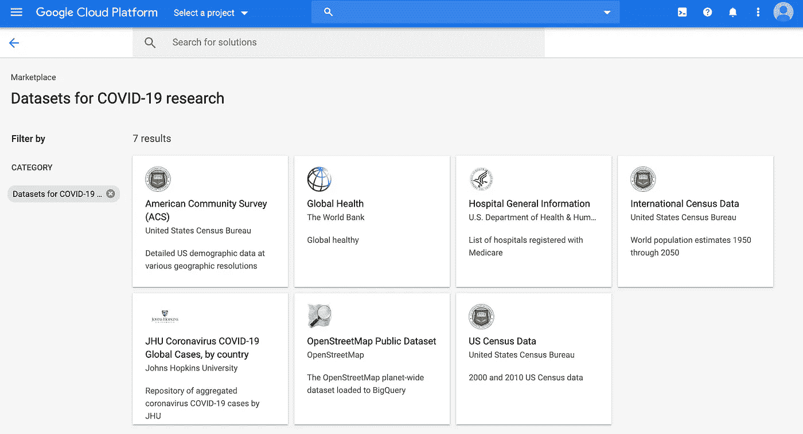*

*市场中的谷歌新冠肺炎数据集*

## *预览和查询数据*

*要预览数据集，您可以单击“查看数据集”，例如 JHU 冠状病毒新冠肺炎全球病例。*

*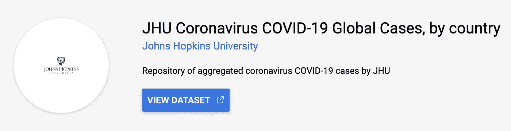*

*然后，选择一个表格并使用“预览”选项卡*

*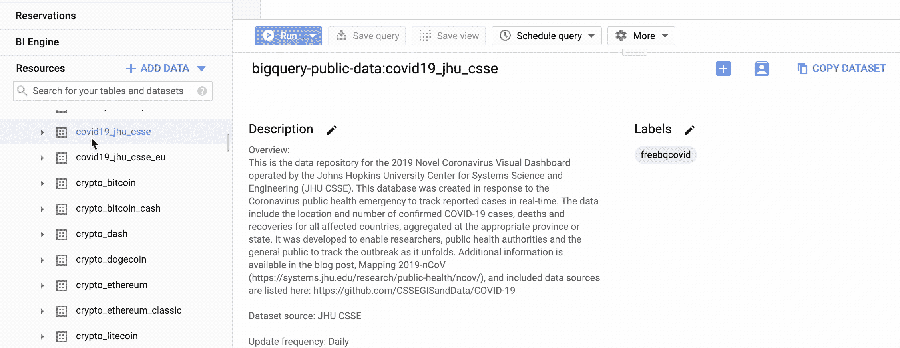*

*在 Google Cloud BigQuery 仪表板中预览数据*

*您可以使用 BigQuery 查询数据，例如查询 2020 年 3 月 31 日美国的确诊病例数*

```
*SELECT
  province_state,
  confirmed,
FROM
  `bigquery-public-data.covid19_jhu_csse.summary` 
WHERE
  country_region = "US"
  AND date = '2020-03-31'
ORDER BY
  confirmed desc*
```

*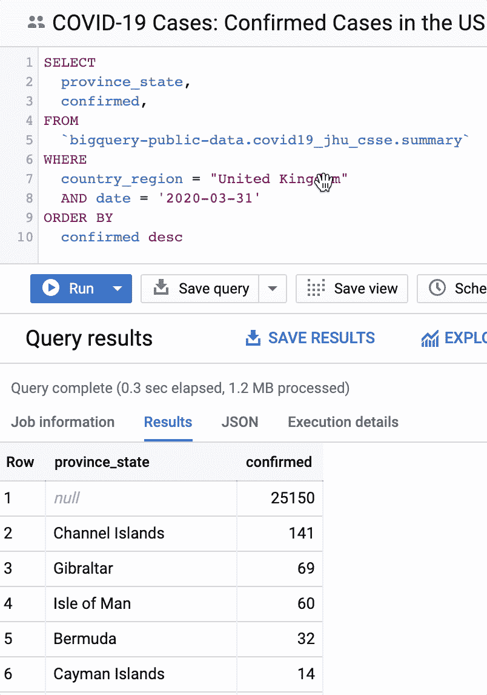*

*BigQuery 查询 2020 年 3 月 31 日美国确诊病例数*

## *数据集快速概述*

*所有的数据都很长，不可能提供所有数据的预览。相反，我会给你一个数据集包含的内容的快速概述。希望这可以节省你一些时间，加快你的数据探索。*

***1。** [**新冠肺炎数据来自约翰·霍普金斯系统科学与工程中心**](https://console.cloud.google.com/marketplace/details/johnshopkins/covid19_jhu_global_cases)*

*数据集: **covid19_jhu_csse***

*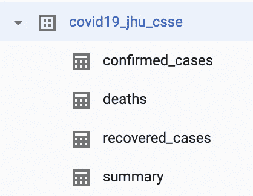*

*这是由约翰霍普金斯大学系统科学与工程中心(JHU CSSE)运营的 2019 年新型冠状病毒[视觉仪表板](https://www.arcgis.com/apps/opsdashboard/index.html#/bda7594740fd40299423467b48e9ecf6)的数据仓库。该数据库是为应对冠状病毒突发公共卫生事件而创建的，用于实时跟踪报告的病例。这些数据包括所有受影响国家的确诊新冠肺炎病例、死亡和康复的地点和数量，在适当的省/州汇总。它的开发是为了使研究人员、公共卫生当局和公众能够跟踪疫情。更多信息可在博客帖子 [Mapping 2019-nCoV](https://systems.jhu.edu/research/public-health/ncov/) 中找到，包含的数据源在[此处](https://github.com/CSSEGISandData/COVID-19)列出。*

***2。** [**美国社区调查**](https://console.cloud.google.com/marketplace/details/united-states-census-bureau/acs)*

*数据集:**人口普查局 acs***

*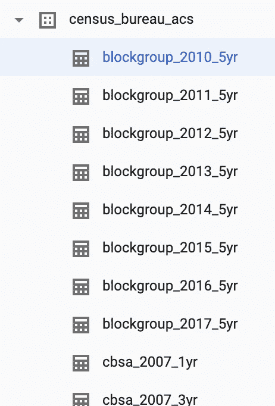*

*美国社区调查(ACS)提供了非常详细的美国人口统计信息，这些信息是在不同的地理级别上汇总的。通过 ACS，我们可以更多地了解工作和职业、教育程度、退伍军人、人们是拥有还是租用他们的房子以及其他话题。政府官员、规划者和企业家利用这些信息来评估过去和规划未来。欲了解更多信息，请参见人口普查局的美国癌症学会信息指南。*

***3。** [**OpenStreetMap 公共数据集**](https://console.cloud.google.com/marketplace/details/openstreetmap/geo-openstreetmap)*

*数据集: **geo_openstreetmap***

*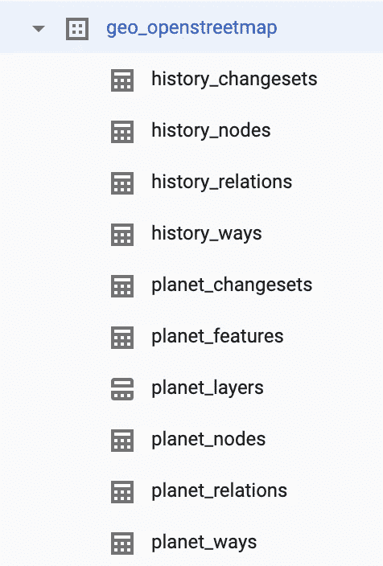*

*OpenStreetMap (OSM)是一个合作项目，创建一个免费的可编辑的世界地图。该地图包括医疗保健提供者的位置。OSM 本身是由志愿者生产的公共产品，数据质量没有保证。*

***4。** [**医院一般信息来自美国卫生与公众服务部**](https://console.cloud.google.com/marketplace/details/hhs/hospital-general-information)*

*数据集: **cms_medicare***

*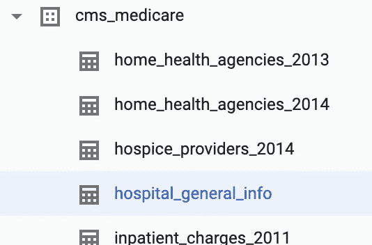*

*该数据表包含所有已注册医疗保险的医院列表。该列表包括地址、电话号码、医院类型和护理质量信息。我们为全国超过 4，000 家通过 Medicare 认证的医院提供护理质量数据，其中包括超过 130 家退伍军人管理局(VA)医疗中心。您可以使用这些数据来查找医院，并比较它们的护理质量。*

***5。** [**来自世界银行的全球卫生数据集**](https://console.cloud.google.com/marketplace/details/the-world-bank/global-health)*

*数据集:**世界银行 _ 卫生 _ 人口***

*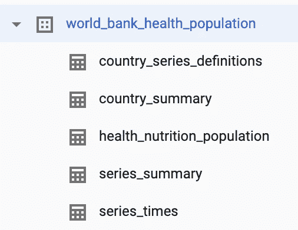*

*该数据集结合了各种来源的关键卫生统计数据，提供了全球卫生和人口趋势的概况。它包括来自 200 多个国家的营养、生殖健康、教育、免疫和疾病方面的信息。*

*6。 [**国际人口普查数据**](https://console.cloud.google.com/marketplace/details/united-states-census-bureau/international-census-data) **:***

*数据集:**人口普查局国际***

*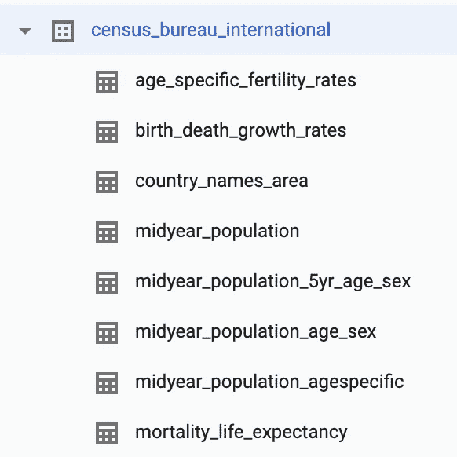*

*国际人口普查数据集提供了自 1950 年以来的国家人口估计数和到 2050 年的预测数。具体而言，该数据集包括按出生时年龄和性别划分的年中人口数字。此外，还提供了生育率、出生率、死亡率和移民率等属性的时间序列数据。*

*7 .**。** [**美国十年一次的人口普查数据**](https://console.cloud.google.com/marketplace/details/united-states-census-bureau/us-census-data)*

*数据集:**人口普查局美国***

*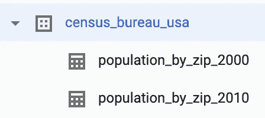*

*美国人口普查数据集包括 2000 年和 2010 年人口普查的全国人口计数。使用邮政编码列表区(ZCTAs)和大地水准面将数据按性别、年龄和位置分类。ZCTAs 是邮政编码的一般化表示，通常(但不总是)与一个地区的邮政编码相同。大地水准面是数字代码，用于唯一标识人口普查局为其制表的所有行政、法律和统计地理区域。大地水准面有助于将普查数据与其他普查和调查相关联。*

# *帮助更好地了解冠状病毒*

*当前的疫情已经推动数据科学家和人工智能公司采取行动，帮助设计治疗方法。随着越来越多的公开数据集，机器学习有很大的潜力来帮助争论和获得洞察力。*

*大概就是这样。感谢阅读。**