# 用于数据科学工作的谷歌云虚拟机

> 原文：<https://towardsdatascience.com/google-cloud-virtual-machine-for-data-science-work-7622579c5b0d?source=collection_archive---------54----------------------->

## 关于如何使用谷歌云控制台为 Python 数据科学工作设置一个带有 JupyterLab 环境的免费虚拟机的快速指南。

在 [Unsplash](https://unsplash.com/s/photos/cloud?utm_source=unsplash&utm_medium=referral&utm_content=creditCopyText) 上由 [Clyde RS](https://unsplash.com/@imclyde?utm_source=unsplash&utm_medium=referral&utm_content=creditCopyText) 拍摄的照片

在你的数据科学生涯中，迟早会有一天，你的计算机不再支持你。对于计算量特别大的任务，您可能需要强大的处理能力，或者您可能希望并行运行许多脚本。如果发生这种情况，你有两个选择:你可以投资一台更快的电脑，或者你可以使用云服务。亚马逊、微软和谷歌都有各自的虚拟机产品，所以你有大量的产品可供选择。

在这篇文章中，我将向你展示如何在 Google Cloud 上设置一个虚拟机，并且已经预装了 JupyterLab。这只需要几分钟，一旦完成，您就可以利用云机器的强大功能来进行 Python 数据科学工作了！

## 开始之前

*   **你需要什么**:一个谷歌账户。
*   **不需要的东西**:关于使用终端、在 Linux 中导航等知识。我们将使用谷歌云控制台。
*   **花费多少**:截至 2020 年 4 月，当您第一次设置您的机器时，您将获得价值 300 美元的信用点数，可以免费使用 12 个月。根据您如何配置您的机器，这个数量应该持续一段时间。你可以在这里阅读更多关于演职员表的信息:[https://cloud.google.com/free/docs/gcp-free-tier](https://cloud.google.com/free/docs/gcp-free-tier)

## 帐户设置

首先，转到[http://console.cloud.google.com/](http://console.cloud.google.com/)，如果您没有自动登录，请输入您的 Google 帐户名&密码。

这是您应该在弹出窗口中看到的内容:

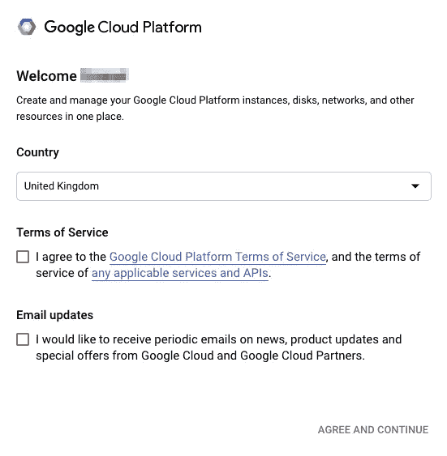

选择您的国家，然后点击同意并继续。找到屏幕顶部的免费试用按钮:

您应该会被导航到一个窗口，在这里您可以输入您的信用卡详细信息。总的来说，我们应该小心这个系统:

*   您可以配置每月花费超过 10，000 美元的机器，
*   不运行机器并不能让你完全安全，因为你还要为存储付费。

在这一点上，你应该是安全的，你会看到一条消息，告诉你如何不会自动收费，即使当你的信用用完。(我还没到那一步，所以不能确认确实如此。)

## 项目设置

首先，你需要一个项目。在屏幕顶部，点击谷歌云平台旁边的区域，(如果你在这篇文章中向下滚动一点，在第二个截图中，你会看到“vmtesting”，这是目标区域，它将为你空着)，然后点击新项目。您应该会看到这样一个窗口，只需输入您的项目名称，然后单击 Create:

现在，您应该会看到您的新项目在左上角被选中:

请注意，屏幕上显示的是空的小部件，因为到目前为止，您的项目基本上是空的。

**实例设置**

您已经建立了项目，现在您需要一个虚拟机。

点击左上角的导航菜单，向下滚动到人工智能部分，然后点击笔记本。

您应该看到一个空列表，您还没有实例，所以单击 New Instance。有几个选项，如果您正在使用神经网络，可以选择 Tensorflow 版本之一，XGBoost 有一个单独的配置，等等。我们现在用基本的 Python，它将会有熊猫和 scikit-learn。

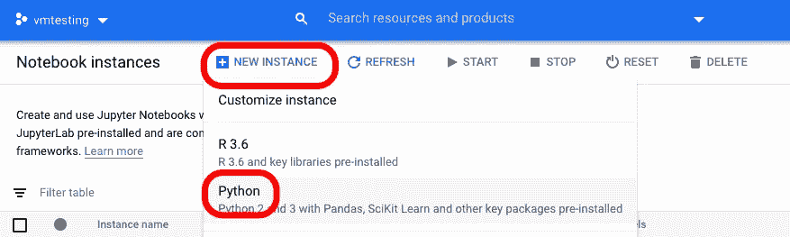

单击 Python 后，您应该会看到一个包含虚拟机配置的弹出窗口。如果您向下滚动，您应该会看到该机器的估计成本。您可以单击“Create ”,也可以单击“Customize”来调整一些设置，我们现在就要这样做了。

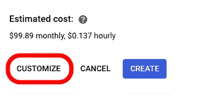

在页面的顶部，您应该看到实例的名称和区域。这些设置没多大关系，最便宜的地区会被自动选中，你可以保留它们。这样就不用换到实际位置了。

您可以在机器上更改的最重要的事情可能是机器配置下的处理能力:

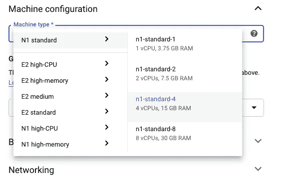

n1-standard-4 是默认选择，有 4 个 CPU。这完全取决于你需要什么，你可以一直使用最低的设置，如果你发现它太慢或者你意识到你需要更多的内存，你可以增加它。如果您正在运行许多并行任务，例如使用 GridSearchCV 进行超参数优化，那么多个 CPU 非常有用。scikit-learn 中可以并行化的一个很好的指标是它们是否有一个`n_jobs`参数。

当您进行更改时，您可以在屏幕右侧看到估计成本的变化，将机器更改为最低设置会降低价格:

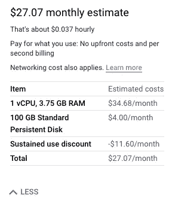

您可能想要更改的另一个设置是磁盘空间。根据帮助文本，只对您正在使用的部分收费。

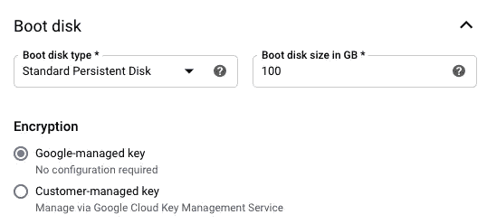

还有额外的设置，如网络等，我没有改变它们。如果你对你的设置满意，点击底部的创建。加载一段时间后，您应该会在屏幕上看到以下内容:

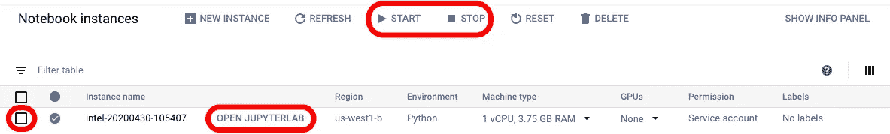

此时，您的虚拟机正在运行。如果您想要停止它，请通过单击实例旁边的框来选择它，然后单击顶部栏中的 stop 按钮。这也是您稍后返回时可以启动实例的地方，以及如果您不再需要它时如何删除它。

可以点击打开 JupyterLab 开始工作！

## 在 JupyterLab 工作

在你点击打开 JupyterLab 之后，一个新的标签会在你的浏览器中打开，带有 JupyterLab 设置。

在右侧，您只需点击笔记本图标即可在 Jupyter 笔记本中工作:

虚拟机预装了一些广泛使用的库，如 scikit-learn，但您可能需要其他库。如果是这样的话，你可以简单地使用`pip`，只需在笔记本上输入`!pip install <library>`，将`<library>`改成你需要的任何东西。

如果您想连接到现有的 GitHub 存储库，您可以很容易地做到这一点。在左侧，你可以看到你的机器的文件夹结构，应该是空的，除了一个教程文件夹，你可以检查有用的提示。您可以在这里创建新文件夹、上传文件、在文件结构中导航等。要克隆一个存储库，您可以单击 Git 图标:

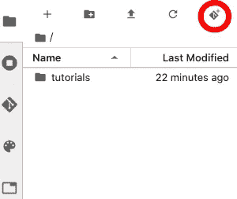

并复制回购的网址。

现在，您可以在虚拟机中处理您的文件。要推回到 GitHub，您可以通过点击垂直面板中的 Git 图标来打开平台的内置功能:

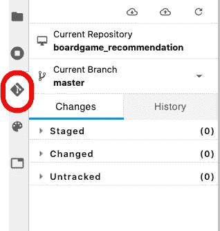

我发现在 JupyterLab 环境中使用终端更方便，在启动窗口的底部，使用标准的`git`命令:

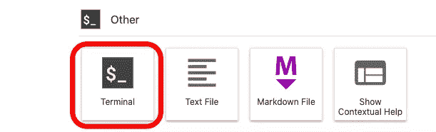

在我的虚拟机上使用 GitHub 时，我遇到了一个问题:如果你使用大文件存储功能来上传比如说大的`csv`文件，这些文件将无法正常工作。您将看到类似这样的内容:

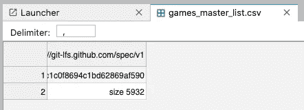

应该有一个解决办法，但我只是手动将文件分别上传到机器上。

最后，也许是最重要的一步:**确保在不需要的时候关闭机器**。使用 JupyterLab 关闭浏览器窗口，返回到笔记本实例，选择您的实例，然后单击 Stop 按钮。

**如何查看自己的积分**

要查看您还剩多少免费点数，请转到左侧的导航面板，然后单击“计费”:

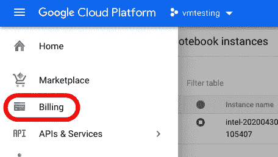

在屏幕的右侧，有一个显示您剩余学分的图表:

在每个月的第一天，您会收到一张发票，上面详细列出了您每月的费用。请注意，有些费用可能会让您感到惊讶，例如，我不知道还有单独的静态 Ip 费用。但这就是免费学分的用途:去实验！

**其他选项**

到目前为止，我们已经介绍了基础知识，我认为这应该足够让您入门了，但是您还可以使用许多其他功能。对于某些任务，比如为图像识别而训练的神经网络，你可能需要在你的机器上增加一个 GPU。但是，您将无法使用默认计划做到这一点，您需要首先更改您的配额。

为此，请转到导航面板，在 IAM & Admin 部分中查找配额。

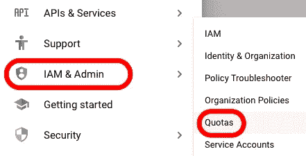

搜索 GPU，将你的配额从 0 增加到 1。

但是请注意，当我这样做并更新我的帐户时，我收到一条消息，说一旦我的免费点数用完，我将不再收到确认请求，我将自动被收费。

## 文件和参考资料

我希望你觉得有用。

谷歌云有非常广泛的文档供你研究。

如果你想自己设置你的机器，而不是依赖预先设置的配置，你可以看看这个[有用的帖子](/running-jupyter-notebook-in-google-cloud-platform-in-15-min-61e16da34d52)。