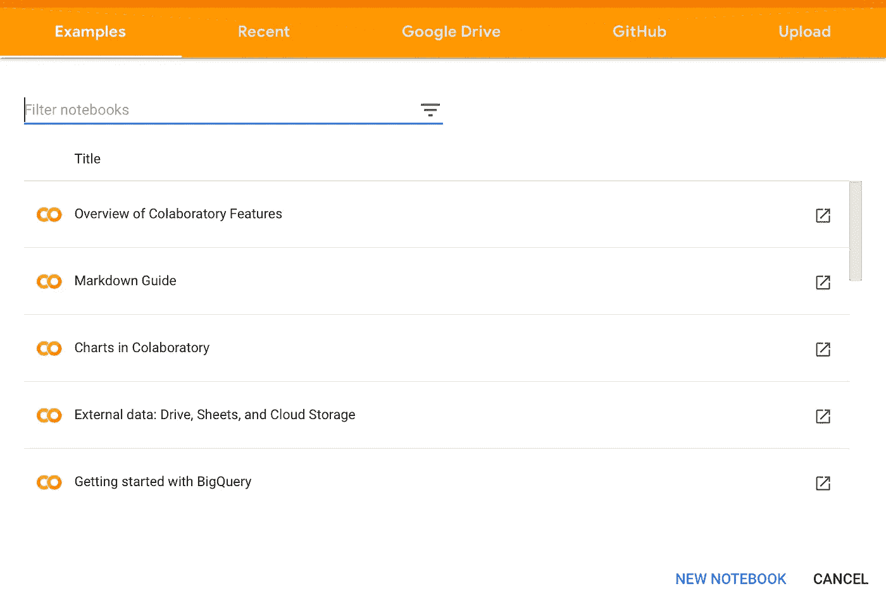
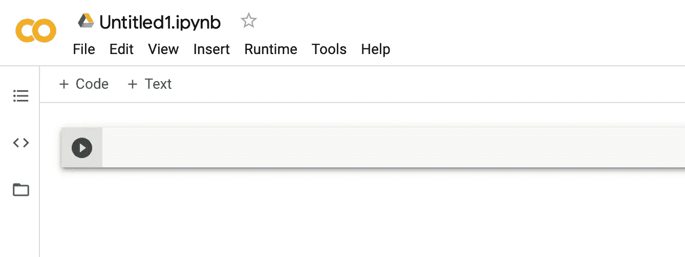
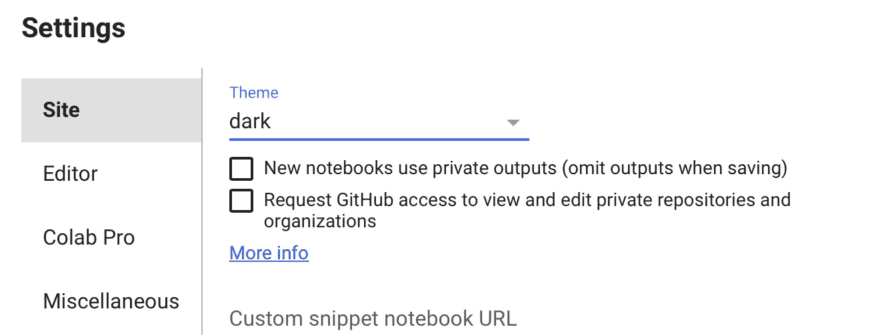
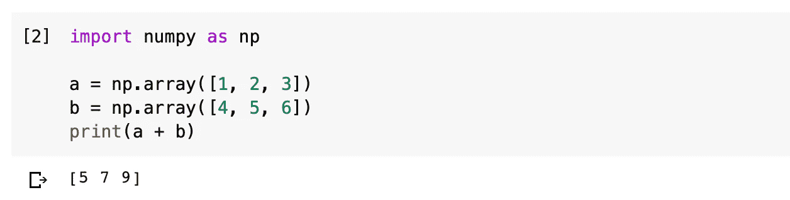
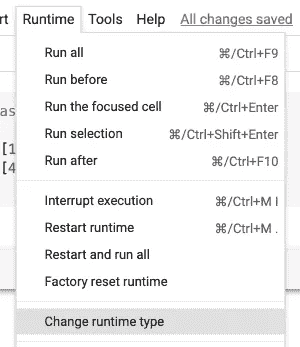
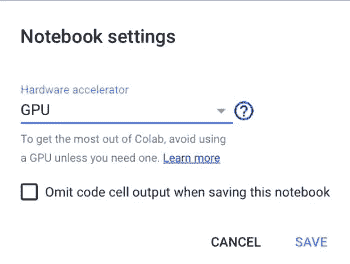
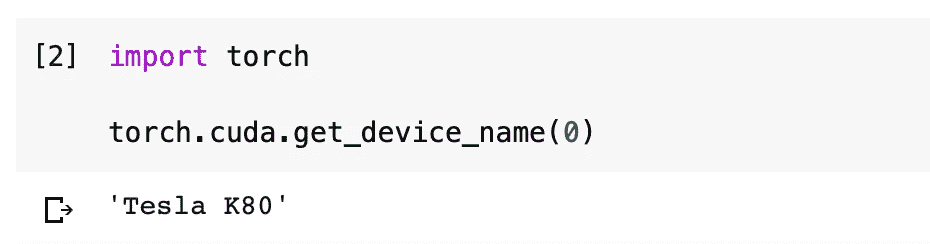
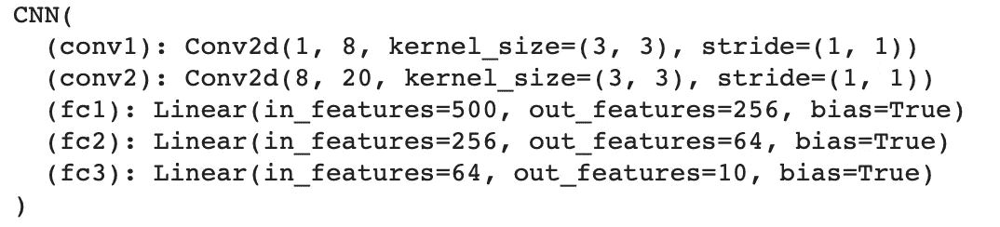
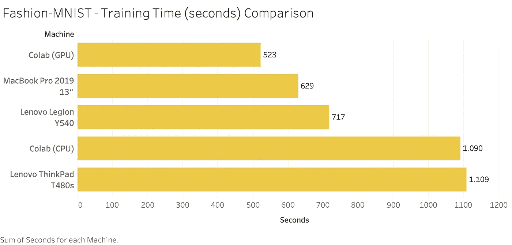

# Google Colab:它与支持 GPU 的笔记本电脑相比如何？

> 原文：<https://towardsdatascience.com/google-colab-how-does-it-compare-to-a-gpu-enabled-laptop-851c1e0a2ca9?source=collection_archive---------4----------------------->

## Colab 简介、运行时、性能比较…以及疑难解答

如果你没有生活在岩石下，你很有可能使用过或者至少听说过[Google co laboratory](https://colab.research.google.com)——一个基于云的笔记本环境，让你在 Google Drive 中编写、执行和共享代码。

但是**和我们都熟悉并深入了解的【Jupyter Lab 相比如何呢？敬请期待一探究竟。**

如果你对 Colab 一无所知，这里有几个要点可以帮助你步入正轨:

*   **相当于 JupyterLab**——做了一些调整
*   **由 Google 托管** —笔记本自动保存到 Google Drive
*   **免费访问 GPU**(图形处理单元)**和 TPU**(张量处理单元)
*   **专为数据科学打造** —绝大多数数据科学库都是预装的

因此，仅仅通过查看这些要点，听起来似乎是一笔不错的交易，但让我们把这种说法留到最后——因为只有到那时，我们才能利用数据做出结论。

这篇文章的结构如下:

1.  创建笔记本
2.  运行时环境
3.  性能比较
4.  判决

所以事不宜迟，我们开始吧！

# 创建笔记本

这个过程再简单不过了——直接去[**colab.research.google.com**](http://colab.research.google.com)。如果你登录到你的谷歌账户，会弹出这样一个窗口:

现在，您可以通过点击模式窗口右下角的**新笔记本**按钮来创建新笔记本。几秒钟后，你会看到一个熟悉的屏幕:

如果你不喜欢默认的灯光主题，你可以很容易地改变它。只需进入**工具—设置**，在那里会弹出这个模式:

主题默认设置为**亮**，如果你愿意的话可以改成**暗**，点击**保存**。我真的很喜欢黑色主题，但浅色主题更适合这篇文章，所以我会坚持下去。

在单元格中，您现在可以简单地导入您需要的任何库并开始工作。大多数库都是预装的，所以少了一件需要担心的事情。为了演示，让我们导入 Numpy 并做一些快速数组添加:

很好，这里没有什么新的东西，但它仍然是一种验证一切正常工作的有效方法。

现在，我非常怀疑您会使用 Colab 来处理 Numpy(除非您正在处理一个马铃薯)，所以在下一节中，我们将简要地探索您可以使用的各种**运行时**。

# 运行时环境

Colab 主要用于处理 GPU 密集型任务——比如训练深度学习模型。这是它背后的基本思想——每个人都可以访问 GPU 或 TPU。

因此，让我们快速探索如何切换到 GPU/TPU 运行时。只需转到**运行时**选项卡，选择**更改运行时类型**:

像这样的模态窗口会弹出，在这里你可以从*无*切换到更合适的:

我已经选择了 GPU。几秒钟后，GPU 将分配给你，如果可用。我们可以用任何深度学习库来验证这一点，我将使用 **PyTorch** :

现在，不能保证你会得到和我一样的 GPU，所以请记住这一点。

好了，你现在已经熟悉了 Google Colab，那么在下一节中，我们将把它的性能与我的一堆笔记本电脑进行比较，同时也与 Google Colab 的 CPU 运行时进行比较。

# 性能比较

为了进行快速的性能测试，我决定使用 PyTorch 库在**时尚-MNIST** 数据集上进行训练。该模型具有以下架构:

所以这里没有什么特别的，大约 15 万个可训练参数(权重和偏差)需要优化。除了 Google Colab，我还会使用我目前拥有的三台笔记本电脑:

*   **联想 ThinkPad T480s:** 英特尔 i7–8550 u @ 1.8 GHz，16GB 内存
*   **联想军团 Y540:** 英特尔 i5–9300h @ 2.4 GHz，Nvidia GeForce 1650 4GB，16GB RAM
*   **MacBook Pro 2019 13":** 英特尔 i5-QC @ 1.4 GHz，8GB 内存

***最后一个说明:*** model 是为 ThinkPad 和 MacBook Pro(显然)在 CPU 上训练的，而为联想军团在 GPU 上训练的。在 Google Colab 上，我在第一个笔记本上使用了 CPU 运行时，在第二个笔记本上使用了 GPU 运行时。

让我们来看一个比较培训时间的快速图表:

Colab (GPU): 8 分 43 秒；MacBook Pro: 10 分 29 秒；联想军团:11:57 分钟；Colab (CPU): 18 分 10 秒，ThinkPad: 18 分 29 秒

这就是你要的——Google Colab，一个比我的支持 GPU 的联想军团笔记本电脑还快的免费服务。出于某种原因，MacBook 的表现超过了它，尽管它只有四核 1.4GHz 的 CPU。ThinkPad 作为这里最贵的设备表现最差。

现在，我们能够做出数据驱动的结论—让我们在下一节中这样做。

# 判决

玩具时尚-MNIST 数据集绝不具有足够的代表性来做出防弹结论——因为这需要更大的数据集和更多的训练周期——但我们可以得出结论，如果你没有 3000 美元的游戏电脑，谷歌可乐实验室可能是一个福音。

这里有一些**T21 的问题，比如:**

*   **运行时断开** —如果笔记本闲置一段时间，运行时将断开
*   **内存** —内存不足是有可能的
*   **依赖** —不能保证 GPU 或 TPU 会在你需要的时候可用，所以请记住这一点

即使有所有的警告，它仍然很容易推荐——至少通过使用它你的电脑不会变热——这对即将到来的夏季至关重要。

感谢阅读。

*喜欢这篇文章吗？成为* [*中等会员*](https://medium.com/@radecicdario/membership) *继续无限制学习。如果你使用下面的链接，我会收到你的一部分会员费，不需要你额外付费。*

 [## 通过我的推荐链接加入 Medium-Dario rade ci

### 作为一个媒体会员，你的会员费的一部分会给你阅读的作家，你可以完全接触到每一个故事…

medium.com](https://medium.com/@radecicdario/membership)