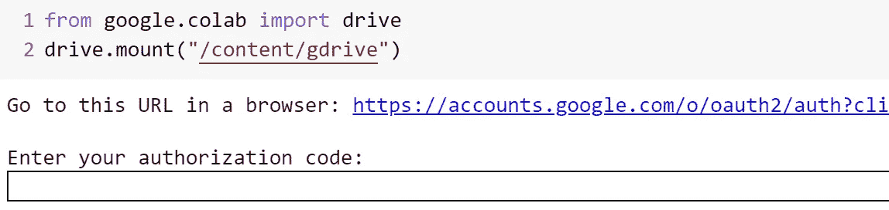
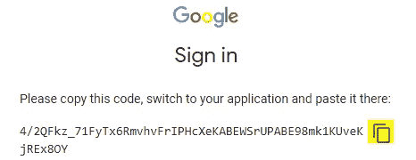
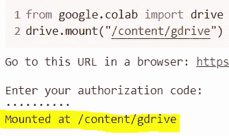
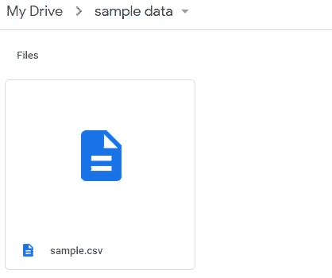
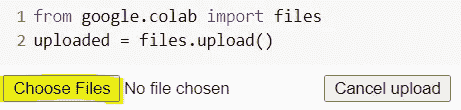
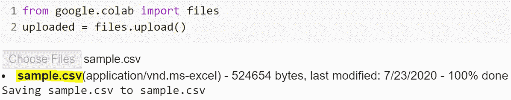

# 如何在 Google Colab 中导入和导出数据集

> 原文：<https://towardsdatascience.com/google-colab-import-and-export-datasets-eccf801e2971?source=collection_archive---------1----------------------->

## **从本地系统和 Google Drive 下载和上传 Colab 中的文件**


[帕特·惠伦](https://unsplash.com/@patwhelen?utm_source=medium&utm_medium=referral)在 [Unsplash](https://unsplash.com?utm_source=medium&utm_medium=referral) 上的照片

被称为 Colab 的 oogle Colaboratory 是一个免费的 Jupyter 笔记本环境，有许多预装的库，如 Tensorflow、Pytorch、Keras、OpenCV 等等。它是免费支持 GPU 和 TPU 的云服务之一。在 Colab 中导入数据集和数据训练模型有助于提高编码体验。我们可以应用不同的方法在 Colab 中导入和下载数据。在本教程中，我将讨论我在以下方面的经验:

1.  从 Google Drive 导入数据
2.  将数据导入和下载到本地系统

**安装 Google Drive**

我们可以通过安装谷歌硬盘来访问硬盘中的文件。将硬盘安装到 Colab 意味着将 google drive 帐户设置为虚拟硬盘，这样我们就可以像访问本地硬盘一样访问硬盘的资源。

**步骤 1** 要连接 Google Drive (GDrive)和 Colab，在 Colab 中执行下面两行代码:

```
from google.colab import drivedrive.mount("/content/gdrive")
```

运行 shell 将返回一个 URL 链接，并询问授权码:



**第 2 步**按照提到的链接，登录谷歌账户，点击高亮显示的位置复制授权码:



**第三步**将授权码粘贴到 shell 中，最后 Google Drive 会挂载到 */content/gdrive* 。注意，驱动器中的文件在文件夹*/content/g Drive/My Drive/*下。现在，我们可以使用像 Pandas 这样的库在 GDrive 中导入文件。



**步骤 4** 例如，我们在 GDrive 的 */My Drive/sample data* 文件夹中有一个数据集(sample.csv)。



执行下面两行代码会将数据导入 Colab:

```
import pandas as pdpd.read_csv('/content/gdrive/My Drive/sample data/sample.csv')
```

**从本地系统导入数据**

**步骤 1** 运行下面两行代码，从本地系统导入数据。

```
from google.colab import filesuploaded = files.upload()
```

执行 shell 将调用一个浏览按钮:



**第二步**浏览本地系统中的目录，我们可以上传数据到 Colab:



最后，我们可以使用像 Pandas 这样的库来读取数据:

```
pd.read_csv("sample.csv")
```

**将数据下载到 Google Drive 和本地系统**

假设数据集已经是 CSV 格式，我们可以通过执行以下两行代码轻松地将数据下载到本地目录中:

```
from google.colab import filesfiles.download('sample.csv')
```

通过执行下面的代码可以下载 pandas 数据帧。假设 dataframe 的名称是“sample ”,那么使用一行代码将文件保存在 Google Drive 中:

```
sample.to_csv('sample.csv')
```

最后，要下载到本地驱动器，请执行以下单行代码:

```
files.download('sample.csv')
```

作为额外的来源，你也可以阅读这个[博客](https://neptune.ai/blog/google-colab-dealing-with-files)来了解更多关于如何在 Colab 中处理文件的信息。

# 阅读默罕默德·马苏姆博士(以及媒体上成千上万的其他作家)的每一个故事。

你的会员费将直接支持和激励穆罕默德·马苏曼德和你所阅读的成千上万的其他作家。你还可以在媒体上看到所有的故事—【https://masum-math8065.medium.com/membership】

**快乐阅读！**