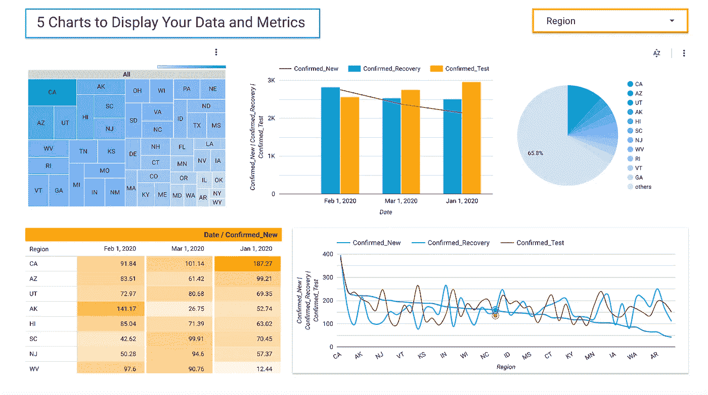
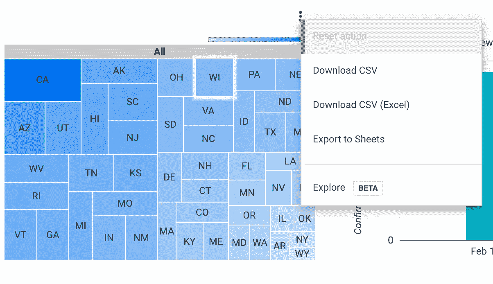
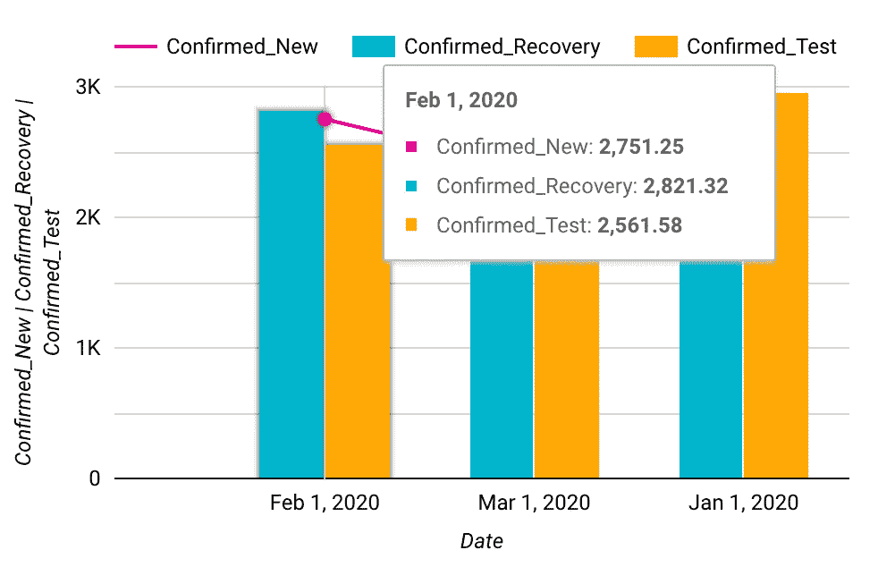
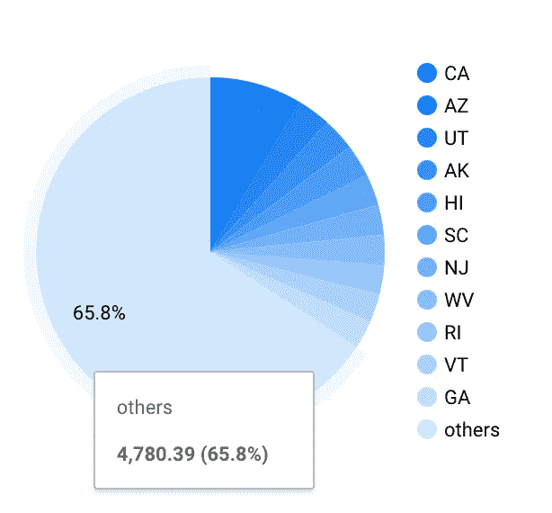
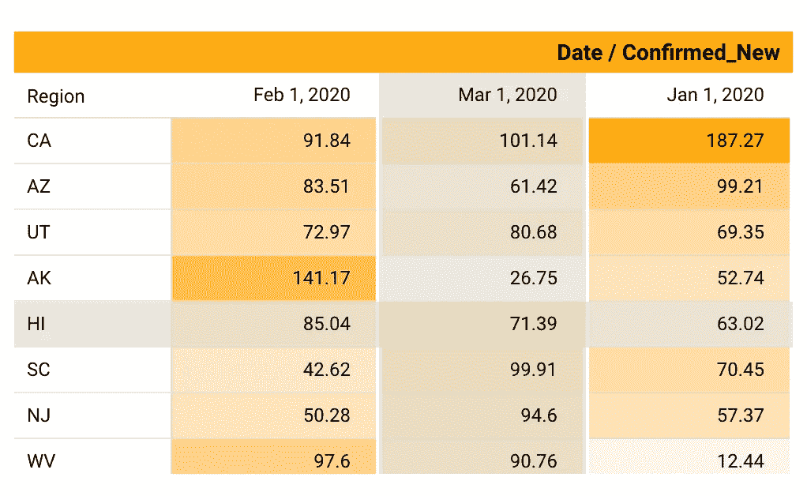
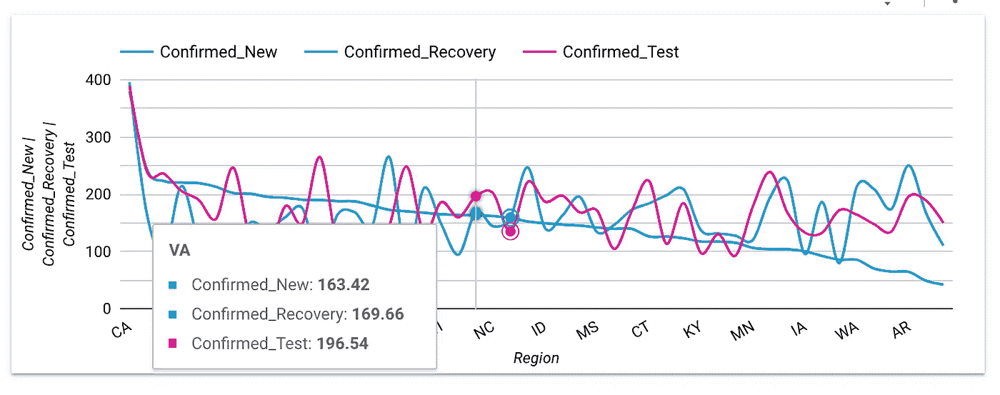

# 谷歌数据工作室:可视化数据的 5 个图表

> 原文：<https://towardsdatascience.com/google-data-studio-5-charts-for-visualizing-your-data-6d0a98422f47?source=collection_archive---------24----------------------->

## 数据科学控制面板主要图表的详细概述

一个虚拟数据的示例，描绘了在一个仪表板上编译的 5 个流行图表。作者在[Google Data Studio](https://datastudio.google.com/)【1】上截图。

# 目录

1.  介绍
2.  关于数据集
3.  树形图
4.  堆积组合图
5.  圆形分格统计图表
6.  带有热图的数据透视表
7.  平滑折线图
8.  结论
9.  参考

# 介绍

本文是万物教程系列的一部分[谷歌数据工作室](https://datastudio.google.com/) (GDS) [1]。这个系列的第一篇文章可以在这里找到【2】。作为 GDS 系列的第二部分，本教程将介绍特定类型的可视化。对于每个图表，都有可变的维度、度量、排序、日期范围、交互和样式菜单。除了这些图表，还有您可以添加的文本，以及数据和过滤控件。下面用于本教程和图表突出显示的数据集有一个过滤器控件，用于显示某些类别而不是其他类别。如果您想要放大或缩小数据，日期范围过滤器(也包含一个下拉菜单)会很有用。这些功能中最好的部分是，当您在仪表板视图中编辑过滤器时，数据也随之调整，并带有相应的图表。

# 关于数据集

数据集是在谷歌表单中创建的虚拟数据。它是为了模拟 2020 年冠状病毒疫情数据集的类似领域而开发的。这些字段包括日期、区域、记录计数和虚拟类别。当遵循本教程时，不同的数据集，如真实的[冠状病毒数据集](https://www.kaggle.com/sudalairajkumar/novel-corona-virus-2019-dataset) [3]只能用于教育和学术研究目的。

# 树形图

树形图是可视化你的维度空间的极好方式。最适合用于分类数据，该图表通过增加或减少您选择的指标的大小来工作。例如，下图不仅描述了最具影响力的数据类别的大小，还添加了一个热图图层，有助于强调某些类别。这个图表的另一个有用的特性是，一旦进入仪表板模式，树形图中使用的数据可以通过多种方式下载。

GDS 的树形图，后面是它的下拉菜单。作者在[Google Data Studio](https://datastudio.google.com/)【1】上截图。

# 堆积组合图

堆叠组合图很有用，因为它结合了流行的条形图和分层的折线图。如果您想描述两个相似的指标，同时在一条线上分层以示强调，这个图表很好。除了多层方法之外，还可以通过将鼠标悬停在特定日期范围上来描述数据。

堆叠组合图及其悬停菜单。作者在[Google Data Studio](https://datastudio.google.com/)【1】上截图。

# 圆形分格统计图表

饼图及其悬停菜单。作者在[谷歌数据工作室](https://datastudio.google.com/)【1】上的截图。

虽然饼状图似乎是旧闻，但在 GDS，规格的数量似乎是无穷无尽的。例如，对于选择绘制图表的指标，GDS 大多数图表中使用的排序方法，可以显示不同的聚合。一些聚合包括总和、平均值、计数、非重复计数、最小值、最大值、中值、标准差和方差。一旦选择了一种分类，你就可以决定是降还是升你的数据。在下面的饼图中，我选择只使用一种颜色渐变，但你可以很容易地切换到多色不同的效果。

# 带有热图的数据透视表

在 GDS，一般的数据透视表实际上有 3 个子层面:数据透视表、带条的数据透视表和带热图的数据透视表。使用您的维度作为索引，日期范围作为列，指标将是最小值和最大值以热图形式着色的值，以显示您的指标的重要性(这种效果有点类似于 Excel 中的条件格式，但可以显示渐变)。

带有热图的数据透视表。作者在[谷歌数据工作室](https://datastudio.google.com/)【1】上的截图。

# 平滑折线图

平滑折线图通常用于显示时间序列，但我想展示分类数据是如何表达的。在下图中，地区(美国各州)在 X 轴上，而指标值在 Y 轴上，所有指标都以各自的颜色绘制。我相信这张图表是 GDS 所能提供的最好的图表之一，因为它能显示来自你的数据的各种信息。下面，您可以看到分类数据和数字数据，同时相互比较。

平滑的折线图及其悬停菜单。作者在[Google Data Studio](https://datastudio.google.com/)【1】上截图。

# 结论

GDS 有大量不同的可视化工具来描述你的数据和指标。事实证明，它们是展示您的探索性数据分析的有用方法，同时也是展示您的即席数据科学指标的有用方法。本教程是 GDS 系列的一部分，如果你对本系列的后续文章有任何问题或特殊要求，请在下面评论。

# 参考

我的 Google Data Studio 仪表板是使用虚拟数据集创建的。要素/字段/列也是虚拟属性。这些图片是我自己的 GDS 仪表板截图。我的仪表板截图中显示的数据和指标不得用于任何医疗目的。它是静态的、非真实的，并且不依赖于准确性。它纯粹是为了教程的目的而开发的。

[1] M.Przybyla，[谷歌数据工作室](https://datastudio.google.com/) (2020)

[2] M.Przybyla，[谷歌数据工作室教程简介](/google-data-studio-tutorial-intro-25dd10d05be0) (2020)

[3] K.Sudalairaj，[新型冠状病毒 2019 年数据集](https://www.kaggle.com/sudalairajkumar/novel-corona-virus-2019-dataset) (2020)