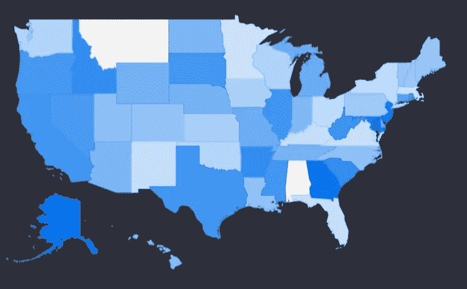
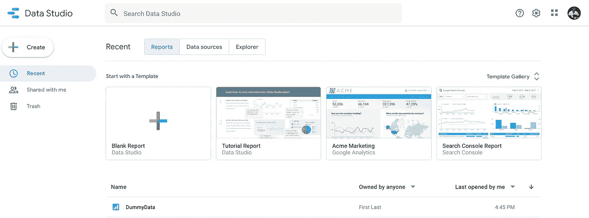
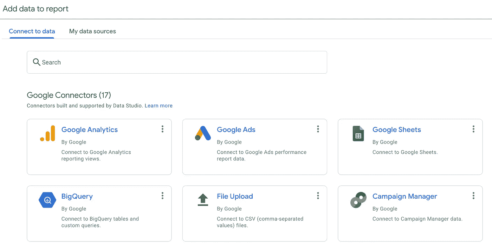
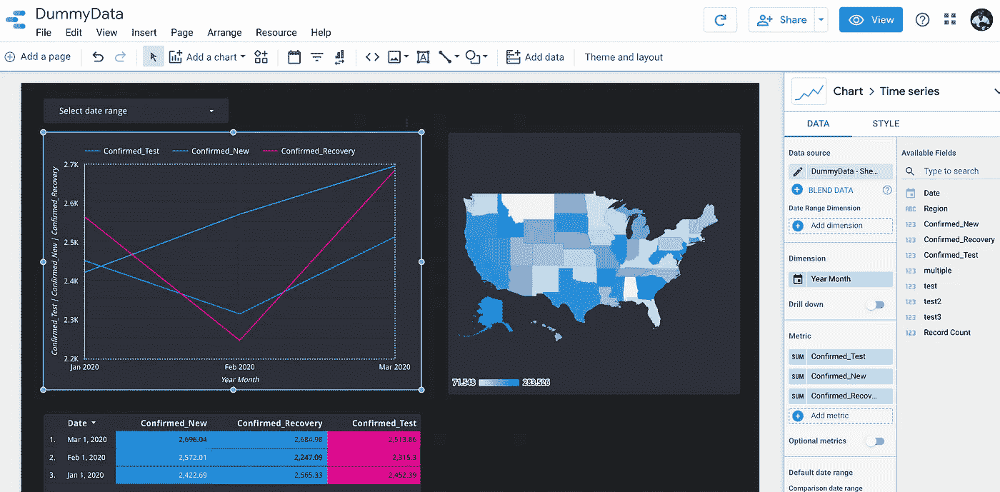

# 谷歌数据工作室教程简介

> 原文：<https://towardsdatascience.com/google-data-studio-tutorial-intro-25dd10d05be0?source=collection_archive---------39----------------------->

## 数据科学家可视化其探索性数据分析的方法

使用 geo map 功能描述美国各州记录计数的虚拟数据示例。作者在[Google Data Studio](https://datastudio.google.com/)【1】上截图。

# 目录

1.  谷歌数据工作室是什么？
2.  为什么对数据科学家有好处？
3.  关于数据集
4.  我如何开始观想(教程)？
5.  警告
6.  结论
7.  参考

# 谷歌数据工作室是什么？

[谷歌数据工作室](https://datastudio.google.com/) (GDS) [1]是一个免费的、易于使用的平台，用于可视化地描述你的数据。与直接编写 Python 代码或使用 Tableau 许可相比，它有许多优点和好处。

*   这很有价值
*   它是互动的
*   有黑暗模式
*   它免费、简单、快捷
*   你不需要执照
*   它可以通过实时连接进行更新
*   它不仅可以用于 EDA，还可以用于模型性能度量
*   您可以与不需要知道如何下载 Jupyter 笔记本的非技术用户共享此仪表板
*   你不需要依赖 Python 代码；但是，您可以使用他们的 GDS 语言创建新字段，这与 Excel 非常相似

# 关于数据集

数据集是在谷歌表单中创建的虚拟数据。它是为了模拟 2020 年冠状病毒疫情数据集的类似领域而开发的。这些字段包括日期、区域、记录计数和虚拟类别。当遵循本教程时，一个不同的数据集，如真实的[冠状病毒数据集](https://www.kaggle.com/sudalairajkumar/novel-corona-virus-2019-dataset) [2]只能用于教育和学术研究目的。

# 为什么对数据科学家有好处？

GDS 是 Python 编码和 Tableau 的独特替代品。这是一种在开发数据科学和机器学习模型之前和之后可视化数据的简单方法。今天，我们将探讨使用前，展示 GDS 如何对您的 EDA 产生积极影响，同时还可以执行临时分析。这种类型的仪表板的一个示例包括来自您的模型的度量，可能是准确性、计数、警报、置信度得分的聚合以及模型预测的趋势。

# 我如何开始观想(教程)？

1.  *创建新报告*

从模板开始，或通过单击空白报告创建新的仪表板。这些模板非常适合启发如何构建您的仪表板，但由于它们使用预定义的数据集，可能很难用您的数据模拟可视化效果。我建议从空白报告开始，如下面的彩色加号所示。

主页包括新的报告和模板。作者在[Google Data Studio](https://datastudio.google.com/)【1】上截图。

2.*连接您的数据*

有各种各样的连接可以利用，这将是您的数据分析的基础。把这一部分想象成把一个 CSV 文件作为熊猫数据帧读入你的 Jupyter 笔记本。上传数据最简单的方法是执行文件上传。正如你在下面看到的，有 17 种可能的连接形式。一个非常有用的数据上传技巧是，如果你连接到一个实时数据源，如 Google Analytics 或 BigQuery，你也可以实时显示你的 GDS 仪表板。

以多种方式连接到您的数据。作者在[谷歌数据工作室](https://datastudio.google.com/)【1】上的截图。

3.*可视化您的数据*

与 Tableau 类似，GDS 允许您组织源自表格格式数据的维度和指标。在 GDS，有数不清的方法可以用几个图表来形象化。图表包括:

*   表格、记分卡、时间序列、条形图、饼图、地理图、折线图、面积图、散点图、数据透视表、项目符号和树形图。

您开发的可视化效果可以通过操纵视觉形状上的点来缩放。轴也可以根据您的喜好轻松编辑。还可以显示表格式数据的颜色编码表示，这可以突出显示字段中较大或较小的值。与 Excel 中的条件格式类似，这种方法在 GDS 中比手写代码更容易执行。要了解更多关于具体特性以及它们如何随着时间的推移而变化，有一个论坛，有用的答案显示在这里[这里](https://support.google.com/datastudio?hl=en&authuser=0#topic=6267740)。

仪表板的主页。可以对可视化效果进行拖放、调整大小和编辑。作者在[Google Data Studio](https://datastudio.google.com/)【1】上截图。

# 警告

有哪些主要的含义？

对于任何数据科学或数据分析工具，充分了解聚合函数至关重要。例如，您的数据中有一些指标可以通过多种方式可视化，即使它们来自相同的来源:总和、平均值、计数、不同计数、最小值、最大值、中值、标准偏差和方差。缺点是你可能有一个你认为你理解的数字，但是当有一个度量的自动设置时，你可能描绘不同的集合信息。这些变化可以被证明是一种优势，因为它们可以快速显示通常在 SQL 或 pandas 库代码中使用 Python 计算的指标，但速度要慢得多。

# 结论

数据科学家、数据工程师、业务分析师和机器学习工程师可以利用各种工具。有些更贵，有些可能太复杂，同时也很耗时。GDS 帮助你，让更多的时间与建模，因为 EDA 过程被缩短和简化。另一个好处是一种快速可靠的可视化模型性能指标的方法。GDS 可能不适合所有人，但它是一种通过充分了解您的数据并能够直观地证明它来给利益相关者留下深刻印象的可靠方法。

# 参考

我的 Google Data Studio 仪表板是使用虚拟数据集创建的。要素/字段/列也是虚拟属性。这些图片是我自己的 GDS 仪表板截图。我的仪表板截图中显示的数据和指标不得用于任何医疗目的。它是静态的、非真实的，并且不依赖于准确性。它纯粹是为了教程的目的而开发的。

[1] M.Przybyla，[谷歌数据工作室](https://datastudio.google.com/) (2020)

[2] K.Sudalairaj，[新型冠状病毒 2019 年数据集](https://www.kaggle.com/sudalairajkumar/novel-corona-virus-2019-dataset) (2020)