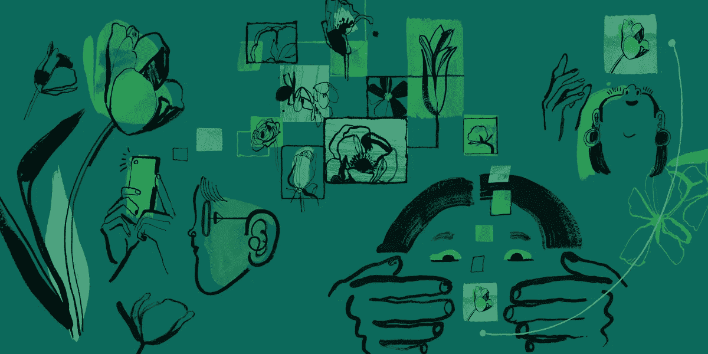
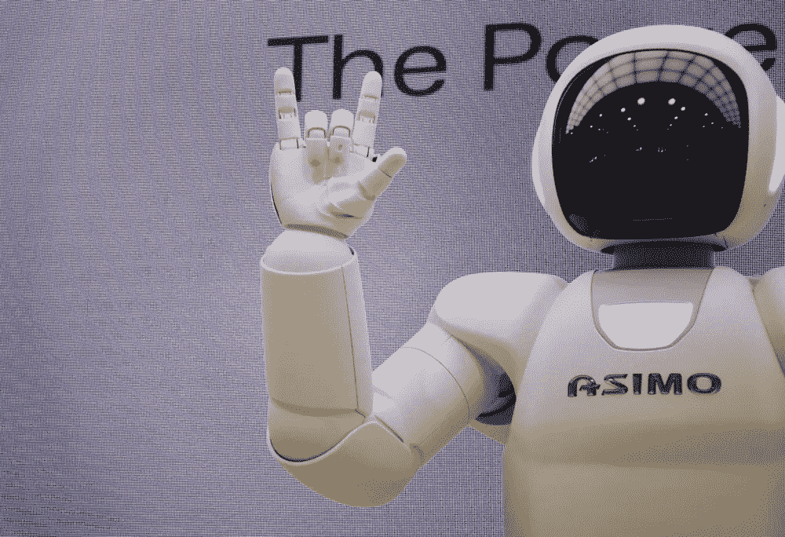

# 创业公司需要问的关于人工智能的三个问题

> 原文：<https://towardsdatascience.com/google-expert-tips-for-artificial-intelligence-startups-three-questions-about-ai-that-startups-need-to-ask-308924cb5324?source=collection_archive---------29----------------------->

## 第一个是:你确定你需要 AI 吗？

劳伦·玉木为谷歌创作的插图

数十亿美元的人工智能投资正在蓬勃发展。这对期待人工智能为其创新和竞争优势的[初创公司](https://www.cbinsights.com/research/artificial-intelligence-top-startups/)来说意味着什么？

策略似乎很简单:用机器学习解决人类的一个长期问题。谷歌、脸书、网飞和优步做到了。一个显而易见的问题是为什么*不*使用人工智能？至少，你的新战略保证会有创业公司成功所必需的时髦词汇。

人工智能有意义地增强用户体验的例子数不胜数。但是，也有一些问题根本不会从人工智能中受益，如果应用人工智能，情况可能会更糟。

我们将带你经历一个决策过程，可以帮助你评估人工智能是否是你业务的正确方法，包括:确定对人工智能的需求，如何让用户控制结果，以及为什么人工智能不是真正的魔法。

# 确定需求:你在人工智能上的投资会增值吗？

如今的企业家经常以问*“我们如何用人工智能解决 X”开始他们的旅程虽然这可能是一个很好的起点，但如果不能为用户或客户提供独特的价值，即使是最好的人工智能系统也只会消耗资源。你的首要任务应该是评估人工智能可以在哪些方面增加独特的价值。*

是的，人工智能可以为披萨推荐平台、年龄猜测应用程序甚至[假猫照片生成器](https://thesecatsdonotexist.com/)…但要问的关键问题是，人工智能是否正在以一种有意义或独特的方式解决问题。

[人工智能解决方案](/risks-of-ai-solutionism-dangers-of-machine-learning-and-artificial-intelligence-in-politics-and-government-728b7577a243)，或者说为了自身而使用人工智能，是一个在著名的马斯洛和卡普兰定律中说明的问题:如果你*“给一个小男孩一把锤子……他会发现他遇到的所有东西都需要敲打。'*

那么，你如何知道人工智能是否适合手头的问题呢？

用户需求是否被确定为需要人工智能解决方案？就像**产品-市场匹配**的想法一样，有一个潜在的需要来考虑**人工智能-用户匹配**。

进行用户研究，审查调查数据，观察用户的生活可以将你的产品理念从技术第一转变为以人为本，这意味着从人工智能*“仅仅因为你可以”*转变为人工智能 ***“因为它独特地解决了核心用户需求。”***

使用人工智能没有正确或错误的动机。但是，推出一个人工智能支持的客户支持聊天机器人是一回事，帮助客户更容易进行交易是另一回事，推出这个聊天机器人只是因为它目前很流行。

[IDEO 的设计套件](http://www.designkit.org/methods#filter)和 [Google 的 People+AI 指导手册](https://pair.withgoogle.com/chapter/user-needs/)可以帮助你识别 AI 可以增加独特价值的用户问题。

马库斯·温克勒在 [Unsplash](https://unsplash.com/?utm_source=medium&utm_medium=referral) 上拍摄的照片

# 程序化规则与启发式规则

一些用户问题最好使用[试探法](https://pair.withgoogle.com/glossary/#heuristic-based)和显式编程规则来解决，而不是复杂的人工智能模型。例如，想想在 Instagram 和抖音这样的应用程序中，社交媒体是如何组织的。

一种组织 feed 的方法是使用 ML 预测模型来预测特定用户最喜欢的内容。这考虑了用户推断的兴趣、个人信息和过去与应用程序的交互。ML 模型将基于预测的参与度对所有内容进行排名，并向个人用户呈现最“相关”内容的最佳猜测。

或者，你可以使用**试探法来解决对你的社交 feed 进行排名的问题，而根本不需要任何机器学习**。首先考虑显示最近发布内容的提要。一些研究表明，用户实际上可能更喜欢按时间顺序排序的订阅源，因为它们可能给用户带来更多的一致性和控制。

另一种方法是允许用户自己手动投票赞成或反对内容，这与 Imgur 等流行图像板上的投票系统以及 Reddit 和 Digg 等聚合器没有什么不同。然而，在这种情况下，人工智能可能会对维护用户的透明度和可预测性产生反作用。更不用说，如果用户觉得“客观”的用户评级受到不透明的 AI 层的某种影响，民间理论和不信任就会比比皆是。

# 让用户控制结果

人工智能产品有两种基本类型:一种是寻求完全自动完成任务的 T2，另一种是寻求增强用户自己完成任务的能力的 T4。当工作重复或计算复杂时，自动化特别有用。当人类的判断对准确性或责任至关重要时，增加任务是最有用的。当人们喜欢自己做这份工作，或者期望围绕这份工作承担个人责任时，这种人工智能与人的合作关系会特别成功。

在这两种情况下，你会发现用户不愿意完全依赖算法预测。研究表明，比起人工智能，人们更喜欢相信人类专家，即使这些专家更容易出错。

即使人工智能决策过程的技术解释能够产生，对许多人来说也很难理解。因此，在你的产品的人工智能模型中建立**信任**必须通过仔细的沟通来培养。

例如，如果你的应用程序使用人工智能来推荐餐厅，可以考虑让用户选择[自我报告食物偏好](https://www.travelandleisure.com/travel-tips/mobile-apps/google-maps-percentage-match)，并给出关于所去过的地方的反馈。提供完全符合用户特定口味和偏好的推荐的最佳方式是简单地询问他们喜欢什么——即使这意味着使用多少带有偏见的自我报告偏好。这将比任何基于(糟糕的)推断口味的 ML 模型预测有效得多。

# 将用户放在驾驶座上

如果你的应用程序使用人工智能来[建议观看新电影](https://help.netflix.com/en/node/100639)，考虑让用户选择删除或重置一些用于产生推荐的数据。相比之下，如果你的最大似然预测可能有更多的[严重后果](https://www.scientificamerican.com/article/people-dont-trust-ai-heres-how-we-can-change-that/)，考虑给用户选择回顾最大似然预测，并在任何严重损害发生之前潜在地纠正航向。

通过将用户放在驾驶座上来建立信任，允许他们理解和管理他们与你的 AI 的交互。更不用说，共创的习惯会丰富整体产品价值。

其他可解释性的方法可以包括[阐明数据源](https://pair.withgoogle.com/chapter/explainability-trust/)，将解释与用户行为联系起来，与专业的 UX 作家或内容战略家密切合作，以及为用户提供控制人工智能输出的工具。

Franck V .在 [Unsplash](https://unsplash.com/?utm_source=medium&utm_medium=referral) 上的照片

# 不要承诺魔法

当用户向他们的智能家居设备询问关于世界的问题时，用爽朗的回答回答的无实体声音可能看起来像魔法一样。像 [Alexa](https://en.wikipedia.org/wiki/Amazon_Alexa) 、 [Siri](https://en.wikipedia.org/wiki/Siri) 、 [Alice](https://en.wikipedia.org/wiki/Alice_(virtual_assistant)) 和 [Google Assistant](https://en.wikipedia.org/wiki/Google_Assistant) 这样的语音助手似乎比任何人类知道的都多，并且随时准备帮助你。但是，呈现个性化的、非常有用的情报的最佳方式是什么呢？

将人工智能作为一种魔法来推销可能很有诱惑力；但是，没有[艾魔](https://www.theguardian.com/commentisfree/2018/aug/05/magical-thinking-about-machine-learning-will-not-bring-artificial-intelligence-any-closer)这种东西。与[亚瑟·C·克拉克](https://en.wikiquote.org/wiki/Arthur_C._Clarke)经常被引用的技术第三定律——*“任何足够先进的技术都与魔法没有区别，”* **相反，传达魔法的概念不会帮助用户或打动投资者。**

*“人工智能的魔力”*是一种修辞，它让人联想到莫名其妙或无所不能的力量，并往往对人工智能能做什么和不能做什么产生不切实际的期望。这种错位的期望最终会导致失望和脱离。

拟人化的 AI 助手往往会加剧这个问题，直接或间接导致用户认为他们的虚拟助手具有广泛的人类能力。与其将 AI 呈现为一个无所不知的虚拟助手，不如考虑突出助手产品的具体功能，以及这如何有利于用户的目标。这可以帮助用户围绕不断发展的人工智能产品能力逐步更新他们的[心智模型](https://pair.withgoogle.com/chapter/mental-models/)。

# 公平处理

在人工智能魔术的笼统陈述和底层技术的深层技术解释之间，有一个微妙的平衡。太多的[机器学习术语](https://becominghuman.ai/bursting-the-jargon-bubble-deep-learning-22da43caa525)会妨碍用户学习使用产品，而不是探索其机制。

Google Flights price insights 功能是复杂机器学习和用户需求平衡整合的一个例子。界面中没有提到*【深度学习】*或*“数据处理”。*相反，[价格洞察工具](https://upgradedpoints.com/how-to-use-google-flights/)只是为用户提供一个有用的提示，告诉他们航班价格目前是低、典型还是高，以及在不久的将来价格可能会发生什么变化。

这个[例子](https://medium.com/people-ai-research/pair-guidebook-google-flights-case-study-1ba8c7352141)还展示了多个 UX 设计元素如何一起工作来解释人工智能预测并培养信任。

亚历山大·辛恩在 [Unsplash](https://unsplash.com/?utm_source=medium&utm_medium=referral) 上拍摄的照片

# 您的产品上市了！现在怎么办？

AI 的用户体验和以前不一样了。人工智能产品可以随着时间的推移适应并变得更好。这意味着**用户可能需要调整他们对产品如何工作的心理模型，产品所有者也可能需要适应**。

例如，如果你正在使用人工智能来管理和过滤你产品的社交媒体，在产品生命周期的某个时刻，你可能会意识到人工智能已经学会优先考虑 clickbait 内容和 cat 视频，而不是重要的新闻文章。这意味着在发布后，你可能想要[重新考虑你为](https://www.theverge.com/2017/5/17/15654730/facebook-news-feed-update-kill-off-clickbait)优化的内容，以确保用户新闻订阅的[多样性](https://about.fb.com/news/2017/05/news-feed-fyi-new-updates-to-reduce-clickbait-headlines/)以及一致的[质量](https://www.wired.co.uk/article/facebook-clickbait-algorithm-change)。

随着 ML 模型对给定用户的了解越来越多，新的特性可以提供更多的价值，产品所有者应该适应随之而来的新的使用模式。通过持续倾听用户(严格在隐私或课程的范围内)和运行评估研究来跟踪和衡量你的产品的成功，例如使用[快乐跟踪调查](https://research.google/pubs/pub43221/)、[待完成工作跟踪器](https://uxdesign.cc/8-things-to-use-in-jobs-to-be-done-framework-for-product-development-4ae7c6f3c30b)或[首要任务研究](https://gerrymcgovern.com/books/top-tasks-a-how-to-guide/)。

# 想要更多吗？

这些建议的背后是对以人为中心的人工智能的承诺。谷歌的 [People+AI 指导手册](https://pair.withgoogle.com/)是一个开放的免费资源，提供了更多关于如何设计以人为中心的人工智能产品的例子和建议。

该指南为人工智能 UX 的风险和机遇提供了新的视角。主题包括用户信任和心智模型，每个都有工作表和资源来帮助您构建以人为中心的人工智能产品。

现在轮到你了——你的人工智能驱动的初创公司正在等待。

*作者:* [*Slava Polonski，*](https://www.linkedin.com/in/vpolonski/en) *谷歌研究员编辑:* [*Alexandra Hays，*](https://www.linkedin.com/in/alexandrahays/) 谷歌作家