# Google It:使用 NLTK、GloVe 和 t-SNE 可视化你自己的 Google 搜索历史中的单词簇

> 原文：<https://towardsdatascience.com/google-it-visualizing-word-clusters-from-your-own-google-search-history-using-nltk-glove-and-52de6a90a851?source=collection_archive---------41----------------------->


图片来自 [Pixabay](https://pixabay.com/photos/google-www-online-search-search-485611/) 。

在谷歌出现之前，电视游戏节目《谁想成为百万富翁》中的电话交友实际上是什么样的？作为一个 90 年代的孩子，我可能是经历过翻遍图书馆书籍和百科全书的最后一代人(有人知道 Encarta 或 Britannica 吗？)来满足自己的求知欲。我们现在通过搜索引擎获得的信息量简直令人震惊，以至于“谷歌 it”已经成为它自己的动词。

几年前，谷歌开始允许用户从各种谷歌相关服务下载自己的数据。正如旧的家庭视频和脸书帖子可以提醒我们生活中的各种快照(好的、坏的和丑陋的)，我们生活在一个我们的搜索历史同样可以做到这一点的时代。如果你像我一样是一个经常使用谷歌的人，一想到这一点就会感到害怕。

为了教育的目的，我将继续把我的隐私放在线上，并展示我的谷歌搜索历史的一个小快照，并展示你可以如何跟随并做同样的事情。

# 1.从谷歌下载你的数据

对于那些决定服用红色药丸(原谅书呆子矩阵参考)的人，首先导航到:【https://takeout.google.com/】T2 并登录你的谷歌账户，如果你还没有这样做。

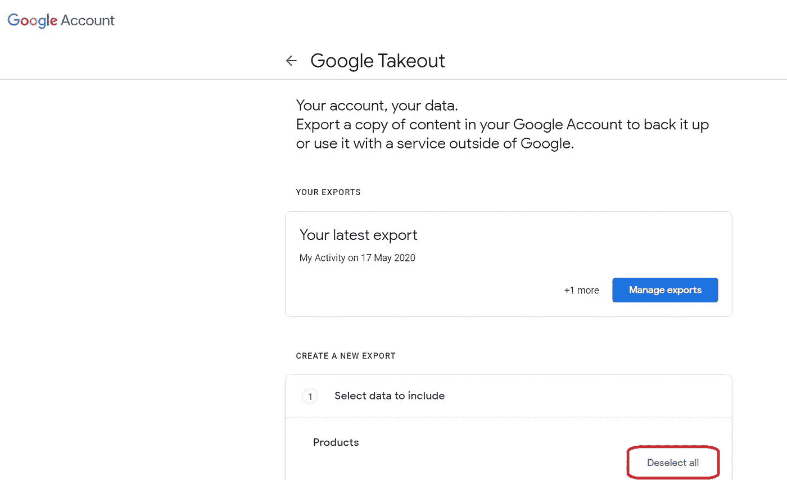

这个页面显示了你可以从所有谷歌相关服务下载的所有数据。由于我们只对从“谷歌搜索”下载数据感兴趣，请点击“取消全选”按钮并向下滚动，直到您看到一个名为“我的活动”的部分，然后点击旁边的复选框。

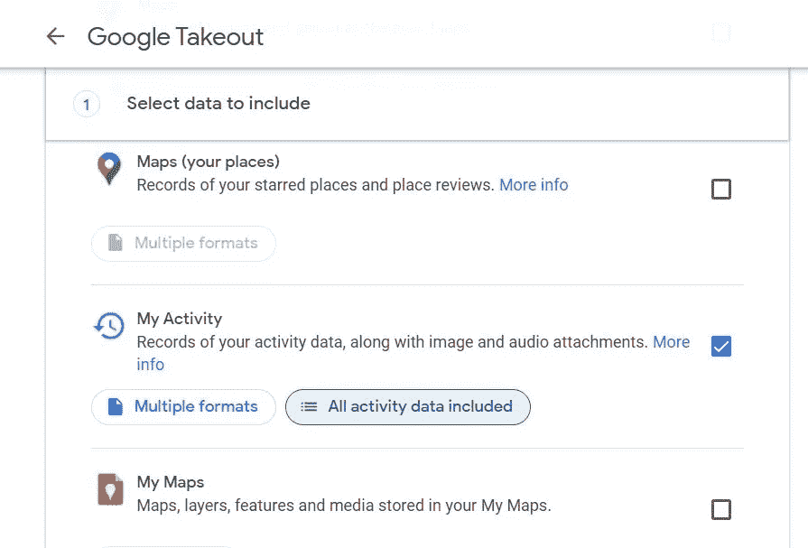

接下来，单击“包括所有活动数据”按钮，出现一个新的弹出框，显示您可以下载的所有活动的列表，然后单击“取消全选”。


向下滚动并找到“搜索”，选择其复选框并单击底部的“确定”。

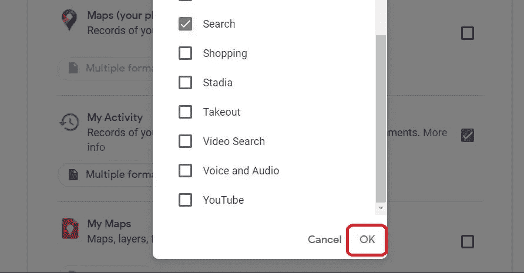

继续浏览页面，然后单击“下一步”，这将允许您导出和下载您的数据。


# 2.从 HTML 文件中提取搜索词

您从 Google 获得的下载输出文件(在压缩的。拉链还是。tgz 文件夹)是一个名为“MyActivity.html”的 HTML 文件。您可以在首选浏览器中查看搜索词、日期和其他元数据，但请记住，根据您的文件大小，可能需要一段时间才能打开。

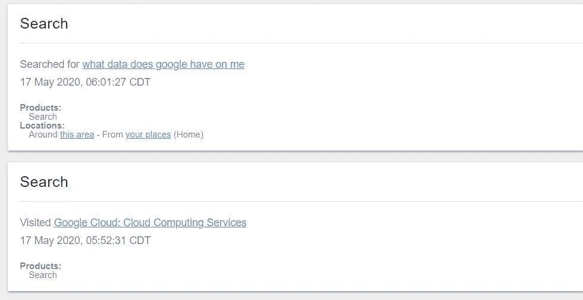

我编写了一个 python 脚本来解析 html 文件，并将搜索词和相应的日期保存到一个 CSV 文件中，该文件将用于进一步的处理。本文不会讨论 html 文件的解析，但是可以随意导航到我的 Github [库](https://github.com/danielkychen/GoogleSearchWords)获取详细信息，在那里您还可以派生、下载和实验解析您自己的 html 文件。在运行我的 python 脚本后打开导出的 CSV 文件，应该会生成如下所示的表格:

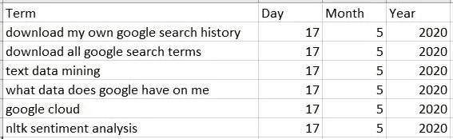

# 3.使用 NLTK 的标记化

NLTK 或自然语言工具包是 python 中的一个平台，其中包含许多用于 NLP 任务的有用的文本处理库，比如我们将在这里使用的标记化。标记化是 NLP 中常见的预处理任务，通过它，您可以将类似“自然语言处理很有趣”的句子分割成类似“自然”、“语言”、“处理”、“是”、“有趣”的单个单词。

让我们清理我们的 CSV 文件，并通过首先导入必要的包并将 CSV 文件作为 pandas dataframe 读取来对我们的搜索词应用标记化。

```
import os
import pandas as pd
import nltk
import gensim.downloader as api
import numpy as np
from sklearn.preprocessing import StandardScaler, MinMaxScaler
from sklearn.decomposition import PCA
from sklearn.manifold import TSNE
from nltk.tokenize.treebank import TreebankWordDetokenizer
import matplotlib.pyplot as pltdataDF = pd.read_csv('./data.csv')
```

在我的特定数据集中，我有大约 60，000 个搜索词(行),但我们需要删除任何可能为空、包含错误值或仅包含非英语单词或符号的搜索词。

让我们看看是否有空行:

```
dataDF.isna().any()
```

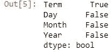

删除缺少值的行:

```
dataDF.dropna(axis = 0, inplace=True)
```

浏览每一列将有助于我们发现任何错误的值:

```
dataDF.describe(include = ['object', 'int64'])
```

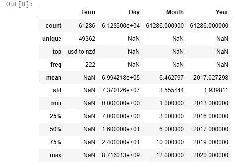

Jupyter 笔记本中的这个汇总表显示，我们的“日”列中的值超出了一个月中某几天的正常范围。小于 1 的最小值和大于 31 的最大值。这很可能与我的 HTML 解析器不能区分作为搜索词一部分的数字和时间戳有关。我们将采用的一个简单解决方案是只保留不包含超出范围值的行:

```
dataDF = dataDF[(dataDF['Day']<32)&(dataDF['Day']>0)]
```

现在，我们检查您是否有仅包含非英语单词或符号的搜索词:

```
~dataDF['Term'].str.contains('[A-Za-z]').any()
```


以及任何包含数值的术语:

```
dataDF['Term'].str.contains('[0-9]').any()
```

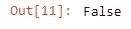

让我们确保所有的字符都是小写字母:

```
dataDF['Term'] = dataDF['Term'].str.lower()
```

我们的数据帧现在可以进行标记化了！

使用 NLTK 进行标记化非常简单，只需要在函数 nltk.word_tokenize()中输入一个字符串，如下所示:

```
nltk.word_tokenize("hey there")
```

要获得单个单词的列表:

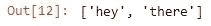

我们可以使用 apply()函数标记数据帧中的每一行:

```
dataDF['Term'] = dataDF['Term'].apply(nltk.word_tokenize)dataDF.head()
```

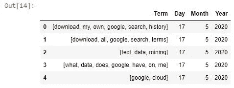

在单词嵌入之前，一个常见的预处理步骤是去除常用的英语单词，如“我”、“他”、“我的”、“和”等。也称为“停用词”以及任何符号和标点符号。NLTK 包含一个停用词语料库，我们将使用它来过滤数据帧中的每一行。我们可以下载所有的语料库(包括停用词)，删除停用词和标点符号，如下所示:

```
nltk.download() #Only required the first time
stopWords = nltk.corpus.stopwords.words('english')def removeStopWords(words):
    removed = [w for w in words if not w in stopWords]

    return removed;def removeSymbols(words):
    removed = [w for w in words if w.isalnum()]

    return removed;dataDF['Term'] = dataDF['Term'].apply(removeStopWords)
dataDF['Term'] = dataDF['Term'].apply(removeSymbols)dataDF.head()
```

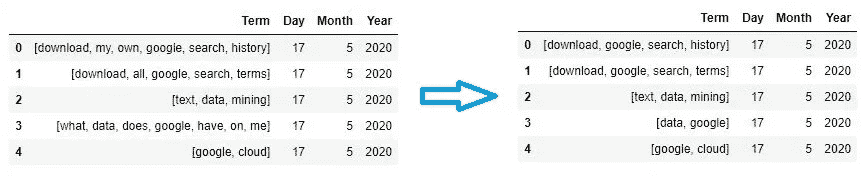

# 4.使用手套嵌入单词

在自然语言处理(NLP)领域，单词嵌入是将单词映射到高维向量空间的行为。通过将单词表示为这些数字向量，我们可以量化单词和句子之间的相似程度。因此，一个好的单词嵌入将理想地为单词“狗”和“犬科动物”提供相似的向量，而不是“狗”和“螺丝刀”。

嵌入从每个单词被转换成一个 hot 编码的向量开始，其中每个元素表示存在于词汇表中的所有单词，只有向量中感兴趣的单词被设置为 1。

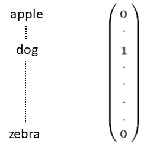

图片作者。

如果你曾经接触过基本的向量数学(如果你没有，不要担心)，你会遇到计算两个向量之间的角度的概念。两个彼此非常相似的矢量将因此具有非常接近 0°的角度(即指向大致相同的方向)，而两个非常不同的向量将彼此正交。形式上，在 NLP 中，两个向量 A 和 B 之间的相似性是角度的余弦，可以这样计算:

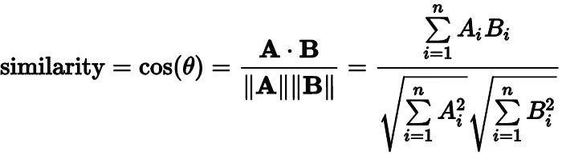

图片来自[维基百科](https://en.wikipedia.org/wiki/Cosine_similarity)

现在，使用一个热编码向量可能会遇到一个问题，除非您比较的两个向量相同(例如“dog”和“dog”)，否则任何其他比较都会产生 0 的点积(A . B ),这不是特别有用。这就是单词嵌入发挥作用的地方。可以通过将独热编码向量乘以嵌入矩阵来计算特定的独热编码字的嵌入。您最终得到的是一个新的向量，与原始词汇大小相比，它具有明显更少的维度(嵌入大小),并且这些新的向量现在将为相似的单词给出接近 1 的相似性得分，否则接近 0。

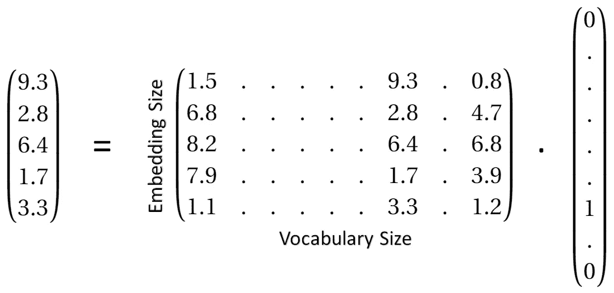

图片作者。

这种看似‘神奇’的嵌入矩阵从何而来？该矩阵可以通过大型文本语料库通过一些目标函数的优化来构建，并且用于构建这些向量的两种常用技术是 Word2vec 和 GloVe。本文不会深入讨论 Word2vec 和 GloVe 是如何构建这些矩阵的，因为我建议读者参考开发这些算法的原始团队:

https://code.google.com/archive/p/word2vec/

手套:【https://nlp.stanford.edu/projects/glove/】T4

幸运的是，我们可以使用预先训练的模型，而不是学习我们自己的嵌入矩阵。使用 python 中的 gensim 库，我们可以轻松地导入这些模型中的一个，我们将使用“glove-wiki-gigaword-300 ”,这是一个在维基百科和 gigaword 语料库上使用 glove 学习的模型，嵌入大小为 300。

```
word_vectors = api.load('glove-wiki-gigaword-300')
```

我们将创建一个新的数据帧 embeddedDF，它将包含与其等价的单词嵌入，而不是原来的单词。

```
def embedSentence(sentence):
    embed = map(embedding, sentence)

    return list(embed);def embedding(word):
    try:
        embed = word_vectors[word]
    except Exception:
        embed = word_vectors['unk'] #For any unknown words

    return embed;embeddedDF = dataDF.copy()embeddedDF['Term'] = embeddedDF['Term'].apply(embedSentence)#removes any rows that became empty after removal of stop words etc.
embeddedDF = embeddedDF[embeddedDF['Term'].astype(str)!='[]']#Will be useful later for combining dataframes
keepIndices = embeddedDF.index
```

因为我们的目标是可视化整个搜索词，而不是单个单词，所以我们不仅需要嵌入单词，还需要嵌入每行的句子(搜索词)。尽管有许多嵌入句子的方法，我们将通过简单地平均一个搜索词中的单词嵌入来实现最简单的“单词包”方法。

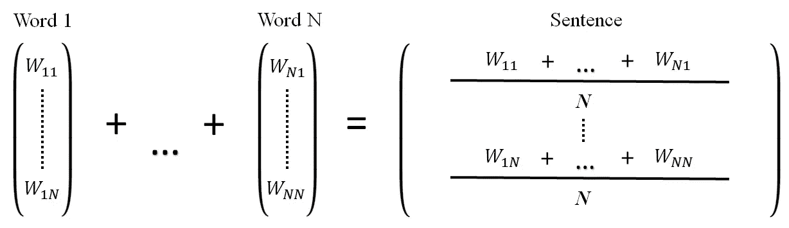

图片作者。

```
def averageEmbedding(sentence):
    average = np.mean(sentence, axis=0)

    return average;embeddedDF['Term'] = embeddedDF['Term'].apply(averageEmbedding)#Reinitializing the indices to remove any gaps
embeddedDF.index = list(range(0, len(embeddedDF)))embeddedDF.head()
```

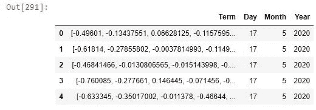

在生成句子嵌入之后，我们将创建一个新的数据帧，其中 300 维嵌入向量的每个元素都在它自己的列中。

```
FeatureColumns = []for i in range(0, 300):
    FeatureColumns.append('e'+str(i))FeatureDF = pd.DataFrame(columns = FeatureColumns)def featurize(sentence, dataframe):
    sentence = pd.Series(sentence, index=FeatureColumns)
    dataframe = dataframe.append(sentence, ignore_index=True)

    return dataframe;for i in range(0, len(embeddedDF['Term'])):
    FeatureDF = featurize(list(embeddedDF['Term'][i]), FeatureDF)
```

既然我们已经将每个搜索项表示为一个 300 维的嵌入向量，我们就可以将它们可视化了！

# 5.使用 t-SNE 可视化搜索词

我们休息一下，参加一些脑力体操。

在你的脑海中想象一个正方形。这很简单，让我们添加另一个维度，现在让我们画一个立方体。仍然很简单，当我们尝试增加另一个维度时会发生什么？我们如何想象一个四维物体？当用图形可视化信息时，我们遇到了同样的问题，超过三维，数据开始变得难以可视化和解释，这就是降维发挥作用的地方。

数据科学中降维的目标是将原始特征集投影到一个较低的维度表示中，同时保留尽可能多的有用信息。这样做的标准方法是使用主成分分析(PCA ),从而试图找到一组新的轴(主成分),使数据的方差最大化。

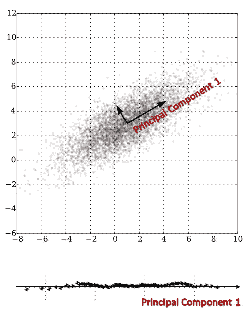

图片修改自[维基百科](https://upload.wikimedia.org/wikipedia/commons/f/f5/GaussianScatterPCA.svg)。

以上面的图像为例，如果我们决定仅使用一个维度重新绘制数据点，并使用第一个主成分作为轴，我们仍将保留大部分相关信息，但只需要一个维度。当我们在应用 PCA 后可视化数据时，彼此差异很大的点往往离得很远，而相似的点不一定会聚集在一起。最近出现了一种称为 t-分布式随机邻居嵌入(t-SNE)的技术，它是一种执行维度缩减并同时允许相似数据点聚集在一起的方法。一个[的例子](https://scikit-learn.org/stable/auto_examples/manifold/plot_lle_digits.html#sphx-glr-auto-examples-manifold-plot-lle-digits-py)使用 MNIST 数据集比较了手写数字(0-9)上的 PCA 和 t-SNE，显示了这些技术之间的行为差异。

我建议对 t-SNE 算法的内部工作原理感兴趣的读者去看看发明者劳伦斯·范·德·马滕的网页:[https://lvdmaaten.github.io/tsne/](https://lvdmaaten.github.io/tsne/)

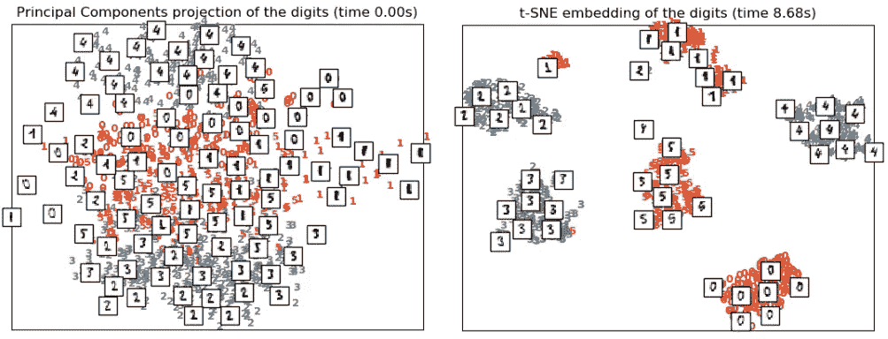

图片由 BSD 许可下的 [scikit-learn](https://scikit-learn.org/stable/auto_examples/manifold/plot_lle_digits.html#sphx-glr-auto-examples-manifold-plot-lle-digits-py) 提供。

现在让我们在搜索词中使用 t-SNE！

我们将可视化 2020 年 3 月这一特定月份的搜索词，而不是试图可视化所有约 60，000 个搜索词，但是您可以随意使用自己的数据集。

我决定选择 2020 年 3 月，因为这是一个充满许多全球事件的月份，包括新冠肺炎、股票崩盘和石油价格战。

我们将首先选择 2020 年 3 月，并将其存储为另一个数据框架“currentDF”，然后在应用 scikit-learn 的 t-SNE 之前标准化我们数据框架的每一列。

```
tempDF = dataDF.loc[keepIndices, :].copy()
tempDF.index = range(0, len(tempDF))#Select the month of March 2020
currentDF = pd.concat([FeatureDF.loc[tempDF[(tempDF['Year']==2020)&(tempDF['Month']==3)].index,:],tempDF[(tempDF['Year']==2020)&(tempDF['Month']==3)]], axis=1)scaler = StandardScaler()
currentScaledDF = scaler.fit_transform(currentDF.loc[:, :'e299'])tsne = TSNE(n_components=2).fit_transform(currentScaledDF)
tsneDF = pd.DataFrame(tsne, columns=['T1', 'T2'])
tsneDF = pd.concat([tsneDF, tempDF], axis=1)tsneDF['Term'] = tsneDF['Term'].apply(TreebankWordDetokenizer().detokenize)tsneDF.head()
```

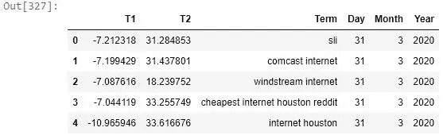

让我们画出我们的搜索词，看看它看起来像什么。

```
def plotWords(dataframe, fileCount=0):    
    plt.figure(num=None, figsize=(12,8), dpi=300)
    ax = plt.subplot(111)
    for i in range(dataframe.shape[0]):
        plt.text(dataframe.iloc[i,0], dataframe.iloc[i,1],    str(dataframe.iloc[i,2]),
                color='blue',
                fontdict={'weight': 'light', 'size':6})

    plt.axis('off')
    plt.savefig(fname='plot'+str(fileCount), dpi=300)scaler = MinMaxScaler()
data = scaler.fit_transform(tsneDF.iloc[:, [0,1]])tsneDF.iloc[:, [0,1]] = dataplotWords(tsneDF)
```

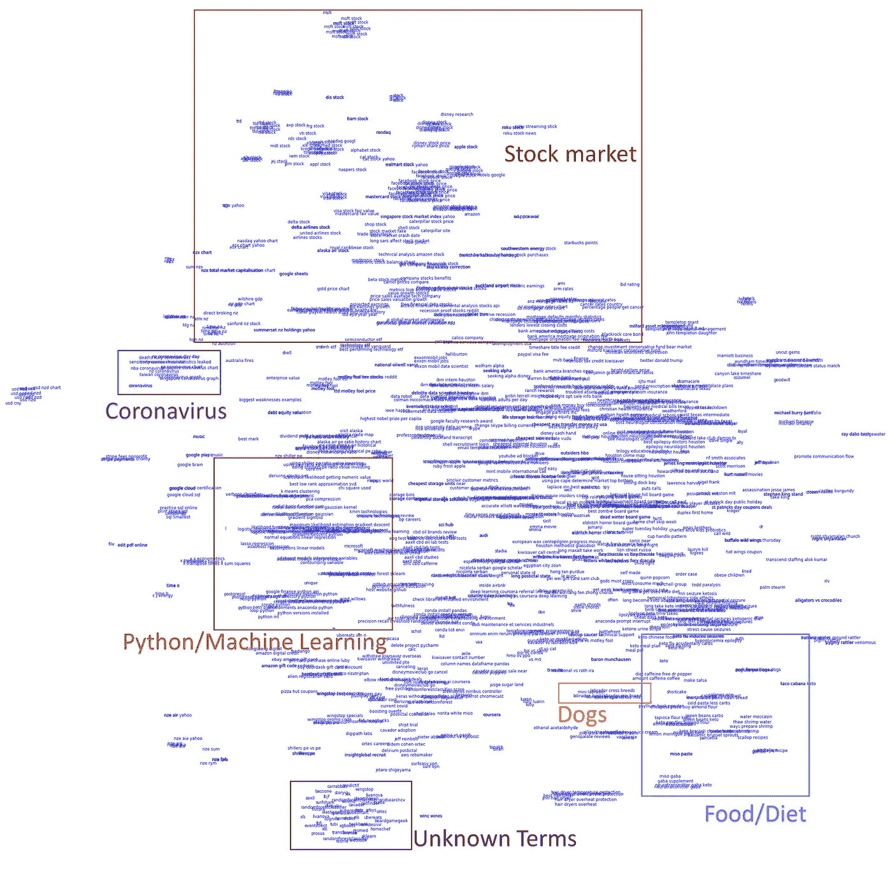

图片作者。

这就是全部了！

试图在单个图表中可视化成千上万个不同的单词可能会非常困难，但即使使用简单的句子嵌入方法，我们也能够使用 t-SNE 将许多相关的术语聚集在一起。虽然在将类似术语分组在一起方面仍有很大的改进空间，但从我 3 月份的谷歌搜索术语中，你可以了解到很多关于我的信息……很明显，我对股市在崩盘期间的表现非常感兴趣，查看了冠状病毒的统计数据，谷歌了各种 python/机器学习术语，查看了狗的图片，并阅读了食物和节食方面的资料(我和妻子正在尝试 keto diet)。深入研究 NLP 的下一步可能是实现更高级的句子嵌入方法，以获得更好的结果。

希望这篇文章足够有趣和简单，并且你能学到一些东西。如果您有任何问题或建议，请随时与我联系。

所有的代码都位于这里:【https://github.com/danielkychen/GoogleSearchWords 