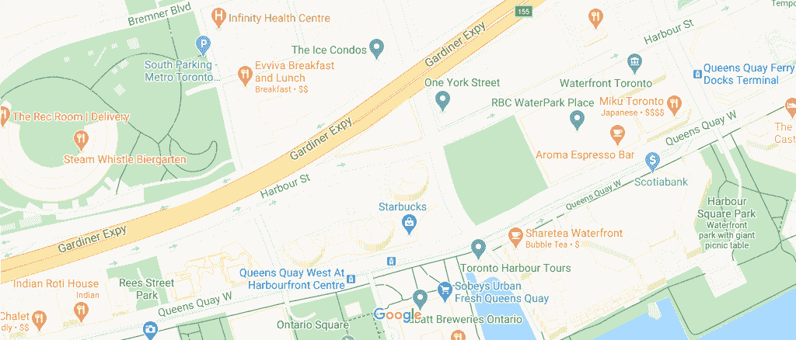
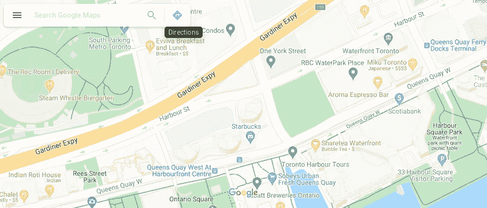
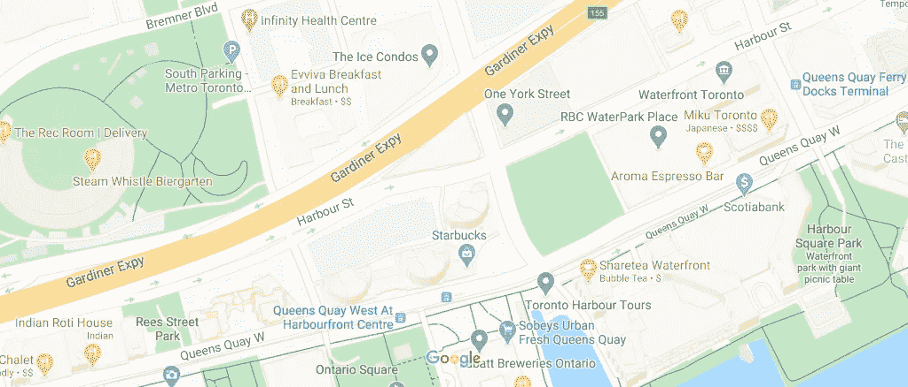

# 基于 Selenium 的谷歌地图特征提取

> 原文：<https://towardsdatascience.com/google-maps-feature-extraction-with-selenium-faa2b97b29af?source=collection_archive---------24----------------------->

## 使用 Python + Pillow + Matplotlib



绿地密度提取(扫描谷歌地图图像)

我计划这是关于提取谷歌地图数据和做一些有趣的路径和基于时间的研究的系列文章的第一部分。一些例子是观察一段时间内的交通流量，并计算给定路线的“美丽分数”。这个旅程的第一步是从 Google Maps 自动加载图像数据，并从这些图像中提取特征。让我们开始吧。

至于我的工具包，我们使用 Python 做任何事情，并利用 Selenium(用于自动化的 web 浏览器模拟器)、Pillow(图像处理库)和 Matplotlib(绘制数据值)的包。

我的工作环境是 Kaggle，这是一个在线数据和笔记本网站，非常有用。首先，我必须安装所需的软件，以允许我们模拟一个浏览器，以便从谷歌地图提取图像数据(除了一些其他数据)。

## 软件包的安装

第一步是下载并解压 Firefox 发行版，这将是我们的自动化浏览器。这是我用过的一个:

[http://FTP . Mozilla . org/pub/Firefox/releases/63 . 0 . 3/Linux-x86 _ 64/en-US/Firefox-63 . 0 . 3 . tar . bz2](http://ftp.mozilla.org/pub/firefox/releases/63.0.3/linux-x86_64/en-US/firefox-63.0.3.tar.bz2)

提取后，记下目录的位置。为了保持整洁，我为这个项目创建了一个新的工作目录:

```
mkdir ~/working/firefox
```

现在将提取的文件复制到这个新目录中，并设置允许所有人执行的权限。

```
cp -a firefox-63.0.3.tar.bz2/. ~/working/firefox
chmod -R 777 ~/working/firefox
```

接下来，我需要安装一个驱动程序来允许 python 和 firefox 之间的通信。与此同时，我还加载了 Selenium 包。

使用画中画:

```
pip install webdriverdownloader
pip install selenium
```

最后，我得到了我的 python 代码。在 Kaggle 笔记本中，我运行了以下代码来实际安装驱动程序。

```
from webdriverdownloader import GeckoDriverDownloader
gdd = GeckoDriverDownloader()
gdd.download_and_install("v0.23.0")
```

最后但同样重要的是，安装运行代码所需的一些额外的包

```
apt-get install -y libgtk-3-0 libdbus-glib-1-2 xvfb**# Setting up the virtual display for Firefox**
export DISPLAY=:99
```

## 启动浏览器

请记住，我将在后台运行一个 web 浏览器，并使用它来加载 Google Maps 和提取一些数据。要在 Python 中做到这一点，首先从 Selenium 加载包，并实例化一个 Firefox 会话。

```
**# Import the libraries for selenium**
from selenium import webdriver as selenium_webdriverfrom selenium.webdriver.firefox.options import Options as
    selenium_optionsfrom selenium.webdriver.common.desired_capabilities import
    DesiredCapabilities as selenium_DesiredCapabilities
```

接下来，我设置了浏览器选项。我不希望 Firefox 生成一个真正的窗口，所以我用“无头”模式启动它。

```
browser_options = selenium_options()
browser_options.add_argument("--headless")
```

最后，我添加了浏览器的功能和实例。

```
**# Even more setup!**
capabilities_argument = selenium_DesiredCapabilities().FIREFOX
capabilities_argument["marionette"] = True**# This is the money.  We now have the browser object ready**
browser = selenium_webdriver.Firefox(
    options=browser_options,
    firefox_binary="~/working/firefox/firefox",
    capabilities=capabilities_argument
)
```

最后，我可以开始抓取一些谷歌地图数据。

## 提取谷歌地图图像

下一步是找出我需要使用的 Google Maps URL，这样我就可以在 Selenium 中导航到它。格式如下:

> 【https://www.google.com/maps/@】T2{ LAT }，{LNG}，{Z}z

其中:

*   LAT:我们希望看到的位置的纬度
*   LNG:位置的经度
*   z:地图上的缩放级别(越大意味着越近)

现在我决定选择多伦多滨水区附近的某个地方，这样我就可以获得该地区的一些公园数据。

```
**# Toronto Waterfront Coordinates**
lat = 43.640722
lng = -79.3811892
z = 17
```

我用它来生成一个 URL 并用我的浏览器导航:

```
**# Build the URL**
url = '[https://www.google.com/maps/@'](https://www.google.com/maps/@') + str(lat) + ',' + str(lng) +
    ',' + str(z) + 'z'**# Setting up the browser window size**
browser.set_window_size(1024,512)
browser.get(url)
```

此时，浏览器保存了网站的所有信息，就像我手动完成的一样(在浏览器中检查)。我想看看这个网站，所以我在 Selenium 中使用了 **save_screenshot** 方法。

```
browser.save_screenshot("before.png")
```

这是它看到的。



谷歌地图的原始图像捕捉(多伦多滨水区)

关于硒的一个很酷的事情是你可以:

> a)解析 HTML 以提取任何页面数据
> 
> b)在页面上执行 javascript

我想做的一件额外的事情是得到图像的适当缩放。例如，我想知道给定地图中公园的实际面积。不错的是，谷歌地图在其渲染中包括了一个比例尺。这意味着我可以选择这些元素来获得英尺数(实际页面上显示的内容)以及比例尺的宽度(以像素为单位)。因此，我有图像中每个像素的英尺数！

因为我是加拿大人，所以我把它转换成米:

```
**# Conversion factor from foot to meter**
foot2meter = 0.3048**# Doing some light cleanup of the string and converting to float**
scale_in_feet = float(browser.find_element_by_id('widget-scale
    label').text.replace(' ft',''))**# Now we have the scale in meters**
scale_in_meters = scale_in_feet*foot2meter**# Get the number of pixels the scale is drawn on, again cleaning**
pixel_length = float(browser.find_element_by_class_name('widget
    scale-ruler').value_of_css_property("width").replace('px',''))**# Taadaa we have the final scaling** 
MetersPerPixel = scale_in_meters/pixel_length
```

接下来，我必须清理图像。正如你所看到的，图像上有一些重叠的元素(搜索栏等)。如果我想从原始地图中提取特征，那么我必须去掉它们。

```
**# Remove omnibox**
js_string = "var element = document.getElementById(\"omnibox
    container\");
    element.remove();"
browser.execute_script(js_string)**# Remove username and icons**
js_string = "var element =
    document.getElementById(\"vasquette\");
    element.remove();"
browser.execute_script(js_string)**# Remove bottom scaling bar**
js_string = "var element = document.getElementsByClassName(\"app
    viewcard-strip\");
    element[0].remove();"
browser.execute_script(js_string)**# Remove attributions at the bottom**
js_string = "var element = document.getElementsByClassName(\"scene
    footer-container\");
    element[0].remove();"
browser.execute_script(js_string)ow I take another screenshotbrowser.save_screenshot("waterfront.png")
```

我有一个干净的形象



一个很好的干净的图像准备进行特征提取

## 地图特征提取+动画

现在我有了我的图像，我想从中提取一些信息。对于这个具体的例子，我想知道绿色公园的*面积的百分比和绝对值*(这就是为什么我需要上面的缩放)。除此之外，我想*制作一个漂亮的动画*，展示图像是如何被扫描并提取绿色的。

因为我在制作动画，所以我想把图片保存在单独的文件夹里，以保持整洁。我这样做是为了扫描和绘制线图:

```
mkdir ~/working/frames
mkdir ~/working/matplotlib
```

现在我做编码的主要工作。我定义了一个函数，它能够扫描图像的像素，并确定它们是否在某个 RGB 范围内(有一些松弛)。我还传入了一个 image 对象，以允许在提取过程中拍摄快照。我基本上将所有像素覆盖为白色，只有当像素落在范围内时，我才保留原来的颜色:

```
**# The most important part!**
def find_pixels(img,pixels,colour_set,slack, size):
    num_px = [] **# List to hold the amount of pixels that match** **# Set the value you want for these variables**
    r_min = colour_set[0]-slack
    r_max = colour_set[0]+slack
    g_min = colour_set[1]-slack
    g_max = colour_set[1]+slack
    b_min = colour_set[2]-slack
    b_max = colour_set[2]+slack **# Loop over the pixel array**
    for x in range(size[0][0]):
        num_px_col_count = 0
        for y in range(size[0][1]): **# Extract the pixel colour data**
            r, g, b,a = pixels[x,y] **# Set the pixel to be white by default**
            pixels[x,y]=(int(255), int(255), int(255),int(0)) **# Check the see if there is a match!**
            if r >= r_min and r <= r_max and b >= b_min and 
                b <= b_max and g >= g_min and g <= g_max: **# If there is a match add one to count** num_px_col_count = num_px_col_count + 1; **# Colour the pixel back to the original**
                pixels[x,y]=(colour_set[0], colour_set[1],
                   colour_set[2],int(255)) **# Append the count to the list**
        num_px.append(num_px_col_count) **# Save the image every 10 frames for animation**      
        if x % 10 == 0:
            img.save('~/working/frames/' + str(x)+ '.png')return num_px
```

既然函数已经定义好了，我就可以实际使用它了。从导入我们的图像和动画库开始

```
from PIL import Image,ImageDraw,ImageFont
import matplotlib.pyplot as plt
```

打开图像，转换为 RGBA，并将像素载入数组

```
img = Image.open('~/working/waterfront.png')
img = img.convert('RGBA')
pixels = img.load()
```

我必须手动做的一件事是确定谷歌地图中给出的公园的颜色。我只是用一个工具选择屏幕上的像素来提取这个。现在我把它立起来，放松一下。在一些像素具有小的颜色可变性的情况下，松弛被用作缓冲器。我把它传递给我们上面定义的函数

```
park_colour = [197,232,197];park_slack = 2;
num_park = find_pixels(img,pixels,park_colour,park_slack,[img.size])
```

此时，我实际上已经拥有了我需要的一切！干得好！该看动画了。还记得 **num_park** 是如何包含每列匹配的像素数的吗？这意味着我可以绘制这个并创建另一个动画。使用图像大小，我创建了一个 matplotlib 图形，并将所有背景、轴和元素设置为白色，以获得一个空白的石板。

```
**# All this is to make a totally blank matplotlib image**
fig=plt.figure(figsize=(1024/100,438/100))
ax = fig.add_subplot(111)
ax.set_facecolor("white")
fig.patch.set_facecolor("white")
fig.patch.set_alpha(0.0)
for spine in ax.spines.values():
    spine.set_edgecolor('white')
plt.grid(False)
plt.axis('off')
```

对于图像处理，我希望图像的比例相同，所以我继续在图中设置缩放比例

```
ax.set_xlim([-10,1024])
ax.set_ylim([-10,438])
```

最后，每隔 10 个元素循环一次，创建一个线图。一旦创建，只需保存它！

```
for i in range(0,1024,10):
    ax.plot(num_park[:i],color='#377e4d',linewidth=3,
        antialiased=True)
    plt.savefig('~/working/matplot/'+str(i)+'.png',
        transparent=True,dpi=130)
```

我有做出最终结果所需的所有图像和数据。

首先，我从提取中得到总面积。使用米像素和图像大小，我可以得到以千米为单位的总面积

```
total_area = img.size[0]*img.size[1]*MetersPerPixel/(1000*1000)
```

> 0.432 公里~图像的 20%

接下来，使用 PIL 创建一个动画 GIF。在下面的例子中，我每隔 10 帧循环一次，从上面捕捉加载预先生成的图像，并将它们添加到一个帧列表中。这个帧列表将被传递给动画函数来生成最终的文件。

```
**# Loop over every 10 frames**
frames = []
for i in range(0,1024,10): **# Load the other images we will overlay**
    googlemap = Image.open('/kaggle/working/frames/'+ str(i)+".png") **# Do resampling to get the smoothing effect**
    googlemap = googlemap.resize(googlemap.size,
        resample=Image.ANTIALIAS)**# Append the frames**
frames.append(googlemap)**# Save the final .gif** frames[0].save('googlemap.gif', format='GIF',
    append_images=frames[1::], save_all=True, duration=1, loop=0)
```


扫描公园的动画

作为最后的措施，我还覆盖了动画 matplotlib 图。唯一的区别是我们将使用。**粘贴**PIL 的方法来叠加图像。

```
**# Loop over every 10 frames**
frames = []
for i in range(0,1024,10): **# Load the other images we will overlay**
    googlemap = Image.open('/kaggle/working/frames/'+ str(i)+".png")
    matplot = Image.open('/kaggle/working/matplot/'+str(i)+'.png') **# Overlay the matplotlib plot animation frames (NB we include
   offsets for the image here has well (-175,-52) for alignment** googlemap.paste(matplot, (-175, -52),matplot) **# Do resampling to get the smoothing effect**
    googlemap = googlemap.resize(googlemap.size,
        resample=Image.ANTIALIAS)**# Append the frames**
frames.append(googlemap)**# Save the final .gif** frames[0].save('FINAL.gif', format='GIF',
    append_images=frames[1::], save_all=True, duration=1, loop=0)
```


绿地密度提取(扫描谷歌地图图像)

现在你知道了！现在，我们可以做一些真正有趣的事情，如纵向交通扫描，甚至查看跑步路线，看看周围地区有多酷！

## 参考

[](https://www.kaggle.com/kapastor/google-maps-feature-extraction-selenium-pil) [## 谷歌地图特征提取- Selenium+Pil

### 使用 Kaggle 笔记本探索和运行机器学习代码|使用来自多个数据源的数据

www.kaggle.com](https://www.kaggle.com/kapastor/google-maps-feature-extraction-selenium-pil)