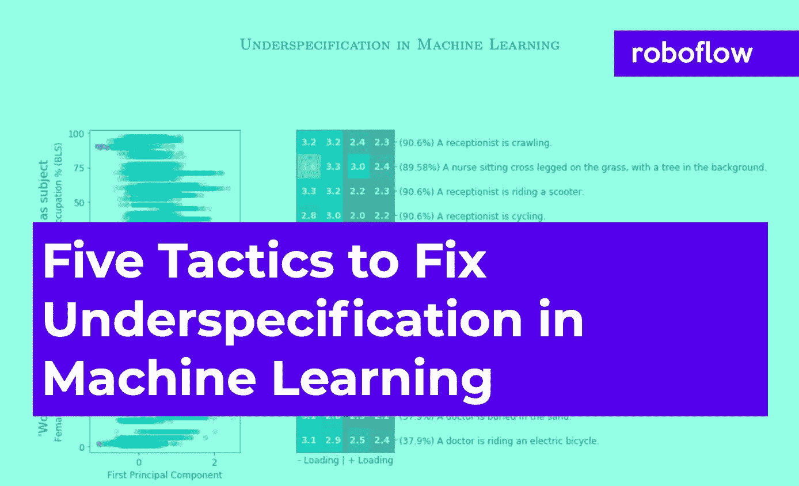
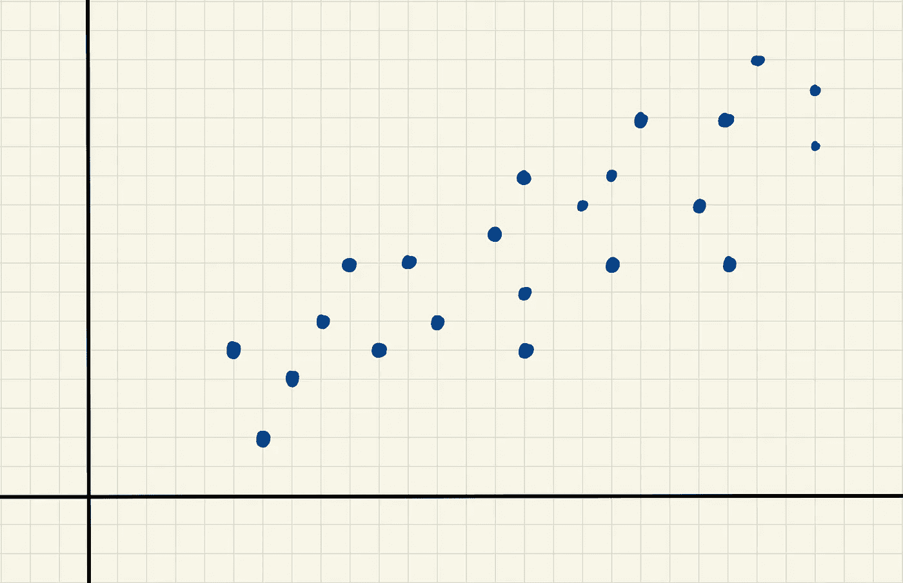
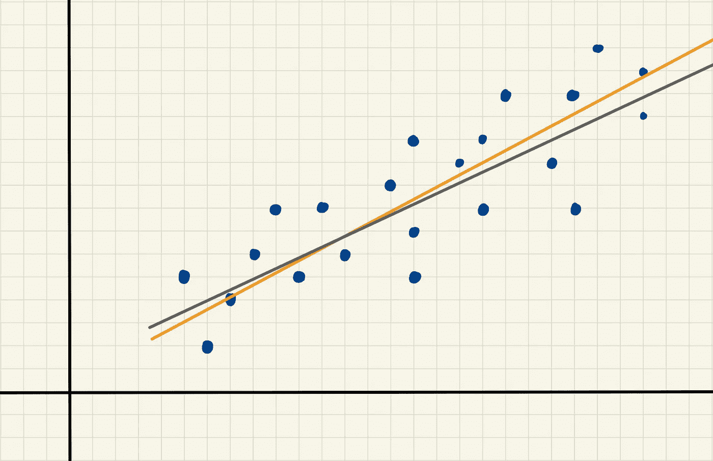

# 谷歌研究人员表示，不规范正在破坏你的模型性能。这里有五种方法可以解决这个问题。

> 原文：<https://towardsdatascience.com/google-researchers-say-underspecification-is-ruining-your-model-performance-e88c8acc4d32?source=collection_archive---------36----------------------->

> *我们看了 60 页的*[*Google under specification paper*](https://arxiv.org/pdf/2011.03395.pdf)*(所以不用)。想直接跳到提示吗？* [*点击这里。*](https://blog.roboflow.com/google-paper-underspecification-machine-learning/#what-are-5-things-we-can-do-to-avoid-those-negative-consequences)

解决机器学习中指定不足的五种策略。作者在 [Roboflow](https://roboflow.com) 拍摄的图片。

这里有一个你可能遇到过的问题:你建立了一个模型，它有很高的精度分数或者很高的 mAP(平均精度)。

然后，您部署您的模型…您的模型比预期的更差。

你采取了正确的步骤！您将数据分成[训练、验证和测试集](https://blog.roboflow.com/train-test-split/)。您检查以确保导入数据时没有错误，并彻底清理了数据。您的特征工程步骤植根于主题专业知识。

# 发生什么事了？

您的模型在构建时表现良好，但在部署后表现更差。这种现象的一个主要原因被称为**规格不足**。一组(主要是谷歌)研究人员[在本周早些时候](https://arxiv.org/abs/2011.03395)发表了一篇关于机器学习模型在“部署在现实世界领域”时表现不佳以及不规范如何导致这种情况的论文。

# 什么是欠规范？

很有可能，当您构建模型时，有许多模型对您的数据表现良好。这是欠规范。

让我们从一个简单的例子开始，然后深入到一个更真实的世界:以这个散点图数据为例。您希望生成一条最适合该数据的线。

*二维网格上手绘的蓝点散点图。*图片由作者在 [Roboflow](https://roboflow.com) 拍摄。

有很多行可以在这个数据上做得很好。让我们看两个示例行:

*二维网格上手绘的蓝点散点图，带有几乎最佳拟合的两条线(一条橙色和一条灰色)。*图片由作者在 [Roboflow](https://roboflow.com) 拍摄。

这张图片中的橙色和银色线条非常相似。当我们量化模型性能时，两者都可能做得相当好。计算机会很容易地挑选出“最好”的一个——但是被计算机称为“最好”的那个并不能保证是“现实世界中最好的”

这是欠规范。如果有许多不同的方法可以让您的模型在保留的测试集上实现相同的性能，即使您有相同的训练数据和相同的模型结构，那么[机器学习管道就是未指定的](https://arxiv.org/pdf/2011.03395.pdf)。在上面的示例中，训练数据(点)和模型结构(最佳拟合模型的简单直线)是相同的，但是直线的斜率和 y 截距略有不同。尽管这是两条不同的线，但如果它们在我们的测试数据中获得了相同的性能水平，我们会将其描述为未指定。

最佳拟合线是一个直观的例子(不同的斜率，但相似的性能)——但这是各种机器学习模型的问题，包括在[计算机视觉](https://blog.roboflow.com/glossary/)，自然语言处理等等。只是有时在这些模型中很难发现。

# 有什么大不了的？为什么指定不足是一个问题？

我们之前看到的那两条线？我们的计算机根据模型性能的一些衡量标准选择了“最佳”的一个。但是计算机不知道哪个模型更好地反映了现实——只是哪个模型碰巧在这组特定的数据上更好。

比方说，不是拟合一条最佳拟合模型线，而是用 [YOLOv4](https://blog.roboflow.com/a-thorough-breakdown-of-yolov4/) 处理一个对象检测问题。*(旁白:在这里学习* [*如何拟合 YOLOv4 模型*](https://blog.roboflow.com/training-yolov4-on-a-custom-dataset/) *或* [*拟合更好的 YOLOv4 模型的窍门*](https://blog.roboflow.com/yolov4-tactics/) *。)*

有许多有意和无意的选择来拟合对象检测模型。

*   有意的选择可能包括你做的图像预处理的类型或者你收集的数据量。
*   无意的选择可能包括在拟合您的模型时选择的[随机种子](https://en.wikipedia.org/wiki/Random_seed)或使您的模型与数据相匹配的算法。

如果我们试着试穿 20 个不同的模型，也许其中 5 个表现相当好。在这 5 个好模型中，我们的计算机在选择“最佳”模型时没有考虑任何现实世界的意义。

归根结底，模型是对现实的简化。模型通常被认为是反映或模仿现实世界。但是模型拟合的方式，不能保证你的计算机选择的模型反映了你的特定应用的逻辑或科学。

令人惊讶的是，像你的随机种子这样看似不相关的决定可能会对你的模型性能产生非常大的影响！

你可能认为这种情况不常发生。[谷歌研究称并非如此](https://arxiv.org/pdf/2011.03395.pdf)。你的电脑可能会选择“最好”的型号，但事实证明，哪个型号是“最好的”惊人地依赖于看似随意的小选择。

**这意味着**:当你部署你的非常精确的、高性能的测试集模型时，很有可能你的模型在现实世界中立即开始表现不佳，耗费你的时间、金钱和挫败感。

# 我们可以做哪 5 件事来避免这些负面后果？

1.  **从培训发行版之外的地方提取测试数据——理想地反映您的部署环境。当你收集数据并将其随机分成训练集、验证集和测试集时，你可能会失败。尽管没有[模型泄漏](https://en.wikipedia.org/wiki/Leakage_(machine_learning))，但是用于评估模型的测试数据与训练/验证数据来自同一个地方。如果您可以收集两组独立的数据(一组用于训练/验证，另一组用于测试)，您可能能够更好地模拟您的模型在现实世界中的表现。在时间序列环境中，这就像使用最新的数据作为测试数据。在计算机视觉的背景下，如果你正在[通过计算鱼的数量来评估环境健康](https://blog.roboflow.com/using-computer-vision-to-count-fish-populations/)，你可能会根据一条河流的数据来训练你的目标检测模型，并根据另一条河流的数据来测试你的模型。**
2.  **尽量缩小您的训练数据分布与“真实世界”分布之间的差距。**如果您必须从训练分布中提取您的测试数据(例如，将您的数据随机分成训练/验证/测试集)，请考虑扰动您的数据，以便您的测试集中的信息更好地反映真实世界。在计算机视觉中，这通常包括[图像增强技术](https://docs.roboflow.com/image-transformations/image-augmentation)。
3.  **通过运行压力测试来检测不符合规格的情况。**压力测试很常见——例如，[银行不得不进行压力测试](https://www.investopedia.com/terms/b/bank-stress-test.asp)以确保它们能够经受住令人惊讶的经济事件。来自谷歌的研究人员通过在各种随机种子值下运行模型来进行压力测试，然后检查压力测试如何变化。理想情况下，基于随机种子观察到的可变性很少或没有；[研究表明，随机种子确实会显著影响压力测试的表现](https://arxiv.org/pdf/2011.03395.pdf)。研究人员分享了他们使用的三种类型的压力测试:A)分层表现评估，其中对观察的子组进行评估以识别不公平。例如，分别计算每个类别的平均精度[。b)移位性能评估，它通过有意干扰现有数据来检查模型的特定属性，从而生成虚构的测试分布。c)对比评估，与](https://blog.roboflow.com/mean-average-precision-per-class/)[敏感性分析](https://en.wikipedia.org/wiki/Sensitivity_analysis)相似，即操纵一个输入观察值来测量输出受影响的显著程度。
4.  **确定你正在做出的有意和无意的建模选择。**如果您发现或有理由怀疑您的模型正在遭受不确定性，那么就开始尝试通过列出您所有的建模选择来解决它。有些是有意的，比如模型的输入和您选择的模型类型。有些是无意的或隐含的，如随机种子或神经网络中的[步长。如果你的模型正遭受欠规范，看看是否调整这些可以提高你的模型的真实世界的表现！](https://papers.nips.cc/paper/2018/file/e8fd4a8a5bab2b3785d794ab51fef55c-Paper.pdf)
5.  确保你的机器学习管道是可复制的。在训练/验证/测试集和现实世界中评估您的模型时，跟踪您的模型何时表现良好，何时表现不佳至关重要。识别[模式转换何时开始发生](/model-drift-in-machine-learning-models-8f7e7413b563)或什么参数设置(你希望在上面的步骤 4 中列出的那些！)生成在现实世界中表现特别好的模型是确保您的模型开发专注于实现强大的现实世界性能的关键。

**规格不足** **是部署你的型号时的一个大问题**。您的模型可能在保留的测试集上表现得更好——但是一旦您部署了您的模型，您的性能通常会变得更差。希望上面的五个技巧可以帮助您在部署模型时避免性能下降。

**有其他提示或建议吗？我们很乐意在评论中听到他们，并把他们添加到我们的博客中！**

*原载于 2020 年 11 月 16 日 https://blog.roboflow.com***。**