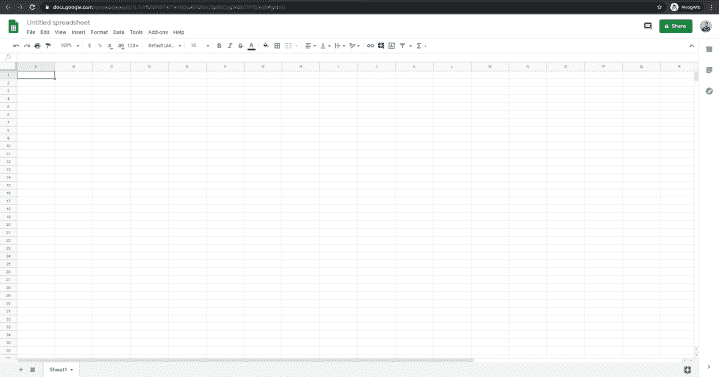
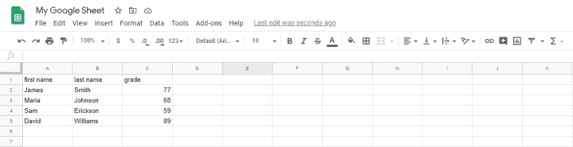
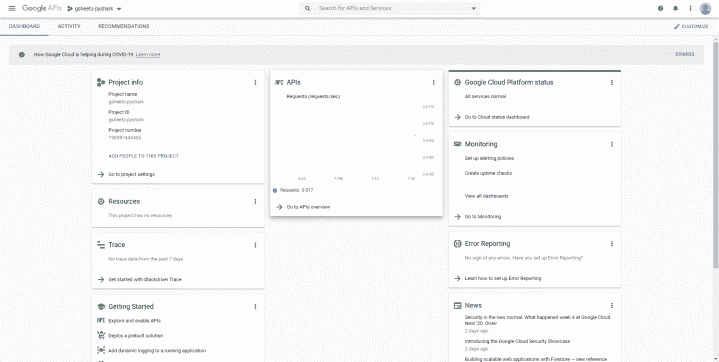
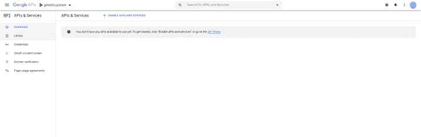
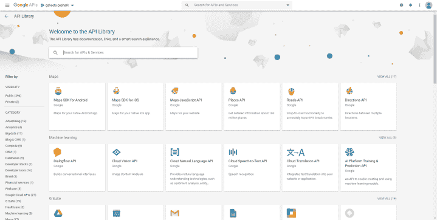
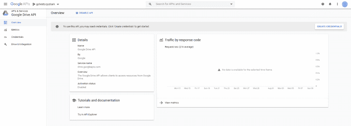
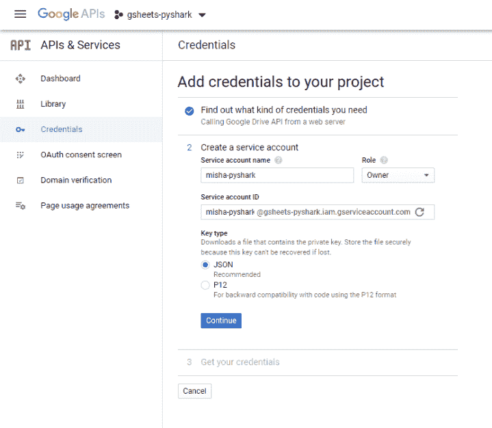
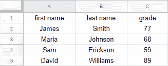

# 使用 Python 的 Google Sheets API——Python 编程

> 原文：<https://towardsdatascience.com/google-sheets-api-using-python-python-programming-2a55543fbfcb?source=collection_archive---------41----------------------->

## 在这篇文章中，我们将讨论如何使用 Python 访问和编辑 Google Sheets


作者图片

**目录**

*   介绍
*   创建一个示例 Google Sheets 文档
*   创建 Google API 凭据
*   使用 Python 打开 Google 工作表
*   使用 Python 选择/创建/删除工作表
*   使用 Python 编辑 Google 工作表中的数据
*   结论

# 介绍

使用 Python 从多个来源访问数据成为数据科学和分析领域几乎所有职位的标准要求。使用 Excel 电子表格和内部 CSV 文件随处可见。

但是如果你的数据现在以 Google Sheet 的形式存储在 Google Drive 上呢？当然你可以下载你选择的任何格式。然而，它不是一个可扩展的解决方案，因为它需要不断的人工输入。

让我们看看如何以编程的方式解决这个问题，甚至在使用 Python 处理 Google Sheets 时自动完成一些任务。

为了继续学习本教程，我们需要两个 Python 库:gspread 和 oauth2client。

如果您没有安装它们，请打开“命令提示符”(在 Windows 上)并使用以下代码安装它们:

```
pip install gspread
pip install oauth2client
```

# 创建一个示例 Google Sheets 文档

如果你正在阅读这篇文章，你可能已经有一个 Google Sheets 文档了。你想处理你的文件。出于本教程的目的，我将创建一个简单的 Google Sheets 文件，在其中复制学生的成绩数据集。本质上，我们将有三列:名、姓和年级。

要创建您的第一个 Google Sheets 文件，请访问 [Google Drive](https://www.google.com/drive/) 页面，使用您的 Google 帐户登录。一旦你进入，在左上角，点击新建，然后谷歌工作表。这将创建一个如下所示的空白文档:



作者图片

这个新文档是空的，没有任何数据或自己的文件名。

在左上角，你会看到“无标题电子表格”，为了方便起见，让我们将其重命名为“我的谷歌表”。

让我们添加一些示例数据。我添加了一些简单的字段:



作者图片

太好了。现在我们有一个文件，我们将继续工作。

# 创建 Google API 凭据

使用 Python 开始使用 Google Sheets 的第一步是为 Google Drive 和 Google Sheets 创建 API 凭证，这将允许我们连接到我们的文件。

首先，我们将前往[面向开发者的谷歌云控制台](https://console.developers.google.com/)，不用谷歌账户登录。

一旦我们进入，在最顶端，您将看到以下按钮来创建一个项目:


作者图片

点击它，它会带你到一个新的页面，在那里它会要求你为你的项目创建一个名称。我把我的命名为“gsheets-pyshark ”,然后点击“创建”。

现在，在右上角，单击“bell”图标，您将看到一个通知，表明项目已经创建。在通知列表中，单击查看进入项目页面。

这将把您带到项目的 API 仪表板。它应该是这样的:



作者图片

完美。到目前为止，我们使用 Python 创建了自己独特的项目来处理 Google Sheets。下一步是设置 API。

转到导航菜单(单击右上角的三条水平线)，选择 APIs & Services，然后选择 Dashboard。您应该会看到以下页面:



作者图片

如你所见，我们还没有任何可用的 API。我们需要添加它们。跟随屏幕中间的蓝色链接 API library 进入所有可用的 Google APIs 列表:



作者图片

这里我们需要添加“Google Drive”API。通过在搜索框中键入名称找到它，单击它，然后单击启用。加载可能需要几秒钟。一旦启用，我们就会到达这里:



作者图片

太棒了。Google Drive API 现已启用。要使用它，我们需要为它生成凭证。单击右上角的“创建凭据”,并像这样填写表单:


作者图片

填写完上面的表格后，继续点击蓝色按钮。我需要什么凭证？

在下一个表单中，您应该选择您的帐户名称(我将其设置为 misha-pyshark)和帐户在项目中的角色(我选择了 Owner)。“密钥类型”应该设置为 json，因为我们希望将凭证下载为. JSON 文件:



作者图片

然后，单击 Continue，您的凭证将自动下载，您将看到一个弹出窗口，提示您的 API 凭证已创建。

**重要提示**:请将下载的 JSON 文件重命名为“mycredentials ”,这样在后面的代码中引用它会容易得多。此外，您应该将它放在 Python 代码所在的目录/文件夹中(这样我们可以节省指定文件位置的时间)。

到目前为止，我们已经启用了 Google Drive API，并为其下载了凭证。最后一步是启用 Google Sheets API。让我们回到[谷歌 API 库](https://console.developers.google.com/apis/library)，找到“谷歌工作表 API”。点击进入它，然后点击启用让它运行。

现在我们已经准备好使用 Python 访问 Google Sheets 了。

# 使用 Python 打开 Google 工作表

在 Python 中有多种方法来执行授权步骤。我在本教程中使用的方法在大多数关于这个主题的文章中被广泛使用，所以我决定用同样的方法。

作为第一步，我们需要导入所需的库:

现在是时候用我们的凭证配置客户机了。这将创建 gspread 客户端:

一切都是为了检索我们之前创建的 Google Sheet 并从中获取所有记录。

使用 Python 有 3 种方法打开 Google 工作表:

## 1.按名称打开谷歌工作表

这里，我们只需要输入我们创建的 Google 工作表的实际名称:

## 2.通过 URL 打开 Google 工作表

要使用 URL 打开 Google 表单，您需要在浏览器中打开您的 Google 表单并复制它的地址。我的文件是:[https://docs . Google . com/spreadsheets/d/1 l7 cyfmvpiiypktye 1 bdwkpgfhajxp 8 hceg 34 BH 7 vyl 0/](https://docs.google.com/spreadsheets/d/1L7cYfMVPIiYPkTYe1bDwKPGfhAJXp8HCeg34Bh7VYl0/)

现在，我们用**。open_by_url()** 方法，并将我们的 url 作为参数传递:

## 3.按键打开谷歌工作表

按键打开 Google Sheet 与前面的选项非常相似。我们文件的关键是什么？很容易找到。密钥是 URL 的最后一个组成部分，位于最后两个斜杠(“/”)之间。在我的例子中是:1l 7 cyfmvpiiypktye 1 bdwkpgfhajxp8 hceg 34 BH 7 vyl 0

现在，我们用**。open_by_key()** 方法，并将我们的 URL 作为参数传递:

无论您决定继续哪种方式，它都会在我们的内存中创建一个对象，并将其存储为 **gsheet** 。它到底包含了什么？简单地说，它的内容正是我们在创建这个 Google 表单时输入的内容。现在让我们从其中检索信息:

在上面的代码块中，我们打开并检索了“Sheet 1”中的所有数据，然后打印出来。它应该是这样的:

```
[{'first name': 'James', 'grade': 77, 'last name': 'Smith'},
{'first name': 'Maria', 'grade': 68, 'last name': 'Johnson'},
{'first name': 'Sam', 'grade': 59, 'last name': 'Erickson'},
{'first name': 'David', 'grade': 89, 'last name': 'Williams'}]
```

我们最终得到了一个每行都有值的列表。还要注意 Google Sheets 默认情况下是如何将第一行设置为列名的。

**奖励**:使用下面的代码，Google Sheet 可以很容易地转换成 Pandas dataframe:

我们得到了一个更熟悉的输出:

```
first name last name grade
0 James Smith 77
1 Maria Johnson 68
2 Sam Erickson 59
3 David Williams 89
```

# 使用 Python 选择/创建/删除工作表

在我们能够访问 Google 表单之后，让我们看看我们可以从什么开始。第一个检查点是我们在使用 Google Sheet 的不同工作表时的灵活性。

我的示例 Google Sheet 只包含一个名为“Sheet 1”的工作表。然而，拥有一个多工作表文件是很常见的。当然，当我们检索数据时，我们需要指定数据应该来自哪个工作表。这就把我们带到了第一个交互选项。

## 使用 Python 选择工作表

回想一下，我们的 Google Sheet 在本地内存中保存为 **gsheet** 。现在我们想从文件中按名称访问特定的工作表。我们要做的是创建一个只包含“Sheet1”数据的 Google 主工作表的子集，并打印其内容:

结果应该与上一节相同，因为我们的文件中只有一个工作表:

```
first name last name grade
0 James Smith 77
1 Maria Johnson 68
2 Sam Erickson 59
3 David Williams 89
```

## 使用 Python 创建工作表

现在，如果您想要另一个空工作表呢？当然，你可以通过浏览器登录你的 Google Drive 并手动创建。但是如果您的脚本作为自动化过程的一部分运行(这就是您可能正在阅读本文的原因)，我们希望从我们的 Python 代码中让一切工作起来。

gspread 库的功能也允许我们创建新的工作表:

上面的代码将使用给定的参数在我们的 Google Sheet 中创建新的工作表。请记住，您必须为要添加的工作表指定一个新名称以及行数和列数。

要检查它是否工作，请登录到您的 Google Drive 并查看 Google Sheet 文件，您将看到第二个工作表“新工作表”已添加到您的文件中。

## 使用 Python 删除工作表

或者，您可能希望删除刚刚创建的工作表。现在，这里有一个小问题:您只能删除使用 Python 创建的工作表。在我的示例中，它是 **newsheet** ，原因是存储在本地内存中的用于访问该特定工作表的格式:

如果你再次检查你的谷歌工作表，你会看到“新工作表”已经被删除。

# 使用 Python 编辑 Google 工作表中的数据

本节将讨论大多数最有用的功能。这就是我们使用 Python 编辑主文件中数据的地方。首先，我们需要定义将要使用的工作表:

回想一下，我们正在处理的数据如下所示:



作者图片

## 获取单元格值

假设我们想要从工作表的特定单元格中检索数据，并让该单元格为“A2”(我们要获取的数据是“James”)。我们将使用以下代码来实现:

我们得到了我们所期望的:

```
James
```

## 更新单元格值

还有一种情况是，您希望更新单元格中的值。假设我们输入错误，需要将 A2 单元格中的名称从“James”改为“John”。可以使用以下代码简单地更改它:

并重用前一部分的小代码块来获得更新后的值:

我们得到:

```
John
```

## 从一行中获取所有值

或者，您可能对检索整行数据(而不是单个单元格)感兴趣。在我们的例子中，假设我们有兴趣获取工作表中第一个学生的数据。

唯一需要注意的是，我们需要知道要从中检索数据的行的索引。假设第一行是列标题，感兴趣的行的索引为 2。现在我们可以得到它的值:

我们得到一列值:

```
['John', 'Smith', '77']
```

## 从列中获取所有值

在另一种情况下，您可能希望从列(而不是行)中获取数据。假设在我们的场景中，我们希望从“grade”列中获取所有数据。

我们将再次需要找到它的索引(index = 3)并运行类似于上一节的代码:

我们在列中得到一个值列表:

```
['grade', '77', '68', '59', '89']
```

## 插入新行

我们通常用电子表格做的最受欢迎的任务之一可能是添加新数据。

在我们的例子中，假设有一个新生刚刚写了他/她的试卷，并得到了一个分数。我们想用 Python 更新我们的谷歌表，增加一个新条目。

为此，我们需要两条信息:学生数据(名、姓和年级)和我们要插入的行的索引:

新索引是 6 的原因是因为我们知道已经有 5 行数据，并希望添加到列表的末尾。请记住，您可以选择任何索引值，它只是将剩余的行向下推。

现在，让我们将这一行添加到我们的 Google 工作表中，并检查它是否已被添加:

我们在刚刚添加的行中得到一个值列表:

```
['Emily', 'Watson', '89']
```

**注意**:整个软件包的功能非常广泛，而且很多功能都是针对具体情况的。关于 gspread 软件包的完整方法示例，请点击[这里](https://gspread.readthedocs.io/en/latest/user-guide.html#opening-a-spreadsheet)。

# 结论

在本文中，我们讨论了如何使用 Python 访问/编辑 Google Sheets，并介绍了 gspread 库的特性。

如果你有任何问题或对编辑有任何建议，请随时在下面留下评论，并查看我的更多 [Python 编程](https://pyshark.com/category/python-programming/)文章。

*原载于 2020 年 8 月 15 日 https://pyshark.com**[*。*](https://pyshark.com/google-sheets-api-using-python/)*