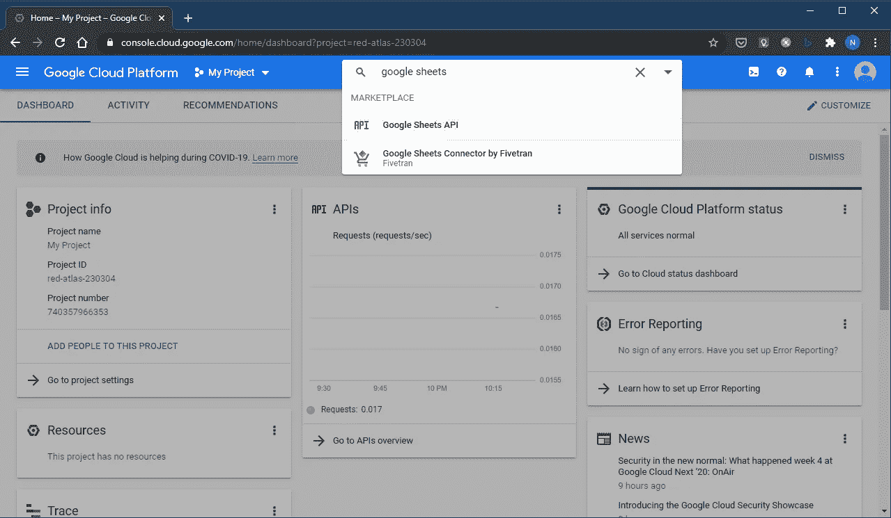
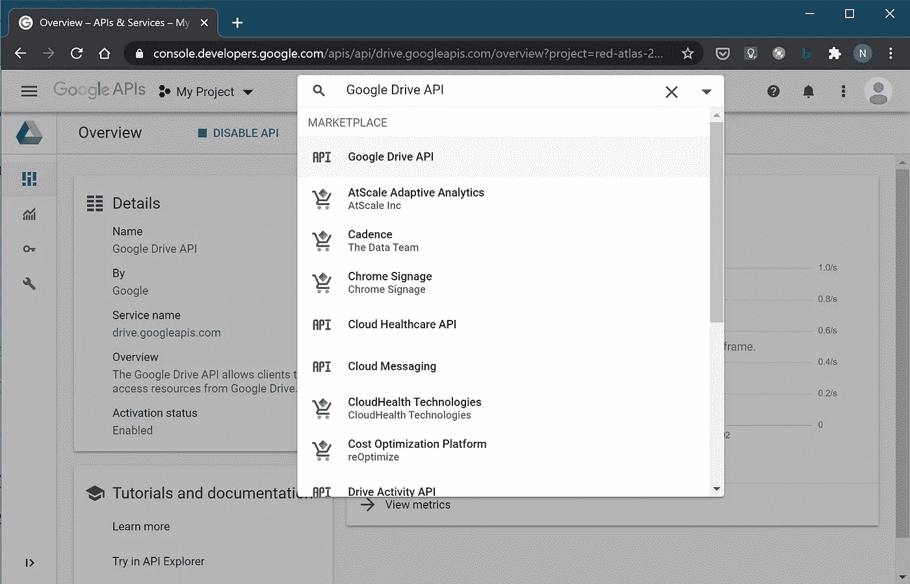
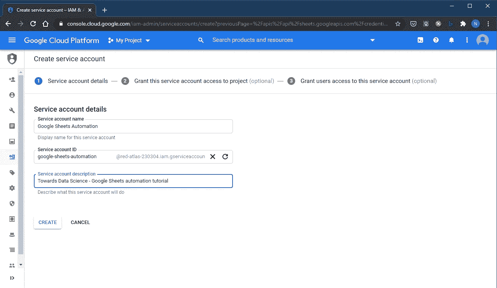
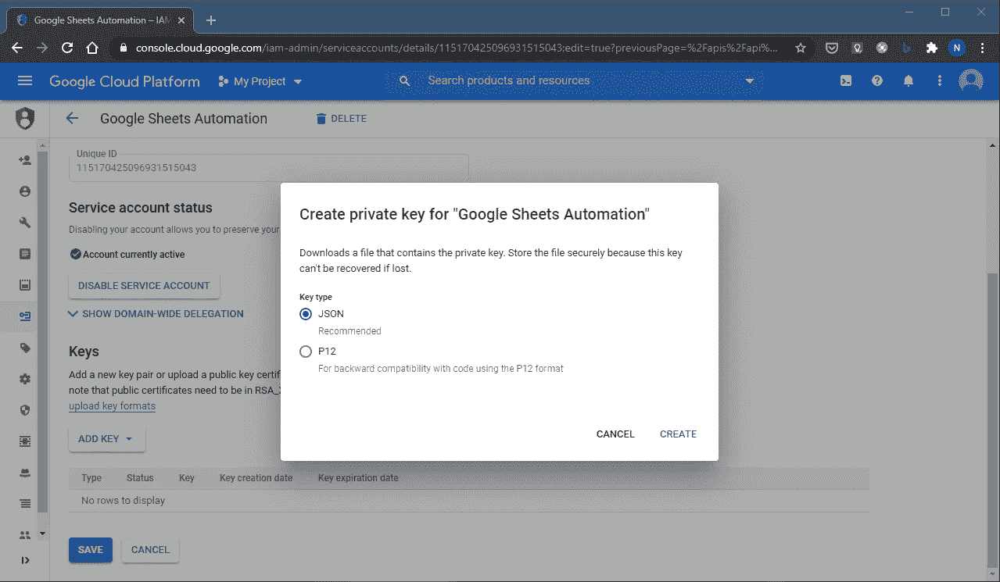
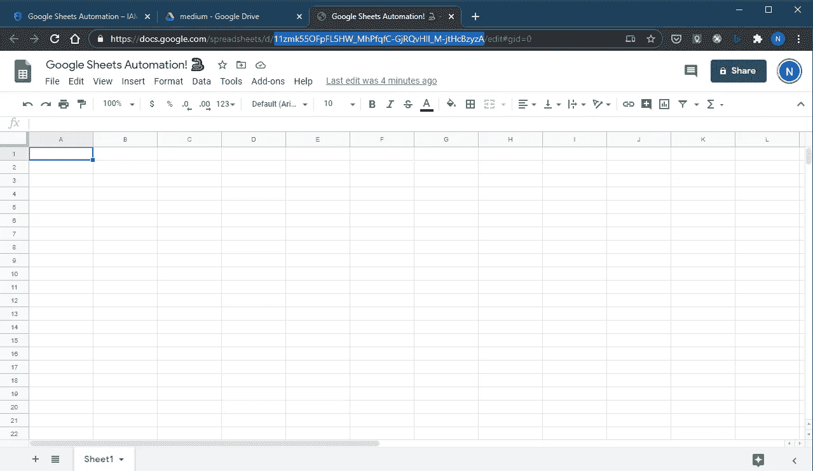
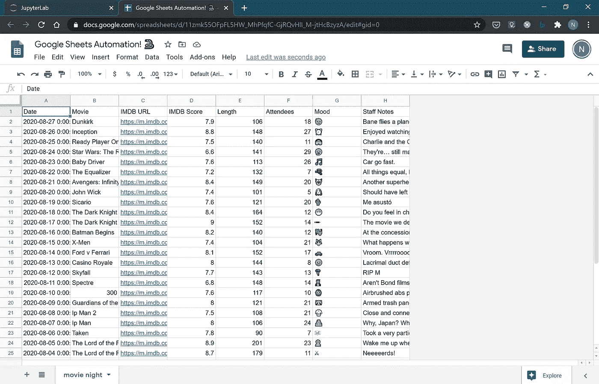
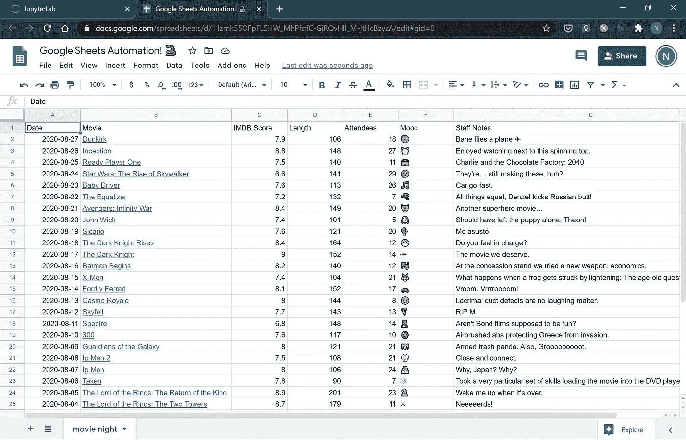
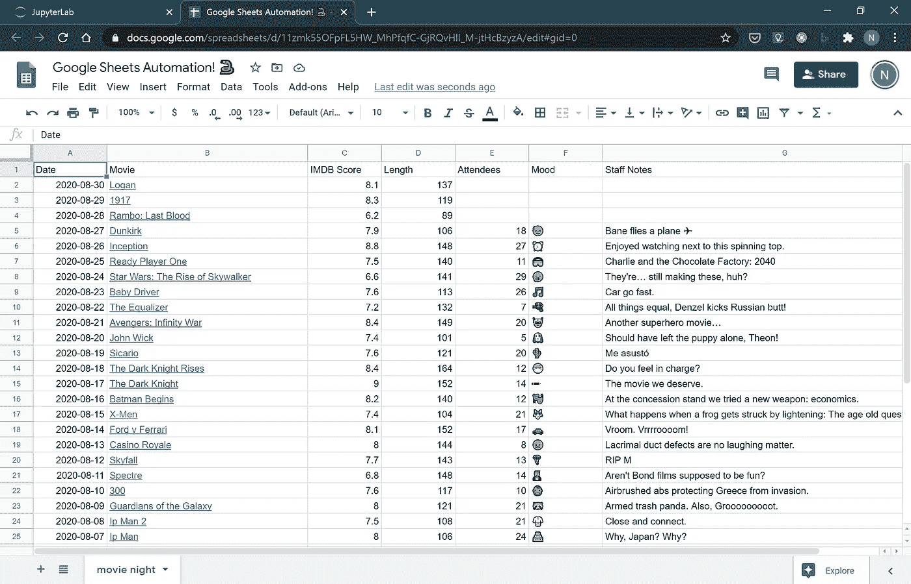
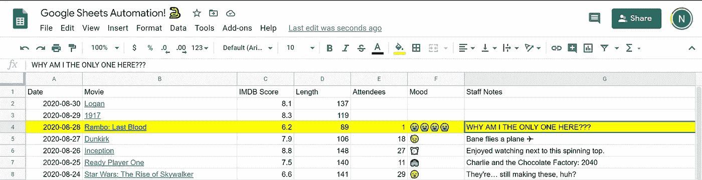

# 谷歌床单，遇见熊猫数据框

> 原文：<https://towardsdatascience.com/google-sheets-pandas-dataframe-6b8666f9cf6?source=collection_archive---------11----------------------->

## 🐍跳电子表格之舞:简单的方法。


由[米卡·鲍梅斯特](https://unsplash.com/@mbaumi?utm_source=medium&utm_medium=referral)在 [Unsplash](https://unsplash.com?utm_source=medium&utm_medium=referral) 拍摄的照片

可能是因为在键盘后面呆的时间太长了。但是有时候我在网上的阅读和观看让我觉得我是一个濒临灭绝的开发者。在电子表格中工作的人。每一天。

你能相信吗？开发人员，像不存在的电子表格一样过他们的生活。如果你是这些人中的一员，我想见见你。要知道*你*的存在，这并不全是我耳畔的狂言。

对于我们其余的人来说，电子表格是非常重要的东西。爱他们或者恨他们，那些二进制的行和列是没有用的。简而言之，哲学课就是*电子表格就是*。每个非开发人员的员工都在电子表格中拯救了清洁工的生命。

> *“电子表格是。”把这个存在主义的重磅炸弹交给一所大学；哲学荣誉博士学位肯定会随之而来。*

Excel 和 Google Sheets，它们毫无用处；除非我们把自动化和知识工作者传递电子表格的仪式分开，否则我们的生产力也不会提高。

# 我的三段两分钱

就个人而言，我喜欢好的电子表格。对于管理数据，快速和肮脏的计算，可视化一维时间序列…5 次中有 4 次我会打开 Excel 或 Google 工作表，而不是启动 Jupyter 服务器。

除此之外，*业务中的 spreadsheetitis* 是不知道如何移动数据的一种症状。我亲眼见过“人肉路由器”问题严重到 20 多个(20 个！)人们在最终——幸运的是——将一个版本的电子表格放入“数据库”(另一个电子表格)之前接触过它。

还有电子表格。当有一个大写的“S”的电子表格时，你就知道这个行业是数据地狱。经理们认为*就是*业务。

# 自动化你的理智之路

我们将讨论几个用于 Python 中 Google Sheets I/O 的库。无论是哪种方法，你都必须在谷歌云平台(谷歌版的 AWS 和 Azure)的迷宫般的控制台内启用 Google Sheets API。幸运的是，Google——go figure——在控制台中有一个很棒的搜索功能，我们将使用它来帮助您进行设置。

## 疯狂第一——从谷歌云平台获取一个`credentials.json`文件

前往[console.cloud.google.com/](https://console.cloud.google.com/)，使用谷歌账户登录，访问您想要自动化的电子表格。该 API 可用于 GSuite 和免费的 Google 账户。如果这是一个工作拥有的电子表格，与 GCP 访问的管理员将不得不按照这些步骤，给你的凭证文件。

选择顶部导航栏中的项目。每个资源都保存在项目中，就像 Azure 中的资源组一样。如果您还没有，请选择项目下拉列表和“新建项目”。然后搜索“Google Sheets API”，如果你是个虐待狂，想用鼠标探索仪表盘，就在“APIs & Services”下面。



“启用”API。

现在你需要为 Google Drive API 做同样的事情。



接下来，您需要创建一个服务帐户，然后您将为其创建凭据。

步骤:

*   你在谷歌云平台>谷歌工作表 API 在[console.cloud.google.com/apis/api/sheets.googleapis.com](console.cloud.google.com/apis/api/sheets.googleapis.com)
*   前往侧边栏上的凭证`🗝 Credentials`。
*   选择`+ CREATE CREDENTIALS` >服务账号。OAuth 是一个不同的故事。本文涵盖了服务器端的内部使用。创建服务帐户。
*   下一个视图是为服务帐户选择 IAM 角色。这是可选的，跳过它。
*   接下来是“授予用户对此服务帐户的访问权限(可选)”。也跳过。



现在，您将回到“项目[项目名称]的服务帐户”屏幕。点击超链接`Email`字段或汉堡菜单(三点)> `Create key`，选择表格中的服务账户。

无论哪种方式，`ADD KEY`或`Create key`，选择 JSON 键类型和`CREATE`。这会将一个 JSON 文件下载到您的计算机上。


最后一件事:电子表格。这里我为这个例子创建了一个。请注意 Omnibar 中 URL 的突出显示部分。这是文档的 ID。大多数库都给出了引用整个 URL 或者只引用这个 ID 的选择。



您可以从[这里](https://docs.google.com/spreadsheets/d/11zmk55OFpFL5HW_MhPfqfC-GjRQvHlI_M-jtHcBzyzA/edit?usp=sharing)查看并下载电子表格。

为服务帐户打开从 GCP 下载的`credentials.json`文件。复制`client_email`属性中的电子邮件值。用这封邮件分享谷歌表单。这使服务帐户可以访问在另一个帐户(不是服务帐户)上创建的电子表格。

唷。这是所有谷歌基础设施的东西。我保证。

现在我们可以开始写 Python 代码了。

## 尝试开源库

谷歌有一个用于[工作表](https://developers.google.com/sheets/api/)的 API，就像它用于所有谷歌驱动产品一样。有了它的 [Python 库](https://developers.google.com/sheets/api/quickstart/python)，没有什么是你做不到的。

尽管如此，你还是会疯狂地使用它。

我对电子表格的强硬态度是，它们是向商业用户传递数据的一种可移植的、可视化的方式。数据矩形，左上角的单元格 A1。不是玩鲍勃·罗斯🎨具有条件格式的🖌，在同一工作表中形成群岛的数据岛，或创建类似 Tableau 的图表仪表板。

并不是说所有这些事情都不好。我已经用电子表格自动化掉进那些兔子洞很多次了。只是，当你深入研究 Google Sheets 这些年来内置的所有功能时，编码的回报时间比下降得很快。

这篇文章是关于数据输入和数据输出的。最快解决问题的时间胜出。

在 Python 数据方面，这意味着使用 pandas [数据帧](https://pandas.pydata.org/pandas-docs/stable/reference/api/pandas.DataFrame.htmlhttps://pandas.pydata.org/pandas-docs/stable/reference/api/pandas.DataFrame.html)。在 Google Sheets 连接器方面，它更悬而未决。是时候去 GitHub 购物了。

为此，这里有三个我最喜欢的包装 Google Sheets API 的第三方 Python 库:

EZSheets

阿尔·斯威加特不会做错事。他的书*用 Python 自动化枯燥的东西*一手教会了我如何为金钱编码。我还是一个月参考几次。

斯威加特是一个巨大的大脑，他有能力把复杂的东西分解成我能消化的婴儿食品。EZSheets (GitHub)是他的创造，还有 Gmail、日历和 Drive 的兄弟界面。

EZSheets 以其一次更新一组数据的清晰方法而大放异彩。也用于选择列和行。我还没有找到另一个库能像这个库一样捕捉到遍历单元格的复杂性。其他库并不比 Sheets API 更好，其中用于处理数据的嵌套的`for`循环让我眩晕。

gspread

gspread (GitHub)是另一个大脑 Anton Burnashev 设计的库。gspread 非常受欢迎，已经成为希望使用 Google Sheets 的 Python 开发人员的事实上的库。

有充分的理由。文档[很棒，源代码清晰，布局合理，文档字符串也不错。另外，gspread 的界面包装了一些 Google Sheets 格式功能。它也有处理熊猫和 NumPy 数组的方法。](https://gspread.readthedocs.io/en/latest/)

gspread-dataframe(获胜者)

一个由罗宾·托马斯构建的 gspread 库的包装器，[gspread-data frame](https://github.com/robin900/gspread-dataframe)(GitHub)是我用 DataFrames 读写 Google Sheets 的首选包。

文档[很好，但是有点多余。源代码很简短，有两个函数，`get_as_dataframe`和`set_with_dataframe`。](https://pythonhosted.org/gspread-dataframe/)

gspread-dataframe 是我们将在本教程中使用的。

## 密码

场景:我们有一个正在进行的电影之夜的数据表。同事需要每天手动向列中添加值。当我们安排新的电影之夜时，我们需要收集输入到表单中的手写数据，并在顶部添加新的电影。

这个例子是虚构的，但是我有多个中型科技公司的客户要求这个功能。你可以想象有一个数据库，里面有像`movies`和`movienights`这样的表，有一个视图功能将这些表连接到这个表中，电影之夜的协调员帮助填写这个表。

除了成熟的 web 应用程序或表单软件，使用电子表格作为表示层和数据输入层实际上非常方便。

> *奖励:有了 pandas 1.1.0，我们可以从 DataFrame 上的一个方法生成一个没有索引的减价表！*
> 
> *df . head①。to _ markdown(index = False)
> 
> ' | IMDB URL | IMDB Score | Length | Attendees | Mood | Staff Notes | \ n |:——————————————————————————————————————————————————————————————————————————————————————————————————————————————————————Length | enders | Mood |😓|克星开飞机✈ |'*

我们的数据:

## 写入 Google 工作表

先安装`gspread_dataframe`。因为它是`gspread`的包装器，我们将需要那个库和它的`oauth2client`依赖。

```
pip install gspread_dataframe gspread oauth2client
```

检查您是否可以连接到工作表:

```
$ ipython
Python 3.8.1 (tags/v3.8.1:1b293b6, Dec 18 2019, 23:11:46) [MSC v.1916 64 bit (AMD64)]
Type 'copyright', 'credits' or 'license' for more information
IPython 7.12.0 -- An enhanced Interactive Python. Type '?' for help.
In [1]: import gspread
   ...: from gspread_dataframe import (get_as_dataframe,
   ...:                                set_with_dataframe)
   ...: from oauth2client.service_account import ServiceAccountCredentials
   ...: scope = ["https://spreadsheets.google.com/feeds",
   ...:          "https://www.googleapis.com/auth/drive"]
   ...: credentials = ServiceAccountCredentials.from_json_keyfile_name("./credentials.json", scope)
   ...: gc = gspread.authorize(credentials)
   ...: gc.open_by_key("11zmk55OFpFL5HW_MhPfqfC-GjRQvHlI_M-jtHcBzyzA")
Out[1]: <Spreadsheet 'Google Sheets Automation! 🐍' id:11zmk55OFpFL5HW_MhPfqfC-GjRQvHlI_M-jtHcBzyzA>
```

如果连接有问题，请阅读由`gspread`抛出的异常，它非常有用。记住，JSON 文件下载的密钥有一个`client_email`。该电子邮件需要与其共享工作表。OAuth 库需要在正确的文件路径下访问`credentials.json`。记得把文件重命名为`credentials.json`。

现在来给 Google Sheets 写信。

```
# gsheets.py
​
import gspread
from gspread_dataframe import (get_as_dataframe,
                               set_with_dataframe)
from oauth2client.service_account import ServiceAccountCredentials
import pandas as pd
​
​
FILE_KEY: str = "11zmk55OFpFL5HW_MhPfqfC-GjRQvHlI_M-jtHcBzyzA"
SHEET_NAME: str = "movie night"
​
​
def _get_worksheet(
    key:str,
    worksheet_name:str,
    creds:"filepath to Google account credentials"="credentials.json",
    ) -> gspread.Worksheet:
    """ return a gspread Worksheet instance for given Google Sheets workbook/worksheet """
    scope = ["https://spreadsheets.google.com/feeds",
             "https://www.googleapis.com/auth/drive"]
    credentials = ServiceAccountCredentials.from_json_keyfile_name(creds, scope)
    gc = gspread.authorize(credentials)
    wb = gc.open_by_key(key)
    sheet = wb.worksheet(worksheet_name)
    return sheet
​
​
def write(sheet: gspread.Worksheet, df: pd.DataFrame, **options) -> None:
    set_with_dataframe(sheet, df,
                     include_index=False,
                     resize=True,
                     **options)
```

使用这些函数:

```
sh: gspread.Worksheet = _get_worksheet(FILE_KEY, SHEET_NAME)
​
""" Here you are getting your data. Usually this would be a
database. But it could be another spreadsheet, serialized data,
generated from Python code... wherever. """
df = pd.read_pickle("./movienight2.pickle")
​
write(sh, df)
```

`set_as_dataframe`(信用罗宾·托马斯，`gspread-dataframe.py`)选项:

```
:param worksheet: the gspread worksheet to set with content of DataFrame.
:param dataframe: the DataFrame.
:param include_index: if True, include the DataFrame's index as an
        additional column. Defaults to False.
:param include_column_header: if True, add a header row or rows before data with
        column names. (If include_index is True, the index's name(s) will be
        used as its columns' headers.) Defaults to True.
:param resize: if True, changes the worksheet's size to match the shape
        of the provided DataFrame. If False, worksheet will only be
        resized as necessary to contain the DataFrame contents.
        Defaults to False.
:param allow_formulas: if True, interprets `=foo` as a formula in
        cell values; otherwise all text beginning with `=` is escaped
        to avoid its interpretation as a formula. Defaults to True.
```

Python 写 Google Sheets！



不错！(我喜欢看电脑做苦工。意味着我不用工作了。😄)注意`resize=True`选项是如何使工作表适应数据框形状的。

不过，还可以更好。在写入工作表之前，将对数据帧进行一些调整。日期格式为 datetime。同样，让我们使用单元格公式的力量来整理 IMDB 链接。

```
def _to_string(df: pd.DataFrame, *cols) -> pd.DataFrame:
    for col in cols:
        if col in df.columns:
            df[col] = df[col].astype(str)
    return df
​
def hyperlink_formula(df: pd.DataFrame, textcol: str, linkcol: str) -> pd.DataFrame:
    ix: int = df.columns.tolist().index(textcol)
    vals: pd.Series = \
        '=HYPERLINK("' + df["IMDB URL"] + '", "' + df["Movie"] + '")'
    df.insert(ix, textcol+"_temp", vals)
    df.drop([textcol, linkcol], axis=1, inplace=True)
    df.rename(columns={textcol+"_temp": textcol}, inplace=True)
    return df
​
sh: gspread.Worksheet = _get_worksheet(FILE_KEY, SHEET_NAME)
df = pd.read_pickle("./movienight1.pickle")
​
df = _to_string(df, "Date", "Movie")
df = hyperlink_formula(df, "Movie", "IMDB URL")
​
write(sh, df)
```



干净多了。现在，`Movie`栏有了有效的超链接！

当新的电影之夜被插入到数据库中时，运行 Python 脚本的调度程序更新该表:



## 从谷歌工作表中读取

电影《夜秘》统计人头，解读人群，写下对事件的评论。人类仍然比机器做得更好的事情。



现在让 Python 来吃吧。要插入数据库，保存在 S3 桶，文件系统或其他地方。

为此，我们使用`gspread_dataframe` : `get_as_dataframe`提供的另一个函数。

`set_as_dataframe`选项(再次感谢罗宾·托马斯，`gspread-dataframe.py`):

```
:param worksheet: the worksheet.
:param evaluate_formulas: if True, get the value of a cell after
        formula evaluation; otherwise get the formula itself if present.
        Defaults to False.
:param nrows: if present and not None, limits the number of rows read from the worksheet.
                Defaults to None. See pandas documentation for more info on this parameter.
:param \*\*options: all the options for pandas.io.parsers.TextParser,
        according to the version of pandas that is installed.
        (Note: TextParser supports only the default 'python' parser engine,
        not the C engine.)
```

代码:

```
def read(sheet: gspread.Worksheet, **options) -> pd.DataFrame:
    return get_as_dataframe(sheet,
                     evaluate_formulas=False,
                     **options)
​
df = read(sh)
(df[df["Movie"].str.contains("Rambo")]
    .values.tolist()
)
```

这将返回:

```
[['2020-08-28',
  '=HYPERLINK("https://m.imdb.com/title/tt1206885/?ref_=m_ttls_tt_119", "Rambo: Last Blood")',
  6.2,
  89,
  1.0,
  '😭😭😭😭',
  'WHY AM I THE ONLY ONE HERE???']]
```

# 结论

电子表格是一个强大的工具。有了像 EZSheets、gspread 和 gspread_dataframe 这样的令人惊叹的 Google Sheets API 包装器，用 Python 管理它们的大量工作已经完成了。

使用电子表格作为 Python 工具链的一部分，而不是妨碍业务自动化…这为我们节省了大量时间和工作。最重要的是，它停止了“传递电子表格”的仪式。这是一件美妙的事情！

这是本文中使用的 [Google 工作表](https://docs.google.com/spreadsheets/d/11zmk55OFpFL5HW_MhPfqfC-GjRQvHlI_M-jtHcBzyzA/edit?usp=sharing)的链接。