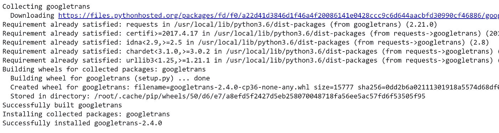
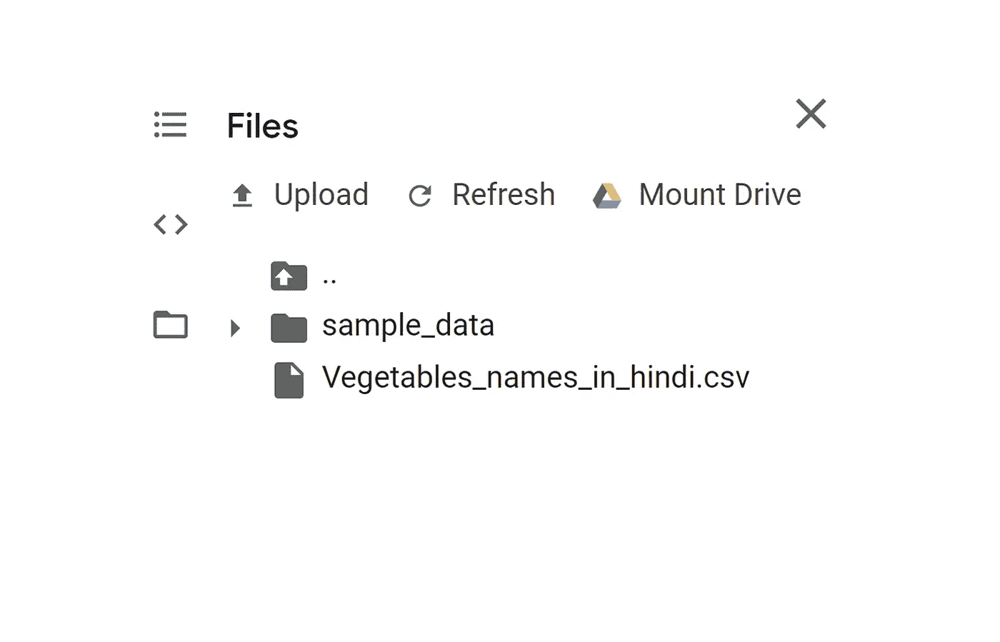
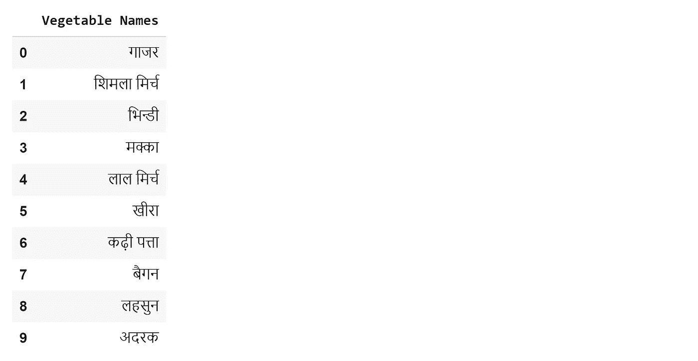
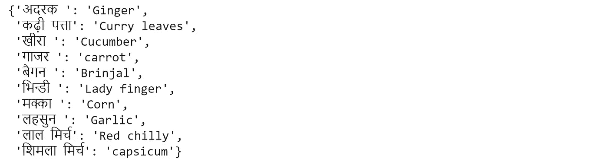

# 用于 Python 的谷歌翻译 API

> 原文：<https://towardsdatascience.com/google-translate-api-for-python-723093c2144b?source=collection_archive---------6----------------------->

## 在本教程中。我将演示如何使用 Google Translate API 将数据从印地语翻译成英语。


**图片来源** : [API 布道者](https://www.google.com/url?sa=i&url=https%3A%2F%2Fapievangelist.com%2F2011%2F08%2F25%2Fpaid-version-of-google-translate-api%2F&psig=AOvVaw0Gddrnv7iO-78xQ51zvgA3&ust=1582340795702000&source=images&cd=vfe&ved=0CAMQjB1qFwoTCPjdt4fV4ecCFQAAAAAdAAAAABAE)

有些事情我想在教程开始的时候说清楚。首先，我会将数据从[印地语](https://en.wikipedia.org/wiki/Hindi)翻译成[英语](https://en.wikipedia.org/wiki/English_language)。此外，我将在一个 [Pandas 数据框](https://pandas.pydata.org/pandas-docs/stable/generated/pandas.DataFrame.html)上演示翻译，这意味着我将把整个数据框从印地语转换成英语。这不是很好吗？好吧，我们开始吧。另外，你可以使用 [Google Colab 笔记本](https://colab.research.google.com/)来输入代码。我建议每个人都通读一下 Google Translate API for Python 的文档，这样当你开始编码的时候，你可能就知道我的意思了。这将是一件轻而易举的事，因为你在编码时会知道大部分的术语。

[](https://pypi.org/project/googletrans/) [## googletrans

### 快速和可靠-它使用相同的服务器，translate.google.com 使用自动语言检测批量翻译…

pypi.org](https://pypi.org/project/googletrans/) 

打开你的 Google Colab，新建一个笔记本，命名为“***Google _ translations . ipynb***”。在实际输入代码之前，我希望你们所有人都在笔记本里手动安装谷歌翻译库。为此，只需键入`!pip install googletrans`。该命令自动下载并安装库，如下所示:

```
# install googletrans using pip
!pip install googletrans
```



！pip 安装 googletrans

## 导入必要的库

在这一步中，我们将导入我们将在整个教程中使用的必要库。库 ***熊猫*** 用于将 CSV 数据存储到数据帧中。而 **googletrans** 显然是用于翻译的，我们也将使用它的一个方法 ***Translator*** ，你将在后面的教程中看到。

```
# Importing the necessary librariesimport pandas as pd
import googletrans
from googletrans import Translator
```

## 将 CSV 文件存储为数据帧

在这一步中，我们将在 pandas 的帮助下将 CSV 文件存储为数据帧。要获取 CSV 文件，请单击下面的链接:

 [## Vegetables_names_in_hindi.csv

### 编辑描述

drive.google.com](https://drive.google.com/open?id=1UZl-vf7uBh80GaQFk1-kxsa_zI-_rwFm) 

下载 CSV 文件后，将文件上传到 Google Colab。左手边有 3 条水平线，悬停时提示“ ***显示目录*** ”。点击转到 ***文件*** 选项卡后再按 ***上传*** 。然后上传 CSV。



上传 CSV 文件

现在，您必须读取 CSV 文件并将其存储在数据框中。为了清楚起见，我显示了数据框的前 10 行。

```
# Reading and storing the CSV file as a dataframedf = pd.read_csv('/content/Vegetables_names_in_hindi.csv')
df.head(10)
```



在熊猫图书馆的帮助下，CSV 文件存储为数据帧

## 构建翻译器函数并翻译数据帧

这是我们将数据帧从印地语翻译成英语的地方。原始代码是从一篇[文章](http://translator = Translator() translations = {} for column in df.columns:     # Unique elements of the column     unique_elements = df[column].unique()     for element in unique_elements:         # Adding all the translations to a dictionary (translations)         translations[element] = translator.translate(element).text translations)中获取的。但是我做了一些改变。因此，要了解更多关于翻译功能的信息，请点击[这里](http://translator = Translator() translations = {} for column in df.columns:     # Unique elements of the column     unique_elements = df[column].unique()     for element in unique_elements:         # Adding all the translations to a dictionary (translations)         translations[element] = translator.translate(element).text translations)。

[](/translate-a-pandas-data-frame-using-googletrans-library-fb0aa7fca592) [## 使用 googletrans 库翻译熊猫数据框

### Googletrans 是一个使用 Google Translate API 的免费 python 库。在这篇文章中，我们解释了如何使用…

towardsdatascience.com](/translate-a-pandas-data-frame-using-googletrans-library-fb0aa7fca592) 

```
translator = Translator()
translations = {}
for column in df.columns: # Unique elements of the column unique_elements = df[column].unique()
    for element in unique_elements: # Adding all the translations to a dictionary (translations) translations[element] = translator.translate(element).texttranslations
```



存储在字典中的印地语到英语的值

基本上，我将所有独特的元素存储在一个数据帧中，然后在 translator 函数(Translator())的帮助下将每个元素翻译成英语。通过这样做，您可以从上面的输出中看到，所有的元素现在都被从印地语翻译成了存储在字典中的英语。

## 将翻译后的单词替换到原始数据帧

现在，最后一步是将转换后的数据替换或保存到新的或原始的数据框中。在这里，我将借助[熊猫替换功能](https://pandas.pydata.org/pandas-docs/stable/reference/api/pandas.DataFrame.replace.html)用原始数据帧替换它。

```
# Replacing all the translated words from the dictionary to the original dataframedf.replace(translations, inplace = True)
df.head(10)
```


最终翻译的数据(英语)

您已经成功地将 CSV 文件中的数据从印地语翻译成了英语。将来，默认情况下，您可以使用本教程作为参考，将数据从不同的语言翻译成英语。我希望你们今天学到了新东西。如果你对教程有任何疑问，请在下面的评论区提问。在那之前，下次见。再见。