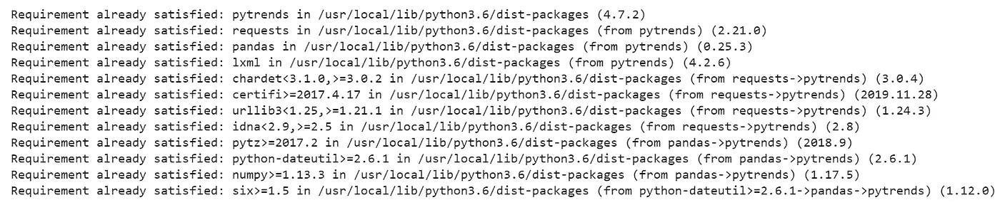
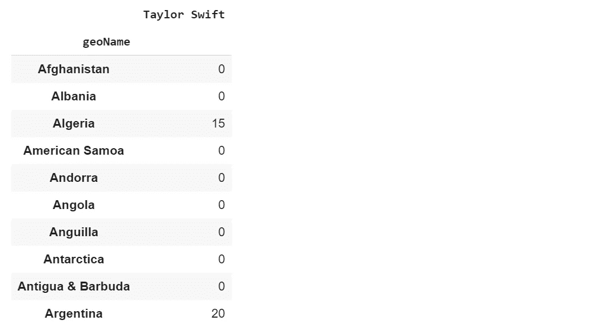
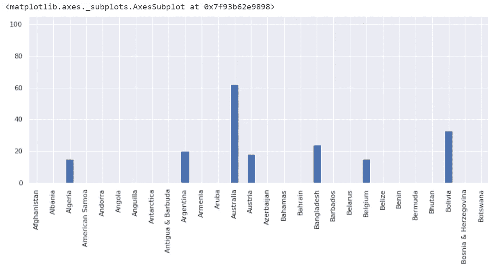
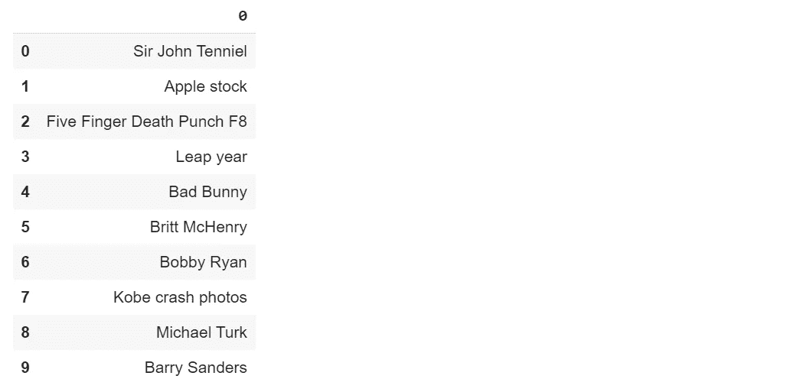
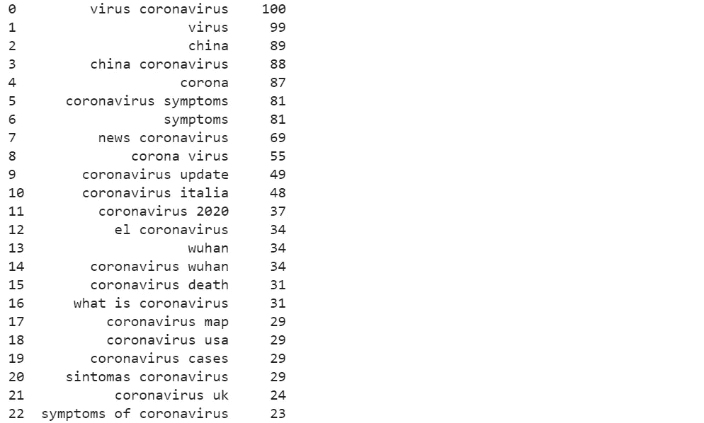

# 用于 Python 的 Google 趋势 API

> 原文：<https://towardsdatascience.com/google-trends-api-for-python-a84bc25db88f?source=collection_archive---------2----------------------->

## 在本教程中，我将演示如何使用 Google Trends API 来获取互联网上的最新热门话题。


图片来源:[谷歌趋势](https://www.google.com/url?sa=i&url=https%3A%2F%2Fknowyourmeme.com%2Fmemes%2Fsites%2Fgoogle-trends&psig=AOvVaw1rYwrfu1pNYm4zn8XcLH-u&ust=1582997539252000&source=images&cd=vfe&ved=0CA0QjhxqFwoTCPjAz8Pj9OcCFQAAAAAdAAAAABAD)

# 介绍

[Google trends](https://trends.google.com/trends/) 是一个基于各种地区和语言，分析并列出 Google search 上热门搜索结果的网站。Google Trends 是 Google 的网站(很明显)。在本教程的帮助下，您可以使用 Python 从 Google trends 网站获得趋势分析结果(以及更多)。您不需要手动搜索和复制趋势分析结果，名为`pytrends`的 Python API 会为您完成这项工作。在开始之前，我希望你们所有人浏览一下`pytrends` API 的官方文档。

[](https://pypi.org/project/pytrends/) [## pytrends

### 谷歌趋势的非官方 API 允许从谷歌趋势自动下载报告的简单界面。主…

pypi.org](https://pypi.org/project/pytrends/) 

在开始之前，本教程的全部代码可以在我的下面给出的 [***GitHub 资源库***](https://github.com/Tanu-N-Prabhu/Python/blob/master/Google_Trends_API.ipynb) 中找到。请随意探索。

[](https://github.com/Tanu-N-Prabhu/Python/blob/master/Google_Trends_API.ipynb) [## 塔努-北帕布/Python

### permalink dissolve GitHub 是 4000 多万开发人员的家园，他们一起工作来托管和审查代码，管理…

github.com](https://github.com/Tanu-N-Prabhu/Python/blob/master/Google_Trends_API.ipynb) 

# 装置

第一步是手动安装库。所以，打开你最喜欢的 IDE 或者笔记本开始输入下面的代码。我将使用 [Google Colab](https://colab.research.google.com/) ，因为这是我最喜欢的笔记本。

> **如果你用的是 jupyter notebook，就按原样输入代码(确保你有“！”**开头)

```
!pip install pytrends
```

或者，如果您使用的是 IDE，只需键入以下代码

```
pip install pytrends
```

执行上述代码后，您应该会得到如下所示的成功消息:



**库成功安装**

# 履行

## 连接到 Google

您必须首先连接到 Google，因为毕竟我们是从 Google Trends 请求 Google Trends 主题。为此，我们需要从`pytrends.request`库中导入名为`TrendReq`的方法。此外，我将导入 pandas 库来存储和可视化数据，您将在后面的教程中看到这些数据。

```
import pandas as pd                        
from pytrends.request import TrendReqpytrend = TrendReq()
```

## 按地区划分的利息

让我们看看世界范围内该地区流行的术语。我会选择，要搜索的词为“ ***泰勒斯威夫特*** ”(我好喜欢她……).

```
pytrend.build_payload(kw_list=[‘Taylor Swift’])# Interest by Region
df = pytrend.interest_by_region()
df.head(10)
```



按地区划分的利息

现在你可能在想什么是价值观，它们代表什么？这些值是按 0 到 100 的范围计算的，其中 100 是最受欢迎的位置，作为该位置中总搜索数的一部分，值 50 表示该位置受欢迎程度为一半。值为 0 表示没有足够的数据用于此项的位置。**来源** → [谷歌趋势](https://support.google.com/trends/answer/4355212)。

让我们把结果绘制在柱状图上，因为有时视觉表现能给出一个清晰的图像。

```
df.reset_index().plot(x=’geoName’, y=’Taylor Swift’, figsize=(120, 10), kind =’bar’)
```



条形图

同样，您使用参数`resolution = 'COUNTRY_NAME'`来过滤结果。

## 每日搜索趋势

现在，让我们来了解一下全球每日热门搜索趋势。为此，我们必须使用`trending_searches()`方法。如果你想在全球范围内搜索，不要传递任何参数。

```
# Get Google Hot Trends data
df = pytrend.trending_searches(pn=’united_states’)
df.head()
```



趋势搜索

确保您输入小写的国家名称`pn = "canada"`。另外，你可以将上述结果与 [google trend 的结果](https://trends.google.com/trends/trendingsearches/daily?geo=US)进行比较。要了解今天的热门话题，只需使用:

```
df = pytrend.today_searches(pn=’US’)
```

## 排行榜

让我们看看 2019 年的趋势。在`top_charts`方法的帮助下，我们可以得到每年的热门搜索。

```
# Get Google Top Charts
df = pytrend.top_charts(2019, hl='en-US', tz=300, geo='GLOBAL')
df.head()
```


去年的热门标题(2019)

要比较结果，只需访问[谷歌趋势](https://trends.google.com/trends/yis/2019/GLOBAL/)。我们可以指定想要查看趋势搜索的年份和国家。

## 谷歌关键词建议

让我们看看如何才能获得谷歌的关键词建议。如果你不知道我在说什么？下图更清楚地解释了事情。


关键词建议

```
# Get Google Keyword Suggestionskeywords = pytrend.suggestions(keyword='Mercedes Benz')
df = pd.DataFrame(keywords)
df.drop(columns= 'mid')   # This column makes no sense
```


关键词建议

## 相关查询

当用户搜索一个主题时，他们也会搜索一些相关的东西，这是很常见的事情。这些被称为相关查询。让我们看看题目“ ***冠状病毒*** ”的相关查询有哪些。请记住，当您想要更改主题名称时，只需使用新名称作为参数再次运行下面的代码。

```
pytrend.build_payload(kw_list=['Coronavirus'])
```

现在让我们运行方法`related_queries`，该方法返回一个字典，其中包含与主题“ ***冠状病毒*** ”相关的所有查询

```
# Related Queries, returns a dictionary of dataframesrelated_queries = pytrend.related_queries()
related_queries.values()
```



对冠状病毒的相关疑问

同样，您也可以搜索相关主题，只需运行以下代码即可:

```
# Related Topics, returns a dictionary of dataframesrelated_topic = pytrend.related_topics()
related_topic.values()
```

本教程到此结束，我希望你们已经学到了一些东西。如果你们对教程有任何疑问，请在评论区告诉我。虽然这是一个简短的教程，但有很多东西需要学习。好的，下节课再见，祝你有美好的一天！！！