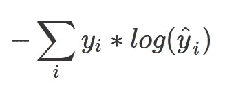
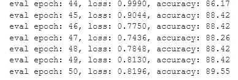

# 谷歌在机器学习中的灵活性方法

> 原文：<https://towardsdatascience.com/googles-approach-to-flexibility-in-machine-learning-170bd9d8f169?source=collection_archive---------37----------------------->

## 如何建立一个亚麻阿尔法版本的 CNN？

由 [Unsplash](https://unsplash.com/collections/8762704/flax?utm_source=unsplash&utm_medium=referral&utm_content=creditCopyText) 上 [MusicFox Fx](https://unsplash.com/@musicfox?utm_source=unsplash&utm_medium=referral&utm_content=creditCopyText) 拍摄的照片

想到机器学习，首先想到的框架是 Tensorflow 和 PyTorch，如果你想与深度神经网络合作，这是目前最先进的框架。技术变化很快，需要更多的灵活性，因此谷歌的研究人员正在为开源社区开发一个新的高性能框架:Flax。

计算的基础是 JAX 而不是 NumPy，NumPy 也是谷歌的一个研究项目。JAX 最大的优势之一是使用了 XLA，一个特殊的线性代数编译器，**支持在 GPU 和 TPU 上执行。对于那些不知道的人来说，TPU(张量处理单元)是一个专门为机器学习优化的芯片。JAX 重新实现了 NumPy 的一部分，在 GPU/TPU 上运行你的函数。**

Flax 专注于以下关键点:

*   **轻松**阅读代码
*   **更喜欢复制**，而不是糟糕的抽象或膨胀的功能
*   **有用的错误消息**，似乎他们从 Tensorflow 错误消息中吸取了教训
*   基本实现的易扩展性

赞够了，现在开始编码吧。

因为 MNIST 的例子变得很无聊，我将为辛普森一家建立一个图像分类，不幸的是，Maggie 在数据集中丢失了:-(。

数据集的样本图像

首先，我们安装必要的库并解压缩数据集。不幸的是，此时您仍然需要 Tensorflow，因为 Flax 缺少一个好的数据输入管道。

现在我们导入库。你可以看到我们有两个“版本”的 numpy，普通的 numpy 库和 JAX 实现的 API 的一部分。print 语句根据可用的硬件输出 CPU、GPU 或 TPU。

为了训练和评估，我们首先必须创建两个 Tensorflow 数据集，并将它们转换成 numpy/jax 数组，因为 FLAX 不接受 TF 数据类型。这是目前有点 hacky，因为评估方法不采取批次。我必须为 eval 步骤创建一个大的批处理，并从中创建一个 TF 特征字典，它现在是可解析的，并可以在每个时期后提供给我们的 eval 步骤。

# 模型

CNN-class 包含了我们的卷积神经网络。当你熟悉 Tensorflow/Pytorch 时，你会发现它非常简单。我们的`flax.nn.Conv`的每个调用都定义了一个可学习的内核。我使用了 MNIST 的例子，并用一些额外的层来扩展它。最后，我们有四个输出神经元的密集层，因为我们有一个四类问题。

与 Tensorflow 不同，激活函数是显式调用的，这使得测试新的和自己编写的激活函数变得非常容易。FLAX 基于模块抽象，启动和调用网络都是通过 apply 函数完成的。

# 亚麻的度量标准

当然，我们想衡量我们的网络变得有多好。因此，我们计算损失和准确性等指标。我们的精度是用 JAX 库计算的，而不是 NumPy，因为我们可以在 TPU/GPU 上使用 JAX。

为了测量我们的损失，我们使用交叉熵损失，不像在 Tensorflow 中它是由你自己计算的，我们还没有可能使用现成的损失对象。如你所见，我们使用`@jax.vmap`作为损失函数的函数装饰器。这将我们的代码矢量化，以便在批处理中高效运行。

`cross_entropy_loss`是如何工作的？`@jax.vmap`接受两个数组，logits 和 label，并对每一对执行我们的`cross_entropy_loss`，从而允许批处理的并行计算。单个示例的交叉熵公式为:

对于四个输出神经元中的一个，我们的基本事实 y 是 0 或 1，因此我们的代码中不需要求和公式，因为我们只需要计算正确标签的 log(y_hat)。在我们的损失计算中使用平均值，因为我们有批次。

# **培训**

在我们训练步骤中，我们再次使用函数装饰器`@jax.jit`，来加速我们的函数。这与 Tensorflow 非常相似。请记住`batch[0]`是我们的图像数据，`batch[1]`是我们的标签。

损失函数`loss_fn`返回当前模型`optimizer.target`的损失，我们的`jax.grad()`计算其梯度。在计算之后，我们像在张量流中一样应用梯度。

在 FLAX 中，评估步骤非常简单。请注意，完整的评估数据集将传递给此函数。

经过 50 个纪元后，我们有了非常高的精确度。当然，我们可以继续调整模型和优化超参数。

对于这个实验，我使用了 Google Colab，所以如果你想自己测试，用 GPU/TPU 创建一个新环境，并从 Github 导入我的笔记本。请注意，FLAX 目前不在 Windows 下工作。

# 结论

值得注意的是 **FLAX 目前仍处于 alpha** 阶段，并不是谷歌的官方产品。

到目前为止，这项工作给快速、轻量级和高度可定制的 ML 框架带来了希望**。目前完全缺少的是数据输入管道，所以 Tensorflow 仍然必须使用。目前的一组优化器很不幸地仅限于带有动量的 ADAM 和 SGD。我特别喜欢如何使用这个框架的非常严格的前进方向和高度的灵活性。我的下一个计划是开发一些目前还没有的激活功能。Tensorflow、PyTorch 和 FLAX 之间的速度比较也会非常有趣。**

如果你想尝试一下 FLAX，可以查看一下[文档](https://flax.readthedocs.io/en/latest/notebooks/flax_intro.html)和他们的 [Github 页面](https://github.com/google/flax/tree/prerelease)。

如果你想下载我的带有数据集的例子，只需克隆 SimpsonsFaceRecognitionFlax。