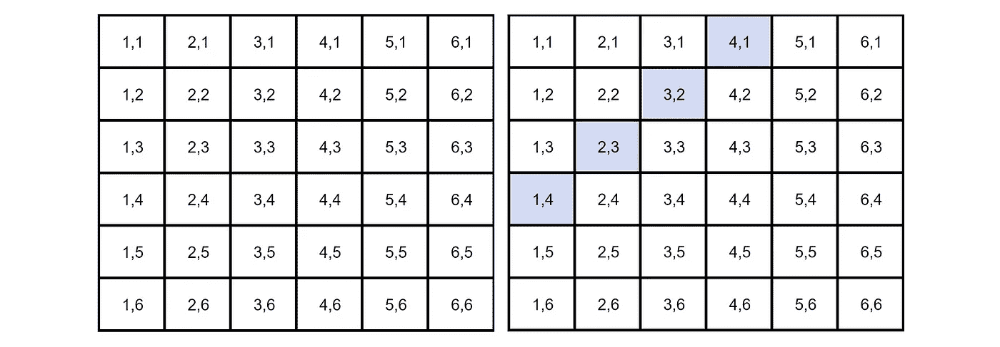

# 谷歌的数据科学面试脑筋急转弯

> 原文：<https://towardsdatascience.com/googles-data-science-interview-brain-teasers-7f3c1dc4ea7f?source=collection_archive---------3----------------------->

## 简单、直观地解释谷歌的一些问题解决方案

照片由[米切尔罗](https://unsplash.com/@mitchel3uo?utm_source=unsplash&utm_medium=referral&utm_content=creditCopyText)在 [Unsplash](https://unsplash.com/s/photos/google?utm_source=unsplash&utm_medium=referral&utm_content=creditCopyText)

作为谷歌数据科学面试的一部分，他们喜欢问一些他们称之为“解决问题”的问题，这些问题非常类似于脑筋急转弯。在这篇文章中，我们将看看谷歌提出的六个问题，并提供以下答案！

*如果你对更多的问题和解决方案感兴趣，请点击这里的* *查看谷歌数据科学访谈中问到的一堆* [*产品、SQL 和编码问题。否则，这里有一个关于*](https://www.interviewquery.com/blog-google-data-science-interview-questions-and-solutions/) [*在谷歌数据科学面试*](https://www.interviewquery.com/blog-the-google-data-scientist-interview/) *中期待什么的伟大指南。*

# 问题和答案

## **1。一个盒子里有 12 张红卡和 12 张黑卡。另一个盒子里有 24 张红牌和 24 张黑牌。你想从两个盒子中的一个里随机抽取两张卡片，一次抽取一张。哪个盒子得到同色卡片的概率更大，为什么？**

有 24 张红卡和 24 张黑卡的盒子获得两张同色卡片的概率更大。让我们走过每一步。

假设你从每副牌中抽出的第一张牌是红色的 a。

这意味着在有 12 个红和 12 个黑的牌组中，现在有 11 个红和 12 个黑。因此，你再抽一张红色的几率等于 11/(11+12)或 11/23。

一副牌中有 24 个红和 24 个黑，那么就有 23 个红和 24 个黑。因此，你再抽一张红色的几率等于 23/(23+24)或 23/47。

由于 23/47 > 11/23，所以卡数较多的第二副牌有较大概率得到相同的两张牌。

## **2。你在赌场，有两个骰子可以玩。你每掷一次 5 就赢 10 美元。如果你一直玩到你赢了然后停止，预期的回报是多少？**

*   我们假设每次你想玩的时候要花 5 美元。
*   两个骰子有 36 种可能的组合。
*   在 36 种组合中，有 4 种组合会掷出 5(*见蓝色*)。这意味着有 4/36 或 1/9 的机会掷出 5。
*   1/9 的胜算意味着你会输八次，赢一次(理论上)。
*   因此，您的预期支出等于$ 10.00 * 1-$ 5.00 * 9 =-35.00。

*编辑:谢谢各位的评论和指出，应该是-$35！*

## **3。如何判断给定的硬币是否有偏差？**

这不是一个难题。答案很简单，就是进行假设检验:

1.  零假设是硬币没有偏向，翻转头的概率应该等于 50% (p=0.5)。另一个假设是硬币有偏差，p！= 0.5.
2.  抛硬币 500 次。
3.  计算 Z 得分(如果样本小于 30，则需要计算 t 统计量)。
4.  对比 alpha(双尾检验所以 0.05/2 = 0.025)。
5.  如果 p 值>α，则不拒绝 null，硬币不偏。
    如果 p 值<α，则 null 被拒绝，硬币有偏差。

*在这里* *了解更多假设检验* [*。*](https://www.statisticshowto.datasciencecentral.com/probability-and-statistics/hypothesis-testing/)

## **4。让不公平的硬币变得公平**

由于抛硬币是二进制的结果，你可以通过抛两次硬币来使不公平的硬币变得公平。如果你掷两次，有两种结果可以赌:正面跟着反面或者反面跟着正面。

> P(正面)* P(反面)= P(反面)* P(正面)

这是有意义的，因为每一次抛硬币都是一个独立的事件。这意味着如果你得到正面→正面或反面→反面，你需要重新抛硬币。

## **5。你即将登上去伦敦的飞机，你想知道你是否必须带雨伞。你随便打电话给三个朋友，问他们是否在下雨。你的朋友说实话的概率是 2/3，他们通过撒谎对你恶作剧的概率是 1/3。如果他们三个都说在下雨，那么伦敦下雨的概率是多少。**

你可以看出这个问题与贝叶斯理论有关，因为最后一个陈述本质上遵循这样的结构，“假设 B 为真，A 为真的概率是多少？”因此，我们需要知道某一天伦敦下雨的概率。假设是 25%。

P(A) =下雨的概率= 25%
P(B) =三个朋友都说在下雨的概率
P(A|B)假定他们说在下雨的概率
P(B|A)假定在下雨的情况下三个朋友都说在下雨的概率= (2/3) = 8/27

*第一步:求解 P(B)*
P(A | B)= P(B | A) * P(A)/P(B)，可以改写为
P(B)= P(B | A)* P(A)+P(B |非 A)* P(非 A)
P(B)=(2/3)* 0.25+(1/3)* 0.75 = 0.25 * 8/27+0.75 * 1

*第二步:求解 P(A | B)*
P(A | B)= 0.25 *(8/27)/(0.25 * 8/27+0.75 * 1/27)
P(A | B)= 8/(8+3)= 8/11

因此，如果三个朋友都说在下雨，那么有 8/11 的几率是真的在下雨。

## **6。给你 40 张四种不同颜色的卡片——10 张绿卡，10 张红牌，10 张蓝卡，10 张黄牌。每种颜色的卡片都从一到十编号。随机抽取两张牌。找出所选卡片不是相同号码和相同颜色的概率。**

由于这些事件不是独立的，我们可以使用规则:
P(A 和 B) = P(A) * P(B|A)，也等于
P(非 A 非 B) = P(非 A) * P(非 B |非 A)

例如:

P(非 4 非黄)= P(非 4) * P(非黄|非 4)
P(非 4 非黄)= (36/39) * (27/36)
P(非 4 非黄)= 0.692

所以，挑出来的牌不是同号同色的概率是 69.2%。

就是这样！如果任何答案没有意义，请让我来，我会尽我所能解释得更透彻:)

> 如果你对更多数据科学问题感兴趣，请查看[面试提问](https://www.interviewquery.com/)。

# 感谢阅读！