# Google 的 EfficientDet:概述

> 原文：<https://towardsdatascience.com/googles-efficientdet-an-overview-8d010fa15860?source=collection_archive---------7----------------------->

[来源](https://pixabay.com/photos/m31-space-astronomy-astronomical-3613931/)

## 使用网络优化网络

如果你像我一样，读了谷歌的 EfficientDet 论文，你会问“到底发生了什么？”。不要担心，我已经审阅了论文，并将尽我所能解释这个模型。

这个模型建立在以前的工作(像许多其他模型一样)之上，更具体地说，是一项被称为 EfficientNet 的关键工作:

1.  [EfficientNet:反思卷积神经网络的模型缩放](https://arxiv.org/abs/1905.11946)

在我们深入研究谷歌新的目标检测模型的细节之前，让我们先做一下 EfficientNets 的背景工作。

# 效率网

本文作者关注如何有效地扩展卷积神经网络(ConvNets)以提高性能。缩放网络以提高性能的典型方法是增加以下之一:网络深度、宽度或图像分辨率。虽然有可能将两个或更多的这些一起缩放，但是目前这是一个冗长的过程，并且通常导致模型具有次优的准确性和效率。下面是不同缩放方法的图示，直接摘自该论文:

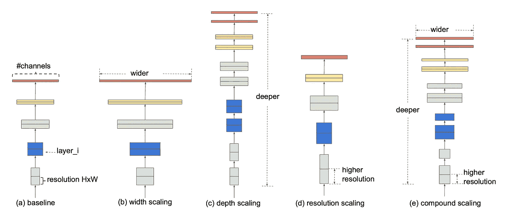

缩放神经网络模型的方法。摘自[谭&乐 2019](https://arxiv.org/abs/1905.11946)

作者旨在回答这个问题:

> 有没有一种原理性的方法可以提高网络的精度和效率？

你可能已经猜到了，但答案是肯定的。他们发现平衡网络宽度/深度/分辨率的所有维度非常重要。让你吃惊的是他们的缩放方法的简单性。他们只是用一个恒定的比例来缩放每个维度。就是这样！他们称这种方法为*复合缩放*。随着用于训练神经网络的图像变得更大，复合缩放开始变得有意义，因为更大的图像需要更深的网络来增加感受域，并需要更多的通道来捕捉更大图像中的更小细节。

我们很快发现，模型缩放带来的性能提升在很大程度上依赖于基线网络。作者更进一步，使用一种叫做神经结构搜索(NAS)的算法来寻找最佳基线网络。在给定目标函数的情况下，高级 NAS 算法使用强化学习来确定最佳结构。使用 NAS 创建了一个新的模型系列，称为 *EfficientNets。*在 ImageNet 数据集上将这些模型的性能与 ConvNets 进行了比较，结果如下图所示:

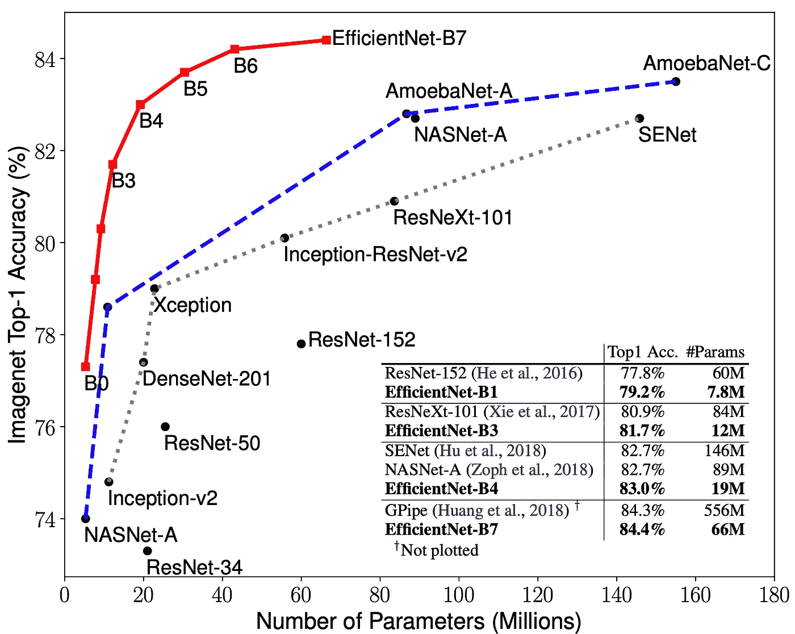

与其他分类器相比，EfficientNet 系列的性能。摘自[谭&乐 2019](https://arxiv.org/abs/1905.11946)

从这些结果中引人注目的是，这些模型在准确性和参数数量方面都优于其他先进模型。作者还表明，这些模型可以很好地转移到其他数据集，在 8 个公开可用的数据集中，有 5 个成为得分最高的模型，同时参数减少了 21 倍。

## 复合模型缩放

那么复合缩放实际上是如何工作的呢？首先，让我们将 ConvNet 定义为:

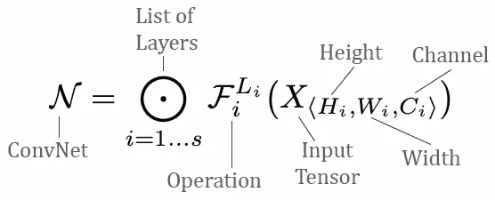

[谭&乐，2019](https://arxiv.org/abs/1905.11946) 一个共网的定义

他们本质上将其描述为由应用于输入张量的运算(例如卷积)组成的层列表。

复合缩放试图扩展网络长度(Lᵢ)、宽度(Cᵢ)和/或分辨率(Hᵢ、Wᵢ)，而不改变基线网络中预定义的 Fᵢ。固定 Fᵢ的基本原理是为了减少设计空间，但考虑到 Lᵢ、Cᵢ、Hᵢ和 Wᵢ仍然可以探索每一层，设计空间仍然相当大。为了进一步减小设计空间，施加了一个限制，即所有层必须以恒定的比率均匀缩放。复合缩放的目标是在给定资源约束的情况下最大化模型的准确性，这被公式化为一个优化问题:

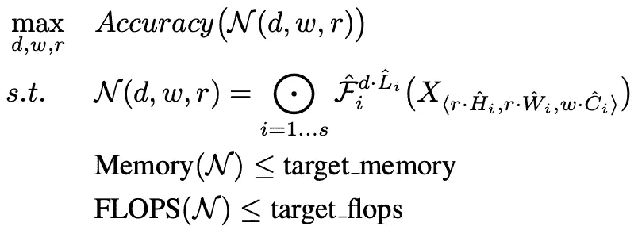

复合扩展的目标是优化系统资源约束。摘自摘自[谭&乐，2019](https://arxiv.org/abs/1905.11946)

w、d 和 r 是用于缩放网络宽度、深度和分辨率的系数。预定义参数的符号上方有一个^。预定义网络的示例如下所示:

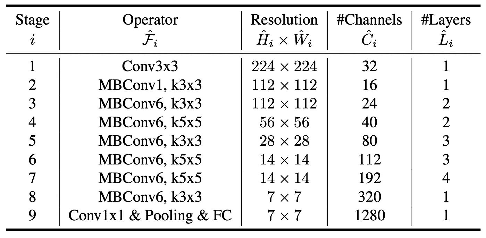

预定义的高效网络。摘自[谭&乐 2019](https://arxiv.org/abs/1905.11946)

## 缩放尺寸

扩展 ConvNet 的深度(d)、宽度(w)和分辨率(r)的难点在于，这三者相互依赖，并且会在不同的资源限制下发生变化。因此，通常只在一个维度上缩放。

**深度:**缩放深度是缩放 ConvNet 最常见的方式。网络变得更深，因为更深的网络可以提取更丰富和更复杂的特征。不利的一面是，由于梯度消失的问题，更深的凹网更难训练。这个问题通过跳过连接和批量标准化得到了缓解，但是对于非常深的网络来说，回报是递减的。

**宽度:**通常用于较小的车型。这些网络通常更擅长捕获图像的细粒度特征，并且更容易训练。

**分辨率:**提高图像的输入分辨率，ConvNets 可以捕捉图像中的细粒度模式。早期的 con vnet 在 224x224 上训练，而较新的 con vnet 在 480x480 上训练。下图显示了分别扩展这些维度的性能(在预定义的网络上执行扩展，如上所示):

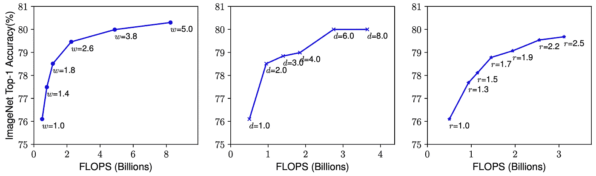

通过单独扩展每个维度来提高性能。左边是宽度，中间是深度，右边是分辨率。摘自[谭&乐 2019](https://arxiv.org/abs/1905.11946)

这一结果的主要观察结果表明，扩大网络的深度、宽度和分辨率可以提高精度，但对于更深、更大的模型，精度会降低。

## **复合缩放**

到目前为止，显而易见的是，标度维数不是独立的。例如，作者指出:

> 更高分辨率的图像应该需要更深的网络，以便更大的感受野可以在更大的图像中捕获包括更多像素的类似特征。

作为提高分辨率的结果，网络宽度也应该增加以捕捉更精细的细节。这些直觉表明，模型需要在所有这些维度上进行缩放，而不是在单一维度上。为了验证他们的直觉，作者在深度(d)和分辨率(r)的不同组合上测量了网络的宽度(w)(下图)。下图中的缩放示例从基线网络(d=1.0，r=1.0)开始，有 18 个分辨率为 224x224 的卷积层。最后一个基线网络(d=2.0，r=1.3)产生 36 个卷积层，分辨率为 299x299。

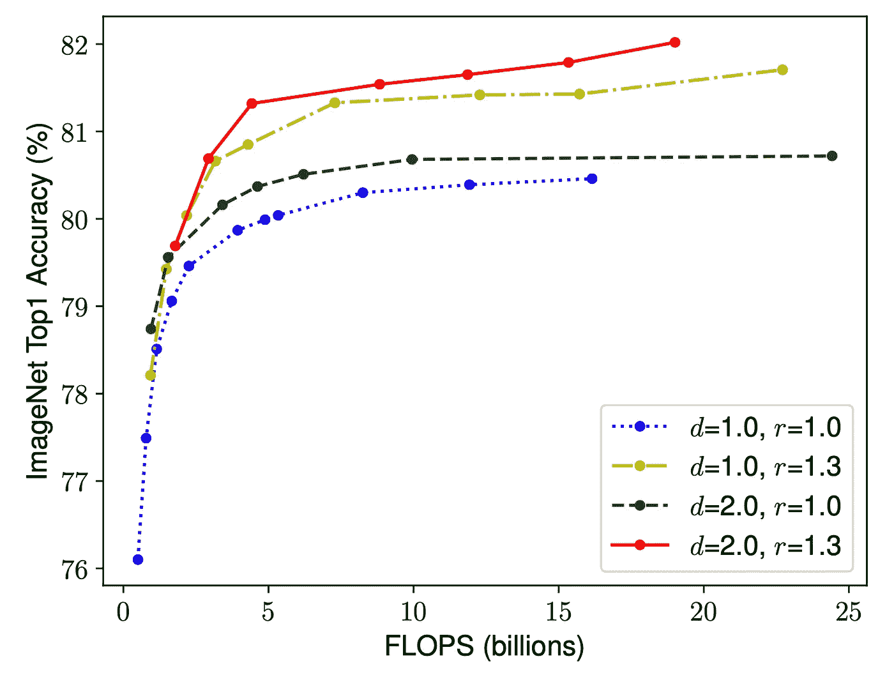

扩展网络宽度。每条线代表由图例中定义的系数缩放的不同作品。每条线上的一点显示不同的宽度。该网络是从前面显示的预定义网络扩展而来的。摘自[谭&乐 2019](https://arxiv.org/abs/1905.11946)

这一结果使作者观察到，为了获得更好的模型精度和效率，在缩放过程中平衡网络的所有维度是重要的。根据这一观察，他们提出了一种复合缩放方法。该方法使用复合缩放系数φ来统一缩放网络尺寸:

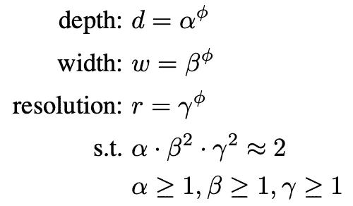

在等式中，α、β和γ是常数，可以通过网格搜索来确定。用户定义的系数(φ)控制如何为模型缩放分配资源。而α、β和γ分别定义了如何将这些资源分配给网络的宽度、深度和分辨率。

通过缩放现有的 ConvNets 来评估缩放方法。为了真正利用这种新方法，一个名为 **EfficientNet 的新架构家族应运而生。**他们通过使用 NAS 优化准确性和 FLOPS 来构建基线网络。他们的研究产生了一个叫做 **EfficientNet-B0** 的高效网络。下表说明了 EfficientNet-B0 网络(它与前面显示的预定义网络完全相同):

高效网络-B0 网络。摘自[谭&乐 2019](https://arxiv.org/abs/1905.11946)

他们的下一步是通过分两步应用复合扩展来扩展 EfficientNet-B0:

1.  将φ固定为 1。对α、β和γ进行网格搜索。他们发现 EfficentNet-B0 的最佳值为α = 1.2，β = 1.1，γ = 1.15。
2.  将α、β和γ固定为常数，并按比例放大不同φ的基线网络，以获得到 B7 的有效 Net-B1。

下表显示了这些新网络与其他先进网络相比的性能:

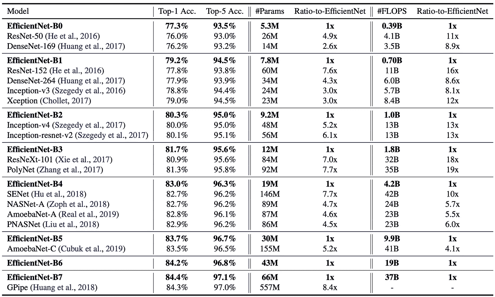

EfficinetNet 模型系列与其他分类器相比的性能。摘自[谭&乐 2019](https://arxiv.org/abs/1905.11946)

与现有的 ConvNets 相比，EfficientNets 的性能始终更好，并且减少了参数和触发器的数量。下表和下图进一步证实了这一点:

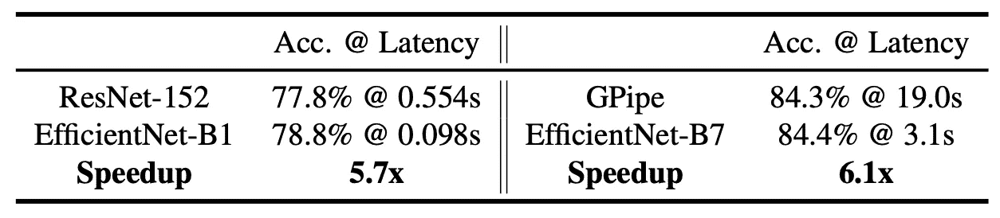

通过高效网络实现的速度提升。摘自[谭&乐 2019](https://arxiv.org/abs/1905.11946)

与 ResNet-152 相比，EfficientNet-B1 的 CPU 延迟快 5.7 倍，尽管它们具有相当的准确性。在精确度范围的顶端，GPipe 模型对于数据集上具有 84.3%精确度的单个图像具有 19.0 秒的延迟。最大的 EfficientNet 型号(B7)只有 3.1 秒的延迟，这是 6.1 倍的加速。下图显示了 FLOPS 与 Imagenet Top-1 精度的对比。

与其他分类器相比，EfficientNet 模型系列的 FLOPS。摘自[谭&乐，2019](https://arxiv.org/abs/1905.11946)

该图清楚地显示了 EfficientNet 系列更好地利用了可用资源，该模型在准确性方面表现更好，并且显著减少了 FLOPS 的数量。

**单维缩放**

为了消除复合缩放方法对 EfficientNet 架构的影响，B0 架构仅在一维上进行缩放。这些结果如下图所示:

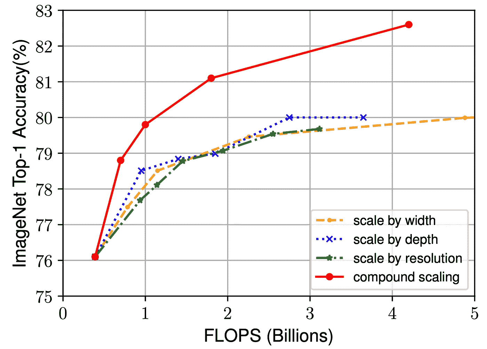

用不同的方法扩展 EfficientNet-B0 网络。摘自[谭&乐 2019](https://arxiv.org/abs/1905.11946)

显而易见，复合比例远远优于单一维度的比例，后者很快导致收益递减。这突出了复合缩放的重要性。为了进一步理解为什么复合缩放如此有效，下图比较了一系列缩放 B0 模型的类激活图:

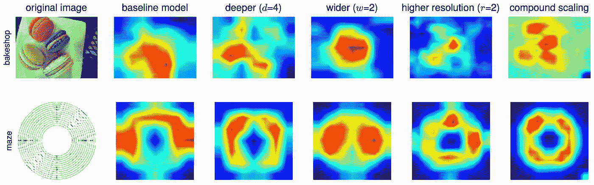

不同缩放方法的类激活图。显示复合缩放提供了更多相关的激活。摘自[谭&乐 2019](https://arxiv.org/abs/1905.11946)

复合缩放模型倾向于关注具有更多相关对象细节的区域。其他型号对这些细节关注较少。

总体而言，本文作者表明，在给定一组资源约束的情况下，平衡网络深度、宽度和分辨率对于优化性能至关重要。复合缩放方法提供了一种在所有这些维度上有效缩放模型的优雅方式。这就引出了本文的下一部分，Google 的 EfficientDet，它建立在上面讨论的工作之上。

# EfficientDet:可扩展且高效的对象检测

近年来，在对象检测方面取得了巨大的进步，产生了更精确的模型，但代价是增加了计算量。这些巨大的计算成本将阻碍它们在许多现实世界应用中的部署，例如自动驾驶汽车，其中低延迟预测是必要的。在这样的约束下，模型效率对于对象检测来说非常重要。模型检测器架构，如一级和无锚检测器更有效，但通常以精度为代价。因此，人们自然会问:

> 是否有可能建立一个可扩展的检测架构，同时具有更高的准确性和更好的效率？

Google 的 EfficientDet 旨在解决这个问题，要回答这个问题，我们首先需要了解当前物体探测器设计选择的挑战:

**挑战 1——高效的多尺度特征融合:**特征金字塔网络(FPN)广泛用于多尺度特征融合。最近的工作，如 PANet 和 NAS-FPN 允许跨尺度特征融合。先前的特征融合方法简单地将特征相加在一起，然而，这些特征具有不同的分辨率，并且已经观察到对输出融合特征的贡献不相等。为了解决这个问题，提出了加权双向特征金字塔网络。BiFPN 具有可学习的权重来确定不同输入特征的重要性，其应用自顶向下和自底向上的多尺度特征融合。

**挑战 2 -模型缩放:**对象检测器的模型缩放通常会牺牲准确性或效率。受 EfficientNets 作者所做工作的启发，提出了一种用于对象检测器的复合缩放方法。像 EfficientNets 一样，这种缩放方法也可以缩放网络的深度、宽度和分辨率。

EfficientNet 与提议的 BiFPN 和复合缩放的结合创造了一个新的检测机系列，称为 **EfficientDet** 。与以前的物体检测器相比，该系列模型始终实现了更高的精度，并将触发器数量减少了一个数量级。EfficentDet 对目标探测社区的贡献可以总结为三点:

*   BiFPN 简介。这是一个加权的双向特征网络，便于进行多尺度特征融合
*   提出一种缩放方法，以原则方式缩放主干、特征网络、盒/类网络和分辨率
*   结合以上两点，产生了 EfficientDet，一种新的物体检测器系列。这些模型在广泛的资源限制范围内具有更好的准确性和效率

## BiFPN

为了理解 BiFPN 的贡献，我们需要首先将问题公式化。多尺度特征融合旨在聚合不同分辨率的特征。这可以表示为多尺度特征的列表:

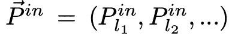

其中上面的每个元素代表 lᵢ.级别的特征目标是找到一个转换 *f* ，它可以聚集特性并输出一系列新特性:

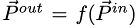

为了理解这一点的重要性，我们来看一下传统的 FPN，它集成了不同尺度的功能:

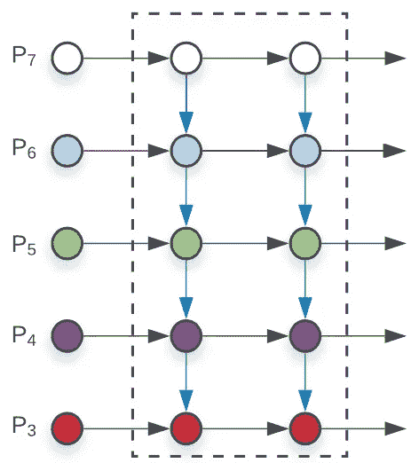

传统的 FPN 网络。摘自 [*谭等著 2019 年*](https://arxiv.org/abs/1911.09070)

它有 3–7 个输入要素(P₃ - P₇)，其中每个输入要素代表一个具有给定分辨率的要素级别。该 FPN 以自上而下的方式聚合多尺度要素:

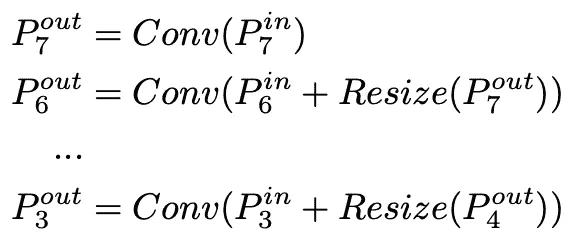

*Resize* 通常是分辨率匹配的上采样或下采样操作。最后， *Conv* 是用于特征处理的卷积运算。

上面显示的 FPN 固有地受到信息单向流动的限制。为了解决这个问题，PANet 增加了一个自下而上的路径，NAS-FPN 使用神经架构搜索来寻找更好的跨尺度特征网络拓扑。下图显示了这两种网络设计:

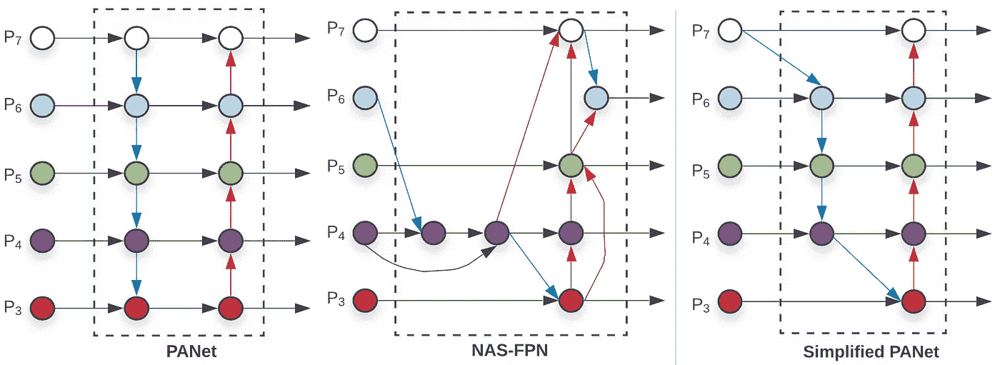

三种不同的 FPN 结构。★2019*[*谭等。*](https://arxiv.org/abs/1911.09070)*

作者表明，PANet 比 NAS-FPN 获得了更好的精度，但代价是更多的参数和计算。提出了几项优化措施:

1.  移除只有一条输入边的结点。如果某个结点只有一条输入边，且没有要素融合，则该结点对要素网络目标的贡献可能较小。这导致了一个简化的面板(见上图)
2.  从输入节点到输出节点只在同一层增加一条额外的边。这将融合更多的功能，而不需要太多的额外成本
3.  存在双向信息流(自上而下和自下而上)。每个双向路径被视为其自己的层，因此允许这些层重复，从而实现更高级别的特征融合(BiFPN，如下)

通过这些优化，新的特征网络被命名为**双向特征金字塔网络(BiFPN)。**BIF pn 如下图所示:

BiFPN 结构。摘自 [*谭等译 2019*](https://arxiv.org/abs/1911.09070)

**加权特征融合**

如前所述，不同分辨率的特征融合通常包括调整它们的大小，然后进行求和运算。这种方法的缺点是所有特征都被同等对待。由于这些特征具有不同的分辨率，它们通常对输出特征的贡献是不相等的。为了解决这个问题，计算每个输入特征的额外权重，以允许网络学习每个特征的重要性。总共测试了三种加权融合方法:

1.  **无界融合**:包含一个无界可学习权重。但是，因为它是无界的，所以会导致训练不稳定，所以被丢弃
2.  **基于 Softmax 的融合**:对每个权重应用 softmax，从而将权重限制在 0 到 1 之间，但这导致延迟显著增加。
3.  **快速归一化融合**:等式如下。通过 Relu 的应用，确保每个权重(ωᵢ)大于或等于零。ϵ设置为 0.001 以避免数值稳定性。与基于 softmax 的方法相比，这种计算在 GPU 上要快 30%。

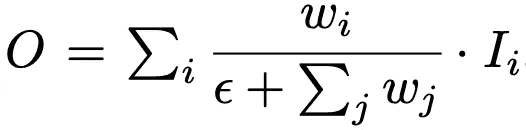

快速标准化融合。摘自 [*谭等著 2019*](https://arxiv.org/abs/1911.09070)

最终的 BiFPN 集成了双向跨尺度连接和快速归一化方法。这方面的一个例子如下所示，它是 BiFPN 中的第 6 层:

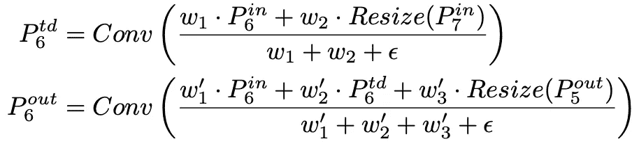

P6 层中跨尺度连接的集成示例。摘自 [*谭等译 2019*](https://arxiv.org/abs/1911.09070)

上面的等式是自上而下路径的中间等式，下面的等式是自下而上路径的等式。

## 效率检测

随着 BiFPN 的发明，一种新的检测器系列被创造出来，称为 EfficientDet。EfficientDet 的架构如下所示，使用 EfficientNet 作为主干网络。

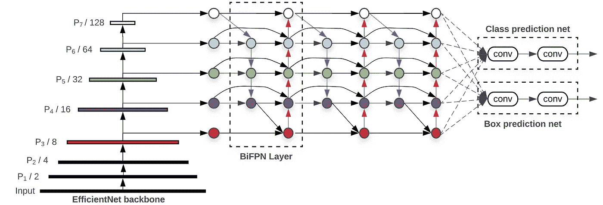

具有 EfficientNet 主干和 BiFPN 结构的 EfficientDet 架构。摘自 [*谭等著 2019 年*](https://arxiv.org/abs/1911.09070)

该网络中的 BiFPN 用作特征网络。它从主干网络中提取第 3 - 7 层的特征，并重复应用 BiFPN。融合后的特征被输入到一个类和盒网络中，以预测物体的类和包围盒。

**复合缩放**

受 EfficientNets 中复合缩放的启发，提出了一种新的复合缩放目标检测方法。该方法使用系数(φ)来联合放大主干网络、BiFPN 网络、类/箱网络和分辨率的所有维度。每个网络组件的扩展描述如下:

*   **主干网络:**使用 B0-B6 中定义的相同系数，以便可以重复使用其 ImageNet 预训练权重
*   **BiFPN:** 宽度呈指数增长(通道)，深度呈线性增长(层)。形式上，宽度和深度使用以下等式进行缩放:

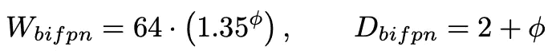

*   **框/类预测网络:**宽度固定为与 BiFPN 中相同，但深度线性增加，如下所示:

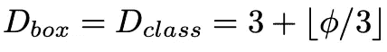

*   **输入图像分辨率:**由于分辨率必须能被 2⁷ = 128 整除，因此分辨率也线性增加。这是通过以下等式实现的:

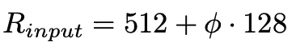

使用上面所示的三个等式，创建了从 efficient det-D0(φ= 0)到 D6(φ= 6)的家族网络。下表进一步阐述了这一点:

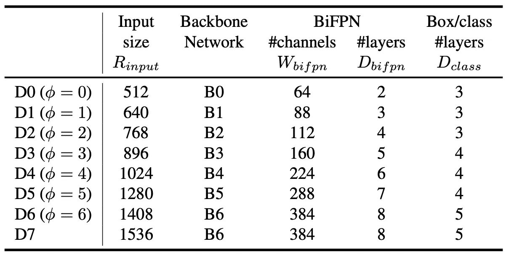

不同 EfficientDet 模型的架构总结。摘自 [*谭等著 2019*](https://arxiv.org/abs/1911.09070)

该表还包含一个 D7 模型，除非更改批量大小或其他设置，否则该模型无法放入内存。结果，通过仅增加输入图像分辨率，D6 模型被扩展到 D7。

**性能**

这些型号与其他探测器相比如何？下表显示了 EfficientDet 系列与按精度分组的其他型号的比较:

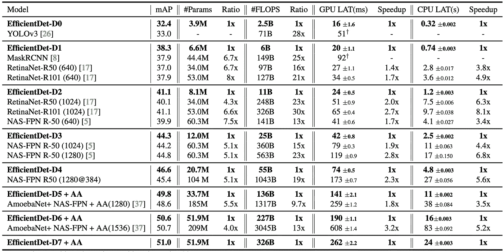

与其他检测机相比，EfficientDet 系列型号的性能。摘自[【谭】等著 2019](https://arxiv.org/abs/1911.09070)

与以前的检测机相比，EfficientDet 系列型号在各种精度水平和资源限制下实现了更高的精度和效率。

为了了解 BiFPN 对模型性能的贡献，下表比较了主干网和 BiFPN 的影响:

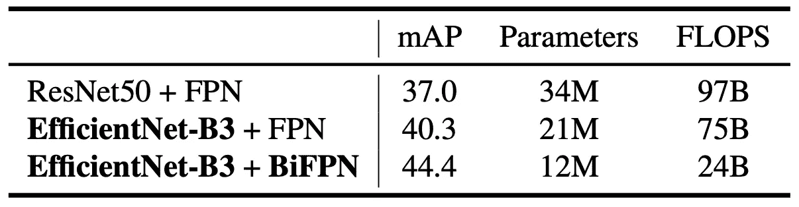

EfficientDet 模型中每个组件的贡献(根据 mAP)。摘自 [*谭等著 2019 年*](https://arxiv.org/abs/1911.09070)

很明显，强主干结构提高了性能，但是 BiFPN 的增加不仅通过增加 mAP 而且通过减少参数和触发器的数量进一步提高了性能。另一个关键的补充是加权连接。与其他 fpn 相比，加权连接如何影响性能:

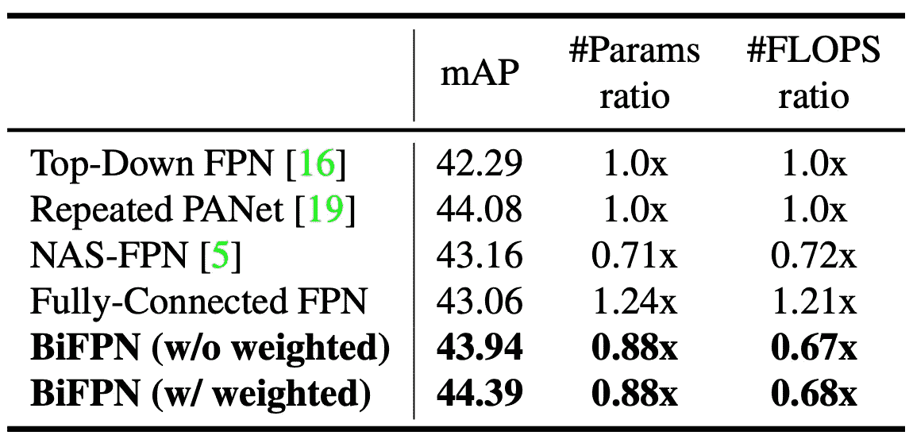

加权连接对地图的影响。摘自 [*谭等译 2019*](https://arxiv.org/abs/1911.09070)

你可以看到，受到单向信息流限制的普通 FPN 精确度最低。PANet 和 NAS-FPN 模型显示了更高的精度，但需要更多的参数和触发器。总体而言，BiFPN 以更少的参数和触发器实现了最佳精度。

# 结论

EfficientDet 网络深受 EfficientNet 模型工作的启发。使用复合缩放，与其他现代对象检测模型相比，该模型在准确性和效率方面的性能都得到了提高。事实证明，EfficientDet 系列模型在 GPU 和 CPU 上具有显著的加速性能，这对于要求低延迟的应用程序来说至关重要。我相信我们正在进入一个目标探测发展的阶段，在这个阶段优化当前的模型将变得至关重要。我们总是可以建立更大更深的模型以获得更高的精确度，但是我们能优化它们以充分利用它们吗？