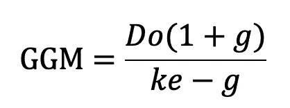
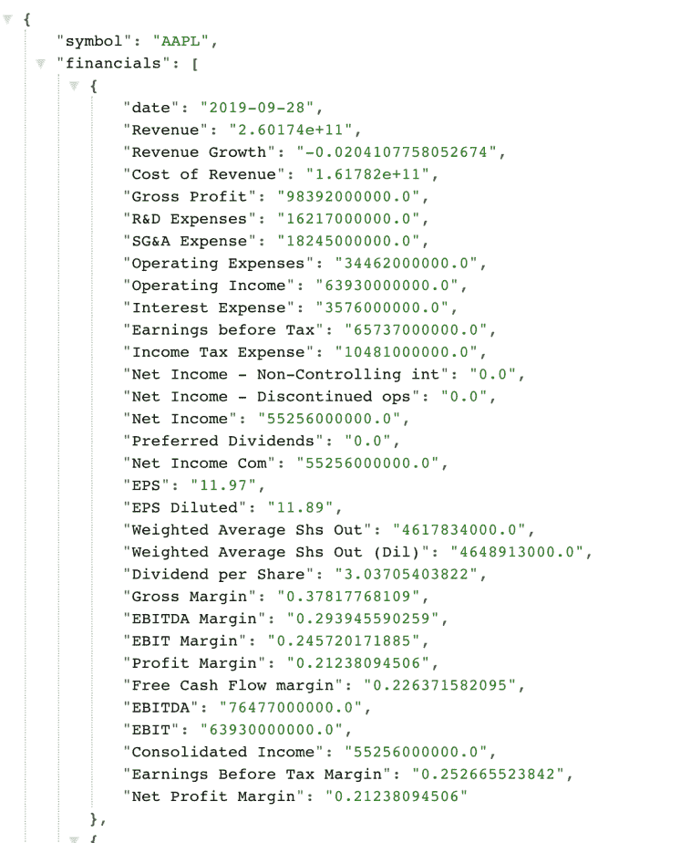
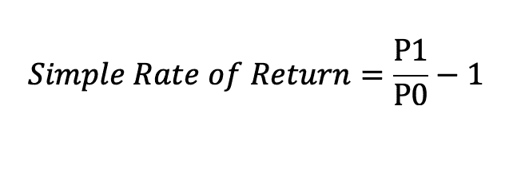

# 基于 Python 的戈登增长模型

> 原文：<https://towardsdatascience.com/gordon-growth-model-with-python-c2670c8022a9?source=collection_archive---------27----------------------->

## 使用 Gordon 增长模型评估 Python 公司的价值

戈登增长模型(GGM)是一种用来评估公司价值的工具。这一理论假设公司的价值是所有未来股息支付的总和贴现到今天的价值(即现值)。也可以称为股利贴现模型。在这篇文章中，我们将**学习如何使用 Python** 的 **戈登增长模型对一家公司进行估值。**


照片由 [Aditya Vyas](https://unsplash.com/@aditya1702?utm_source=unsplash&utm_medium=referral&utm_content=creditCopyText) 在 [Unsplash](https://unsplash.com/s/photos/equity?utm_source=unsplash&utm_medium=referral&utm_content=creditCopyText) 拍摄

# 理解戈登增长模型(GGM)

GGM 模型的优点之一是计算起来非常简单。



评估公司价值的戈登增长模型

为了计算我们的模型，我们只需要三个元素:

*   **股息(Do)** :公司支付的股息。通过查看公司公开的年度/季度报告，我们可以很容易地获得公司支付的最新股息。
*   **增长(g):** 是红利预期的**常数**增长率。计算 g 的一种方法是，取一家公司最近支付的两到三次股息，计算增长，并用它来代表持续增长。这种方法的问题是，如果一家公司保持其股息支付年复一年不变，在我们的计算增长率将为零。为了解决这个问题，我们将采取不同的方法，用可持续增长率来代替。[可持续增长率是指一家公司无需通过额外股本融资就能实现的增长率。](https://www.investopedia.com/terms/s/sustainablegrowthrate.asp)
*   **权益成本(ke):** 我们将使用资本资产定价模型(CAPM)来估算所需的权益成本。如果你想进一步了解 CAPM 模型，我推荐你 [**看看下面这篇文章**](https://corporatefinanceinstitute.com/resources/knowledge/finance/what-is-capm-formula/) **。**

# 戈登增长模型假设

该模型使用了一些假设，我们需要记住这些假设:

*   股息增长率逐年保持不变。
*   股息是股东财富的核心。
*   权益成本必须大于股息增长。否则，我们的模型会给出负值。

# 计算戈登增长模型所需的数据

我们将使用[免费 API、*financialmodelingpre*](https://financialmodelingprep.com/developer/docs/)p 和[熊猫数据阅读器](https://pandas-datareader.readthedocs.io/en/latest/)来检索公司信息和市场数据。以下是使用 GGM 模型得出公司估值所需的数据:

1.  **最新公司分红**

2.为了通过 CAPM 模型计算**权益成本(ke)** ，我们需要:

*   公司 Beta ( **B** )。它可以从*financialmodelingprep*API 中提取。
*   无风险利率( **RF** )。[我们将使用 1 年期国库券作为我们的模型无风险利率](https://fred.stlouisfed.org/series/TB1YR)。
*   市场预期收益( **ERm** )。我们将计算标准普尔 500 指数最近一年的回报，作为我们市场预期回报的代理。另一种方法是采用美国股票的超额历史年回报率。

3.为了计算**可持续增长率**，我们需要支付率和股本回报率(ROE)。

**资本资产定价模型:**

**预期收益(即权益成本)= Rf + B (ERm — Rf**

# 用 Python 计算戈登增长模型

现在我们对 GGM 模型(或股息贴现模型)有了更多的了解，让我们开始构建我们的脚本。

这个想法是构建一个 Python 函数，它将一个公司股票代码作为参数。该函数将返回公司价值作为结果(即股票价格)。

```
import requests

def valuecompany(quote):
 #getting the latest dividend
   dividend = 
requests.get(f'https://financialmodelingprep.com/api/v3/financials/income-statement/{quote}')
    dividend = dividend.json()
    dividend = dividend['financials']
    Dtoday = float(dividend[0]['Dividend per Share'])
    print(Dtoday)

valuecompany('JNJ')
#Return:
3.47931249313
3.47 is the dividend paid by Johnson & Johnson in the latest year
```

在函数的第一部分，我们对 [API 端点](https://financialmodelingprep.com/api/v3/financials/income-statement/AAPL)进行 *http* 调用，以检索作为参数传递的公司的**股息值**。在我们的例子中，我们传递了 *Johnson & Johnson* 的股票代码(注意，API 通过[股票代码](https://en.wikipedia.org/wiki/Ticker_symbol)来识别公司)。

如代码所示，我们解析财务列表的第一个元素*，它包含一个*字典。在这个字典中，我们提取关键字**“每股股息”**的值。在将该值转换成浮点型数据后，我们将它存储在变量调用 *Dtoday* 中。

如果你不熟悉如何用 Python 解析字典，我推荐你看一下下面的[文章](https://techtutorialsx.com/2016/10/30/python-parsing-json/)。



用 Python 解析 API

太好了，我们有了模型的第一部分。接下来，我们需要计算 ***可持续增长率*** 。计算比率的公式如下[所示](https://www.investopedia.com/terms/s/sustainablegrowthrate.asp):

**SGR =净资产收益率* (1 —股息支付率)**

我们可以从[公司关键指标 API 终点](https://financialmodelingprep.com/api/v3/company-key-metrics/AAPL)得到**净资产收益率**和**股利支付率**。为了提取这些值，我们需要解析*指标字典*并提取关键字 *ROE* 和 *payout_ratio* 的值:

```
metrics = requests.get(f'https://financialmodelingprep.com/api/v3/company-key-metrics/{quote}')
    metrics = metrics.json()

    ROE = float(metrics['metrics'][0]['ROE'])
    payout_ratio = float(metrics['metrics'][0]['Payout Ratio'])

    sustgrwothrate = ROE*(1-payout_ratio)
    print(sustgrwothrate)

#Result
0.097024
The sustainable growth rate for JNJ is of 9.7%
```

现在我们已经计算了 ***可持续增长率*** 以及。最后，我们可以使用 [CAPM 模型](https://corporatefinanceinstitute.com/resources/knowledge/finance/what-is-capm-formula/)计算权益成本:

# 用 Python 计算权益成本(Ke ):

为了通过 CAPM 计算**权益成本(ke)** 我们需要的第一个要素是**无风险利率**。我们将使用 1 年期国库券作为代理，因为国库券被认为是无风险证券。

我们将使用 Pandas DataReader 和 [FRED](https://fred.stlouisfed.org/series/TB1YR) 作为数据提供者。*网。DataReader* 方法将返回一个 Pandas DataFrame，其中包含一个 1 年期国库券提供的利率时间序列。

我们使用 *iloc[-1]* 方法来检索*数据帧*的最新元素，因为我们的 Pandas 数据帧 *Treasury* ***的最新元素包含最新的可用利率*** 。

```
import pandas as pd
    #if you get an error after executing the code, try adding below:
    pd.core.common.is_list_like = pd.api.types.is_list_like

    import pandas_datareader.data as web
    import datetime

    start = datetime.datetime(2019, 2, 1)
    end = datetime.datetime(2020, 2, 27)

    Treasury = web.DataReader(['TB1YR'], 'fred', start, end)
    RF = float(Treasury.iloc[-1])
    RF = RF/100
    print(RF)

#Result:
0.0149 or 1.49%
```

接下来，我们需要为公司获得**测试版**。它可以很容易地从 [API 公司简介](https://financialmodelingprep.com/api/v3/company/profile/AAPL)端点中提取出来:

```
beta = requests.get(f'https://financialmodelingprep.com/api/v3/company/profile/{quote}')
    beta = beta.json()
    beta = float(beta['profile']['beta'])
    print(beta)

#Result:
0.70 is the Beta for JNJ
```

最后，计算权益成本的最后一个要素是**预期市场回报**(即 CAPM 模型中的市场溢价)。

我们将使用指数 S & P 500 作为市场回报的代表。然后，我们将计算去年的市场回报。这是我们用来代表预期市场回报的指标。

正如我的另一篇文章所示，[使用 Pandas DataReader 和 FRED 作为数据提供者，我们可以很容易地检索标准普尔 500 的价格并计算市场回报:](https://codingandfun.com/python-for-finance-calculate-and-plot-sp-500-daily-returns/)

```
start = datetime.datetime(2019, 2, 15)
    end = datetime.datetime(2020, 2, 15) 
    SP500 = web.DataReader(['sp500'], 'fred', start, end)

    #Drop all Not a number values using drop method.
    SP500.dropna(inplace = True)

    SP500yearlyreturn = (SP500['sp500'].iloc[-1]/ SP500['sp500'].iloc[0])-1
    print(SP500yearlyreturn)

# Result:
0.34666119528451844
The market return from the last year was around 34%
```

注意，我们可以使用 *iloc* 来提取熊猫数据帧的第一个元素。即 *iloc[0]* 包含去年的 S & P 500 价格。另一方面， *iloc[-1]* 包含最近的 S & P 500 价格。

然后，我们**使用以下公式计算年回报率**以获得回报率:



简单收益率

完美！我们拥有计算**权益成本** ( **Ke** )所需的所有要素。现在我们只需要应用公式通过 CAPM 模型得到 **Ke** 。

```
ke = RF+(beta*(SP500yearlyreturn - RF))
print(ke)

#Response:
0.24735644374478466
24% is the cost of equity for JNJ
```

## 把所有这些放在一起，计算公司的价值

最后，我们拥有了通过戈登增长模型和 Python 计算公司价值所需的所有元素。

在 *Johnson & Johnson* 的案例中，我们看到根据模型得出的股价为 25.38 美元，远低于当前每股 150 美元的股价。

戈登增长模型的问题之一是返回值对模型的输入非常敏感。例如，权益成本的轻微增加/减少会对计算的价值产生很大影响。

```
DDM = (Dtoday*(1+sustgrwothrate))/(ke-sustgrwothrate)
    return DDM

#Result:
25.38 is the value of JNJ stock according to the DDM model
```

# 模型限制和总结

在这篇文章中，我们建立了一个模型，并使用戈登增长模型对一家公司进行了估值。您可以通过将这个脚本作为函数 *valuecompany* 的一个参数来对任何公司进行估值。Python 将为您完成这项工作。

然而，当使用戈登增长模型对一家公司进行估值时，有一些限制需要考虑，这将使模型不起作用:

*   这种模式不适用于不支付股息的公司
*   权益成本必须大于股息增长。否则，我们的模型将给出负值(即分母 *ke-g* ，将为负值)
*   假设每股股息不变在现实世界中是不现实的

希望你喜欢这篇关于如何用 Python 计算戈登增长模型的文章！请参阅下面的完整代码，以供参考:

```
import requests

def valuecompany(quote):
    #Latest dividend of the company
    dividend = requests.get(f'https://financialmodelingprep.com/api/v3/financials/income-statement/{quote}')
    dividend = dividend.json()
    dividend = dividend['financials']
    Dtoday = float(dividend[0]['Dividend per Share'])

    #ROE and PAyout Ratio
    metrics = requests.get(f'https://financialmodelingprep.com/api/v3/company-key-metrics/{quote}')
    metrics = metrics.json()

    ROE = float(metrics['metrics'][0]['ROE'])
    payout_ratio = float(metrics['metrics'][0]['Payout Ratio'])

    sustgrwothrate = ROE*(1-payout_ratio)
    print(sustgrwothrate)

     ##Cost of equity:

    #Risk Free Rate

    import pandas as pd
    #if you get an error after executing the code, try adding below:
    pd.core.common.is_list_like = pd.api.types.is_list_like

    import pandas_datareader.data as web
    import datetime

    start = datetime.datetime(2019, 2, 1)
    end = datetime.datetime(2020, 2, 27)

    Treasury = web.DataReader(['TB1YR'], 'fred', start, end)
    RF = float(Treasury.iloc[-1])
    RF = RF/100

    #Beta
    beta = requests.get(f'https://financialmodelingprep.com/api/v3/company/profile/{quote}')
    beta = beta.json()
    beta = float(beta['profile']['beta'])

    #Market Return
    start = datetime.datetime(2019, 1, 1)
    end = datetime.datetime(2020, 2, 27)

    SP500 = web.DataReader(['sp500'], 'fred', start, end)
    #Drop all Not a number values using drop method.
    SP500.dropna(inplace = True)

    SP500yearlyreturn = (SP500['sp500'].iloc[-1]/ SP500['sp500'].iloc[0])-1

    ke = RF+(beta*(SP500yearlyreturn - RF))

    DDM = (Dtoday*(1+sustgrwothrate))/(ke-sustgrwothrate)
    print(DDM)
    return DDM

valuecompany('JNJ')
```

*原载于 2020 年 2 月 19 日*[*【https://codingandfun.com】*](https://codingandfun.com/gordon-growth-model-valuing-a-company-with-python/)*。*