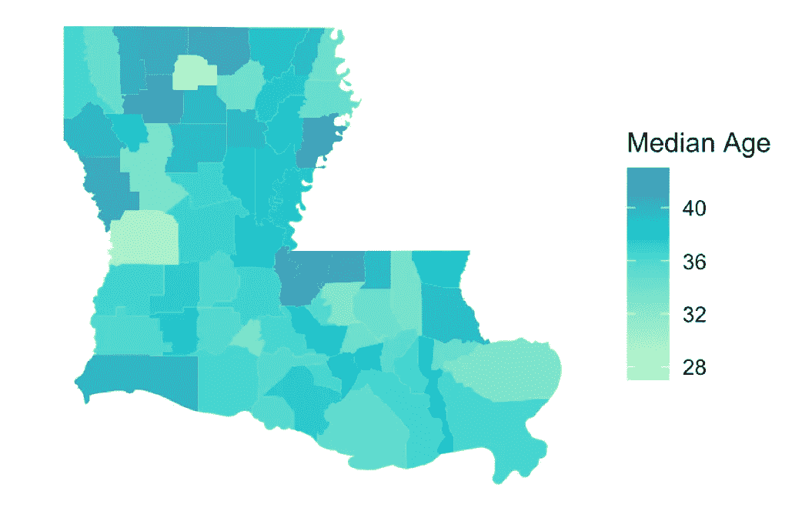
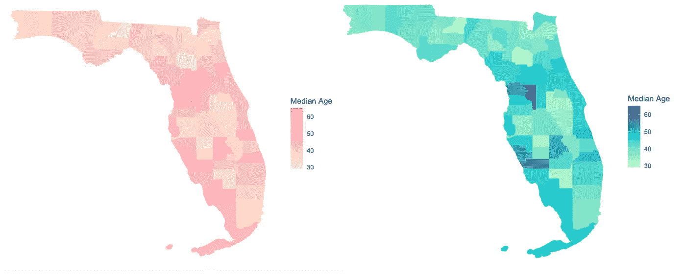
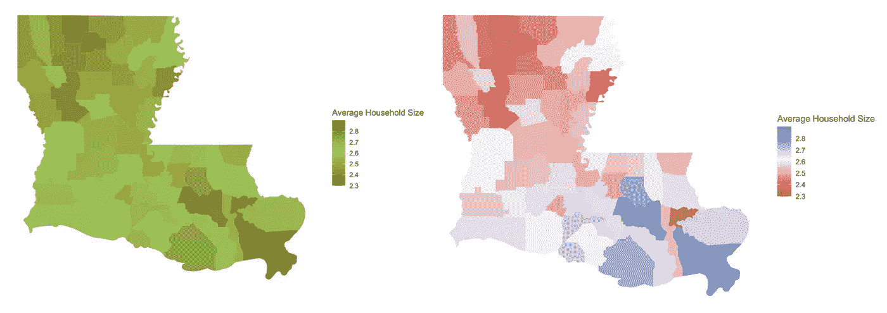

# R 中漂亮(简单)的地理空间数据可视化

> 原文：<https://towardsdatascience.com/gorgeous-simple-geospatial-data-visualizations-in-r-878b41e8bb9a?source=collection_archive---------39----------------------->

## 使用 ggplot2、rgdal 和 maptools 制作华丽的渐变

我最近在 R 中写了一篇关于[地理空间可视化的介绍文章，这篇文章很快成为我阅读量最大的文章，增加了 5 倍(谢谢，顺便说一句！).看到人们对地理空间数据可视化如此感兴趣真是太棒了，因为在这一点上，它已经成为我在这个星球上最喜欢的事情之一。](/route-66-revisited-mapping-geospatial-data-in-r-371dd406cde0)

话虽如此，我觉得我已经在桌子上留下了一些卡片；首先，我没有讨论过 ggplot2。更好的是，第二种方式*甚至更漂亮。*

在本教程中，我们将使用 2010 年的人口普查数据来展示用 R 的 ggplot2 库绘图的奇迹。就像上次一样，**只有 3 步**—所以拿些爆米花，让我们开始吧！

## 步骤 1:下载 2010 年人口普查数据集

史上最简单的一步；去我的 [Github repo](https://github.com/amawest/mapping_R/blob/master/county_census.zip) 下载 county_census.zip 就行了。

这是一个相当大的文件；一旦下载完毕，解压，你就可以开始了。

## 步骤 2:安装库并上传普查数据到 R

我们将使用 3 R 库，它们是`maptools`、`rgdal`和`ggplot2`。我们还将运行一个命令`readShapeSpatial()`，它将提示您输入想要使用的文件。

*   出现提示时，一定要打开`County_2010Census_DP1.shp` (这是上一步下载的)。

## 步骤 3:地理空间制图

***例 1:佛罗里达州&中位年龄***

现在，我们将选择一个状态，创建一个模板，并用颜色填充它:

图表显示:

**左:**粉色&面霜，例 1；**右**:蓝色&绿色，前。2

在重新创建时，“GEOID10”只是指 2010 年的人口普查，不需要更改。另一方面，第一行中的“12”代表佛罗里达州的 FIPS 代码，如果你绘制不同的州，这个代码*会*改变。 [FIPS 代码](https://www.mcc.co.mercer.pa.us/dps/state_fips_code_listing.htm)是常用的唯一标识符，它将每个州定义为一个从 1 到 50 的数字(美国领地也有自己的 FIPS 代码)。

`DP_TableDescriptions.xlx`提供了我们可以根据人口普查中提供的答案绘制的所有变量的列表(对于本例，我选择了 DP0020001，*各县的平均年龄*)。你可以在`county_census.zip`文件中找到这个 Excel 表格。

佛罗里达&中位年龄图很好，因为老年人和年轻人的高数量组合构成了一个超级漂亮的梯度(谢谢你，雪鸟！).如果你想描绘另一个州，你可以参考[这一页](https://www.mcc.co.mercer.pa.us/dps/state_fips_code_listing.htm)，找到你选择的 FIPS 代码。否则，坚持佛罗里达就好了。

不要画俄亥俄州，因为…嗯，你知道的。

***例 2:路易斯安那州和平均家庭规模(+趣味色彩！)***

我们将再做一次，改变我们选择使用的州和人口普查数据——我喜欢提供两个例子，以便有人可以看到代码如何响应变化。

让我们使用 [R 颜色](http://www.stat.columbia.edu/~tzheng/files/Rcolor.pdf)来挑选一两个令人愉快的配色方案，并进行绘图:

图表显示:

**左:** Camo，Ex.3**右**:红色，白色&蓝色，例如。四

这一次，我选择了迷彩的颜色(在美国农村长大，迷彩已经深深印在我的脑海里)和另一种红色、白色和蓝色，奇怪的是，这让我想起了黏糊糊的冰棍，而不是美国国旗。

尼克·托伦塔利在 [Unsplash](/s/photos/popsicles?utm_source=unsplash&utm_medium=referral&utm_content=creditCopyText) 上拍摄的照片

另外，你会注意到在第二个例子中渐变的范围发生了巨大的变化——因为我们是手动插入的，所以在你精确地描绘了整个范围并设置了一个精确的中间值之前，对它进行试验是很重要的(稍微搜索一下就可以避免太多的猜测)。**如果任何州县持有超出指定范围的值，它们在绘制图表时将显示为令人讨厌的灰色。**

## 结论

我希望你对这个教程有一点兴趣(我非常喜欢想象伪装中的路易斯安那州！).如果你有任何问题，运行代码的问题，或者只是想打个招呼，请在下面评论🙂。你也可以通过我的个人网站或[推特联系我。](https://twitter.com/amawest_)

谢谢，祝你一周愉快！

——阿曼达·❤️