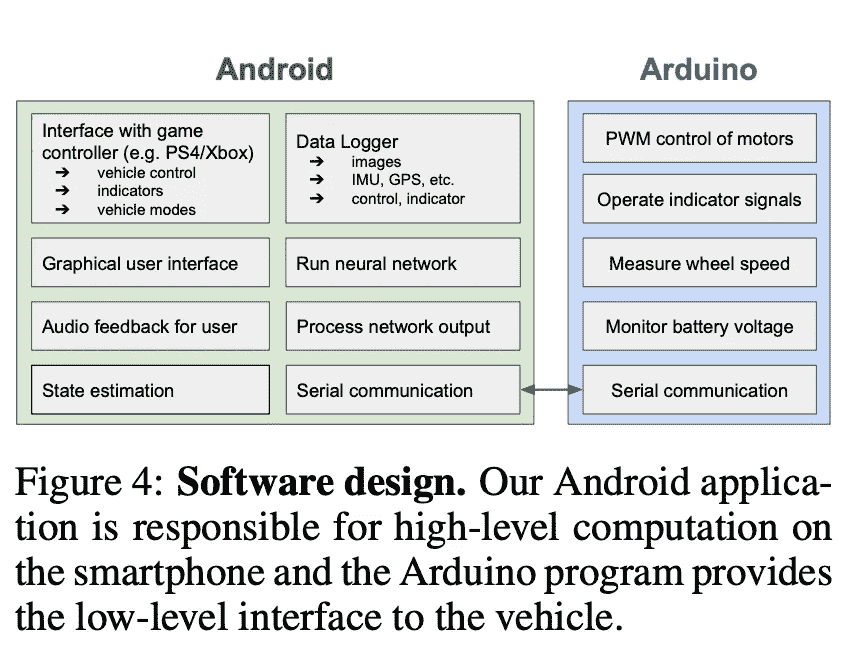
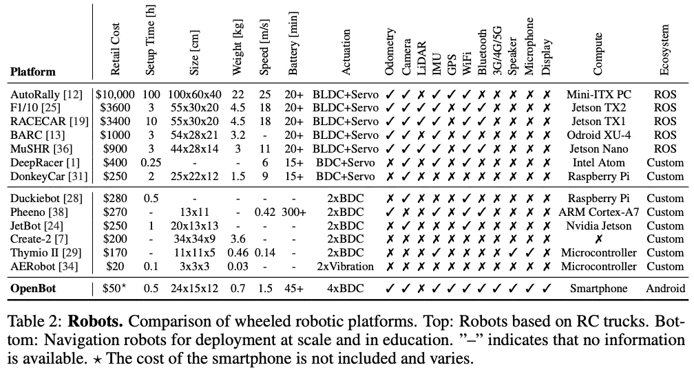

# 有 50 美元吗？把你的手机变成一个可编程机器人

> 原文：<https://towardsdatascience.com/got-50-turn-your-phone-into-a-programmable-robot-bf69d3df1231?source=collection_archive---------38----------------------->

## OpenBot 计划旨在利用现有设备实现边缘机器人的大众化。

[梁杰森](https://unsplash.com/@ninjason?utm_source=medium&utm_medium=referral)在 [Unsplash](https://unsplash.com?utm_source=medium&utm_medium=referral) 上的照片

英特尔实验室刚刚公布了其 [OpenBot](https://www.openbot.org/) 项目，该项目旨在提供低成本的实时先进机器人技术，以激励该领域的大规模社区采用。低成本是通过大规模生产的传感器、3d 打印的身体和你自己的智能手机的结合来实现的。

我喜欢这种系统的设计。公司太专注于将他们的数据和逻辑放入云中，他们常常忘记了引入的延迟。在某些情况下，边缘设备除了读取传感器测量值并将其上传的最小处理能力之外，几乎没有任何其他处理能力。

最佳方法(对许多行业而言)是在边缘处理尽可能多的可行内容，而在其余部分求助于更强大的设备。这是为什么呢？边缘是所有活动的地方。优势就是你这么在意的消费活动。边缘是…嗯，赚钱的地方。简单地在集中式云数据处理服务之间来回铲取数据远不如在整个生态系统中分配计算工作负载那样具有可扩展性。对于除了极低功耗物联网应用之外的所有应用，您希望您的边缘设备在一次充电后运行数月，您希望您的边缘设备完成更多任务。

# 不太尖锐的边缘

请注意，我使用了“更强大的设备”而不是“你的云”来管理你的非边缘计算的剩余部分。您的架构不仅仅是边缘和云的二元划分。你可以拥有一个由越来越强大的设备组成的“中间件”,这些设备仍然非常接近你的第一跳边缘设备；这些设备可以为您的第一跳设备提供更多的计算能力，同时仍然允许您避免往返于您的云和。这就是智能手机在 OpenBot 架构中发挥作用的地方。

作者[在其论文](https://github.com/intel-isl/OpenBot/blob/master/docs/paper/OpenBot.pdf)中制作的应用程序设置框图。

像 [Tensorflow Lite](https://www.tensorflow.org/lite) 这样的努力已经在将机器学习带到边缘方面取得了长足的进步。在不久的将来，我们可能会拥有如此高效的算法和硬件，以至于对于嵌入式设备是否可以运行复杂的神经网络预测不再有第二个问题。然而，在那之前，没有什么可以阻止我们使用我们的第一跳和后端云设备之间的设备，比如我们心爱的智能手机。

在这种设置中，您可以在边缘设备上保留所有传统的嵌入式操作(主要是传感器和驱动)，同时将更多计算密集型操作(机器学习推理、状态估计和更新等)卸载到智能手机的“本地主力”上。这可能看起来是一个小步骤，但解决了两个关键问题:避免昂贵的往返到您的云，并避免您的边缘设备的缓慢/棘手的片上计算。边缘设备将智能手机视为一种快速的场外计算，而你的云服务对此一无所知(希望现在能自动缩小规模🤑).

# 平台注意事项

不幸的是，就目前而言，该应用程序仅适用于 Android。但是，要记住开源的妙处。假设这个项目受到社区的欢迎，我们将很快有几个额外的选择。是的，可能会创建一个 iPhone 应用程序。然而，更多的人可以胜任“本地主力”的职位。可能无非就是一个更强大的嵌入式设备(咳咳树莓 Pi 咳咳)。

OpenBot 对类似机器人项目的市场调查，由作者[在他们的论文](https://github.com/intel-isl/OpenBot/blob/master/docs/paper/OpenBot.pdf)中做出。

# 送行

OpenBot 的新设置为机器人原型开发提供了一种新的低成本方法，进一步增加了该领域的民主化。无论是用于控制系统、边缘计算还是机器学习，这个项目必定会被整个社区广泛采用。

你打算尝试一下吗？在合作项目中，你独立完成了吗？[在这里让我知道](https://docs.google.com/forms/d/e/1FAIpQLSd_ND3EA2EbHciX2Zq5tZ_s_IBHWI-I4V47IFdcadzSwhmuXQ/viewform?usp=sf_link)。如果有足够多的人想在某件事情上合作，我会安排一些事情！

# 资源

*   [OpenBot 网站](https://www.openbot.org/)
*   [OpenBot Github](https://github.com/intel-isl/OpenBot)
*   [OpenBot 白皮书](https://arxiv.org/pdf/2008.10631.pdf)

# 保持最新状态

除了在 Medium 上，用 [LifeWithData](https://lifewithdata.org/) 博客、[机器学习 UTD 时事通讯](http://eepurl.com/gOe01T)和我的 [Twitter](https://twitter.com/@anthonyagnone) 让自己保持更新。通过这些平台，我分别提供了更多的长文和简文思想。