# 有数据吗？我如何在几个小时内自学如何浏览网站(你也可以)

> 原文：<https://towardsdatascience.com/got-data-how-i-taught-myself-how-to-scrape-websites-in-a-few-hours-and-you-can-too-2fe19889d6b0?source=collection_archive---------26----------------------->

## 找不到任何有趣的、高质量的数据集？生成你自己的数据集出奇的容易——下面是方法(包括[代码](https://github.com/databyjp/beginner_scraping))。

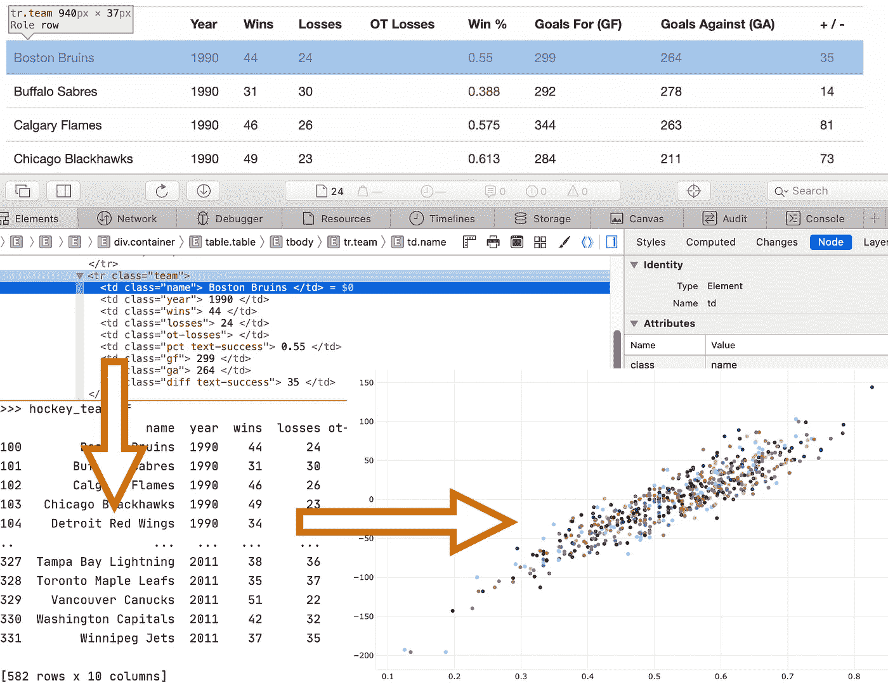

从网站到数据和信息:网站:[抓取本网站](https://scrapethissite.com/pages/)

我有一个可耻的秘密。它影响了数据科学社区中数量惊人的人。我懒得面对这个问题，也懒得正面解决它。

我不知道如何收集数据。

大多数时候，这并没有影响我的生活——我可以访问数据集，或者其他人已经为我的需要开发了定制的抓取器/API。

但我偶尔会浏览一个网站，希望我能获得一些有趣的原始数据来做一些严肃的分析。

嗯，不会再有了。

最近，我自学了如何用 Python 结合使用 [BeautifulSoup](https://www.crummy.com/software/BeautifulSoup/bs4/doc/) 、 [requests](https://requests.readthedocs.io/en/master/) 和[正则表达式](https://docs.python.org/3/library/re.html)来抓取网站。

> 我有一个可耻的秘密…我不知道如何收集数据。

整个过程比我想象的要简单得多，因此我能够制作自己的数据集。

所以在这里，我想分享我的经验，这样你也可以自己做。与我的其他文章一样，我在这里的 [git repo 中包含了完整的代码](https://github.com/databyjp/beginner_scraping)，因此您可以按照自己的目的使用或修改代码。

# 在开始之前

## 包装

我假设您熟悉 python。即使你相对较新，这个教程也不应该太难。

你需要`BeautifulSoup`、`requests`和`pandas`。用`pip install [PACKAGE_NAME]`安装每个(在您的虚拟环境中)。

你可以在这里找到我的代码:[https://github.com/databyjp/beginner_scraping](https://github.com/databyjp/beginner_scraping)

# 让我们制作一个数据集

一旦我们学会了如何收集数据，这种技能几乎可以应用于任何网站。但重要的是要把基本面搞对；所以让我们从容易的地方开始，同时反映现实世界。

你们很多人都知道我是一个体育迷——所以让我们从搜集我们的数字数据开始吧，这些数据将从[ScrapeThisSite.com](https://scrapethissite.com/faq/)那里获得。

顾名思义，这个网站是用来练习刮痧的。假设数据在表中，也很容易检查数据是否被正确抓取。

## 获取原始数据

在我们做任何事情之前，我们需要原始数据。这就是`requests`库的用武之地。获取数据很简单，只需如下代码行:

```
*import* requests
page = requests.get("https://scrapethissite.com/pages/forms/")
```

获得网页的副本是如此容易。要检查页面是否已正确加载，请尝试:

```
*assert* page.status_code == 200
```

如果你没有得到一个错误，这应该意味着该页面已被正确下载。那有多好？现在到了肉的问题；从我们的页面获取数据。

## 进入你的元素

要抓取一个网站，我们需要确定网站的哪一部分包含了我们想要的信息。尽管这在视觉上很容易，但在代码中却很难做到。

在这项任务中，您最好的朋友是浏览器上的“检查元素”按钮。有不同的方法来处理要抓取的元素，但这是次要的。首先，您需要识别被抓取的数据。

例如，让我们说，我想刮这一页。

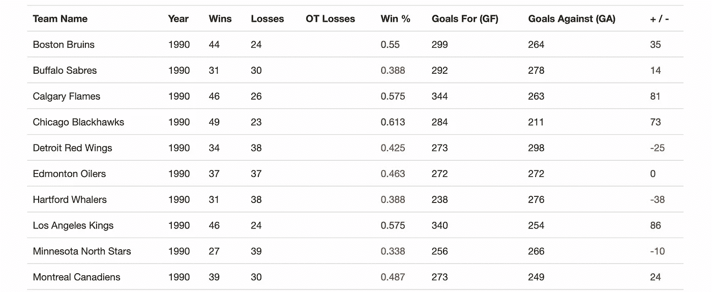

我们的第一桌给刮了([https://scrapethissite.com/pages/forms/](https://scrapethissite.com/pages/forms/))

在我们继续之前，先看一下底层代码。这是它的一个小样本。

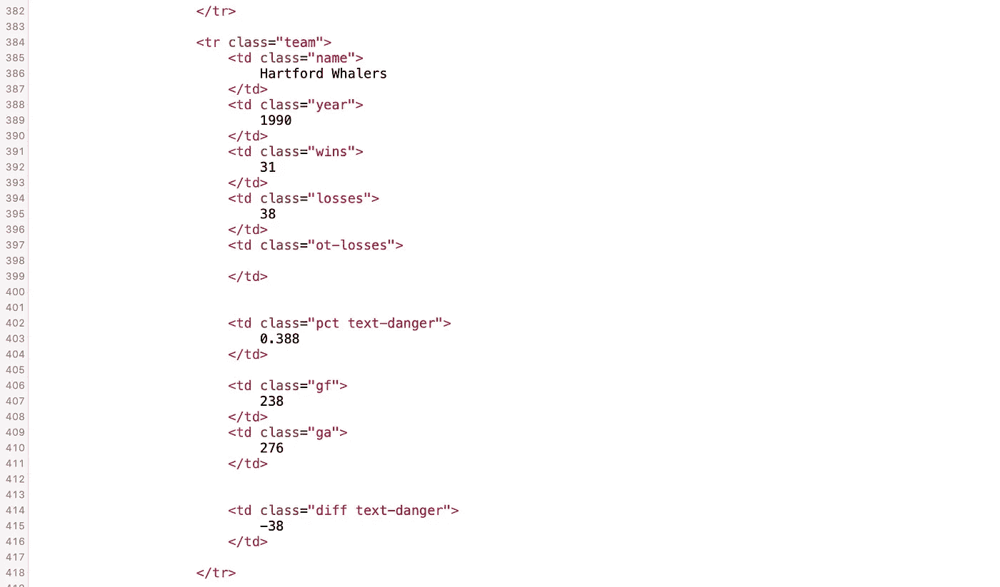

页面的源代码

鉴于它是为学习刮擦的人设计的，阅读起来并不困难。尽管如此，将你在这里看到的与你所看到的渲染关联起来还是很痛苦。

您应该做的是突出显示页面上的相关元素，右键单击并选择“检查元素”。这将显示一个类似于下图的布局，尽管会因浏览器而异。

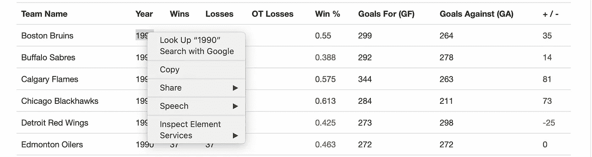

“检查元素”按钮—您的新好朋友

将要调出的代码是 [DOM(文档对象模型)](https://developer.mozilla.org/en-US/docs/Web/API/Document_Object_Model/Introduction)。不用太专业，这允许代码与呈现的最终结果相匹配。

我强烈推荐滚动浏览这里的各种元素，选择它们，并大致观察 DOM 的结构。

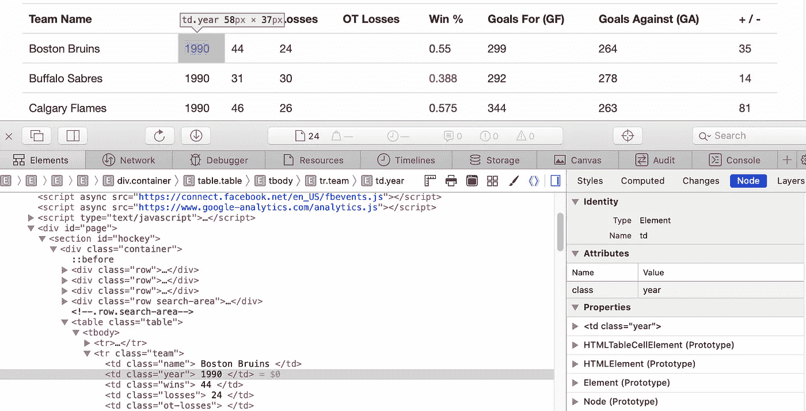

探索你的王国

更具体地说，让我们看看我们将做什么来刮出显示如下会议排名的表。

## 小步前进——收集一份数据

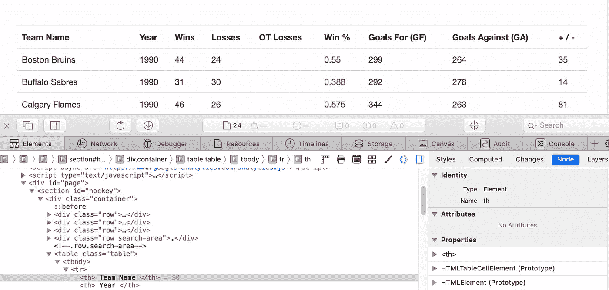

使用“检查元素”按钮

对元素的检查表明，我们希望获得该表的内容。尽管它没有唯一的 id，但它确实驻留在一个具有`id`值`hockey`的`section`中。

BeautifulSoup 发现所有这些都很容易，参数`id`可以被传递(html 中的`id`值是唯一的)，或者只是标签的一个默认参数。

我们可以通过以下方式找到所有这些:

```
div = soup.find(id="hockey")  # Find the right div
table = div.find("table")
```

您可以通过运行以下命令来验证该 div 中只有一个表:

```
assert len(soup.find_all("table")) == 1
```

我们注意到该表包括标题行`<th>`和数据行`<tr>`。让我们只抓取这些行——我们还注意到这里的每个数据行都有一个值为`team`的`class`属性，所以让我们也按照这个属性进行过滤。这可以通过将它们作为字典传递来实现，允许我们根据人们定义的任何自定义属性进行过滤！

```
team_elm = table.find("tr", attrs={"class": "team"})
```

收集的元素如下所示:

如果我们想从这些乱七八糟的东西中提取出球队的名字呢？

我看到 name 列由它的`class`属性标记，所以我可以通过它的标签(`td`)和属性找到该列。

```
team_name = team_elm.find("td", attrs={"class": "name"}).text
```

但是由于结果包含大量空白:

```
>>> team_name
'\n                            Boston Bruins\n                        '
```

这是正则表达式的工作！

```
team_name = re.sub(r"^\s+|\s+$", "", team_name)
```

如果你不确定这是怎么回事，那么[正则表达式](https://docs.python.org/3/library/re.html)将字符串的开头`^`空格`\s+`或字符串的结尾`|`空格不替换任何内容。如果可能会超过多行，您可以添加一个`re.M`标志。

太棒了。现在，我们如何扩展它来收集整个表呢？

## 变得舒适—抓取整个数据表

为此，我们将像以前一样识别表，隔离每一行数据，然后遍历该行以收集数据元素。

在查看元素时(参见下面的屏幕显示)，我注意到每一列都有一个带有不同`data-stat`属性的`<td>`标记，例如“wins”、“loss”、“win_loss_pct”等。

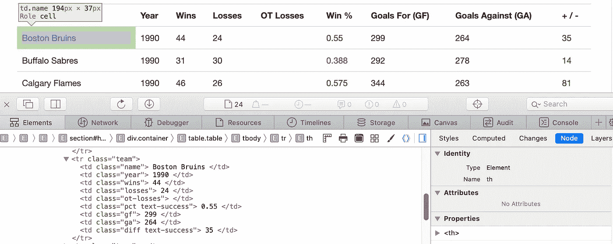

调查每个要刮除的列

我们可以对它们进行硬编码，并手动遍历它们。但是，更有趣的方法是实际获取一行，并生成这些列属性的列表，如下所示。

```
stat_keys = [col.attrs["class"][0] for col in data_rows[0].find_all("td")]
```

这为我们提供了一个值列表:

```
['name', 'year', 'wins', 'losses', 'ot-losses', 'pct', 'gf', 'ga', 'diff']
```

使用这个代码片段，我们只需编写几行代码来执行获取数据的任务。在较高层次上，代码循环遍历行，确保该行不是标题行，循环遍历列，将数据收集到一个字典中，并将其整理到一个列表中。

整个结果数据然后被放入熊猫数据框架。

这应该是相对清楚的，但如果这没有什么意义，那也没关系。相反，看看下面的代码。实际代码非常简洁，几乎比我的描述还要短！

## 重复该任务—抓取多个页面

让我们通过从多个页面抓取数据来总结这一点。你可能已经注意到了底部各个页面的链接。

再一次，看看这个元素——根据我们的发现，我们可以决定我们的策略。

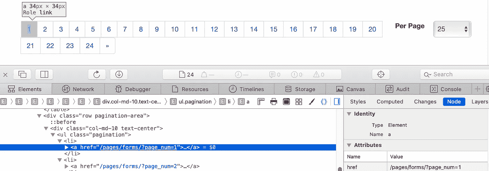

检查底部分页栏

我们可以用多种方法中的一种来处理这个问题，但是这一次，我们将抓取这里的每个链接，然后抓取每个结果页面。

我选择的方法是用 class 属性值为`pagination`的`ul`标记元素。然后，我找到每个`li`元素，获取 href 目标(即链接)，然后通过一个集合转换它以删除任何重复的内容。

```
pagination = soup.find("ul", attrs={"class": "pagination"})
link_elms = pagination.find_all("li")
links = [link_elm.find("a").attrs["href"] for link_elm in link_elms]
links = list(set(links))
```

直截了当，不是吗？

我们现在需要做的就是创建一个函数来概括我们抓取上面页面的任务，并连接每个页面返回的结果。

```
temp_dfs = list()
for link in links:
    tmp_df = scrape_this(uri=link)
    temp_dfs.append(tmp_df)
hockey_team_df = pd.concat(temp_dfs, axis=0).reset_index(drop=True)
```

为了更好地衡量，我们可以对结果进行排序，并将它们保存为一个文件:

```
hockey_team_df.sort_values(["year", "name"], inplace=True)
hockey_team_df.to_csv("hockey_team_df.csv")
```

综上所述，我们得到:

就是这样！只需几行代码，我们就可以从这个网站上收集几十年的数据来生成我们自己的数据集。

只是为了检查一下，让我们用[和](https://github.com/plotly/plotly.py)绘制一些数据，看看胜率和一些不同指标之间的相关性。需要注意的一点是，在操作下载的页面之前，我们需要转换数据帧中的数据类型！

为什么？嗯，你可能已经知道了——或多或少所有的网站数据都是以文本形式呈现的。文本，即使是数字，也不能被操纵。因此，举例来说，需要对成功进行操作，以便:

```
hockey_team_df.wins = hockey_team_df.wins.astype(int)
```

一些可视化库会在内部进行这种转换，但是如果你在 pandas 中操作数据，你肯定需要这样做。

(这里我不会展示完整的代码，但它在我的[GitHub repo](https://github.com/databyjp/beginner_scraping)—`scraper_mult_pages.py`文件中。)

这是一张图表，对比了本赛季的胜率和进球数:

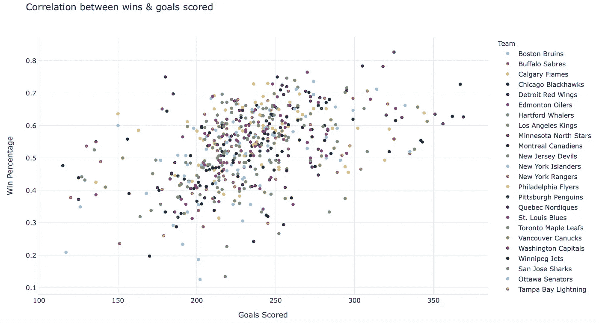

关联得分目标与获胜百分比

这并不可怕，但看起来没有那么大的相关性。允许进球(对手进球)呢？

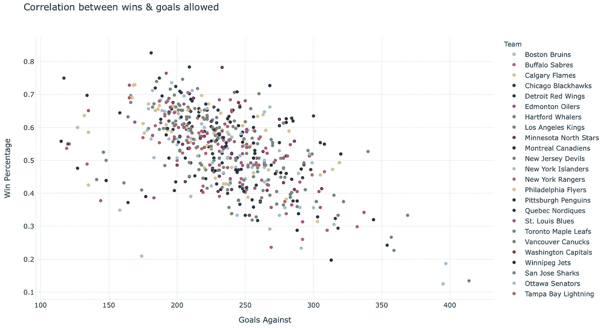

关联允许的目标与成功百分比

那更好！也许防守确实能赢得冠军/比赛。我们可以将这两者结合起来看目标差异:

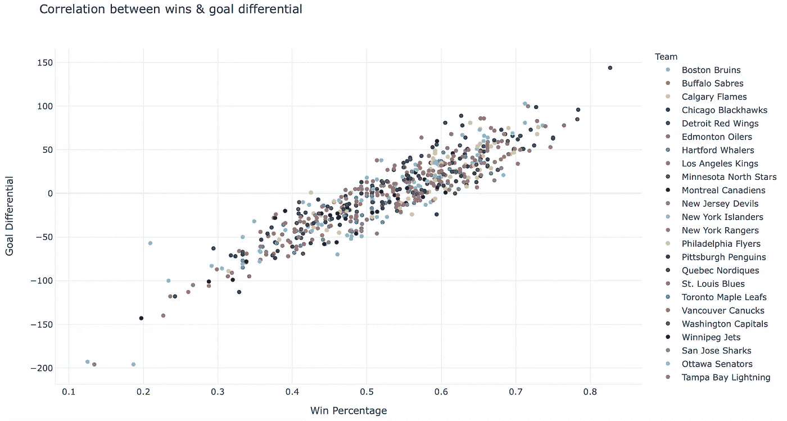

将目标差异与成功百分比相关联

哇哦。如果我自己这么说，这有什么关系。

这不是很棒吗？嗯，我觉得是。你可能对这些*特定的*数据不感兴趣，但关键是——你现在也拥有了所有你需要的工具来获取你感兴趣的数据。

我希望那是有用的。我很高兴我费心去学习如何做到这一点。

当你认真对待它的时候，你会发现还有很多事情要做——使用像 [selenium](https://github.com/SeleniumHQ/selenium) 这样的包对某些网站来说可能是必要的，而像 [scrapy](https://github.com/scrapy/scrapy) 这样功能更全面的框架可能会为你的大项目节省时间。但是通过采用这些技术，我们已经可以做很多事情了。

来吧——试试看！

有一点要注意:我用过的这个网站明确允许抓取，但不是每个人都允许。网络抓取一直是一个有点争议的话题，最近的一个案例甚至上了法庭。一如既往，明智并尊重他人的网站和潜在的知识产权。

你可以在这里了解更多:[https://www.scraperapi.com/blog/is-web-scraping-legal/](https://www.scraperapi.com/blog/is-web-scraping-legal/)

但是在你离开之前——如果你喜欢这个，请在 twitte 上打个招呼/关注，或者关注这里的更新。ICYMI:我也写过这篇关于可视化隐藏信息的文章，以 NBA 助攻数据为例:

[](/how-to-visualize-hidden-relationships-in-data-with-python-analysing-nba-assists-e480de59db50) [## 如何用 Python 可视化数据中的隐藏关系 NBA 助攻分析

### 使用交互式快照、气泡图和桑基图操纵和可视化数据，使用 Plotly(代码和数据…

towardsdatascience.com](/how-to-visualize-hidden-relationships-in-data-with-python-analysing-nba-assists-e480de59db50) 

最近，这个展示了我在互联网上发现的一些令人惊叹的数据科学投资组合。

[](/these-data-science-portfolios-will-awe-and-inspire-you-mid-2020-edition-728e1021f60) [## 这些数据科学产品组合将让您惊叹不已并深受启发(2020 年中期版)

### 使用这些来改进您自己的数据科学产品组合，学习新技能或发现新的有趣项目。

towardsdatascience.com](/these-data-science-portfolios-will-awe-and-inspire-you-mid-2020-edition-728e1021f60)