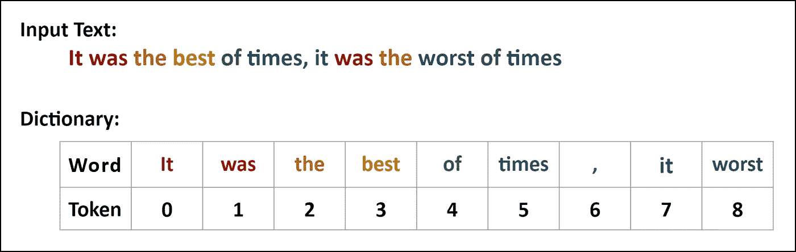
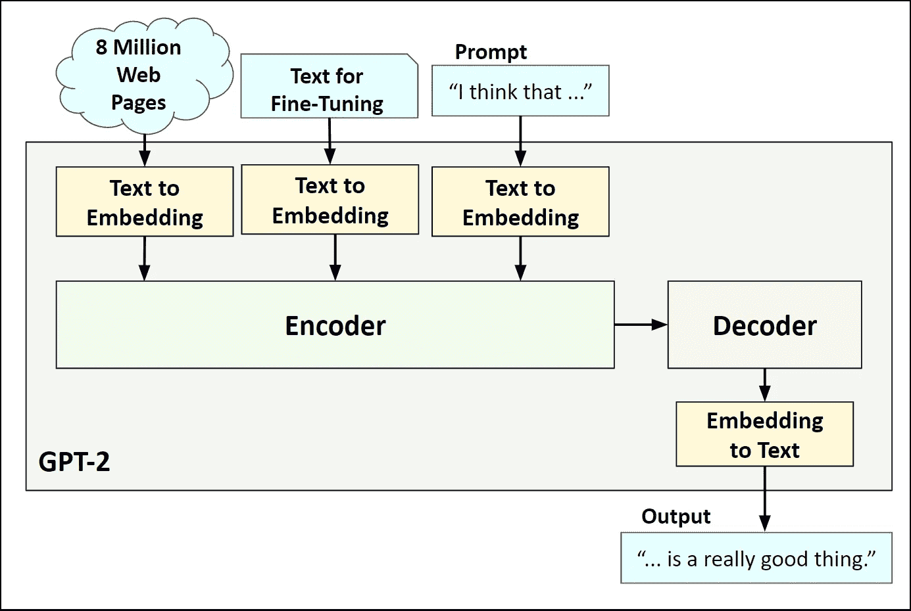
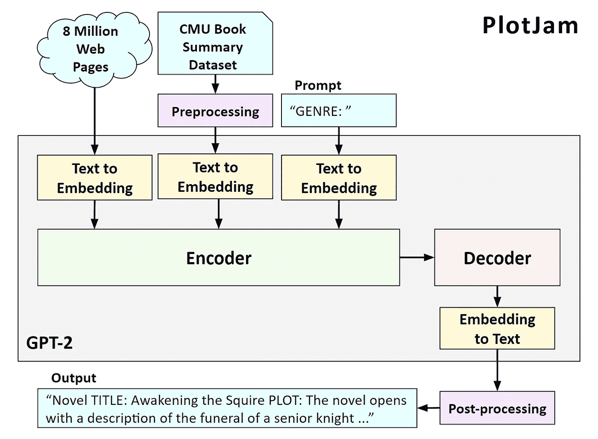
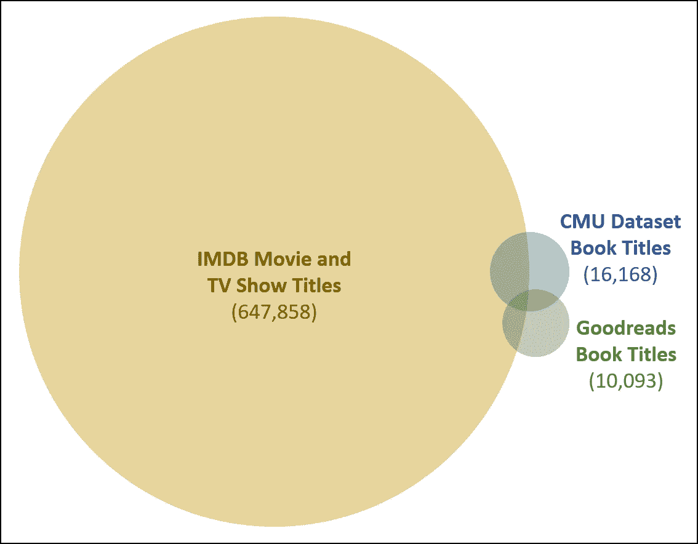
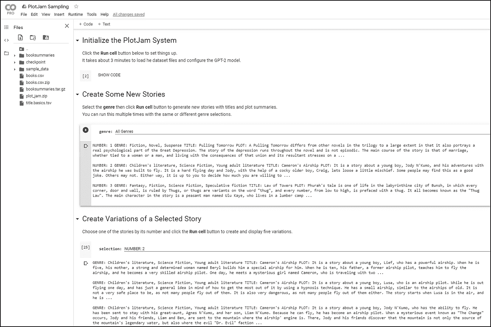

# 有写作障碍吗？是 GPT 2 号来救援了！

> 原文：<https://towardsdatascience.com/got-writers-block-it-s-plotjam-to-the-rescue-e555db9f3272?source=collection_archive---------45----------------------->

## 使用人工智能创造不存在的书的情节概要…还没有。


**故事**图片说明基于 alexkerhead CC 2.0 的一张照片

在这篇文章中，我将向你展示如何使用人工智能(AI)和机器学习(ML)来帮助你开始写你一直想写的小说。我将从计算机如何使用人工智能处理文本的简单背景开始。然后，我将描述我如何建立一个名为 GPT-2 的 ML 模型来生成新的情节概要，并就如何为自己创造一些新的故事想法给出指导。

这是我关于如何将人工智能用于创造性努力的系列文章的第二部分。第一部分是关于如何使用 ML 来创造抽象艺术，这里有[的](/machineray-using-ai-to-create-abstract-art-39829438076a)。

# 背景

## 自然语言处理

自然语言处理(NLP)是语言学和计算机科学的一个领域，它研究具有 Java 和 Python 等计算机语言的机器如何与具有英语和斯瓦希里语等自然语言的人类进行交流。艾伦·图灵是教计算机理解人类语言的第一批支持者之一。他在 1950 年写了关于它的文章。

> 我们可能希望机器最终能在所有纯智力领域与人类竞争。但是哪些是最好的开始呢？即使这是一个艰难的决定。许多人认为像下棋这样非常抽象的活动是最好的。还可以维护的是，最好给机器提供钱能买到的最好的感觉器官，然后教它理解和说英语。艾伦·图灵，数学家和计算机科学家

## 文本到令牌

处理文本的第一步是将单词转换成数字。这个过程叫做标记化。对文本进行标记的最简单方法之一是，按照输入序列中出现的顺序，简单地为唯一的单词和标点符号分配一个数值。例如，想想《双城记》的第一句开场白。



**标记文本**

您可以看到，单词“was”、“the”、“of”和“times”中的四个出现了两次，并且它们在两个实例中获得了相同的令牌值。在这个方案中，像“it”这样的大写单词与小写的“It”有不同的标记。此外，标点符号，像逗号，得到自己的令牌。你可以在 Srinivas Chakravarthy 的帖子[中阅读各种标记化方案。](/tokenization-for-natural-language-processing-a179a891bad4)

## 变形金刚(电影名)

一旦单词被标记化，它们就可以被机器学习系统处理来完成各种任务。例如，可以训练 ML 模型将文本从一种语言翻译成另一种语言。在下面的例子中，一个转换器被训练成从英语翻译成西班牙语。


**使用转换器进行语言翻译**

输入的英文文本在输入到转换器之前被转换成标记。在转换器内部，令牌被编码成内部的“通用”形式，然后解码成西班牙语令牌，再转换成西班牙语单词。想了解更多关于变形金刚的信息，请看马克西姆·阿拉德的[帖子](https://medium.com/inside-machine-learning/what-is-a-transformer-d07dd1fbec04)。

## GPT-2

2018 年，OpenAI 创建了一个名为生成式预训练变压器(GPT)的系统[2]。他们解释说，NLP 任务的巨大收益…

> …可以通过对不同的未标记文本语料库进行语言模型的生成性预训练，然后对每个特定任务进行有区别的微调来实现。— **亚历克·拉德福德**和 OpenAI 的同事们

来自 OpenAI 的团队在 2019 年创造了一个名为 GPT-2 的改进版变压器[3]。在这篇论文中，他们说…

> …具有足够能力的语言模型将开始学习推断和执行自然语言序列中展示的任务，以便更好地预测它们，而不管它们的采购方法如何。来自 OpenAI 的亚历克·拉德福德及其同事

下图显示了 GPT-2 的主要组成部分。GPT-2 没有使用单一值的令牌，而是使用单词嵌入，即多个数字的数组来表示每个单词。这使系统有能力捕捉对单词更完整的理解。



**GPT-2 组件**

GPT 新协议模式分为三个阶段:

1.  初始训练——学习理解一般语言
2.  微调—学习执行特定任务
3.  提示—启动系统开始生成输出文本

请注意，该模型在生成文本时利用了所有三个阶段的输入。你可以在杰伊·阿拉玛的帖子[中阅读更多关于 GPT-2 如何工作的信息。](http://jalammar.github.io/illustrated-gpt2/)

# 情节混乱

PlotJam 是我创建的一个系统，用来帮助有创造力的作家发现新的故事。PlotJam 使用 GPT-2 模型，该模型根据超过 16，000 本英文书的标题和情节摘要进行了微调，创建了带有标题和简短情节摘要的新故事。这是一个显示主要组件的图表。



**PlotJam 组件**

## 准备文本以进行微调

微调文本的来源是来自卡内基梅隆大学的[图书摘要数据集](http://www.cs.cmu.edu/~dbamman/booksummaries.html#:~:text=This%20dataset%20contains%20plot%20summaries,author%2C%20title%2C%20and%20genre.)。我通过分离每本书的类型、标题和第一部分情节概要来准备数据。

以下是其中一本书的原始数据示例:

```
**Wikipedia ID** 1166383
**Freebase ID** /m/04cvx9
**Book title** White Noise
**Book author** Don DeLillo
**Publication date** 1985-01-21
**Genres** Novel, Postmodernism, Speculative fiction, Fiction
**Plot summary**
Set at a bucolic Midwestern college known only as The-College-on-the-Hill, White Noise follows a year in the life of Jack Gladney, a professor who has made his name by pioneering the field of Hitler Studies (though he hasn’t taken German language lessons until this year). He has been married five times to four women and has a brood of children and stepchildren (Heinrich, Denise, Steffie, Wilder) with his current wife, Babette. Jack and Babette are both extremely afraid of death; they frequently wonder which of them will be the first to die. The first part of White Noise, called "Waves and Radiation," is a chronicle of contemporary family. ...
```

下面是预处理书籍摘要的 Python 代码。

**对文本进行预处理的代码**

这是预处理后的 CMU 书籍摘要数据集中的一个条目。

```
**GENRE:** Novel, Postmodernism, Speculative fiction, Fiction **TITLE:** White Noise **PLOT:** Set at a bucolic Midwestern college known only as The-College-on-the-Hill, White Noise follows a year in the life of Jack Gladney, a professor who has made his name by pioneering the field of Hitler Studies (though he hasn't taken German language lessons until this year). He has been married five ...
```

## 训练模型

在书摘要文本被预处理之后，我用它来微调 GPT-2 模型。我运行了 10，000 步的微调，这似乎足够系统生成新的情节摘要。下面是源代码:

**代码训练模型**

## 生成图

模型微调后，可以通过调用 generate 函数来创建新的图。我传入一个提示“流派:”来指示系统创建一个随机流派的故事的标题和情节。

**生成新图的代码**

以下是输出，显示了由 GPT-2 合成的新图:

```
**GENRE**: Mystery **TITLE**: Deadright’s Corner **PLOT**: The novel’s protagonist is Edward Wells, a young policeman who is given the job of turning around the case of a manslaughter in which a man killed his wife’s valet – the killing was clearly premeditated – after which he is induced to investigate the matter further. It is during this investigation that Wells discovers the terms of a secret contract between the police and a deceased man's ...
```

好的。在这里。第一个新故事。它属于神秘类型，标题是“死亡之角”。而且好像是一个以年轻警察为主角的犯罪故事。还不错。

## 检查原创性

GPT-2 系统被设计成以用于微调的数据的风格“开始写”。当以前缀“流派:”提示时，它将选择它在微调中看到的流派之一，然后创建一个标题和一个简短的情节概要。但是，不能保证它总能创造出新的标题和独特的情节。有时它选择一个现有的标题，它可能会也可能不会想出一个类似于已发表作品的情节。

我通过对结果进行后处理来过滤掉明显重复的故事，看看标题是否独特。我在 CMU 数据集中查找以前用过的书名，也在书评网站 Goodreads 和 IMDB 数据库中查找电影和电视节目的书名。下图显示了这三个数据集中的图书数量。



**文氏标题图**

您可以看到，与 CMU 数据集和 Goodreads 相比，IMDB 数据库有一个庞大的书目列表。下面是一个代码片段，展示了我如何累积标题列表以用于重复检查。

**代码积累大量现有标题**

请注意，我从标题的开头删除了冠词“the”和“A”。如果 GPT-2 想出的标题是“了不起的盖茨比”，我们会认为这是一个骗局，并将其过滤掉。此外，请注意，标题列表并不详尽。有很多出版的书籍没有维基百科页面，没有 Goodreads 上的评论，或者被拍成了电影或电视剧。因此，如果你看到一个你喜欢的故事情节，请在写作之前先做一点研究，以确保它确实是独一无二的。

## 不要重复自己。不要重复自己。

有时，GPT-2 文本生成器会卡在一个特定的短语上，并在情节摘要中重复多次。在这个例子中你可以看到一些重复。

```
**GENRE**: Science Fiction **TITLE**: Baseline Behavior **PLOT**: In the preface, Guy Sager explains his term for the branch of psychology that emphasizes **the individual’s sense of themselves** vs. the collective and their social relations. He believes that **the individual’s sense of themselves** can be affected by the environment (via the “environment in which they find themselves”). In other words, **the individual’s sense of themselves** can be saved by the environment (via their …
```

注意短语“个人对自己的感觉”是如何被重复三次的。我写了一个小函数，寻找这个工件来过滤掉有重复的条目。这是 Python 代码。

**检查重复短语的代码**

如果函数在输入中一次或多次看到给定长度的短语，它会被标记为重复。我用短语长度五来过滤掉重复的情节概要。

# 在 Google Colab 中生成新故事

以下是运行 PlotJam 的说明。它作为一个谷歌实验室运行，这是一个使用高端 GPU 进行人工智能实验的免费服务。请注意，有一个谷歌帐户是必需的。

[](https://colab.research.google.com/github/robgon-art/PlotJam/blob/master/PlotJam_Sampling.ipynb) [## PlotJam 采样

### 使用 GPT-2 创建新的情节提要

colab.research.google.com](https://colab.research.google.com/github/robgon-art/PlotJam/blob/master/PlotJam_Sampling.ipynb) 

1.  点击上面的**链接。**
2.  登录您的**谷歌账户，如果您尚未登录，请点击**。
3.  单击第一个**运行单元格**按钮(悬停在[ ]图标上并单击播放按钮)。将出现一条警告，指出此笔记本不是由 Google 创建的。
4.  点击**无论如何都要运行**初始化系统。下载数据集和配置预训练的 GPT-2 模型大约需要 5 分钟。
5.  选择你想尝试的**类型**，点击第二个**运行单元**按钮，生成一些新的故事情节。
6.  选择一个你喜欢的故事，点击第三个**运行单元**按钮，生成所选故事情节的五个变体。



**PlotJam Google Colab**

你可以看到每个情节变化都以相同的类型和标题开始，但在情节概要如何展开方面有所不同。

# 未来的工作

PlotJam 系统基于 GPT-2 的“大型”模型。这个模型有 7.74 亿个参数，运行在 Google Colab 系统上。未来的工作将是使用具有 16 亿个参数的“超大”模型，这可能会有更好的结果。OpenAI 最近发布了他们的 GPT-3 模型的测试版，他们声称该模型有 1750 亿个参数。这可能会在创建情节概要方面做得更好。

# 感谢

我要感谢詹尼弗·林对这个项目的帮助和反馈。

# 源代码

这个项目的所有源代码都可以在 GitHub 上找到。这些源代码在 [CC BY-NC-SA 许可](https://creativecommons.org/licenses/by-nc-sa/4.0/)下发布。


**归属共享**

# 参考

[1] A. M .图灵，《计算机器与智能》*头脑。1950 年 10 月，49:433–460*

[2] A .拉德福德，k .纳拉西姆汉，t .萨利曼斯，I .苏茨基弗，《通过生成性预训练提高语言理解》，2018 年 6 月

[3] A .、j .吴、r .蔡尔德、d .栾、d .阿莫代伊和 I .苏茨基弗。“语言模型是无监督的多任务学习者”，2019 年 2 月


照片由[王思然·哈德森](https://unsplash.com/@hudsoncrafted?utm_source=medium&utm_medium=referral)在 [Unsplash](https://unsplash.com?utm_source=medium&utm_medium=referral) 上拍摄

# 附录 A:样本输出

这里有一些来自 PlotJam 的“精选”样本。

```
**GENRE**: Historical fiction, Historical novel **TITLE**: Banner in the Storm **PLOT**: The story begins with Bertie finding himself at sea with the second Continental Spice Company. The story follows him as he joins the company, and encounters some of the Continental crew, including Captain Harvey Hatcher, a former Ballista, and Professor Appleby, who has joined the company to search for the Northwest Passage. Hatcher and Appleby have a small sailboat that is quite beat up. They set out to sea in a stormy sea with a group of American and ...**GENRE**: Science Fiction **TITLE**: Faso **PLOT**: The novel opens in a post-apocalyptic Southern California, in a hellish world shattered by nuclear war decades before. Fifteen-year-old Alex Hunter and his ten-year-old friend Sean Collins go to visit a mysterious old building called the Basement. The Basement is an old bunker owned by the U.S. military that is filled with ancient artifacts and military technology. Alex and Sean are separated as they are pursued by a horde of evil ...**GENRE**: Crime Fiction **TITLE**: Physical Damage **PLOT**: The police report finding a bloody scene of apparent murder, but do not find any suspects. The case becomes more complicated when two bodies are found wearing the same cologne and gloves. The case becomes more personal for Detective Chief Inspector Alan Banks when he is called to a murder scene by two of his colleagues, both of whom are lying in their own ...
```

为了无限制地访问 Medium 上的所有文章，[成为会员](https://robgon.medium.com/membership)，每月支付 5 美元。非会员每月只能看三个锁定的故事。