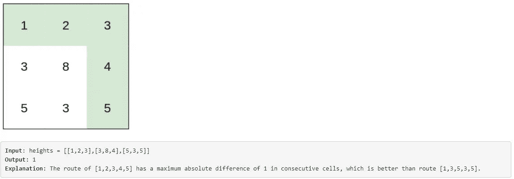
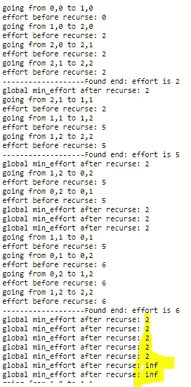
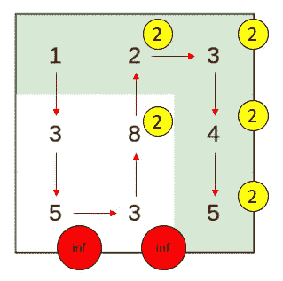

# 抓住你了。递归全局变量

> 原文：<https://towardsdatascience.com/gotcha-when-using-global-variable-with-recursion-ea92e16a8799?source=collection_archive---------12----------------------->

## 注意参数顺序和返回值


安德里亚·费拉里奥在 [Unsplash](https://unsplash.com?utm_source=medium&utm_medium=referral) 拍摄的照片

我用回溯法解决了这个 leetcode 问题[https://leet code . com/contest/weekly-contest-212/problems/path-with-minimum-effort/](https://leetcode.com/contest/weekly-contest-212/problems/path-with-minimum-effort/)，花了一些时间调试奇怪的输出。本文讨论了对全局变量使用递归时的一些陷阱，如何处理它们，以及如何将代码从全局改为局部。

免责声明:回溯只通过 15/75 的测试用例，其余的超过了时间限制，本文的目的是强调全局变量的可能问题，而不是给出最佳解决方案。更多使用二分搜索法、迪克斯特拉和克鲁斯卡尔的美丽解决方案，请观看亚历克斯在 https://www.youtube.com/watch?v=AM__3Zx1XNw 的演练(从 7:26 开始)

# 问题



问题是从左上走到右下，每走一步允许上、下、左、右四个方向，然后用最小的努力找到路径。`effort`定义为任意两个连续方块之间数值的最大绝对差值。

包含具有**全局**与**非全局**变量的实现的笔记本:[https://gist . github . com/git Han/a 818d 336 c 2309852 a 21d 99 EFD 619238d](https://gist.github.com/gitgithan/a818d336c2309852a21d99efd619238d)

# 回溯概述

我的回溯解决方案是使用一个`visited` 2D 数组来跟踪访问。
从左上角的单元开始，如果在矩形边界内并且之前没有被访问过，我们尝试以向下、向右、向上、向左的顺序移动(该顺序比其他一些顺序更快地到达目的地，因此全局最小值可以更早地被更新，并且用于限制/加速未来路径的探索)。在移动(递归)之前，访问被标记，因此对于`if valid()`，将来的访问尝试将返回 False。

在此过程中，使用我们要访问的单元和当前单元之间的 abs 差来更新路径的努力(初始化为 0)。如果我们到达基本情况(右下角的单元格)，返回努力。

一旦一个方向的递归完成，我们就更新全局最小值`min_effort`(初始化为`math.inf`)并取消该方向的单元格标记。

一旦当前单元格的所有 4 个方向都完成，我们返回`math.inf`备份调用堆栈，这样它就不会错误地影响调用者的 min()。

# 病菌



这个 5 ^ 2，后面跟着 2 个 inf 的输出令人难以置信。看起来像是全局变量`min_effort`在第一个解(1，下到 3，下到 5，右到 3，右到 5)回到 inf 后从 inf 更新到 2！最终答案(路径 1，2，3，4，5)也被错误地推断，而不是 1。



这五个 2 对应于从目的地 5 回溯到 4，3，2，8，3，5 的算法，因为所有这些都具有所有 4 个已访问或出界的方向，所以下一个要尝试的路径是从 1，0 向右到 1，1 (3 到 8)。

# 全局变量如何回到未更新的状态？

问题出在第`min_effort = min(min_effort,find_path(...))`
行，因为 python 从左到右计算参数，在进入递归之前已经计算了全局变量`min_effort`，所以递归中发生的任何事情(包括对全局变量的更新)对`min_effort`都没有影响。

在网格底部中间的 3 的范围内，算法还没有找到成功的路径(第一条路径是 1，3，5，3，5)，所以此时`min_effort`还是`math.inf`，而`min(math.inf,math.inf)`变成了 inf。

# 3 个修复

1.  **交换参数**

一种解决方法是简单地将参数的顺序换成`min_effort = min(find_path(...), min_effort)`。这使得递归有机会在比较之前先更新全局变量。

2.**先存成变量**

如果您仍然希望优先保持旧的顺序，可以先计算递归并保存到变量中。

```
recursion_res = find_path(...)
min_effort = min(min_effort, recursion_res)
```

3.**完全删除全局变量**

这是由于 Leetcode 在运行所有测试用例时给出了错误的测试结果，但是作为定制输入单独运行失败的用例给出了正确的结果。如果您坚持在 leetcode 上使用全局变量，那么复制结果，清除全局变量，并返回复制的结果，以便清除的全局变量为下一个测试用例做好准备。

两个变化:
1。将之前的全局变量添加到递归函数签名中`find_path(...,min_effort)`

2.返回`min_effort`而不是`math.inf`

这将确保最小努力路径总是通过递归调用传播。如果你问为什么在使用全局变量时不返回`min_effort`,这也是可行的，但是没有必要，因为如果你避免了上面提到的问题，在`min(min_effort,find_path(...))`比较之前，`min_effort`将被更新为非 inf 值，所以即使第二个参数返回 math.inf，一旦任何路径首先到达目的地，第一个参数将总是被更新为正确的值。另外，`math.inf`更能代表“无解/不好的价值”。

然而，支持`return min_effort`而不是`return math.inf`的理由是它更准确地代表了最新的程序状态。此外，我们可以完全避免 gotcha 处理(前面描述的两个修复),直接使用`min(min_effort,find_path(...))`,因为有了`return min_effort`,第二个参数将总是被更新，所以在第一个参数中包含其初始化的`math.inf`的“预递归求值”`min_effort`不会造成任何伤害。(与上一段完全相反的情况)。

# 改进解决方案

因为我们正在寻找全局最小值，所以任何路径都可能受到任何其他路径的结果的影响。这为当前最佳结果提供了一个机会，一旦发现它们比当前`min_effort`具有更长的努力，就短路未来路径。这可以通过用额外的检查`if updated_effort < min_effort:`包装回溯部分(visit，recurse，unvisit)来实现，以大大减少探索步骤，使用“小于”,因为尝试不会减少当前最佳结果的东西是没有意义的。

```
if updated_effort < min_effort:
                visited[row,col] = 1
                min_effort = min(min_effort,find_path(heights_arr,visited,row,col,updated_effort,max_row,max_col))
                visited[row,col] = 0
```

# 全球与本地比较

**全球优势:**

1.  允许的宽松返回值(`math.inf`或`min_effort`)
2.  方便的编码(更少的参数传递和更简单的递归函数)

**全局不利因素:**

1.  不要使用在线编码平台(对工作面试自动编码评估有风险)
2.  必须时刻注意不在当前堆栈中的副作用和变量
3.  对函数参数排序敏感(所有这些问题的根源)

**本地优点:**

1.  专注于局部问题空间的更容易的调试/跟踪
2.  副作用更少

当地不利因素:

1.  更详细的函数签名(要跟踪的项目越多，意味着签名越长)
2.  失去返回`math.inf`的能力，必须返回`min_effort`以将更新的结果传播回程序的其余部分

# 做错比做对更有价值

当使用全局变量时，如果我最初使用上面的 fix 2 返回了`min_effort`或正确编码，我根本不会看到这个问题。塞翁失马，焉知非福，返回最直观的正确值和对(可能)无关变量赋值的懒惰让我加强了对 python 求值顺序和调试技巧的理解。