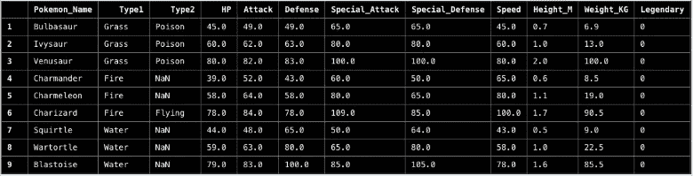
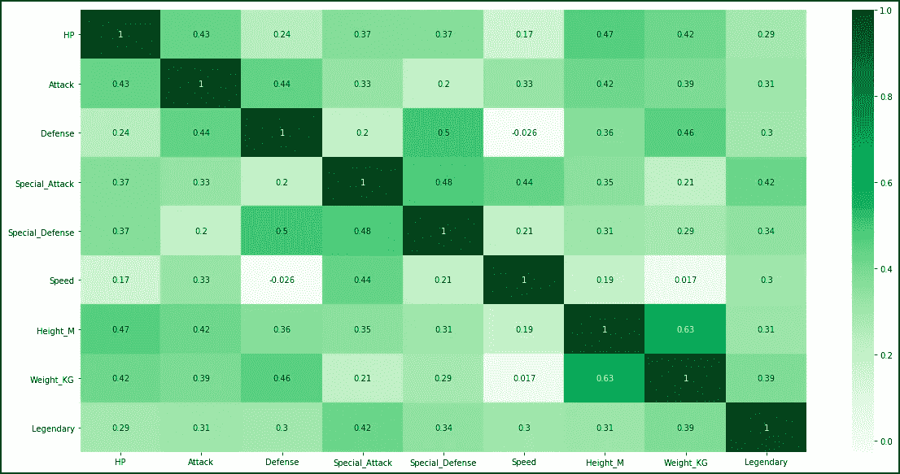
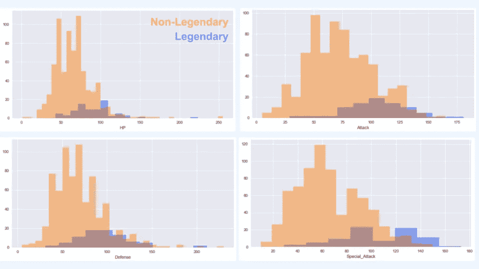
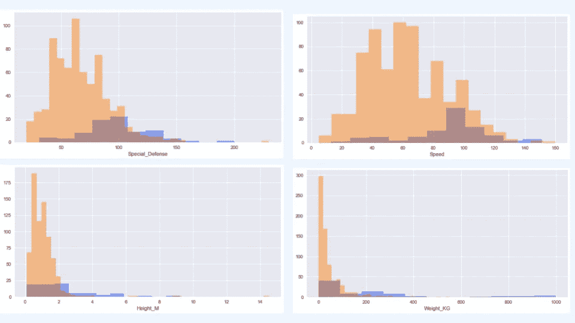
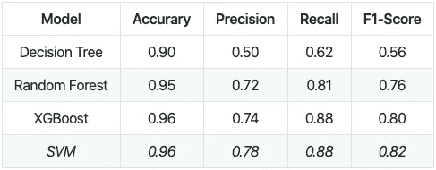
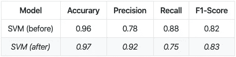
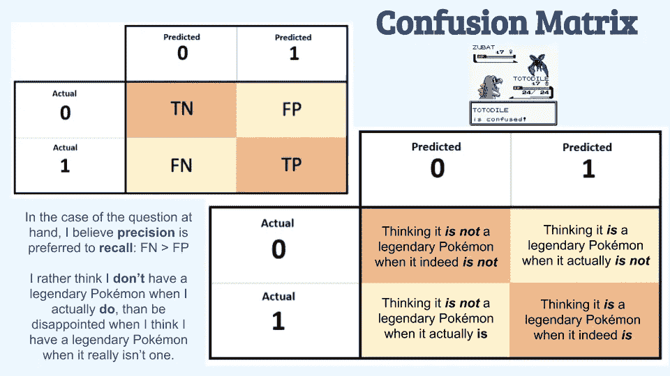

# 必须把它们分类

> 原文：<https://towardsdatascience.com/gotta-classify-em-all-5f341d0c0c2?source=collection_archive---------49----------------------->

## 我如何建立一个分类模型来区分传奇和非传奇的神奇宝贝


图片由 [PIRO4D](https://pixabay.com/users/PIRO4D-2707530/?utm_source=link-attribution&utm_medium=referral&utm_campaign=image&utm_content=1593048) 来自 [Pixabay](https://pixabay.com/?utm_source=link-attribution&utm_medium=referral&utm_campaign=image&utm_content=1593048)

当我还是个孩子的时候，我对神奇宝贝很着迷。我每天下午放学后都会看这个节目，周六早上早早醒来看更多的节目，收集卡片，当然，还会在我的游戏机上玩游戏。通常，我和我的朋友会出去玩，在我们各自的设备上玩游戏，互相帮助在广阔的地区导航，捕捉每个游戏中介绍的独特的神奇宝贝。对于其中的一个游戏《神奇宝贝蓝宝石》(我个人最喜欢的)，我甚至买了一本指南书，在我一个城市一个城市、一个健身房一个健身房地行进时帮助我，告诉我关于这个游戏的秘密。不用说，在我年轻的时候，神奇宝贝是我生活中很重要的一部分。然而，不幸的是，随着年龄的增长，神奇宝贝在我的生活中几乎不存在了，除了偶尔出现在我最喜欢的消遣中。

去年冬天，我完成了一次数据科学训练营。在训练营期间，我们会被分配一些项目，在这些项目中，我们必须找到自己的数据用于分析和强化各种数据科学概念。做了一些关于体育的项目，并且知道我正在为我的最终项目保存音乐数据，我思考我想为我的分类项目做些什么。在花了一些时间思考想法并尝试跳出框框思考后，我过去对神奇宝贝的喜爱浮现在脑海中，成为一个分类模型可能建立的基础。虽然我最初对尝试按神奇宝贝的类型进行分类感兴趣，但很明显，由于类型的数量庞大以及每种类型的神奇宝贝比例不平衡，我决定将它们分类为传奇与非传奇是我要走的路线。

我是这样做的:

# 数据

对于这个项目，我最终从三个不同的来源获得了我的神奇宝贝数据，以满足我的分类需求。我使用了 [**BeautifulSoup**](https://www.crummy.com/software/BeautifulSoup/bs4/doc/) 和[**Pandas read _ html**](https://pandas.pydata.org/pandas-docs/stable/reference/api/pandas.read_html.html)函数从下面的站点中抓取数据。

1.  [神奇宝贝数据库](https://pokemondb.net/pokedex/all) —全部 8 代神奇宝贝的完整神奇宝贝指标(最终仅使用 1-7 代)，具有类型、总量、HP、攻击、防御、特殊攻击、特殊防御和速度等特征(最终未使用类型或总量)
2.  [神奇宝贝 API](https://pokeapi.co/docs/v2.html)——使用官方神奇宝贝 API 获得每个神奇宝贝的身高和体重，作为我认为重要的附加功能
3.  [sere bii](https://www.serebii.net/)——在这里获得新的神奇宝贝 API [中没有的高度和重量，在这里](https://www.serebii.net/pokemon/)[获得传奇神奇宝贝的列表用于标记目的](https://www.serebii.net/pokemon/legendary.shtml) (0 =非传奇，1 =传奇)



用于分类模型的数据帧部分

总的来说，我看了:

**809 个独特的神奇宝贝(第 1-7 代)，其中 80 个被认为是传奇**

**特性:HP，攻击，防御，特殊攻击，特殊防御，速度，身高，体重**

# 探索性数据分析

*1。神奇宝贝功能相关热图:*



*2。显示非传奇与传奇神奇宝贝所有特征分布的重叠直方图:*



正如我们所见，特殊攻击、特殊防御、身高和体重是与传奇属性相关性最高的四个特征，也是非传奇和传奇神奇宝贝之间分布的最大间隔。

# 建模

1.为[](https://scikit-learn.org/stable/modules/generated/sklearn.model_selection.train_test_split.html)**设置 *x* 和 *y* 变量，其中传奇系列为 *y* 变量，其余特征的数据帧为 *x* 变量**

**2.使用 [**SMOTE**](https://imbalanced-learn.readthedocs.io/en/stable/generated/imblearn.over_sampling.SMOTE.html) (合成少数过采样技术)合成虚假数据，原因是传奇与非传奇神奇宝贝中的等级不平衡，因为数据中只有约 10%的神奇宝贝是传奇**

**3.尝试了不同的模型，看看哪种效果最好:**

```
# Created list of different classifiers/models I wanted to runclassifiers = []model1 = xgboost.XGBClassifier()
classifiers.append(model1)model2 = svm.SVC()
classifiers.append(model2)model3 = tree.DecisionTreeClassifier()
classifiers.append(model3)model4 = RandomForestClassifier()
classifiers.append(model4)# Fit each model with synthesized training data; found accuracy, precision, recall, and F1 score; printed out confusion matrix and classification reportfor clf in classifiers:
    clf.fit(X_synth, y_synth)
    y_pred= clf.predict(X_test)
    acc = accuracy_score(y_test, y_pred)
    prec = precision_score(y_test, y_pred)
    recall = recall_score(y_test, y_pred)
    f1 = f1_score(y_test, y_pred)
    print("Accuracy of %s is %s"%(clf, acc))
    print("Precision of %s is %s"%(clf, prec))
    print("Recall of %s is %s"%(clf, recall))
    print("F1 Score of %s is %s"%(clf, f1))
    cm = confusion_matrix(y_test, y_pred)
    print(cm)
    print(classification_report(y_test, y_pred)) # Code above originally seen in this Medium story on [Choosing the Best Algorithm for your Classification Model](https://medium.com/datadriveninvestor/choosing-the-best-algorithm-for-your-classification-model-7c632c78f38f)
```

****

**4.在最佳模型上运行[**【GridSearchCV】**](https://scikit-learn.org/stable/modules/generated/sklearn.model_selection.GridSearchCV.html)**，在这种情况下是 SVM(支持向量机)，以便找到模型的最佳参数****

******最优参数为:C = 1000，核= rbf(径向基函数)******

********

*******最终模型总体显示 97%的准确性*******

****尽管*回忆*在最终模型中失败了，但我对此没意见，因为:****

********

****最终，我得到了一个非常准确的传奇与非传奇神奇宝贝分类模型。在深入研究了哪些神奇宝贝被错误分类后，很明显，这更多是因为这些神奇宝贝与相反类别的神奇宝贝相似(传奇而非非传奇，反之亦然)，而不是模型本身的错。****

****做这个项目非常怀旧，让我怀念我作为一名神奇宝贝训练师试图“抓住它们”的日子。“由于世界的现状和我们所处的隔离状态，我最终买了一台任天堂 Switch Lite 和最新的神奇宝贝游戏*神奇宝贝剑*，重温美好时光来打发时间。即使过了这么多年，如果我自己这么说的话，我也没有失去一步。****

## ****如果你有兴趣看我项目的完整代码，可以在我的 GitHub 上查看！****