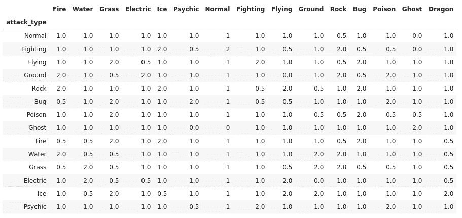
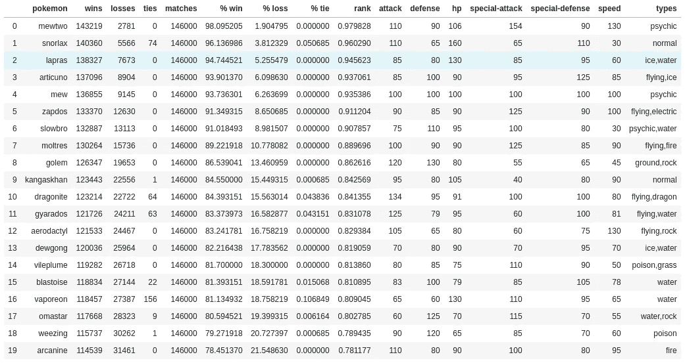
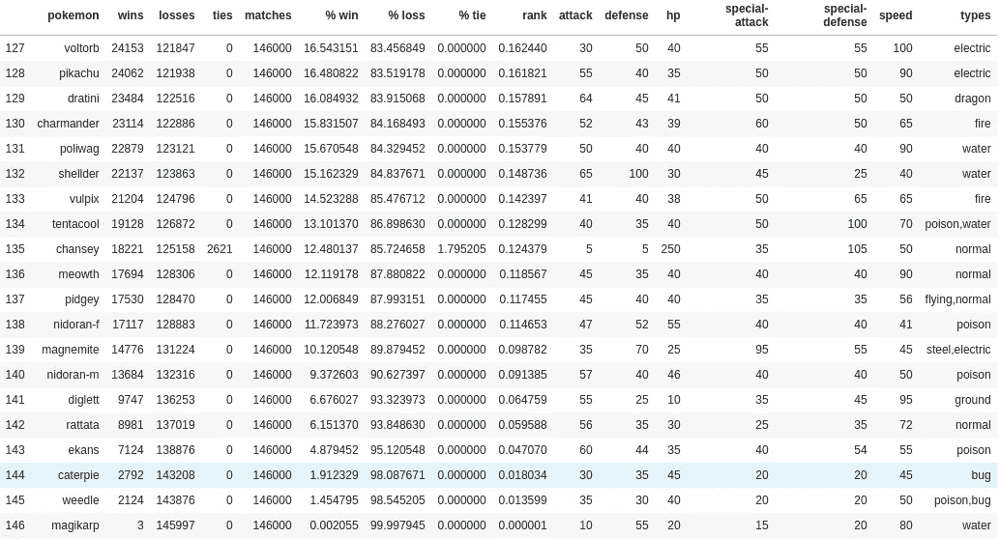

# 必须全部模拟——口袋妖怪

> 原文：<https://towardsdatascience.com/gotta-simulate-em-all-pokemon-390553008e2d?source=collection_archive---------27----------------------->

## 模拟第 1 代的口袋妖怪战斗来识别等级


图片来源:[剪影旅行者山脉](https://pixabay.com/illustrations/silhouette-traveller-mountains-3105515/)、[口袋妖怪星球](https://pixabay.com/illustrations/pokemon-planet-smartphone-space-1624022/)、[口袋妖怪风格文字](https://textcraft.net/style/Textcraft/pokemon)

我们中的许多人都是在这个系列的各种迭代中玩口袋妖怪长大的。我十岁的时候，美国出了第一代(红蓝)口袋妖怪。我花了无数个小时和我的朋友玩那个游戏。2018 年，我偶然看到 PyData 的一个演讲，“ [Vincent Warmerdam:用简单甚至线性的模型取胜| PyData London 2018](https://www.youtube.com/watch?v=68ABAU_V8qI) ”，其中提到获取口袋妖怪数据是多么容易。这个演讲并没有把重点放在口袋妖怪战斗模拟上，尽管它启发了我，让我创建了一个口袋妖怪战斗模拟器，并写了这篇文章。

在本文中，我将讨论:

*   这种实现的局限性
*   数据收集过程
*   模拟器中使用的算法
*   我对口袋妖怪的排名

**注:**如果您想查看所有源代码，请在[github.com/tylerwmarrs/pokemon-battle-simulation](https://github.com/tylerwmarrs/pokemon-battle-simulation)找到。

# 实施限制

虽然我试图捕捉游戏中的大部分战斗机制，但有些机制被遗漏了。

*   诸如瘫痪、中毒等疾病被排除在外，以简化战斗。
*   口袋妖怪不可能恢复健康。
*   战斗由口袋妖怪通过升级学习的破坏性能力组成。
*   攻击机制可以通过排列效率来改进，而不是随机选择。

这些限制可能会影响一些口袋妖怪的行列。我强烈鼓励任何感兴趣的人通过对资源库做出贡献来实现缺失的细节。

# 数据收集

数据收集过程没有痛苦。一个网站为我提供了我需要的关于口袋妖怪的大部分信息。网站[pokeapi.co](http://pokeapi.co)，以 JSON 格式提供开放的 API 结果。网站的文档相当全面。获得口袋妖怪属性和涉及的移动:

1.  从红色/蓝色版本中识别口袋妖怪
2.  对于每个口袋妖怪，下载属性
3.  识别红色/蓝色版本的移动
4.  对于每次移动，下载属性

一旦下载了所有的动作和口袋妖怪，我就使用熊猫连接将动作映射到每个口袋妖怪。

# 数据转换

与 JSON 相比，我更喜欢使用 CSV 文件，所以我花了一些时间来简化模拟战斗所需的属性结构。JSON 结构由可选属性组成，嵌套很多层。展平属性使得查询变得更加容易。

**口袋妖怪属性**

*   名称——口袋妖怪的名称
*   惠普—健康点
*   攻击—一般攻击统计
*   速度——速度是用于计算伤害的统计数据
*   特殊攻击—特殊攻击统计
*   防御——统计数据，用于确定对常规攻击造成的损害
*   特殊防御——用于确定针对特殊攻击的损害的统计数据
*   类型——口袋妖怪的类型；火、水、岩石等。

**移动属性**

*   名称—移动的名称
*   PP-可以应用移动的次数
*   类型—移动的类型；火、正常、水等。
*   暴击率——调整招式暴击几率的标志
*   功率-功率是一种用于计算伤害的统计数据
*   min _ hits——在给定回合中，移动的最小次数。
*   max _ hits——在给定回合中，移动可以应用的最大次数。

# 损坏计算

## 类型修饰符

除了招式和口袋妖怪，我还需要获得数据来帮助量化伤害。口袋妖怪是一个回合制游戏，玩家选择一个动作来应用。这个模拟只关注计算伤害的攻击动作。每个口袋妖怪都是特定的类型，每次攻击也是如此。目标是要么打败对方的口袋妖怪，要么捕获它。这个模拟只捕捉胜利和失败。如果受到攻击，可能会造成更大的伤害:

*   攻击型口袋妖怪
*   攻击的类型
*   保卫口袋妖怪类型



口袋妖怪的类型修改器图表

该表显示了攻击伤害如何适用于给定的口袋妖怪类型。我是从[这个网站](https://www.math.miami.edu/~jam/azure/compendium/typechart.htm)用回来的，清理过了。该表捕获默认类型修饰符值为 1 的异常。

## 临界机会算法

基于随机数生成器的临界机会算法取决于攻击。有些攻击比其他攻击更容易致命一击。我从[这个网站](https://bulbapedia.bulbagarden.net/wiki/Critical_hit#In_Generation_I)获得了公式，并移除了游戏实现中的一些瑕疵。

几个明显的缺陷包括:

*   最初的游戏规则是 100%的临界几率；然而，实现的结果是最高 99.6%。我的实现允许 100%的临界几率。
*   一些助推技能在应该增加致命几率的时候降低了致命几率。然而，在这个模拟中，助推移动被完全忽略。

该算法采用口袋妖怪的基本速度和攻击的临界几率来确定是否发生了临界击中。口袋妖怪的速度是决定成败的一个重要因素。

## 损坏算法

给定口袋妖怪属性和来自暴击算法的暴击布尔，伤害算法决定应用多少伤害。这些算法都是从[这个网站](https://www.math.miami.edu/~jam/azure/compendium/battdam.htm)上的公式推导出来的。

# 战斗模拟

## 选择移动算法

根据攻击口袋妖怪的招式列表，随机选择一个有灵能点剩余的招式。当所有移动都用尽时，返回 null。这是在两个口袋妖怪会打成平手的情况下需要的；否则，apply_move 算法中会出现无限循环。

## 应用移动算法

该算法管理:

*   临界机会随机化
*   同类攻击奖励(一个火口袋妖怪使用火招)
*   攻击口袋妖怪的灵能点(PP)
*   保卫口袋妖怪的生命值(HP)
*   应该应用移动的次数

注意这个函数有一个硬编码的等级值 10，这可能会影响伤害的计算。

## 战斗算法

战斗算法跟踪模拟状态:

*   随机选择可能首先攻击的口袋妖怪
*   轮到哪个口袋妖怪了
*   寻找赢家
*   检查领带

## 战例

这是一个皮卡丘对抗鬼斯的战斗的例子。

```
pikachu = Pokemon('pikachu')
gastly = Pokemon('gastly')
battle(pikachu, gastly)Output
------
gastly damaged pikachu with night-shade for 2.0 hp
gastly pp for night-shade is 14/15
pikachu hp is 33.0/35
pikachu damaged gastly with thunder-shock for 10.0 hp
pikachu pp for thunder-shock is 29/30
gastly hp is 20.0/30
gastly damaged pikachu with dream-eater for 22.0 hp
gastly pp for dream-eater is 14/15
pikachu hp is 11.0/35
pikachu damaged gastly with thunder-shock for 11.0 hp
pikachu pp for thunder-shock is 28/30
gastly hp is 9.0/30
gastly damaged pikachu with lick for 6.0 hp
gastly pp for lick is 29/30
pikachu hp is 5.0/35
pikachu damaged gastly with thunder-shock for 10.0 hp
pikachu pp for thunder-shock is 27/30
gastly hp is -1.0/30{'pokemon': 'pikachu',
 'pokemonb': 'gastly',
 'moves': 6,
 'winner': 'pikachu',
 'first_attack': 'gastly'}
```

# 口袋妖怪排名

随着战斗算法的完成，我创建了一些逻辑来模拟所有口袋妖怪之间至少包含一个破坏性动作的战斗 1000 次。同种的口袋妖怪被排除在战斗之外。比如皮卡丘大战皮卡丘就不是模拟的。在每场战斗开始时，每只口袋妖怪被随机分配最多四种伤害能力。结果被记录在每对口袋妖怪之间，跟踪谁输了，谁赢了，以及平局的数量。单个口袋妖怪战斗 14.6 万次。

随着统计数据的汇总，我以两种方式对口袋妖怪进行了排名:

1.  [贝叶斯排名](/bayesian-ranking-system-77818e63b57b) —先验被设定为 50/50 几率
2.  百分比排名

下面根据贝叶斯排名显示的前 20 名口袋妖怪，Mewtwo 排名第一似乎是合乎逻辑的。Mewtwo 被认为是第一代中最好的口袋妖怪，具有使它如此的属性。它也是最稀有的口袋妖怪之一。



倒数 20 名口袋妖怪似乎也合乎逻辑，因为鲤鱼王是最后一名。鲤鱼王在比赛中的防守和进攻都是最差的。



完整的排名列表，请访问[此链接](https://github.com/tylerwmarrs/pokemon-battle-simulation/blob/master/data/results/pokemon_ranks.csv)。

# 包扎

虽然我对口袋妖怪战斗的实现是有限的，但结果似乎是合乎逻辑的。希望，我已经激励了另一个口袋妖怪迷去接受这些概念，这样他们可以在他们的模拟中应用它们。模拟和建模是一项非常重要的技能。将它应用到您熟悉的东西上，可以使建模过程更易于管理。

如果你觉得这本书有趣，请花时间评论它。