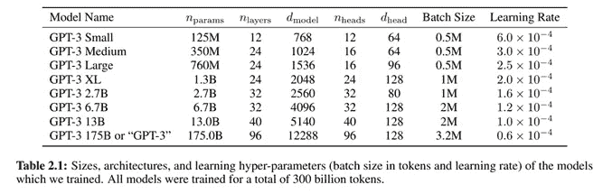

# GPT-3 101:简介

> 原文：<https://towardsdatascience.com/gpt-3-101-a-brief-introduction-5c9d773a2354?source=collection_archive---------16----------------------->

## 在过去的几周里，几乎不可能避免对 GPT-3 的大肆宣传。本文简要介绍了它的架构、已经可用的用例，以及关于它的伦理和绿色 IT 含义的一些想法。

照片来自[https://unsplash.com/@franckinjapan](https://unsplash.com/@franckinjapan)

## 介绍

让我们从基础开始。GPT-3 代表生成式预训练变压器版本 3，它是一个序列转导模型。简单来说，序列转导是一种将输入序列转化为输出序列的技术。

GPT-3 是一种语言模型，这意味着，使用序列转导，它可以预测给定输入序列的输出序列的可能性。例如，这可以用来预测在给定的文本序列中哪个单词最有意义。

这些模型如何工作的一个非常简单的例子如下所示:

[可视化神经机器翻译模型](https://jalammar.github.io/visualizing-neural-machine-translation-mechanics-of-seq2seq-models-with-attention/)，作者 [@JayAlammar](https://twitter.com/JayAlammar)

输入 :这是一个晴朗炎热的夏日，所以我打算去……

***预测输出*** :这是一个晴朗炎热的夏日，我正打算去**海滩**。

GPT-3 基于一种称为 Transformer 的特定神经网络架构类型，简而言之，它比 RNNs(递归神经网络)等其他架构更有效。[这篇文章](/transformers-141e32e69591)很好地解释了不同的架构，以及序列转换如何从 GPT-3 使用的变压器架构中获益。

Transformer 架构并不新鲜，因为它们在两年前变得非常流行，因为 Google 将它们用于另一个非常著名的语言模型， [BERT](https://arxiv.org/abs/1810.04805) 。它们也在 OpenAI 的 GPT 的早期版本中使用。那么，GPT 3 号有什么新鲜事吗？它的大小。这是一个非常大的模型。正如 OpenAI 在这篇[论文](https://arxiv.org/pdf/2005.14165.pdf)中披露的，GPT 3 号使用了 1750 亿个参数。作为参考，GPT-2“仅”使用了 15 亿个参数。如果规模是实现类人智能的唯一必要条件(剧透，它不是)，那么 [GPT-3 只是小了大约 1000 倍](/gpt-3-the-first-artificial-general-intelligence-b8d9b38557a1)。

L [语言模型是很少尝试的学习者](https://arxiv.org/pdf/2005.14165.pdf)，OpenAI 论文。

使用这种庞大的架构，GPT-3 也使用巨大的数据集进行了训练，包括[通用抓取](https://commoncrawl.org/)数据集和[英文维基百科](https://en.wikipedia.org/wiki/Main_Page) ( [跨越约 600 万篇文章，仅占其训练数据的 0.6%](https://www.theverge.com/21346343/gpt-3-explainer-openai-examples-errors-agi-potential))，匹配“闭卷”问答任务的最先进性能，并为[λ](https://arxiv.org/abs/1606.06031v1)语言建模任务创造了新纪录。

## 用例

真正让 GPT-3 与之前的语言模型如 BERT 不同的是，由于它的架构和大量的训练，[它可以在不需要微调的情况下在任务无关的性能上表现出色](https://medium.com/analytics-vidhya/openai-gpt-3-language-models-are-few-shot-learners-82531b3d3122)。魔法来了。自发布以来，GPT-3 已经在广泛的场景中得到应用，一些开发人员已经开发出了非常惊人的用例应用程序。他们中的一些人甚至在 github 或他们自己的网站上分享最好的，供大家尝试:

基于 GPT 协议-3 的非详尽应用列表如下所示:

**文本总结**

**正则表达式**

**自然语言到 SQL**

**自然语言到乳胶方程**

**创意写作**

**界面设计和编码**

**文本到 DevOps**

**自动回复邮件**

**头脑风暴伴侣**

**对话框流程工作台**

**吉他琴谱生成**

## 恐慌的时候到了？

作为一个在 IT 服务市场工作的人，当看到所有这些令人难以置信的基于 GPT 3 的应用程序时，首先想到的问题很明显:软件工程师会因为像这样的人工智能改进而失业吗？这里我首先想到的是，软件工程和写代码是不一样的。软件工程是一项意义深远的任务，它意味着解决问题、创造性，当然，还包括编写实际解决问题的代码。也就是说，我真的认为，由于启动，这将对我们通过软件解决问题的方式产生影响。

正如人类需要启动来识别我们以前从未注意到的东西一样，GPT-3 也是如此。[启动](https://productsolving.substack.com/p/openais-gpt-3-will-change-how-we)的概念将是使这项技术变得有用的关键，为模型提供部分代码块、关于我们想要解决的问题的好问题等等。一些作者已经写了关于“[提示工程](https://medium.com/swlh/openai-gpt-3-and-prompt-engineering-dcdc2c5fcd29)的概念，作为一种通过 GPT-3 风格的人工智能解决问题的新方法。同样，一个工程过程仍然需要比目前 GPT-3 解决的更多的东西，但它肯定会改变我们作为它的一部分处理编码的方式。

GPT-3 推出的时间不长(实际上，目前对其 API 的访问非常有限)，但开发人员通过使用该模型功能所能实现的创造力显然令人惊叹。这就引出了下一个问题。GPT-3 应该上市吗？如果这是用于错误的原因呢？

不久前，OpenAI 在展示其先前的 GPT-2 模型时写道[这个](https://openai.com/blog/better-language-models/):

> “由于担心大型语言模型被用于大规模生成欺骗性、有偏见或侮辱性的语言，我们只发布了一个[小得多的 GPT-2 版本以及采样代码](https://github.com/openai/gpt-2/)。我们不会发布数据集、训练代码或 GPT 新协议模型权重。”

截至今天，OpenAI 仍然承认这种潜在的影响，但正在通过一个测试程序开放对其 GPT-3 模型的访问。他们对这一战略的想法可以在 twitter 上找到:

很高兴看到他们清楚地认识到，滥用 GPT-3 这样的生成模型是一个非常复杂的问题，应该由整个行业来解决:

尽管已经与已经在使用 API 的创作者分享了 API 指南，并声称使用 GPT-3 的应用程序在上线前要经过 OpenAI 的审查，但他们承认这是一个非常复杂的问题，仅靠技术无法解决。甚至 AI @脸书的负责人也在对话中举了几个例子，说明当被提示只写一个词(犹太人、黑人、女人等)时，是如何做到的。)GPT-3 可以显示有害的偏见。这可能与以下事实有关:GPT-3 已经在 Reddit 过滤的数据上进行了训练，并且“从这些数据中建立的[模型产生了令人震惊的偏见](https://www.theverge.com/21346343/gpt-3-explainer-openai-examples-errors-agi-potential)”

这不是唯一的威胁。先进的语言模型可以用来操纵公众舆论，而 GPT-3 模型及其未来的演变可能意味着未来民主的巨大风险。Rachel Thomas 分享了一个关于这个话题的精彩演讲，你可以在这里找到:

数据偏差不是语言模型的唯一问题。正如我在之前的一篇[文章](/bias-in-ai-much-more-than-a-data-problem-de6ef950c848)中提到的，人工智能系统的[政治设计是关键。就 GPT-3 而言，这可能对未来的工作以及已经边缘化的群体的生活产生巨大影响。](https://www.codingrights.org/decolonising-ai-a-transfeminist-approach-to-data-and-social-justice/)

作为一个有趣(或者可怕)的注意，甚至 GPT-3 认为 GPT-3 应该被禁止！

## 多大才算够大？

回到 GPT-3 的架构，就计算资源而言，训练 1750 亿个参数的模型并不便宜。据估计，仅 GPT-3 就需要超过 350GB 的内存和超过 1200 万美元的培训费用。

很明显，结果是惊人的，但是，代价是什么呢？就所需的计算能力而言，人工智能的未来是可持续的吗？让我用我为我的“[深度学习是不是太大而不能倒](/is-deep-learning-too-big-to-fail-8930505d7ab1)”写的一些句子来结束这篇文章文章:

> 我们不要忘记，更多的数据并不一定意味着更好的数据。**我们需要高质量的数据**:无偏见和多样化的数据，这些数据实际上可以帮助人工智能造福于许多社区，这些社区远未获得像玩 AlphaStar 所需的最先进的计算能力。
> 
> 只有当我们使用用有偏见和多样化的数据训练的高效算法(因此绝大多数公民都可以使用)时，深度学习才会“大到不能倒”。它太大了，因为它将为那些大到不能倒的人服务:人民。

*如果你喜欢阅读这篇文章，请* [*考虑成为会员*](https://dpereirapaz.medium.com/membership) *以便在支持我和媒体上的其他作者的同时，获得每个故事的全部信息。*