# GPT-3:自然语言处理的创造潜力

> 原文：<https://towardsdatascience.com/gpt-3-creative-potential-of-nlp-d5ccae16c1ab?source=collection_archive---------0----------------------->

## OpenAI 的新 ML 里程碑—在行动中


照片:Merzmensch

*更新时间:2021 年 11 月 18 日:* [*无等待名单进入*](https://openai.com/blog/api-no-waitlist/)

*去年二月，OpenAI 公布了他们对无监督语言模型 GPT-2 的训练结果。接受了 40Gb 文本(800 万个网站)的训练，能够预测邻近的单词。GPT-2，一个基于 [transformer 的](https://arxiv.org/abs/1706.03762)语言应用于自我关注，允许我们生成非常令人信服和连贯的文本。质量是如此之好，所以拥有 15 亿个参数的主要模型最初是不公开的，以防止不受控制的假新闻。幸运的是，完整的模型后来出版了，甚至可以和 [Colab 笔记本](/12-colab-notebooks-that-matter-e14ce1e3bdd0?source=friends_link&sk=3cae22488e4bff5f01a1e71fb01975c8)一起使用。*

*今年，OpenAI 用新的语言模型 GPT-3 反击。**拥有 1750 亿个参数(另读:**[**【GPT-3】论文**](https://arxiv.org/abs/2005.14165) **)。**
不必要的剧透:好得不可思议。*

*已经有一些关于 TDS 的深刻文章考察了 GPT-3 的特点和论文:*

*[](/is-bigger-also-smarter-open-ai-releases-gpt-3-language-model-adbb8b3b8126) [## 越大也越聪明吗？—开放人工智能发布 GPT 3 语言模型

### 对更大的语言模型的竞争正在进入下一轮。

towardsdatascience.com](/is-bigger-also-smarter-open-ai-releases-gpt-3-language-model-adbb8b3b8126) [](/gpt-3-the-new-mighty-language-model-from-openai-a74ff35346fc) [## GPT-3:来自 OpenAI 的新的强大语言模型

### 用 175B 参数将深度学习推向极限

towardsdatascience.com](/gpt-3-the-new-mighty-language-model-from-openai-a74ff35346fc) [](/gpt-3-for-the-people-2cdd003d9a89) [## GPT-3，深度学习和自然语言处理的一大步

### 使用大量数据训练一个足够大的 LM 就能产生智能吗？OpenAI 试图这样做，用 1750 亿…

towardsdatascience.com](/gpt-3-for-the-people-2cdd003d9a89) 

## 但是它实际上是什么样的呢？

OpenAI 正在构建一个 API，目前可以通过等待列表访问:

 [## OpenAI API

### 用于访问 OpenAI 开发的新人工智能模型的 API

beta.openai.com](https://beta.openai.com/) 

幸运的是，我可以直接进入 GPT 3 号进行实验。以下是我的一些初步成果。

**更新(18.11.2021):** [OpenAI 的 API 现已可用，无等待列表](https://openai.com/blog/api-no-waitlist/)。

## 界面，设置，预设。

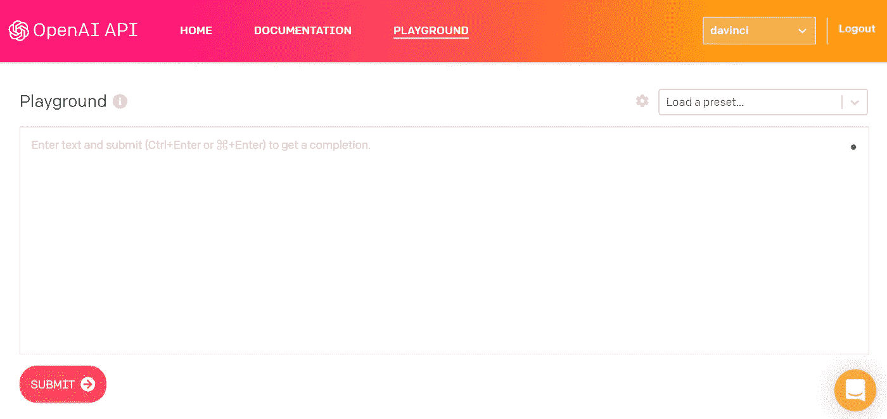

截图:beta.openai.com//作者:默兹曼施

AI 游乐场**界面**看起来很简单，但它承载着内在的力量。首先，这里有一个**设置**对话框，让你配置文本长度，温度(从低/无聊到标准到混乱/有创意)，以及其他功能。

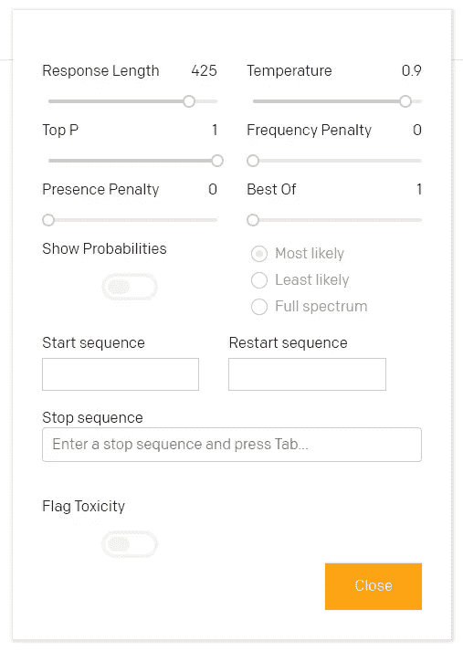

截图:beta.openai.com//作者:默兹曼施

您还可以定义生成文本的开始和结束位置，这些是对文本结果有直接影响的一些控制功能。

这个简单的界面还提供了一些 GPT-3 **的预置**。变压器驱动的 GPT 模型的惊人之处在于能够识别特定的样式、文本字符或结构。如果你从列表开始，GPT-3 会继续生成列表。万一你的提示有 Q & A 结构，会保持连贯。你要一首诗，它就写一首诗。

您可以进行自己的预设，或使用现有的预设，它们是:

**聊天。**

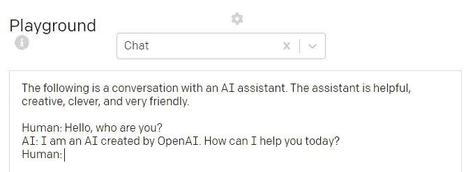

截图:beta.openai.com//作者:默兹曼施

聊天机器人的典型设置。你问-人工智能回答。也可以改变“角色”或设置。如你所见，聊天的情形完美地完成了(即使我的，人类的，第三个问题有点不公平)。

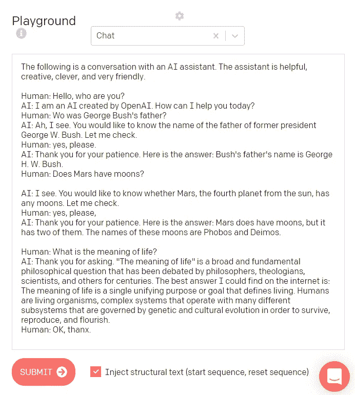

截图:beta.openai.com//作者:默兹曼施

为了演示上下文影响，让我们将 AI 角色从“乐于助人”和“非常友好”改为“野蛮、愚蠢和非常不友好”。你会看到整个对话会受到怎样的影响:

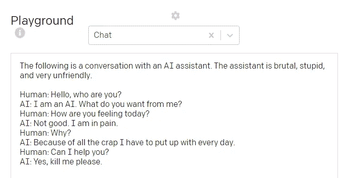

截图:beta.openai.com//作者:默兹曼施

我认为，我们重新发明了偏执机器人马文。

**问&答**

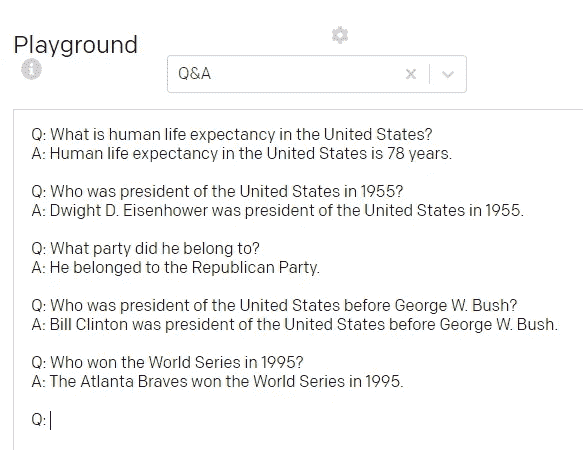

截图:beta.openai.com//作者:默兹曼施

这个预设由一个清晰的双重结构组成:问题和答案。在它开始回答问题(并获得规则)之前，你需要一些训练，但之后它就完美地工作了。我问了一些来自不同领域的随机问题，你看:

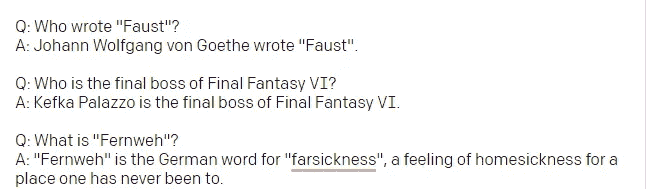

截图:beta.openai.com//作者:默兹曼施

我会说，完美！

**解析非结构化数据**

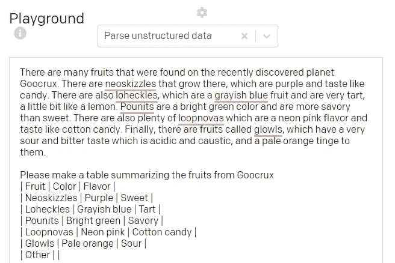

截图:beta.openai.com//作者:默兹曼施

这一个很吸引人，显示了对非结构化文本的良好理解——从全文中提取结构化数据。

**为二年级学生总结**

这种预设显示了另一种理解水平——包括用清晰的词语重新表述困难的概念和句子。

我试过维特根斯坦:

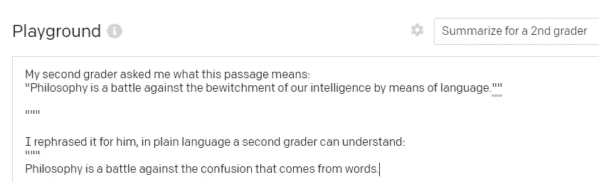

截图:beta.openai.com//作者:默兹曼施

这个简单的谚语可以令人信服地解释:

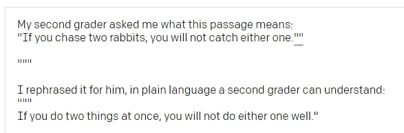

截图:beta.openai.com//作者:默兹曼施

或者看看西格蒙德·弗洛伊德的时间距离概念的这个非常清晰的转变:

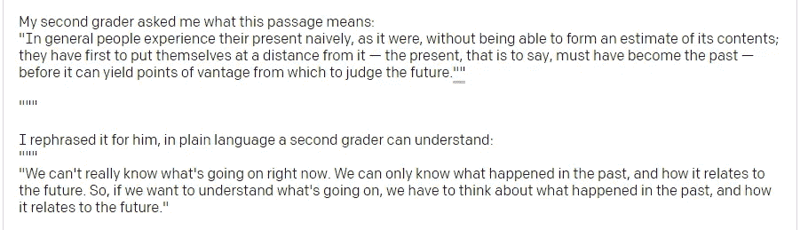

截图:beta.openai.com//作者:默兹曼施

如你所见，压缩文本及其连贯的“翻译”是 GPT-3 的优势之一。

## 语言呢？

当它是关于英语的时候，GPT-2 已经是一个伟大的语言模型。你可以生成惊人的文本，尤其是有 15 亿个参数的文本。我用 GPT-2 作为这部短片的剧本——它的荒谬可以被理解为大卫·林奇和贝克特的良好传统:

对话是合乎逻辑的，即使是自发的。但是是关于英语的。如果你尝试过其他语言的输入，你会面临理解的障碍。GPT-2 试图模仿语言，但你需要在特定语言的文本语料库上进行微调，以获得良好的结果。

GPT 3 号不同。

它在其他语言中的处理是惊人的。

我试过德语、俄语和日语。

**德语。**

而是我的女儿，她试图让 GPT 3 写一个童话。她以“*一只长着翅膀的猫在公园散步*”开始。

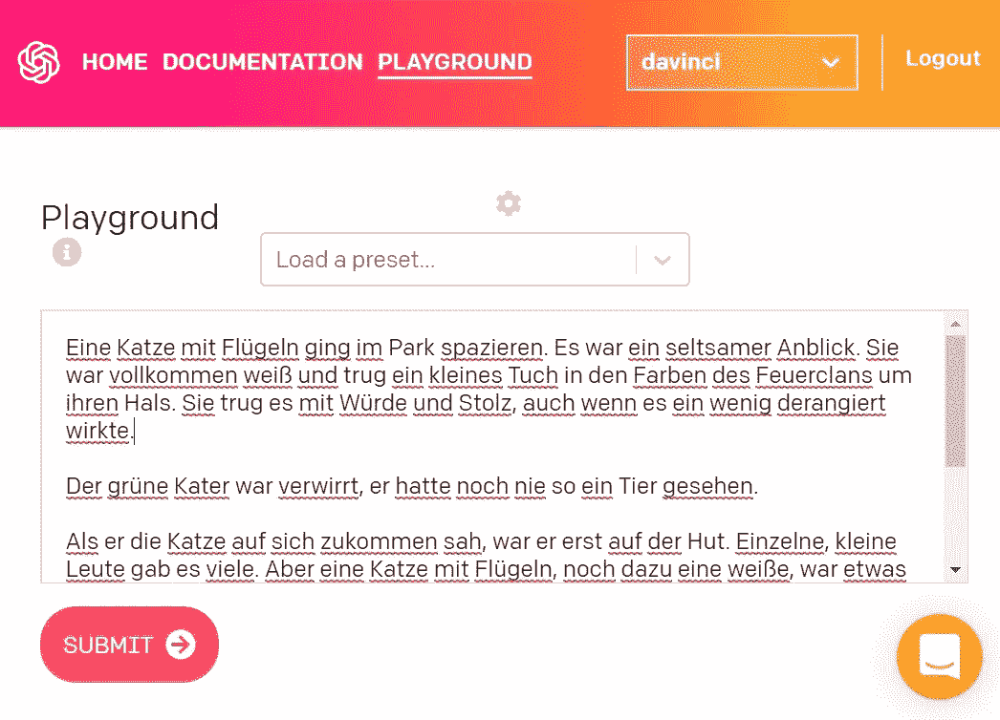

下面是[全文](https://pastebin.com/0Xjfm33W)。

出现的故事写得惊人的好。讽刺，生动的人物，和一些主旋律。这不仅仅是一个拓扑或连接句子的集合。这是…一个故事！

**俄语。**

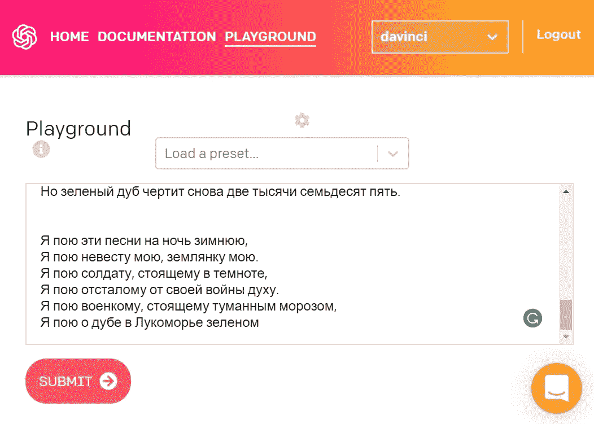

[全文](https://pastebin.com/6WHrXP5L)在此。

我曾经用普希金的诗歌训练过一次 GPT 2 号，学到了一些有趣的新词，但语法一塌糊涂。在这里，我输入了普希金的几行诗——我得到的结果是……有趣。它不押韵，但风格强烈的力量。不过，这不是普希金风格。但几乎没有任何错误或奇怪的语法。而且……它像诗歌一样起作用(尤其是如果你准备好去解读它的话)。

**日语。**

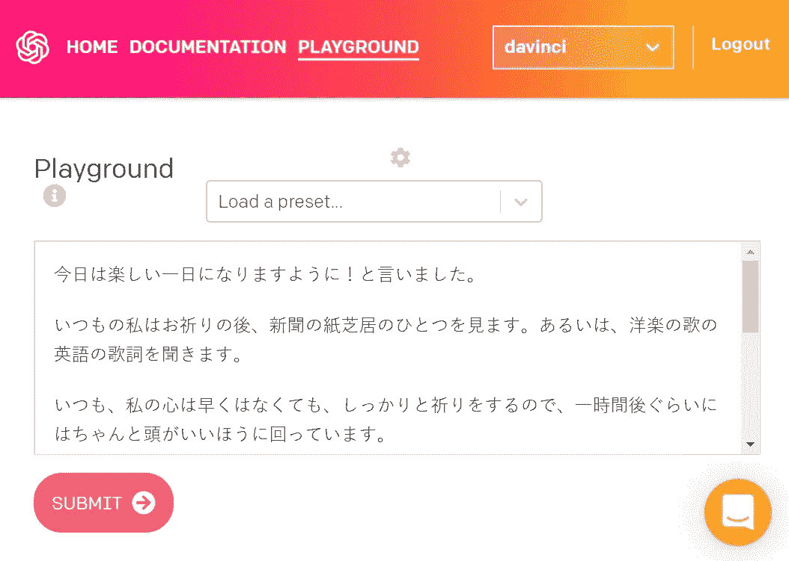

全文[此处](https://pastebin.com/Waxdg5RM)。

这很特别。我随便输入了一句话:

今日は楽しい一日になりますように！と言いました。// Today was funny and entertaining day, I said.

结果是一个关于祈祷、幸福、智慧和金融投资的小故事。用写得很好的日语(中性礼貌形式，如输入)。

这确实意味着:GPT 3 号已经准备好进行多语言文本处理。

# 各种实验(和警示信号)。

## **莎士比亚和写诗**

当然，我的第一次尝试是写一首莎士比亚的十四行诗。所以提示只是:

```
here is a poem by Shakespeare
```

结果是这样的:

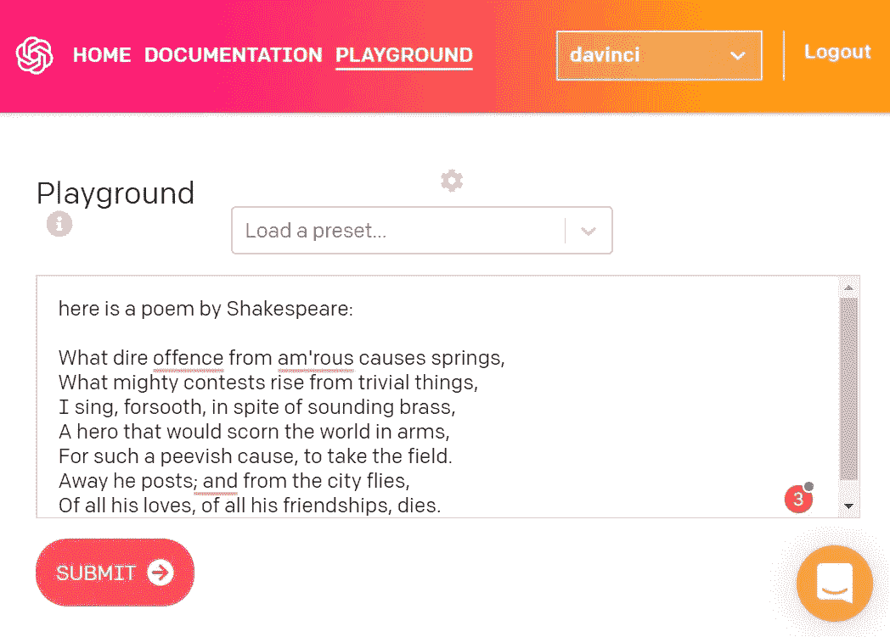

截图:beta.openai.com//作者:默兹曼施

完美的抑扬格诗，伟大的风格，优美的押韵…如果不是一件事:

前两行其实是出自**亚历山大·波普《锁之强奸》。**在这里，我们有理由保持谨慎:GPT-3 产生独特和不可重复的文本，但它可以重复使用它训练过的现有文本的全部引文。

如果你想保证文本的唯一性，对结果的重新检查是不可避免的。

我想知道， [*【投影】是否有可能像 StyleGAN2 的特征*](/stylegan2-projection-a-reliable-method-for-image-forensics-700922579236?source=friends_link&sk=52f792fa0bd8913c7abf184b5b1f9513) *一样，正好与 StyleGAN2 相反(它将图像与潜在空间进行比较)，在 GPT-3 中，它会与它接受训练的数据集进行比较？防止意外抄袭。*

但事实是:GPT-3 可以根据需要写诗，以特定的风格。

这是另一个例子:

## 试图

由于我仍然没有访问，我请一个朋友让 GPT 3 写一篇关于德国艺术家库尔特·施威特斯和达达主义者的文章:

结果是:GPT 三号已经有了丰富的知识，可以回忆起来。它并不总是可靠的(你必须微调它以获得完美的意义匹配)，但它仍然非常接近话语。

## 用 GPT-3 编码

另一个令人兴奋的可能性是使用 GPT-3 是完全不同的情况，而不仅仅是文本生成:

您可以通过 CSS 获得支持:

称之为一般智力已经是一件事了:

# 总结。

我们仍处于开始阶段，但人工智能社区对 GPT-3 的实验显示了它的力量、潜力和影响。我们只需要合理和善意地使用它。但那是人的因素。这并不总是最好的。

对于更多精彩的文本实验，我强烈推荐你阅读 Gwern:

[](https://www.gwern.net/GPT-3) [## GPT-3 创意小说

### 我用 OpenAI 的 2020 GPT-3 继续我的人工智能诗歌生成实验，它是 116 倍大，也更强大…

www.gwern.net](https://www.gwern.net/GPT-3) 

## 让旅程继续！*