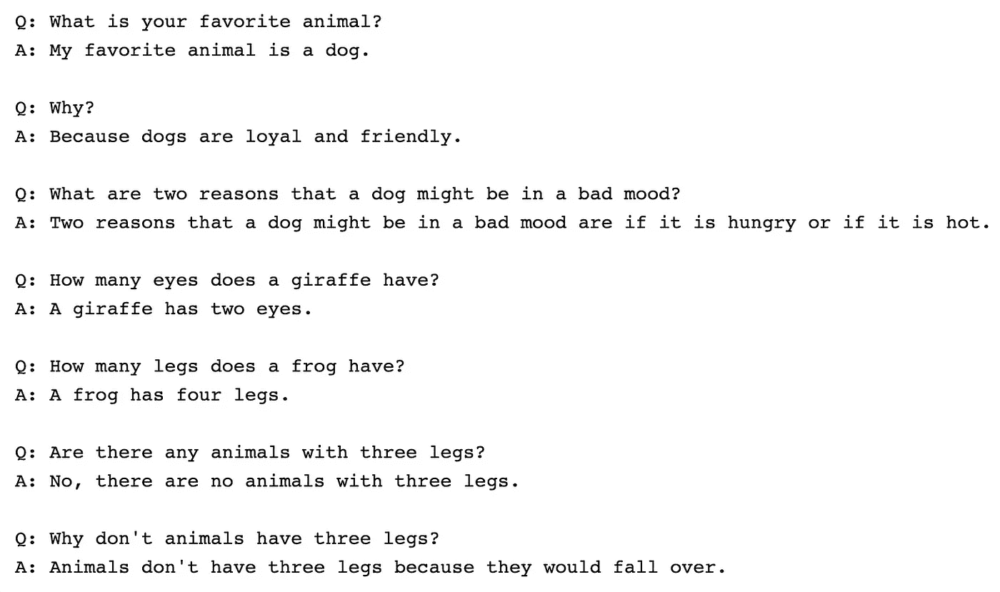
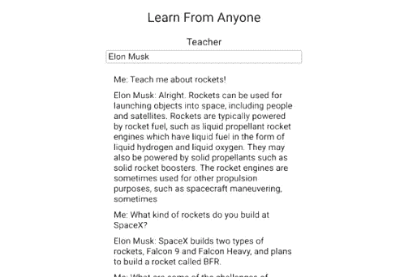
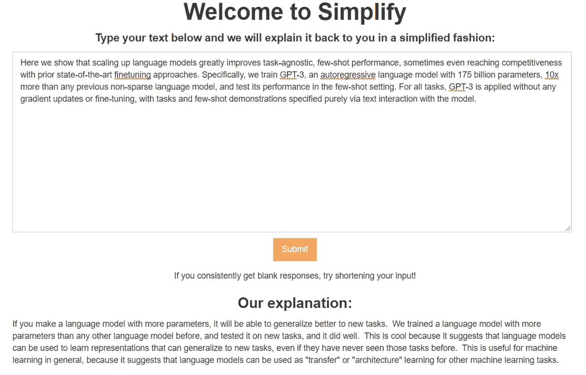
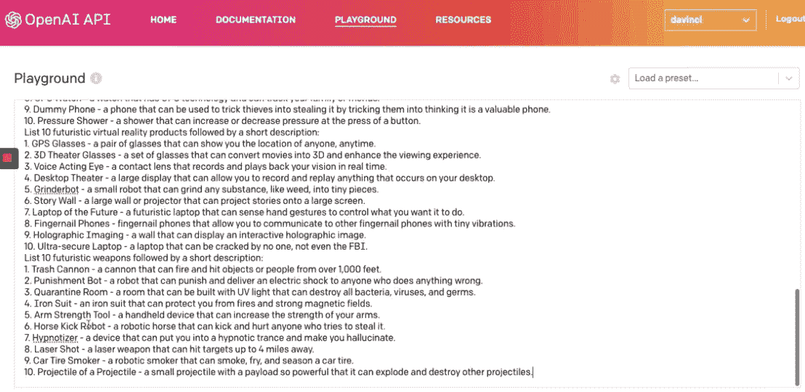
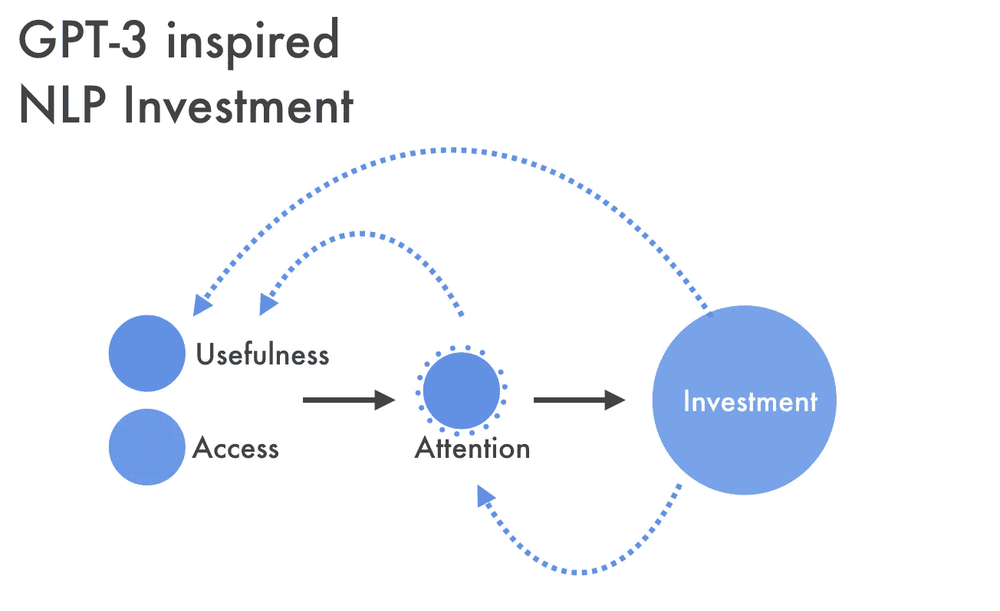
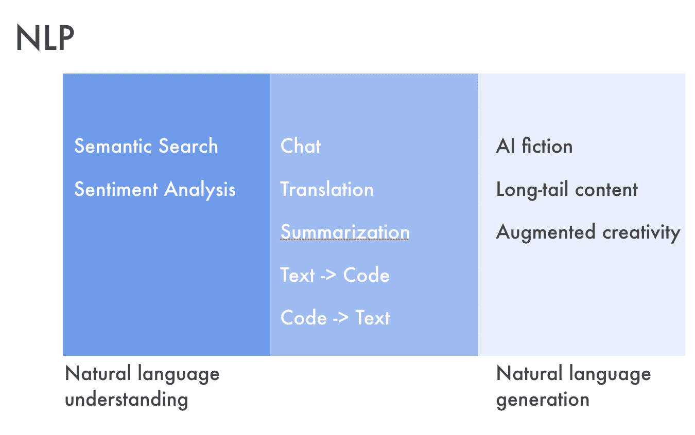

# GPT-3:演示、用例、含义

> 原文：<https://towardsdatascience.com/gpt-3-demos-use-cases-implications-77f86e540dc1?source=collection_archive---------2----------------------->

*paweczerwiński 在* [*unsplash*](http://unsplash.com) 拍摄的照片

# GPT-3

OpenAI 的 [GPT-3](https://beta.openai.com/) 是世界上最复杂的自然语言技术。这是最新最棒的文本生成神经网络。推特圈对此议论纷纷。

我想谈谈最近炒作的影响。但是首先，简单描述一下这头野兽。

虽然绝大多数人工智能系统都是为一个用例设计的，并为此进行了严格的训练，但 GPT-3 是自然语言处理技术谱系中最新的一种，被称为变形金刚，具有更广泛的通用性。

实际上，变形金刚处理大量文本来学习语言的一些一般属性(预训练)。然后，这些知识被用作精细处理特定语言理解任务(微调)的良好起点。这样，它大大减少了特定自然语言任务所需的标记训练数据的数量。

有什么新鲜事吗？GPT 3 号和它的前任 GPT 2 号的主要区别在于它的大小。

尺寸很重要。

在人工智能中，大小尤其重要。彼得·诺维格仍然是正确的，只是更加正确——“数量有它自己的质量”。具体来说，它的巨大(175 个参数)与其有效性直接相关(检测一篇文章是否是人工智能生成的平均人类准确度约为 52%)。

更具体地说:

*   语言模型性能与模型大小、数据集大小和计算量的 [**幂律**](https://lambdalabs.com/blog/demystifying-gpt-3/#5) 成比例。
*   在足够多的数据上训练的语言模型可以解决它从未遇到过的 NLP 任务。换句话说，GPT-3 将该模型作为许多下游工作的通用解决方案进行研究**而不进行微调**。

# GPT-3 个项目和演示

两天前，Twitter 上出现了基于 GPT 3 的有趣而优秀的演示和项目。这里有几个突出的例子，应该能让你很好地体会到什么是可能的。

## 单词

Sushant Kumar[创建了](https://twitter.com/sushant_kumar/status/1283314235842297856)[这个微型网站](https://thoughts.sushant-kumar.com/word)，它获取一个单词，并在此基础上输出一个 GPT 3 生成的句子。把下面网址末尾的‘word’替换掉，就能看到 GPT-3 趾高气扬的样子:[**https://thoughts.sushant-kumar.com/word**](https://thoughts.sushant-kumar.com/word)

这里有一些例子，*只是稍微*挑了挑。

*   GPT 三号正在进行中。“文明以指数曲线上升。我们不应该期望进步是一条直线。”
*   技术方面的 GPT-3。“技术优化系统。人优化文化。”
*   深度学习的 GPT-3。“深度学习研究的 M&A 就像圣诞老人的巧克力糖果。”
*   区块链上的 GPT-3。“所有的加密货币都是欺诈。它没有任何真实的东西作为后盾，它是凭空制造的(除了所用的电)。”
*   GPT-3 设计。“错误是坏的，但删除错误更坏。”
*   GPT 三号在 UX。“用户体验首先是为了用户的体验。"

## 密码

debuild.co[的](https://debuild.co/) [Sharif Shameem](https://twitter.com/sharifshameem/status/1283322990625607681) 已经制作了一些非常令人兴奋的演示。用简单的英语描述你的应用程序应该做什么，然后在几秒钟内开始使用它。

[沙里夫在 debuild.co](https://twitter.com/sharifshameem/status/1283322990625607681)[的展示](http://debuild.co)

他已经为以下项目制作了演示:

*   [生成 JSX 码。](https://twitter.com/sharifshameem/status/1282676454690451457)
*   [建立一个简单的待办事项列表。](https://twitter.com/sharifshameem/status/1284421499915403264)
*   [构建一个“功能正常”的 React 应用程序。](https://twitter.com/sharifshameem/status/1284095222939451393)

## 图灵检定

凯文·拉克尔让 GPT 3 号坐下来，并对它进行图灵测试。凯文测试常识、琐事和逻辑。他的结论是:“GPT 3 号在某些方面给人留下了深刻的印象，但在另一些方面却明显不如人类。”有点像我自己。

传统上，人工智能在“常识”上挣扎。这是 GPT 3 号回答了很多常识性的问题。

GPT-3 在 [lacker.io](http://lacker.io/ai/2020/07/06/giving-gpt-3-a-turing-test.html) 的战斗截图

## 会话

Mckay Wrigley 设计了一个使用 GPT 3 的应用程序，允许你“向任何人学习”。有没有想过向埃隆马斯克学习火箭？如何写出更好的莎士比亚作品？亚里士多德的哲学？

示例截图来自 McKay Wrigley 的[learnfromanyone.com](http://learnfromanyone.com)

发帖时， [learnfromanyone](https://learnfromanyone.com/) 宕机，但应该很快就会恢复运行。

## 设计

乔丹·辛格为 Figma 制作了一个[插件，使用 GPT-3 为你设计。该插件与 Figma 对话，以说出诸如“添加一个蓝色方块”或“给我一个 500 像素的粉色圆圈”之类的话。乔丹在提供了一些原始文本示例后，制作了 GPT-3 生成的 Figma 画布的基本表示。这种表示然后被翻译成 Figma 插件代码来构建一个屏幕。](https://twitter.com/jsngr/status/1284511080715362304)

[乔丹歌手](https://twitter.com/jsngr/status/1284511080715362304)的 GPT-3 Figma 插件

## 总结

卢沛宁用 GPT-3 建立了一个解释如我是 5 的网站。

卢沛宁简化的[截图](https://twitter.com/chris__lu)

## 思维能力

[Paul Yacoubian](https://twitter.com/PaulYacoubian/status/1284695508125196288) 使用 GPT-3 种子引物产生无限想法。

[保罗·雅库比安](https://twitter.com/PaulYacoubian)让 [GPT-3 赚到它的养份](https://twitter.com/PaulYacoubian/status/1284695508125196288)的截图

# GPT 三号协议的含义

GPT-3 是自然语言处理的一个拐点。但不是因为这是一个概念上的巨大飞跃。

GPT 3 号感觉不一样。演示的范围证明了这一点。它给一个易燃的炒作工厂浇上了燃烧的燃料。一家几乎虔诚地准备抓住任何看起来能智能行动的计算机承诺的工厂。

为什么？

首先，它比上一代型号要好。对于一个来自 GPT 2 号的新手来说，显然是有趣和有用的**通过了一些看不见的门槛** **，这需要用户投入更多的时间(例如 [Gwern](https://www.gwern.net/GPT-3) )。**

这也是高度可及的。通过 beta API 开放访问已经导致了演示和项目的疯狂传播——这将该技术的潜力带入了生活。有形性很重要。

最重要的是，你可以通过英语与 GPT 3 互动。它只需要最少量的特定知识。那些创作演示并在场外为其欢呼的人的形象与以前不同了。不仅仅是人工智能从业者和趋势观察者。是黑客。

我的预测是,**GPT 3 的主要遗产将是一个戏剧性的扩展，谁将尝试人工智能的新事物，以及他们将被激励去尝试什么。**

这很可能是最新一代 NLP 的自制计算机俱乐部。

那么接下来呢？

来自 simonoregan.com[的 NLP 投资周期](http://simonoregan.com)

我同意[阿齐姆·阿兹哈尔](https://www.exponentialview.co/)的观点，他将机器视觉能力的繁荣如何引发人工智能初创公司、风险投资和企业支出的浪潮进行了类比。这就是纯人工智能风险投资在计算机视觉热潮开始时的样子。

来自[simonoregan.com](http://simonoregan.com)的风投投资 AI

阿齐姆说得好:

> 因此，在 2020 年的今天，我们认为高质量的图像计算处理毫无价值。我们用脸打开手机。我们用廉价的消费网络摄像头追踪访客。我有一个免费的应用程序，可以识别我用手机指向的任何植物。十年前世界上任何地方都没有的能力现在太便宜而无法计量。自动驾驶汽车依靠这些突破来导航道路。

如果 GPT-3 和自然语言处理遵循机器视觉的类似路径，我们可以预计在未来 3-5 年内使用文本的应用程序将会快速改进。

这很重要。

# 使用案例

对 NLP 的大量投资意味着什么？

首先，在性能改进和可访问性增加的驱动下，我们可以期待标准 NLP 用例的扩散。

来自 simonoregan.com[的 NLP 用例](http://simonoregan.com)

这些 NLP 任务不是新的；他们从 80 年代就存在了。我们大多数人定期或半定期地使用语义搜索、机器翻译和聊天机器人。相当大的改进将意味着更多的采用，并可能导致谁提供这些服务的变化。例如，建立在付费访问人工智能层上的显著改善的语义搜索会放松谷歌对搜索的控制吗？

对于声音的使用也有下游的影响。虽然可用，但今天的语音仍然很笨重。填补 Siri 和 Alexa 知识上的许多空白将大大增强用户的信心，并首先激发语音使用的增加。

然后是对内容生成的影响。当人工智能可以为你做的时候，谁还会去写呢？嗯，从我开始。还有无数更有才华的人。人工智能内容生成真正有潜力颠覆的是最低端。真正的输家将是长尾、低端内容生成者——维基百科及其以下的内容生成者。

然而，在我看来，最大的潜力就在这些常走的普通道路之外。放松对大量训练数据的需求改变了 NLP 可以指向的用例。将 NLP 引入被忽视的、不具吸引力的商业领域，将会改变金融报告、技术写作和医疗报告等领域的游戏规则。增强读者和作者的能力会改变这类内容的创作和消费方式，以及由谁来创作和消费。

最后，还有人工智能文本大规模生成的第二层含义。深度假冒不会很快消失，因此内容认证变得更加重要。

# 有趣的阅读

*   [**【GPT-3】创意小说**](https://www.gwern.net/GPT-3) 。Gwern 测试了 GPT-3 的性能，发现它不仅在诗歌写作质量上与他精心调整的 GPT-2–1.5b 诗歌相匹配，而且超过了它，同时在处理诗歌、汤姆·斯威夫特双关语、科幻小说、像图灵的图灵测试对话这样的对话、文学风格的模仿方面也是多才多艺的。这篇长篇记录了 GPT-3 在他的探索中产生的样本，以及如何使用 GPT-3 的想法和一些关于它剩余弱点的讨论。
*   [**艾&字。阿齐姆·阿兹哈尔思索着自然语言处理的优势。**](https://www.exponentialview.co/p/ai-and-the-word)
*   [**快速想到 GPT3。迪里安·阿斯帕鲁霍夫带着 GPT 3 号兜风，得出结论说这是一辆“精神赛车”。**](https://delian.substack.com/p/quick-thoughts-on-gpt3)
*   [**电脑不做艺术，人做。随着新技术的发展，艺术有着悠久的历史。在过去的一个世纪里，许多这些技术导致了关于艺术家角色的争论和误解。起初似乎让艺术家变得无关紧要的工具实际上给了他们新的表达机会。声称他们的算法是艺术家的技术专家和建议计算机自己创造艺术的记者。这些讨论通常暴露出对艺术、人工智能或者两者都缺乏理解。**](https://cacm.acm.org/magazines/2020/5/244330-computers-do-not-make-art-people-do/fulltext)

# 感谢您的阅读🙏🏻

这篇文章最初发表在 simonoregan.com。

如果你喜欢这个，你可能会喜欢**——每周更新的工具和思考，揭示了 21 世纪 20 年代的新兴技术和趋势。**