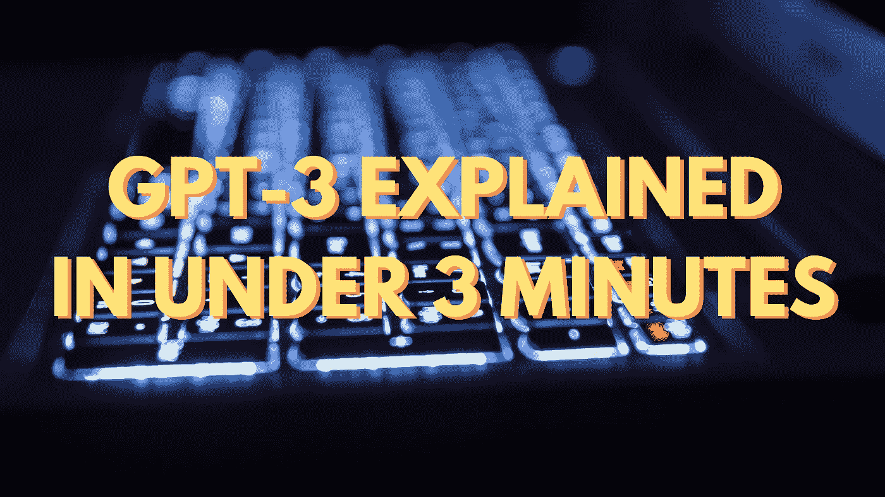

# GPT 3 号在不到 3 分钟的时间内解释完毕

> 原文：<https://towardsdatascience.com/gpt-3-explained-in-under-2-minutes-9c977ccb172f?source=collection_archive---------11----------------------->

所以，你已经在 Twitter 上看到了一些令人惊叹的 GPT-3 演示(机器制作的专栏、诗歌、文章，甚至工作代码)。但是在这个不可思议的模型下到底发生了什么呢？下面是(简介！)往里面看。

GPT 3 是一个神经网络驱动的语言模型。[语言模型](/language-modeling-c1cf7b983685)是预测一个句子在世界上存在的可能性的模型。例如，语言模型可以将句子“我带我的狗去散步”标记为比句子“我带我的香蕉去散步”更可能存在(即在互联网上)这不仅适用于短语，也适用于句子，更普遍的是，适用于任何字符序列。

像大多数语言模型一样，GPT-3 在未标记的文本数据集上进行优雅的训练(在这种情况下，[普通爬行](https://commoncrawl.org/))。单词或短语从文本中随机删除，模型必须学会仅使用周围的单词作为上下文来填充它们。这是一个简单的训练任务，可以产生一个强大的通用模型。

GPT-3 模型架构本身是一个基于[变压器的](/https-medium-com-chaturangarajapakshe-text-classification-with-transformer-models-d370944b50ca)神经网络。这种架构在大约 2-3 年前开始流行，并且是流行的 NLP 模型 [BERT](/bert-explained-state-of-the-art-language-model-for-nlp-f8b21a9b6270) 的基础。从建筑的角度来看，GPT 3 实际上并不新颖！那么是什么让它如此特别和神奇呢？

真的很大。我是说*真的*大。它有 1750 亿个参数，是有史以来最大的语言模型(GPT 2 号只有 1.5 个参数！)，并在任何语言模型的最大数据集上进行训练。这似乎是 GPT 3 号如此令人印象深刻的主要原因。

神奇的是。因此，GPT-3 可以做任何其他型号都做不到(很好):执行*特定*任务，无需任何特殊调整。你可以让 GPT-3 成为一名翻译、程序员、诗人或著名作家，它可以用不到 10 个训练例子来做到这一点。*该死的*。

大多数其他模型(比如 BERT)需要一个精心的微调步骤，你收集*成千上万*的(比如)法英句子对的例子，教它如何翻译。有了 GPT-3，你不需要做微调的步骤。这是它的核心。这就是让人们对《GPT 3:没有训练数据的定制语言任务》感到兴奋的原因。

今天，GPT-3 是在私人测试，但男孩我不能等待得到它。

*更多信息，请查看 daleonai.com 或在 Twitter 上关注@dalequark。*